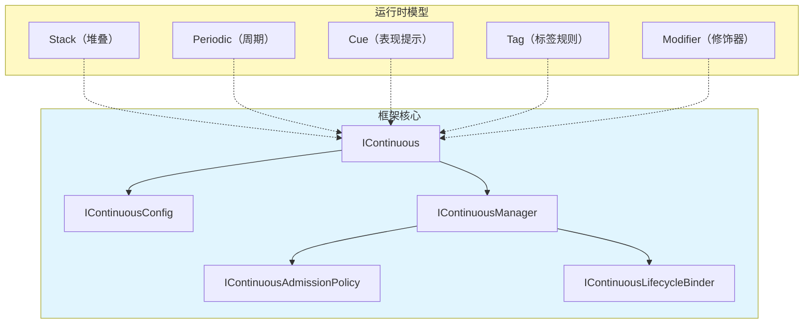
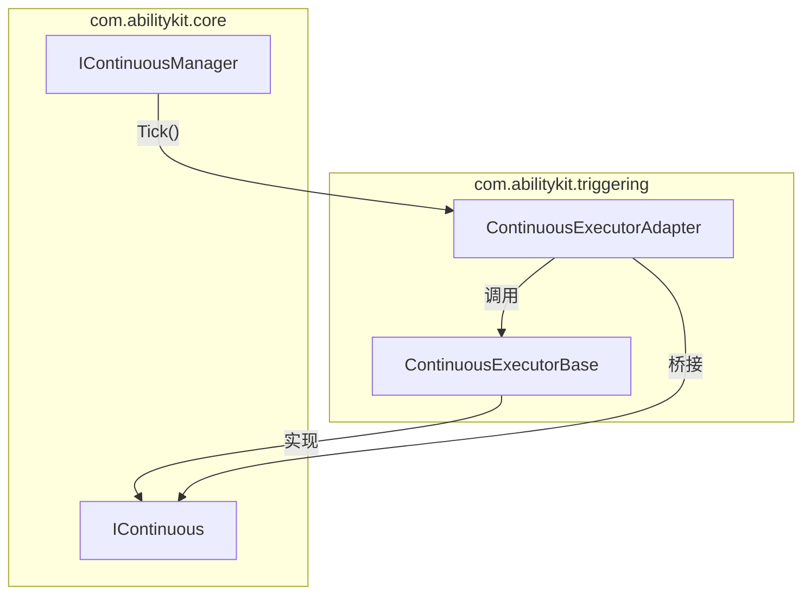
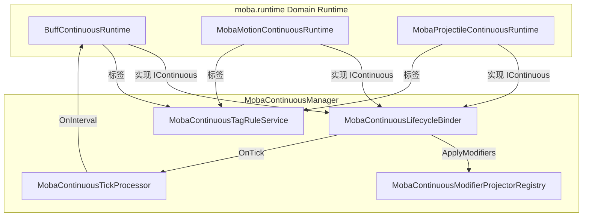

# Continuous 框架接口设计：IContinuous、IContinuousManager 与运行时模型

> 本文以 `com.abilitykit.core/Runtime/Continuous/` 为准，解释 Continuous 框架的接口设计：最小配置接口 + 可选扩展接口的组合模式、生命周期管理器的职责边界、五种运行时模型（stack/periodic/cue/tag/modifier）的实现方式，以及与 moba.runtime、Behavior 包、Triggering 包的协作关系。

---

## 1. 设计目标

Continuous 框架解决的核心问题是：**如何统一管理所有具有"持续时间、可中断/可暂停"特征的游戏对象**。

这类对象在 MOBA 中大量存在：Buff、被动技能、移动增益、光环效果、持续伤害、召唤物等。它们有共同的抽象特征，但具体行为差异巨大。Continuous 框架不实现任何具体业务逻辑，而是提供：

- **生命周期管理**：激活、暂停、恢复、结束、终止
- **组织结构**：标签、互斥组、父子层级、堆叠
- **扩展点**：生命周期钩子、修改器投影、间隔处理器

---

## 2. 源码入口

| 类型 | 源码 | 说明 |
|---|---|---|
| 核心接口 | `Runtime/Continuous/IContinuous.cs` | 持续体接口 |
| 配置接口 | `Runtime/Continuous/IContinuousConfig.cs` | 最小配置 + 可选扩展 |
| 管理器接口 | `Runtime/Continuous/IContinuousManager.cs` | 生命周期管理器接口 |
| 核心类型 | `Runtime/Continuous/ContinuousState.cs`、`ContinuousEndReason.cs` | 状态与结束原因枚举 |
| 策略与钩子 | `Runtime/Continuous/ContinuousPolicies.cs` | 准入策略与生命周期钩子 |
| 默认实现 | `Runtime/Continuous/DefaultContinuousManager.cs` | 管理器默认实现 |
| moba.manager | `Application/Services/Continuous/MobaContinuousManager.cs` | MOBA 业务实现 |
| moba.运行时基类 | `Application/Services/Continuous/MobaContinuousRuntimeBase.cs` | MOBA 运行时基类 |
| moba.配置基类 | `Application/Services/Continuous/MobaContinuousConfigBase.cs` | MOBA 配置基类 |
| 生命周期钩子 | `Application/Services/Continuous/MobaContinuousLifecycleBinder.cs` | 绑定修改器到生命周期 |
| 间隔处理器 | `Application/Services/Continuous/MobaContinuousTickProcessor.cs` | 驱动间隔效果 |
| 标签规则 | `Application/Services/Continuous/MobaContinuousTagRuleService.cs` | 标签驱动的激活/暂停/终止 |
| 修饰器投影 | `Application/Services/Continuous/MobaAttributeContinuousModifierProjector.cs` | 属性修改器 |
| Buff 运行时 | `Application/Services/Buffs/Runtime/BuffContinuousRuntime.cs` | Buff 的 Continuous 实现 |
| 移动运行时 | `Application/Services/Motion/MobaMotionContinuousRuntime.cs` | 移动源的 Continuous 实现 |
| Triggering 集成 | `Runtime/RuntimeServices/Continuous/ContinuousExecutorBase.cs` | 旧版 Continuous 与 IContinuous 桥接 |
| Behavior 集成 | `Runtime/Runtime/BehaviorRuntime.cs` | BehaviorRuntime 实现 IContinuous |

---

## 3. 核心接口设计

### 3.1 IContinuous：最小生命周期接口

```csharp
public interface IContinuous
{
    // 配置（只读）
    IContinuousConfig Config { get; }

    // 状态查询
    ContinuousState State { get; }
    bool IsActive { get; }
    bool IsTerminated { get; }
    bool IsPaused { get; }
    float ElapsedSeconds { get; }

    // 生命周期操作
    void Activate();
    void Pause();
    void Resume();
    void End(ContinuousEndReason reason);
    void Abort(string reason);

    // 事件
    event Action<IContinuous, ContinuousEndReason> OnEnded;
}
```

**设计意图：** 这个接口尽可能薄，只包含"生命周期"相关的最小操作。任何对象只要实现了这组接口，就可以被 `IContinuousManager` 统一管理。

### 3.2 IContinuousConfig：配置接口

```csharp
public interface IContinuousConfig
{
    string Id { get; }
    long OwnerId { get; }
    bool CanBeInterrupted { get; }
}
```

**可选扩展接口（按需实现）：**

```csharp
// 时长配置
public interface IDurationConfig
{
    float? DurationSeconds { get; }
}

// 堆叠配置
public interface IStackConfig
{
    int Stack { get; set; }
    int MaxStack { get; }
}

// 标签配置
public interface ITagConfig
{
    ITagContainer Tags { get; }               // 自身标签
    ITagContainer PauseByTags { get; }       // 导致暂停的标签
    ITagContainer BlockByTags { get; }         // 导致激活失败的标签
}

// 互斥组配置
public interface IMutexConfig
{
    string MutexGroup { get; }
    int Priority { get; }
}

// 层级配置（父子关系）
public interface IHierarchyConfig
{
    string ParentId { get; }
    bool CascadeOnExpire { get; }
}

// 间隔配置（周期效果）
public interface IPeriodicConfig
{
    float IntervalSeconds { get; }
    int MaxIntervalCount { get; }
}

// 标签容器抽象
public interface ITagContainer
{
    bool HasTag(string tag);
    bool HasAny(ITagContainer other);
    int Count { get; }
}
```

**设计意图：** 使用组合模式，而不是继承树。每个持续体只实现它需要的扩展接口，框架通过 `as` 转换检查可选能力。

### 3.3 ContinuousState 与 ContinuousEndReason

```csharp
public enum ContinuousState
{
    Inactive,   // 未激活或已销毁
    Activating, // 激活中
    Active,     // 运行中
    Paused,     // 已暂停
    Expired,    // 正常结束（时长到期）
    Aborted,    // 非正常结束（被中断）
}

public enum ContinuousEndReason
{
    Completed,   // 正常完成
    Interrupted,  // 被中断
    SourceEnded, // 来源结束（如技能被取消）
    CleanedUp,   // 被清理
}
```

---

## 4. IContinuousManager：生命周期管理器

### 4.1 管理器接口

```csharp
public interface IContinuousManager
{
    // 注册与注销
    bool Register(IContinuous continuous);
    void Unregister(IContinuous continuous, ContinuousEndReason reason = ContinuousEndReason.CleanedUp);

    // 状态转换
    bool TryActivate(IContinuous continuous);
    bool TryPause(IContinuous continuous);
    bool TryResume(IContinuous continuous);
    bool TryEnd(IContinuous continuous, ContinuousEndReason reason = ContinuousEndReason.Completed);
    bool TryInterrupt(IContinuous continuous, string reason);

    // 批量操作
    void InterruptAll(long ownerId, string reason);
    void PauseAll(long ownerId);
    void ResumeAll(long ownerId);

    // 查询
    IReadOnlyList<IContinuous> GetOwnerContinuous(long ownerId);
    IReadOnlyList<IContinuous> GetOwnerActiveContinuous(long ownerId);

    // 统计
    int ActiveCount { get; }
    int TotalCount { get; }
}
```

### 4.2 准入策略（IContinuousAdmissionPolicy）

```csharp
public interface IContinuousAdmissionPolicy
{
    bool CanRegister(IContinuous continuous, IContinuousManager manager, out string? reason);
    bool CanActivate(IContinuous continuous, IContinuousManager manager, out string? reason);
}

// 已有实现：
// - AllowAllContinuousAdmissionPolicy：允许所有注册和激活
// - BlockByOwnerActiveTagsPolicy：检查标签互斥
```

### 4.3 生命周期钩子（IContinuousLifecycleBinder）

```csharp
public interface IContinuousLifecycleBinder
{
    void OnRegistered(IContinuous continuous, IContinuousManager manager);
    void OnActivated(IContinuous continuous, IContinuousManager manager);
    void OnPaused(IContinuous continuous, IContinuousManager manager);
    void OnResumed(IContinuous continuous, IContinuousContinuousManager manager);
    void OnEnded(IContinuous continuous, ContinuousEndReason reason, IContinuousManager manager);
    void OnUnregistered(IContinuous continuous, ContinuousEndReason reason, IContinuousManager manager);
}
```

---

## 5. 运行时模型

### 5.1 五种模型总览



### 5.2 Stack（堆叠模型）

**解决的问题：** 同一个 Buff 被多次施加时，如何管理层数。

```csharp
// IStackConfig
public interface IStackConfig
{
    int Stack { get; set; }      // 当前层数
    int MaxStack { get; }        // 最大层数上限
}

// MOBA 中的应用：
// - 廉颇一技能命中后获得"战意"Buff
// - 每次命中 +1 层，最高 5 层
// - 每层提供 +5% 伤害
// - 层数刷新时：Duration 重置，但 Stack 不叠加

// MobaBuffService 处理逻辑：
// - ApplyBuff 时检查 IStackConfig
// - 如果 Buff 已存在且允许叠加 → Stack++
// - 如果 Stack 超过 MaxStack → 截断或拒绝
```

### 5.3 Periodic（周期模型）

**解决的问题：** 间隔执行效果（如每秒伤害、周期回复）。

```csharp
// IMobaContinuousPeriodicConfig
public interface IMobaContinuousPeriodicConfig
{
    float IntervalSeconds { get; }
    int MaxIntervalCount { get; }   // 最大触发次数
    bool ResetIntervalOnStack { get; } // 叠加时重置计时器
}

// 间隔处理器：MobaContinuousTickProcessor
public void Tick(IContinuous continuous, float deltaTimeSeconds)
{
    // 1. 检查是否有 IMobaContinuousPeriodicConfig
    // 2. 递减 IntervalRemaining
    // 3. 到达 0 时：
    //    - 获取执行上下文
    //    - 调用 IMobaContinuousIntervalHandler.OnInterval()
    //    - 重置 IntervalRemaining
}

// MOBA 中的应用：
// - 灼烧效果：每 1 秒造成 50 点伤害，共 5 次
// - 回血效果：每 3 秒回复 100 点 HP
```

### 5.4 Cue（表现提示模型）

**解决的问题：** 持续效果如何在特定时机触发视觉/音效提示。

```csharp
// IMobaContinuousCueConfig
public interface IMobaContinuousCueConfig
{
    // 由 MobaContinuousCueReporter 在适当时机调用
}

// 在 MOBA 中的应用：
// - Buff 激活时播放特效
// - 每 2 秒播放一次环境音
// - Buff 即将结束时播放警告特效
// - Buff 结束时播放消散特效

// MobaBuffPresentationCueReporter 集成到 MobaContinuousLifecycleBinder：
// OnActivated → ReportCue("buff_start")
// 每个 Interval → ReportCue("buff_tick")
// OnEnded → ReportCue("buff_end")
```

### 5.5 Tag（标签规则模型）

**解决的问题：** 基于标签的激活/暂停/终止规则（如沉默期间不能激活某些效果）。

```csharp
// ITagConfig
public interface ITagConfig
{
    ITagContainer Tags { get; }           // 自身携带的标签
    ITagContainer PauseByTags { get; }    // 持有这些标签时暂停
    ITagContainer BlockByTags { get; }   // 存在这些标签时无法激活
}

// MobaContinuousTagRuleService
public MobaContinuousTagRuleResult Explain(IContinuous continuous)
{
    // 遍历所有活跃 Continuous
    // 检查标签冲突：
    // - 如果存在 BlockByTags 中的标签 → BlockActivate
    // - 如果满足 PauseByTags 中的标签 → Pause
    // - 如果满足 OngoingRequired 标签缺失 → Remove
}

// MOBA 中的应用：
// - 英雄被"眩晕"标签命中 → 暂停所有移动类 Continuous
// - 英雄拥有"免疫控制"标签 → 阻止"减速"/"眩晕" Continuous 激活
// - Buff 持有"物理"标签 → 受到"魔法护盾"保护时无效
```

### 5.6 Modifier（修饰器模型）

**解决的问题：** 持续效果如何修改属性或技能参数。

```csharp
// IMobaContinuousModifierConfig
public interface IMobaContinuousModifierConfig
{
    IReadOnlyList<IMobaContinuousModifierSpec> Modifiers { get; }
}

public interface IMobaContinuousModifierSpec
{
    int TargetKind { get; }      // 目标类型：Attribute / SkillParam / MotionSource
    string ModifierId { get; }  // 修饰符 ID
    float Value { get; }         // 修饰值
    ModifierOp Op { get; }      // 操作：Add / Multiply / Override
}

// 修饰器投影注册表
public interface IMobaContinuousModifierProjector
{
    int TargetKind { get; }
    void Apply(IContinuous continuous, IMobaContinuousProjectionConfig projection,
               IReadOnlyList<IMobaContinuousModifierSpec> modifiers);
    void Clear(IMobaContinuousProjectionConfig projection);
}

// 已有的投影实现：
// - MobaAttributeContinuousModifierProjector：修改 AttributeGroup（+10 攻击力）
// - MobaSkillParamContinuousModifierProjector：修改技能参数（冷却 -20%）
```

---

## 6. moba.runtime 中的实现

### 6.1 MobaContinuousManager：业务层管理器

```csharp
[WorldService(typeof(IContinuousManager), WorldLifetime.Scoped)]
[WorldService(typeof(MobaContinuousManager), WorldLifetime.Scoped)]
public sealed class MobaContinuousManager : DefaultContinuousManager,
    IWorldInitializable, IDisposable
{
    // 修饰器投影
    private MobaContinuousModifierProjectorRegistry _modifierProjectors;

    // 间隔处理器
    private MobaContinuousTickProcessor _tickProcessor;
    private List<IMobaContinuousIntervalHandler> _intervalHandlers;
    // 预设：BuffContinuousIntervalHandler, MobaTriggerIntervalContinuousHandler

    // 生命周期钩子
    private MobaContinuousLifecycleBinder _lifecycleBinder;
    private MobaContinuousContextLifecycleBinder _contextLifecycleBinder;
    private MobaContinuousOwnerBoundTriggerLifecycleBinder _ownerBoundTriggerBinder;

    // 标签规则
    private MobaContinuousTagRuleService _tagRuleService;

    public void OnInit(IWorldResolver services) { /* 初始化各组件 */ }
    public void Reproject(IContinuous continuous) { /* 重新投影修饰器 */ }
    public void Tick(float deltaTimeSeconds) { /* 驱动所有活跃 Continuous 的 Tick */ }
}
```

### 6.2 MobaContinuousRuntimeBase：运行时基类

```csharp
public abstract class MobaContinuousRuntimeBase : IContinuous
{
    // IContinuous 实现
    public abstract IContinuousConfig Config { get; }
    public ContinuousState State { get; private set; }
    public bool IsActive => State == ContinuousState.Active;
    public float ElapsedSeconds { get; private set; }

    // 子类覆盖的生命周期钩子
    protected virtual bool OnActivating() => true;
    protected virtual void OnActivated() { }
    protected virtual void OnPaused() { }
    protected virtual void OnResumed() { }
    protected virtual void OnEnding(ContinuousEndReason reason) { }

    // 辅助方法
    protected void AdvanceElapsed(float deltaTimeSeconds);
    protected void ResetElapsed();
}
```

### 6.3 BuffContinuousRuntime：Buff 的运行时

```csharp
public sealed class BuffContinuousRuntime :
    MobaContinuousRuntimeBase,
    IMobaTickableContinuous,              // 支持 Tick 驱动
    IMobaContinuousIntervalState,          // 周期状态
    IMobaContinuousRuntimeStateSync,       // 状态同步
    IMobaContinuousExecutionContextProvider // 执行上下文
{
    public int BuffId { get; }
    public int SourceActorId { get; }
    public int TargetActorId { get; }

    // 绑定到 BuffRuntime
    public void BindRuntime(BuffRuntime runtime);
    public void BindSourceContext(long sourceContextId);

    // 刷新（叠加时调用）
    public void Refresh(
        int sourceActorId,
        float remainingSeconds,
        int stackCount,
        int maxStack,
        ContinuousTagRequirements tagRequirements);
}
```

### 6.4 MobaContinuousTickSystem：帧驱动

```csharp
[WorldSystem(order: MobaSystemOrder.ContinuousTick, Phase = WorldSystemPhase.Execute)]
public sealed class MobaContinuousTickSystem : WorldSystemBase
{
    protected override void OnExecute()
    {
        if (_continuous is MobaContinuousManager mobaContinuous)
        {
            mobaContinuous.Tick(dt);
        }
    }
}
```

---

## 7. 与其他包的协作

### 7.1 与 Triggering 包的协作



**ContinuousExecutorAdapter** 桥接旧版 Triggering 的 `ContinuousExecutorBase` 与新框架的 `IContinuous`：

```csharp
public abstract class ContinuousExecutorAdapter<TCtx> :
    ContinuousExecutorBase<TCtx>, IContinuous
{
    // IContinuous.State → 映射自 Phase
    // Activate() → Start()
    // Pause() / Resume() / End() → 映射 Phase 转换
    // InternalTick() → 调用 OnUpdate()
}
```

### 7.2 与 Behavior 包的协作

`BehaviorRuntime` 直接实现 `IContinuous`，允许行为树被 `ContinuousManager` 统一管理：

```csharp
public class BehaviorRuntime : IContinuous
{
    // IContinuous 实现（显式接口）
    IContinuousConfig IContinuous.Config => _config;
    ContinuousState IContinuous.State => Phase switch {
        BehaviorPhase.Running => ContinuousState.Active,
        BehaviorPhase.Completed => ContinuousState.Expired,
        _ => ContinuousState.Inactive,
    };

    // 内部行为树状态
    public BehaviorPhase Phase { get; private set; }
    public float ElapsedSeconds { get; private set; }
    public IBehaviorDecision Decision { get; }
    public IBehaviorExecutor Executor { get; }
}
```

### 7.3 与 Buff/Projectile/Motion 的协作



---

## 8. 设计约束与扩展点

### 8.1 约束

| 约束 | 说明 |
|---|---|
| 禁止在 Core 包中实现具体管理逻辑 | 互斥、标签、堆叠由业务层实现 |
| 禁止在 Core 包中定义业务配置类 | 配置由 moba.runtime 等业务层定义 |
| Manager 不直接持有 Entity 引用 | 只通过 OwnerId 关联，不侵入 ECS |

### 8.2 扩展点

| 扩展点 | 用法 |
|---|---|
| 新运行时模型 | 继承 `MobaContinuousRuntimeBase`，实现可选接口组合 |
| 新修饰器投影 | 实现 `IMobaContinuousModifierProjector`，注册到 Registry |
| 新间隔处理器 | 实现 `IMobaContinuousIntervalHandler` |
| 新生命周期钩子 | 实现 `IContinuousLifecycleBinder`，注册到 Manager |
| 新准入策略 | 实现 `IContinuousAdmissionPolicy` |

---

## 9. 关联文档

| 文档 | 关系 |
|---|---|
| [11-PlanActions DSL 与 Continuous Runtime 深潜](../09-ImplementationExamples/MOBA/11-PlanActionsAndContinuousRuntimeDeepDive.md) | 深入理解 PlanAction 如何驱动 Continuous Runtime |
| [13-持续行为能力组合设计](../09-ImplementationExamples/MOBA/13-ContinuousCapabilityCompositionDesign.md) | 五种 runtime model 的能力组合边界 |
| [16-领域连续运行时与临时实体生命周期](../09-ImplementationExamples/MOBA/16-DomainContinuousRuntimeAndTemporaryEntityLifecycle.md) | Motion source、Summon 与 Continuous 的生命周期协作 |
| [13-FrameworkCore/02-BehaviorTreeIntegrationDesign.md](../13-FrameworkCore/02-BehaviorTreeIntegrationDesign.md) | BehaviorRuntime 与 IContinuous 的集成 |

---

*文档版本：v1.0 | 状态：canonical | 最后更新：2026-07-22 | 基于 com.abilitykit.core Continuous 源码 v2026-Q3*
