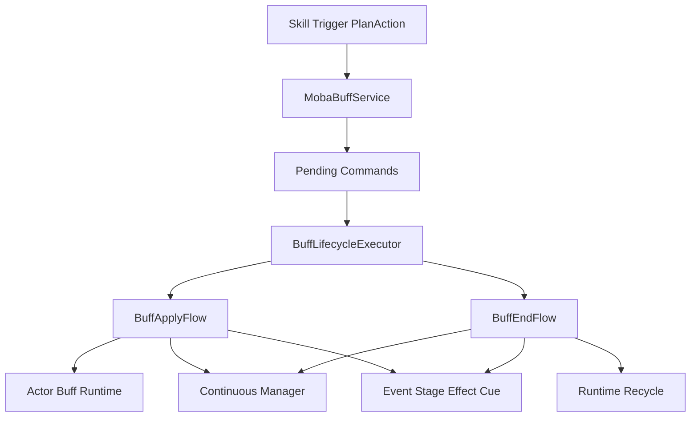
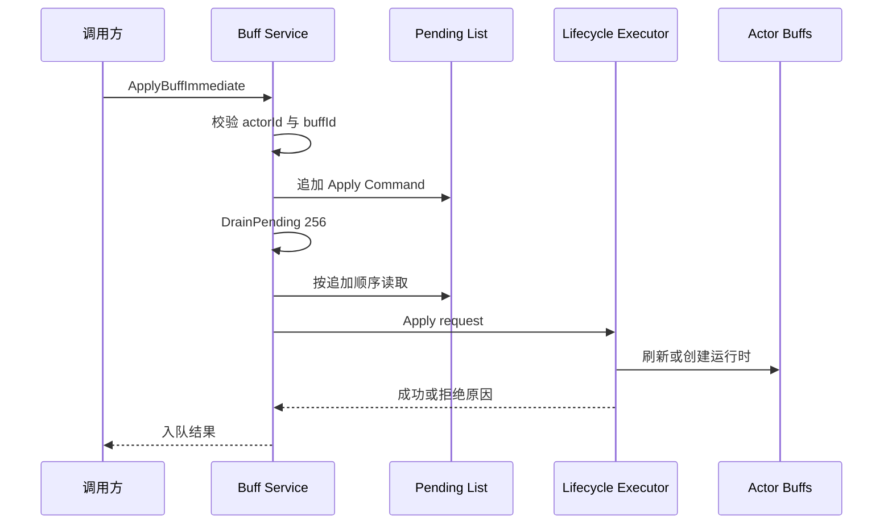
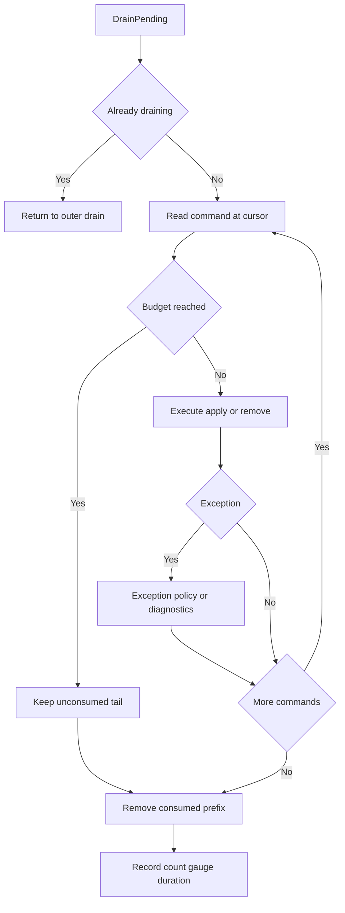
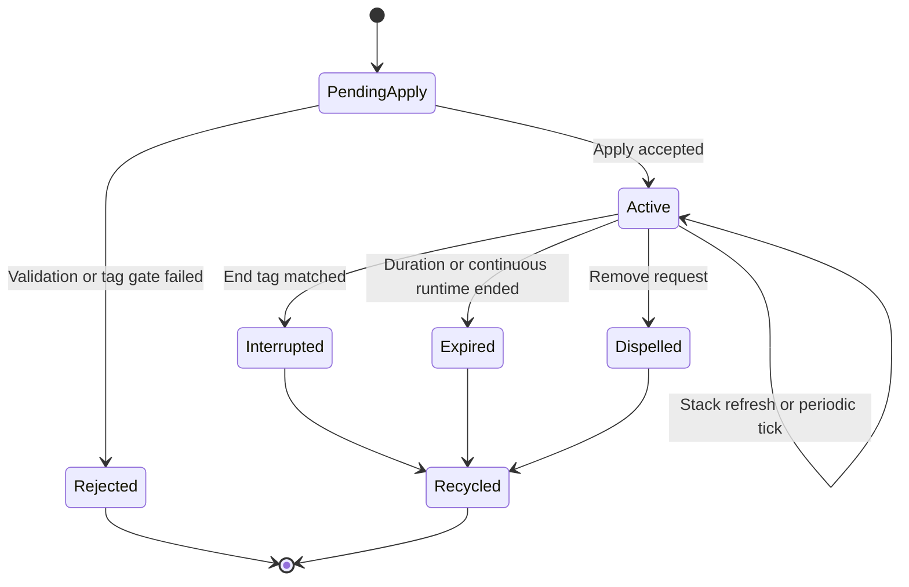

# MOBA Buff 命令执行与生命周期收敛深潜

> 本文只讨论 MOBA 示例中 Buff 命令怎样排队、消费、拒绝和结束，以及持续行为状态怎样与 Actor 上的运行时列表对账。配置字段、叠层策略、Triggering、Modifier 与表现协作的系统总览见 [Buff 系统](../../08-GameplayModules/03-BuffSystem.md)。

## 1. 文档职责与实现边界

玩法模块文档负责回答“Buff 系统有哪些能力”，本文负责回答“一个请求进入 `MobaBuffService` 后按什么顺序执行，失败后留下什么证据，运行时何时回收”。两篇文档共享源码，但不重复展开配置模型和效果类型。

Buff 可以承载属性修改、周期效果、标签门禁、表现 Cue 和触发器联动。入口服务不直接实现这些规则，而是把外部请求收敛到统一生命周期：

| 对象 | 负责 | 不负责 |
|------|------|--------|
| `MobaBuffService` | 参数初筛、命令排队、批量消费、调和入口、诊断 | 叠层策略、上下文创建、阶段效果细节 |
| `BuffLifecycleExecutor` | 编排 apply/remove，保存最近拒绝原因 | 直接持有世界 Tick |
| `BuffApplyFlow` | 配置和标签校验、刷新或新建运行时、绑定持续行为 | 对外排队和重入控制 |
| `BuffEndFlow` | 停止绑定、派发结束事件、移除并回收运行时 | 判断何时到期 |
| `IContinuousManager` | 推进持续行为和周期时间 | 决定 Buff 的业务叠层语义 |

因此，技能、触发器和 PlanAction 应调用 Buff 服务，而不应直接修改 Actor 的 `BuffsComponent.Active` 列表。

## 2. 源码入口与依赖

| 入口 | 源码 | 阅读重点 |
|------|------|----------|
| 对外入口 | [`MobaBuffService.cs`](../../../../Unity/Packages/com.abilitykit.demo.moba.runtime/Runtime/Application/Services/Buffs/MobaBuffService.cs:27) | 即时 API、命令队列、调和与诊断 |
| 生命周期编排 | [`BuffLifecycleExecutor.cs`](../../../../Unity/Packages/com.abilitykit.demo.moba.runtime/Runtime/Application/Services/Buffs/Lifecycle/BuffLifecycleExecutor.cs:57) | apply/remove 分流、拒绝结果、结束顺序 |
| 请求模型 | [`BuffRuntimeContexts.cs`](../../../../Unity/Packages/com.abilitykit.demo.moba.runtime/Runtime/Application/Services/Buffs/Core/BuffRuntimeContexts.cs) | `BuffApplyRequest`、`BuffRemoveRequest` |
| 应用流程 | [`BuffApplyFlow.cs`](../../../../Unity/Packages/com.abilitykit.demo.moba.runtime/Runtime/Application/Services/Buffs/Lifecycle/BuffApplyFlow.cs:17) | 配置门禁、叠层、新实例创建 |
| 结束流程 | [`BuffEndFlow.cs`](../../../../Unity/Packages/com.abilitykit.demo.moba.runtime/Runtime/Application/Services/Buffs/Lifecycle/BuffEndFlow.cs:16) | 解绑、通知、移除和回收 |
| 命令消费系统 | [`MobaBuffCommandDrainSystem.cs`](../../../../Unity/Packages/com.abilitykit.demo.moba.runtime/Runtime/Application/Systems/Buffs/MobaBuffCommandDrainSystem.cs:9) | 每帧 256 条命令预算 |
| 生命周期调和系统 | [`MobaBuffLifecycleReconcileSystem.cs`](../../../../Unity/Packages/com.abilitykit.demo.moba.runtime/Runtime/Application/Systems/Buffs/MobaBuffLifecycleReconcileSystem.cs:10) | 遍历 Actor 并执行运行时对账 |
| Continuous Tick 系统 | [`MobaContinuousTickSystem.cs`](../../../../Unity/Packages/com.abilitykit.demo.moba.runtime/Runtime/Application/Systems/Continuous/MobaContinuousTickSystem.cs:9) | 读取 World Clock，推进 MOBA Continuous Manager |
| 状态恢复 | [`MobaBuffStateRecoveryProvider.cs`](../../../../Unity/Packages/com.abilitykit.demo.moba.runtime/Runtime/Application/Services/Buffs/MobaBuffStateRecoveryProvider.cs:13) | 清空旧列表、按稳定排序重建运行时和 context |
| 计时回滚 | [`MobaBuffTimerRollbackProvider.cs`](../../../../Unity/Packages/com.abilitykit.demo.moba.runtime/Runtime/Application/Rollback/MobaBuffTimerRollbackProvider.cs:26) | 只更新已有 Buff 的计时、周期剩余和层数 |

`MobaBuffService` 是 World Service。`OnInit` 通过当前 World 的 `IWorldResolver` 构建生命周期执行器，确保配置、Actor 查询、事件总线、Trace、持续行为和表现快照都来自同一战斗作用域；`Dispose` 只清空尚未消费的命令，不负责重建或清理 Actor 上已有的 Buff 运行时。



## 3. 请求与命令模型

入口层内部使用 `BuffCommand` 保存单调递增的 `Seq`、`Apply` 或 `Remove` 类型及对应请求。当前列表按追加顺序消费，`Seq` 只被写入命令，没有参与 drain 排序，也没有进入公开回执或录制协议。

应用请求的关键字段包括目标 Actor、Buff ID、来源 Actor、持续时间覆盖、来源上下文、是否强制新实例和 `BuffOriginContext`。实例级 API 要求 `sourceContextId` 非零，用它区分同一来源链上的独立运行实例。移除请求还携带 `TraceLifecycleReason`；普通移除请求若传入 `None`，执行器会规范化为 `Dispelled`。

入口只接受正数目标 ID 和 Buff ID。`ApplyBuffImmediate` 返回 `true` 只表示参数通过、命令成功入队并调用过 drain，不表示生命周期执行成功，也不表示该命令已经在本次 drain 中执行。生命周期拒绝保存在内部 `BuffLifecycleExecutor.LastReject`，随后由服务转换成日志和诊断计数；当前公开 API 没有向调用方返回结构化拒绝结果。因此业务代码不能把这个布尔值当作 Buff 已生效的确认。

## 4. 即时调用仍走统一队列

所有 Immediate API 都遵循“先入队，再主动 drain”，没有绕过队列直接修改运行时：



即时调用、系统 Tick 中尚未消费的命令和效果执行期间派生的新请求共享同一个 pending 列表。`RemoveBuffsImmediate` 会倒序扫描当前运行时，按 Buff ID 和来源筛选，可只移除一个或全部；它先为匹配项建命令，再以 `max(256, queued + 32)` 作为本轮预算。它返回的是成功入队数量，不是最终成功移除数量。

## 5. Drain、重入与命令预算

`DrainPending(maxCommands)` 的行为具有明确约束：

1. `maxCommands <= 0` 时不执行；
2. `_draining > 0` 时内层调用直接返回，阻止效果回调递归进入第二层 drain；
3. 内层 Immediate 调用仍会先追加命令；外层 drain 的循环条件读取实时列表长度，所以新增命令通常会在同一轮继续消费；
4. 达到预算后停止，将未消费尾部保留给后续 drain，通常由同帧后续入口或下一帧命令系统继续推进；
5. 单条命令异常被捕获并上报，后续命令继续执行；
6. 最后统一移除游标已经读取的前缀并记录诊断数据。



默认即时 API 和每帧命令系统都使用 256 条预算，作用是阻断错误配置或循环触发造成的单轮无限增长。超过预算会产生 `buff.drain.maxCommands` 警告和 `moba.buff.drain.maxCommandsExceeded` 计数，剩余命令不会被丢弃。预算会改变派生命令在哪一次 drain 中执行；若同步方案要求严格同帧语义，预算必须成为固定协议，而不是运行时可随意调整的参数。

## 6. Apply 的执行边界

`BuffLifecycleExecutor.Apply` 将请求交给 `BuffApplyFlow`。本专题只保留与执行语义相关的四个分支：

1. 配置、目标或标签门禁失败时，返回结构化 `BuffLifecycleRejectResult`；
2. 已有匹配运行时且未强制新实例时，进入叠层或刷新；
3. 新建运行时只有在 Continuous 激活成功后才加入 Actor 的 Active 列表；
4. Continuous 激活失败时取消上下文、释放技能运行时 retain、发送失败生命周期通知并回收新运行时。

运行时匹配不是只看 Buff ID，而是由 `BuffRuntimeKey` 结合请求类型和来源身份决定。实例级申请和移除必须保留非零 `sourceContextId`，否则同名 Buff 的独立来源链无法稳定区分。具体配置、叠层和持续修饰语义由 [Buff 系统](../../08-GameplayModules/03-BuffSystem.md) 统一说明。

拒绝结果包含枚举类型、稳定字符串 code 和详细 message。入口服务立即消费内部 `LastReject`，生成 `moba.buff.command.rejected`、按拒绝 code、Buff ID 和来源 Actor 拆分的计数；它没有把该结果作为 API 回执返回。

## 7. Remove 与结束顺序

移除流程先确认请求、目标和 Buff 列表有效，再通过 `BuffRuntimeKey.MatchRemoveRequest` 倒序匹配运行时。倒序遍历避免移除列表项后破坏后续索引。`EndRuntime` 的顺序是生命周期正确性的关键：


先通知后回收，保证事件、阶段效果和表现 Cue 仍能读取尚未清空的运行时；先停止持续行为，避免后续 Continuous Tick 继续投影 Modifier 或执行 interval。找不到匹配运行时会形成内部拒绝码和诊断，但普通 Immediate API 仍可能已经返回 `true`，调用方不会直接拿到这次生命周期拒绝。

## 8. 生命周期调和

`ReconcileActorBuffLifecycles` 负责把持续行为状态和 Actor Buff 列表对账。它倒序遍历运行时并执行：

1. 删除空引用并标记仓储 dirty；
2. 延迟解析标签生命周期要求；
3. 标签要求触发结束时把剩余时间置零；
4. 有连续运行时则同步剩余时间和周期剩余时间；
5. 根据标签中断、连续运行时终止或普通倒计时归零决定结束；
6. 标签导致结束使用 `Interrupted`，自然结束使用 `Expired`。



原有提纲把“目标死亡、阵营变化”列为调和职责，但当前方法没有直接检查死亡或阵营字段；这类语义必须通过标签、显式 remove、持续运行时终止或其他生命周期系统转换后进入本流程。

## 9. 确定性、恢复与诊断

### 9.1 执行顺序基线

当前 MOBA `Execute/Normal` 阶段的关键顺序是：

```text
EffectsStep -> BuffCommandsDrain -> ContinuousTick -> BuffLifecycleReconcile
                 -> OngoingTriggerPlansReconcile -> GameplayTick
```

这个顺序由 [`MobaSystemOrder.ValidateKeyDependencies()`](../../../../Unity/Packages/com.abilitykit.demo.moba.runtime/Runtime/Application/Systems/MobaSystemOrder.cs:102) 做静态关系检查；具体系统分别以 [`MobaBuffCommandDrainSystem`](../../../../Unity/Packages/com.abilitykit.demo.moba.runtime/Runtime/Application/Systems/Buffs/MobaBuffCommandDrainSystem.cs:8)、[`MobaContinuousTickSystem`](../../../../Unity/Packages/com.abilitykit.demo.moba.runtime/Runtime/Application/Systems/Continuous/MobaContinuousTickSystem.cs:9) 和 [`MobaBuffLifecycleReconcileSystem`](../../../../Unity/Packages/com.abilitykit.demo.moba.runtime/Runtime/Application/Systems/Buffs/MobaBuffLifecycleReconcileSystem.cs:9) 声明顺序。它保证本轮已排队命令先于 Continuous 推进，Continuous 状态再被 Buff 调和读取；这仍是执行顺序契约，不等于完整的回放或跨 World 确定性证明。

### 9.2 运行时确定性与诊断

| 维度 | 当前实现与边界 |
|------|----------------|
| 顺序 | 同一 World 内按单线程追加顺序执行；`Seq` 未用于重排，也没有线程安全写入协议 |
| 重入 | 内层 drain 返回，新增命令由外层游标继续处理，不形成递归调用栈 |
| 预算 | 每轮有限命令数，剩余命令延后；预算变化可能改变派生命令的执行批次 |
| GC | pending list 复用；成功结束的运行时由结束流程回收；诊断消息支持延迟工厂 |
| 异常 | 单命令异常按可恢复域错误上报，不中断整个队列，也不回滚该命令异常前已产生的副作用；诊断采集异常单独被吞掉，不影响主流程 |
| Trace | Apply、Continuous 和 End 保存来源上下文，但本文没有把 Trace 存在性等同于所有链路都已通过回放验证 |
| 状态恢复 | `MobaBuffStateRecoveryProvider` 导出排序后的身份、计时、叠层、origin、runtime context 和 generation-checked skill runtime handle；导入先销毁并释放所有当前 Buff，再按载荷重建列表、仓储注册和 Buff context。`ApplyTo` 保留 `SkillRuntimeHandle` 作为能力值，但把 context 标记为 `Boundary = Snapshot`、`HasLiveRuntime = false`，并将 `SkillRuntimeRetainHandle`、`Continuous`、`TagRequirements`、`ModifierBindings` 置为空或默认值。因此有效 handle 不等于 live runtime backing，导入后也不会自动恢复 Continuous、Modifier、Tag requirement、owner-bound Trigger 或 retain 订阅 |
| 计时回滚 | `MobaBuffTimerRollbackProvider` 不清空、不创建、不删除运行时，只按 ActorId + BuffId 找到首个已有实例并恢复 `Remaining`、`IntervalRemainingSeconds`、`StackCount`；同一 Actor 存在同 BuffId 多实例时，载荷不含 source/context，匹配具有歧义 |

可观察指标包括 `moba.buff.drain.pending`、`moba.buff.drain.executed`、`moba.buff.pending`、`moba.buff.command.exceptions`、`moba.buff.command.rejected` 及按拒绝原因拆分的计数。排查“Buff 没生效”时，应先区分入口参数拒绝、生命周期拒绝、命令预算延后和执行异常四类原因。

## 10. 验证证据与缺口

证据按“源码契约、直接单元测试、间接业务/诊断证据、补测责任”分层；测试类名或 Release 总数本身不扩大覆盖范围。

| 证据层 | 入口 | 能证明什么 | 不能证明什么 |
|----------|------|------------|--------------|
| 源码契约 | [`MobaBuffService.cs`](../../../../Unity/Packages/com.abilitykit.demo.moba.runtime/Runtime/Application/Services/Buffs/MobaBuffService.cs:73)、[`BuffApplyFlow.cs`](../../../../Unity/Packages/com.abilitykit.demo.moba.runtime/Runtime/Application/Services/Buffs/Lifecycle/BuffApplyFlow.cs:56)、[`BuffEndFlow.cs`](../../../../Unity/Packages/com.abilitykit.demo.moba.runtime/Runtime/Application/Services/Buffs/Lifecycle/BuffEndFlow.cs:35) | 入队、预算、生命周期门禁、新实例提交时机、结束清理顺序 | 运行时在所有组合场景下都被专项测试覆盖 |
| 源码契约 | [`MobaBuffStateRecoveryProvider.cs`](../../../../Unity/Packages/com.abilitykit.demo.moba.runtime/Runtime/Application/Services/Buffs/MobaBuffStateRecoveryProvider.cs:30)、[`MobaBuffTimerRollbackProvider.cs`](../../../../Unity/Packages/com.abilitykit.demo.moba.runtime/Runtime/Application/Rollback/MobaBuffTimerRollbackProvider.cs:47) | 两种恢复机制的字段、列表和绑定边界 | 恢复后行为等价、订阅自动重建或多实例回滚无歧义 |
| 直接单元测试 | `MobaRollbackProviderTests.BuffStateRecoveryEntry_RestoresCapabilityHandleWithoutClaimingLiveRuntime` | 状态恢复保留 generation-checked capability handle，同时设置 Snapshot boundary、`HasLiveRuntime = false` 并清空 retain handle | Continuous、Modifier、Tag requirement 与 owner-bound Trigger 的行为关系自动重建 |
| 直接单元测试 | `BuffStackingPolicyApplierTests` | Replace、AddStack、RefreshDuration、IgnoreIfExists 和新运行时初值的策略对象行为 | 命令排队、Buff Flow、通知、Active 列表和回收顺序 |
| 直接单元测试 | `MobaContinuousLifecycleTests` | 通用 Continuous runtime 的激活/拒绝、暂停/恢复、结束/注销和 owner tag 冲突 | Buff Flow 与 Actor Active 列表调和、BuffEndFlow 的补偿 |
| 间接业务测试 | 英雄 Acceptance、`MobaSkillConfigTestHarness` | 具体技能路径可以调用 Buff 服务并观察业务结果 | 通用 Immediate 返回值、256 预算、异常继续消费和恢复契约 |
| 间接诊断测试 | `MobaBuffDiagnosticProducerTests`、Actor Buff diagnostic store tests | Buff 诊断 draft、collector、snapshot 字段和实例键投影 | 真实 Apply/Remove/End 生命周期已经成功执行 |
| 顺序源码/检查 | [`MobaSystemOrder.cs`](../../../../Unity/Packages/com.abilitykit.demo.moba.runtime/Runtime/Application/Systems/MobaSystemOrder.cs:102) | `EffectsStep < BuffCommandsDrain < ContinuousTick < BuffLifecycleReconcile < OngoingTriggerPlansReconcile < GameplayTick` 的关系检查 | 每个系统组合和多 World 调度都已运行时验证 |

2026-08-02 已执行的 MOBA .NET Release 测试结果为 232/232，并伴随依赖漏洞、Entitas 兼容性、可空性和 xUnit Analyzer 警告。2026-08-11 定向执行 `MobaRollbackProviderTests` 5/5 通过，其中状态恢复用例直接固定 capability handle 与 live-runtime 边界。当前测试目录仍没有针对 `MobaBuffService.DrainPending`、256 条预算、Immediate 布尔返回语义、`BuffEndFlow` 清理顺序、`ReconcileActorBuffLifecycles`、恢复后的行为关系重建或同 Buff 多实例计时回滚歧义的直接测试，因此这些段落仍属于源码事实审计。

建议补充以下契约测试：

1. 生命周期拒绝时 Immediate API 仍只报告入队成功；
2. 重入申请由外层 drain 同轮消费，预算耗尽后尾部保留；
3. 单命令异常不阻断后续命令，且不会伪造成功诊断事件；
4. `Interrupted`、`Expired` 和 `Dispelled` 分别进入正确的通知与清理路径，并验证订阅者异常时的清理责任；
5. `MobaBuffStateRecoveryProvider` 导入后的空绑定状态，以及由哪个系统/服务负责重新装配 Continuous、Modifier、Tag requirement、retain 和 owner-bound Trigger；现有测试只固定 snapshot capability/live-runtime 边界；
6. `MobaBuffTimerRollbackProvider` 在同 Actor 多个同 BuffId 实例和列表增删时的显式约束；
7. `MobaSystemOrder.ValidateKeyDependencies()` 的 Buff/Continuous 顺序回归测试。

## 11. 设计结论

这条实现链的核心是把 Buff 请求的入口顺序、失败诊断和结束清理集中到 World 作用域内。命令队列限制递归重入和单轮工作量，生命周期执行器维护 Apply/Remove 的清理顺序，调和系统把 Continuous 终止状态和 Actor Active 列表重新对齐。当前实现已经具备这三个边界，但公开回执、队列专项测试和恢复后的运行时关系重建仍需补齐，不能仅凭 Trace、状态 Provider 或测试总数推导出完整回放能力。

---

*文档版本：v1.4 | 状态：Buff 命令、生命周期与恢复边界 | 最后更新：2026-08-11 | 验证基线：2026-08-02 MOBA .NET Release tests 232/232（有警告）；2026-08-11 `MobaRollbackProviderTests` 5/5 通过；本轮文档更新未重新执行全量测试*
