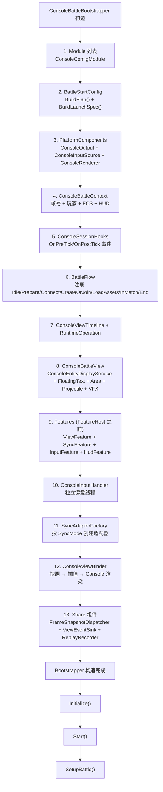
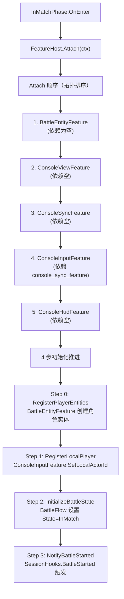
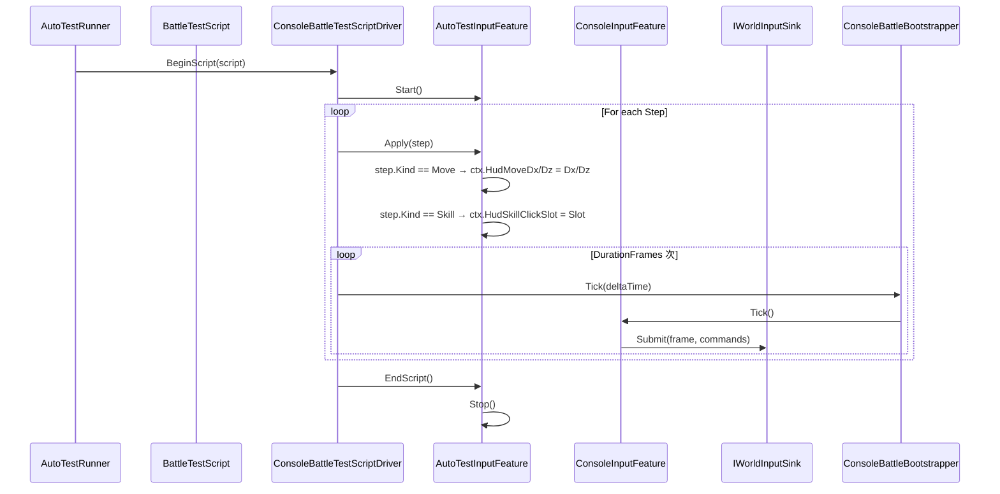

# Console Demo 源码级装配链路：Bootstrapper、FeatureHost、SyncAdapter 与自动测试

> 本文在 [01-ConsoleDemoAnalysis.md](./01-ConsoleDemoAnalysis.md) 的基础上，以真实源码为准，补充 Console Demo 的装配链路细节：ConsoleBattleBootstrapper 的完整初始化顺序、FeatureHost 的阶段生命周期管理、三种 SyncAdapter 的职责边界和切换方式、AutoTestInputFeature 如何替换输入链路，以及录制回放的二进制格式与索引结构。

---

## 1. 源码入口

| 入口 | 源码 | 说明 |
|---|---|---|
| CLI 入口 | `Program.cs` | 解析参数、创建 Bootstrapper、驱动模式 |
| 组合根 | `Bootstrap/ConsoleBattleBootstrapper.cs` | 全部装配的组合根 |
| 上下文 | `Battle/Context/ConsoleBattleContext.cs` | 帧号、玩家、本地 ECS、Hook |
| 阶段流 | `Battle/Flow/BattleFlow.cs` | 阶段注册、切换、FeatureHost 生命周期 |
| 特征组件 | `Battle/Flow/FeatureHost.cs` | 拓扑排序 attach/tick/detach |
| 同步适配器工厂 | `Battle/Sync/SyncAdapterFactory.cs` | 按 SyncMode 创建三种适配器 |
| 输入特征 | `Battle/Input/ConsoleInputFeature.cs` | HUD → PlayerInputCommand → IWorldInputSink |
| 自动测试 | `AutoTest/AutoTestRunner.cs` | 测试脚本驱动和验收断言 |
| 录制/回放 | `Replay/ConsoleRecordWriter.cs`、`ConsoleReplayDriver.cs` | .akrec 格式与索引 |

---

## 2. Bootstrapper 完整装配顺序

`ConsoleBattleBootstrapper` 构造函数中按以下顺序初始化所有组件：



### 2.1 `Initialize()` 做了什么

```csharp
void Initialize()
{
    // 1. Bootstrap Flow：_flow.Configure(_context)
    _flow.Configure(new FlowConfigureContext(_modules, _options));

    // 2. 初始化 Share 订阅：_snapshotDispatcher.Subscribe(OpCode → OnXxx)
    InitializeShareSubscriptions();

    // 3. 初始化 View 订阅：_battleViewEventSink.Subscribe(...)
    InitializeViewSubscriptions();

    // 4. 设置初始阶段
    _flow.SetInitialPhase("Prepare");
}
```

### 2.2 `SetupBattle()` 做了什么

```csharp
void SetupBattle()
{
    // 直接跳转到 InMatch，跳过网络连接等阶段
    _flow.TransitionTo("Connect");
    _flow.TransitionTo("CreateOrJoinWorld");
    _flow.TransitionTo("LoadAssets");
    _flow.TransitionTo("InMatch");
}
```

---

## 3. FeatureHost：阶段内的能力组装

### 3.1 Feature 接口体系

```csharp
// 特征标识
public interface IFeatureId { string FeatureId { get; } }

// 依赖声明
public interface IFeatureDependencies
{
    IEnumerable<string> GetDependencies();
}

// 生命周期
public interface IFeature : IFeatureId, IFeatureDependencies
{
    void OnAttach(IFeatureContext ctx);
    void OnDetach(IFeatureContext ctx);
}

// 帧更新
public interface IFeatureTick { void Tick(IFeatureContext ctx, float deltaTime); }
```

### 3.2 FeatureHost 生命周期

```csharp
// 附加（依赖拓扑序）
void Attach(IFeatureContext context)
{
    if (!TrySort()) return; // 拓扑排序
    foreach (var feature in _sorted)
    {
        feature.OnAttach(context);
    }
}

// 帧更新（注册顺序）
void Tick(float deltaTime)
{
    foreach (var feature in _features)
    {
        if (feature is IFeatureTick ft)
            ft.Tick(_context, deltaTime);
    }
}

// 分离（反向顺序）
void Detach()
{
    for (int i = _sorted.Count - 1; i >= 0; i--)
    {
        _sorted[i].OnDetach(_context);
    }
}
```

### 3.3 Console SubFeature 包装

```csharp
// ConsoleSubFeatureBase 实现了 IFeature，把 Console 组件适配到 FeatureHost
public abstract class ConsoleSubFeatureBase : IFeature, IFeatureDependencies
{
    protected IConsoleBattleView? _battleView;
    protected ConsoleBattleContext? _ctx;

    public virtual void OnAttach(ConsoleBattleContext ctx) { _ctx = ctx; }
    public virtual void OnDetach(ConsoleBattleContext ctx) { }
    public virtual void Tick(ConsoleBattleContext ctx, float deltaTime) { }

    // 子类通过 IFeatureDependencies 声明依赖
    public virtual IEnumerable<string> GetDependencies() => Enumerable.Empty<string>();
}
```

### 3.4 InMatch 的四步初始化

InMatchPhase.OnEnter 中分 4 步推进，每步由 FeatureHost 执行：



**依赖声明示例：**

```csharp
// ConsoleInputFeature 需要 SyncFeature 先 attach
public override IEnumerable<string> GetDependencies() =>
    new[] { "console_sync_feature" };

// BattleEntityFeature 必须最先（无依赖）
public override IEnumerable<string> GetDependencies() =>
    Enumerable.Empty<string>();
```

---

## 4. 三种 SyncAdapter

### 4.1 SyncAdapterFactory

```csharp
public static IBattleSyncAdapter Create(ConsoleBattleContext ctx, BattleStartConfig config)
{
    return config.SyncMode switch
    {
        SyncMode.Lockstep => CreateFrameSyncAdapter(),
        SyncMode.SnapshotAuthority => CreateStateSyncAdapter(),
        SyncMode.Hybrid => CreateHybridSyncAdapter(),
    };
}
```

### 4.2 FrameSyncAdapter（Console 默认）

**职责：** 本地帧同步，只镜像 context 帧号，不推进帧。

```csharp
public void Tick(float deltaTime)
{
    // 1. 从 context 读取当前帧
    _currentFrame = _context.LastFrame;
    _logicTimeSeconds = _context.LogicTimeSeconds;

    // 2. render time = logic time 滞后一帧
    _renderTimeSeconds = _logicTimeSeconds - (1.0 / _tickRate);

    // 3. 广播同步状态
    OnFrameSync?.Invoke(_currentFrame, _logicTimeSeconds);

    // 4. 诊断输出
    if (ShouldDump()) Dump();
}
```

**特点：** `SubmitInput()` 是空操作（直接写入 context 的 HUD），`GetAllActorStates()` 返回空（TODO）。

### 4.3 StateSyncAdapter（网络权威模式）

**职责：** TCP 连接服务端，接收服务端推送的 snapshot。

```csharp
// 登录流程
Connect(host, port, roomId, playerId)
 ├─ TcpClient.Connect(host, port)
 ├─ GuestLogin(playerId) → 获取 PlayerId token
 ├─ CreateOrJoinRoom(roomId) → 获取 numericRoomId
 └─ _connected = true

// 帧循环
Tick(deltaTime)
 ├─ _logicTimeSeconds += deltaTime
 ├─ OnFrameSync?.Invoke(_currentFrame, _logicTimeSeconds)
 └─ 服务端推送自动触发 OnServerPush() 回调

// 输入提交
SubmitInput(PlayerInput input)
 ├─ PlayerInputCommand[] commands = Encode(input)
 ├─ NetworkPackage pkg = EncodePackage(OpCodes.SubmitFrameInput, roomId, commands)
 └─ _client.Send(pkg)

// 服务端推送回调
OnServerPush(int opCode, byte[] payload)
 ├─ OpCode=FramePushed → DecodeFramePushed() → UpdateFrame()
 └─ OpCode=SnapshotPushed → DecodeSnapshotPushed() → OnActorStateSnapshot?.Invoke()
```

### 4.4 HybridSyncAdapter（预测回滚模式）

**职责：** 客户端本地预测 + 服务端快照校正。

```csharp
// 构造时创建 PredictionCoordinator
_predictionCoordinator = new PredictionCoordinator(
    new MovementPredictionHandler(),
    new CooldownPredictionHandler(),
    new HealthPredictionHandler());

// 输入提交
SubmitInput(PlayerInput input)
 ├─ _predictionCoordinator.SubmitInput(_localActorId, frame, input)
 ├─ _predictionCoordinator.Predict(frame) // 本地预测
 └─ Encode + _client.Send(OpCodes.SubmitFrameInput, ...)

// 服务端校正
OnServerPush(OpCodes.SnapshotPushed, payload)
 ├─ DecodeSnapshot(payload) → snapshots[]
 ├─ _predictionCoordinator.OnServerStateReceived(frame, snapshots)
 ├─ snapshots → OnActorStateSnapshot?.Invoke()
 └─ 检测到分歧 → _predictionCoordinator.Reconcile(frame)
```

---

## 5. 输入链路：HUD → PlayerInputCommand → IWorldInputSink

### 5.1 双层写入模式

```
┌─────────────────────────────────────────────────────────────────────────────┐
│ 输入写入链路 │
│ │
│ ConsoleInputHandler (独立线程) │
│ └─▶ ctx.HudMoveDx / ctx.HudMoveDz ────────────────────────────▶ ConsoleInputFeature │
│ └─▶ ctx.HudSkillClickSlot ──────────────────────────────────▶ │
│ │
│ AutoTestInputFeature (可选) │ │
│ └─▶ ctx.HudMoveDx / ctx.HudMoveDz ────────────────────────────▶ │
│ └─▶ ctx.HudSkillClickSlot ──────────────────────────────────▶ │
│ │
│ ConsoleInputFeature.Tick() │ │
│ ├─ ProcessMoveInput() → MobaMoveCodec → PlayerInputCommand → _sink.Submit() │
│ └─ ProcessSkillInput() → ConsoleSkillInputCodec → PlayerInputCommand → _sink.Submit() │
│ │
│ IWorldInputSink (两个实现) │
│ ├─ RuntimePortInputSink（有 RuntimePort 时） → _inputPort.Submit() │
│ └─ DirectCallInputSink（无 RuntimePort 时） → 只记录本地命令日志 │
│ │
└─────────────────────────────────────────────────────────────────────────────┘
```

### 5.2 AutoTestInputFeature 替换链路

```csharp
// Program.StartTestMode()
var runner = new AutoTestRunner(bootstrapper, config);
runner.RunScenario(new FullBattleScenario());

// AutoTestRunner.RunScript()
_autoInput = new AutoTestInputFeature();
_autoInput.Start();

// 替换输入源
bootstrapper.SetAutoTestInput(_autoInput);

// ConsoleInputFeature 仍然工作
// 它读取的是 ctx.HudMoveDx/HudSkillClickSlot
// 这些值现在由 AutoTestInputFeature 写入

// 测试结束后恢复
_autoInput.Stop();
bootstrapper.SetAutoTestInput(null);
```

### 5.3 输入命令结构

```csharp
public struct PlayerInputCommand
{
    public int ActorId;           // 玩家 ID
    public int Frame;             // 帧号
    public byte OpCode;          // 操作码：Move=1, SkillPress=2, SkillAim=3, SkillRelease=4
    public byte[] Payload;        // 编码数据
}
```

| OpCode | 1 (Move) | 2 (SkillPress) | 3 (SkillAim) | 4 (SkillRelease) |
|--------|----------|-----------------|--------------|-----------------|
| Payload | `{"dx":f,"dz":f}` (JSON UTF8) | `slot` (二进制) | `slot+aimPos` (二进制) | `slot` (二进制) |

---

## 6. 视图链路

### 6.1 四层事件流动

```
moba.runtime 逻辑层
    │
    ▼
MobaSnapshotRouter.CollectSnapshots()
    │
    ▼
ShareFrameSnapshotDispatcher (OpCode 路由)
    │
    ├─ OpCode=ActorTransform ──▶ ConsoleBattleViewEventSink.OnActorTransform()
    ├─ OpCode=ActorSpawn ─────▶ ConsoleBattleViewEventSink.OnActorSpawn()
    ├─ OpCode=DamageEvent ─────▶ ConsoleBattleViewEventSink.OnDamageEvent()
    ├─ OpCode=ProjectileEvent ─▶ ConsoleBattleViewEventSink.OnProjectileEvent()
    ├─ OpCode=AreaEvent ───────▶ ConsoleBattleViewEventSink.OnAreaEvent()
    └─ OpCode=PresentationCue ▶ ConsoleBattleViewEventSink.OnPresentationCue()

ConsoleBattleViewEventSink
    │
    ├─ RegisterEntity() ─────────▶ ConsoleBattleView.EntityDisplay.Register()
    ├─ UpdateActorPosition() ────▶ ConsoleBattleView.EntityDisplay.UpdatePosition()
    ├─ ShowFloatingText() ───────▶ ConsoleBattleView.FloatingTextSystem.Add()
    ├─ ShowProjectileSpawn() ────▶ ConsoleBattleView.ProjectileDisplay.Add()
    └─ UpdateEntityHp() ─────────▶ ConsoleBattleView.EntityDisplay.UpdateHp()

ConsoleBattleView.Tick() (FeatureHost 驱动，每帧)
    │
    ▼
ConsoleBattleView.Render() → ASCII 打印到 Console
```

### 6.2 插值渲染

```csharp
// Bootstrapper.Tick() 中：
var snapshots = _syncAdapter?.GetAllActorStates() ?? Array.Empty<ActorStateSnapshot>();
foreach (var snapshot in snapshots)
    _viewBinder.SyncActor(snapshot.ActorId, snapshot,
        _syncAdapter?.LogicTimeSeconds ?? _totalTime);

_viewBinder.TickRender((float)elapsed,
    _syncAdapter?.LogicTimeSeconds ?? _totalTime);

// ConsoleViewBinder.TickRender()：
// 1. 从 PositionSampleBuffer 取最近的 2 个样本
// 2. renderTime = logicTime - (1.0 / 30.0)  // 1 frame behind @ 30fps
// 3. linear interpolation between samples
// 4. ConsoleBattleView.EntityDisplay.UpdateDisplayPosition(interpolatedX, interpolatedY)
```

---

## 7. 自动测试

### 7.1 测试分层

| 层次 | 工具 | 覆盖范围 |
|---|---|---|
| 初始化验收 | `AutoTestRunner.TestInitialization()` | Bootstrapper / Flow / Context / ECS / View 是否存在 |
| 阶段切换验收 | `AutoTestRunner.TestPhaseTransition()` | TransitionTo("InMatch") 后阶段是否为 InMatch |
| 脚本执行验收 | `BattleTestScriptRunner.Run()` | 多帧输入 → 帧推进 → 断言 |
| 自定义验收 | `AutoTestScenario` | 业务场景（技能释放、移动、Buff 等） |

### 7.2 BattleTestScript 结构

```csharp
public sealed class BattleTestScript
{
    public string Name { get; }
    public List<BattleTestStep> Steps { get; }
}

public enum BattleTestStepKind { Move, Skill, Wait, Idle }

public sealed class BattleTestStep
{
    public BattleTestStepKind Kind { get; set; }
    public int Slot { get; set; }            // Skill
    public float Dx { get; set; }             // Move
    public float Dz { get; set; } }            // Move
    public int DurationFrames { get; set; }     // Wait
}
```

### 7.3 测试运行流程



---

## 8. 录制与回放

### 8.1 .akrec 文件格式

```
AKRC (Magic: 0x414B5243)
├─ VERSION: int
├─ RecordTime: DateTime
├─ StartFrame / EndFrame: int
├─ TotalCommands: int
├─ MapName / PlayerName / GameMode: string
├─ [PlayerInputCommand] commands (MemoryPack 序列化)
└─ [FrameSnapshot] snapshots (MemoryPack 序列化)
    ├─ Frame
    ├─ ActorCount
    └─ StateHash
```

### 8.2 录制时机

```csharp
// Program.RecordingGameLoop() 中：
if (Math.Abs(ctx.HudMoveDx) > 0.01f)
    _replayController.RecordCommand(actorId, frame, InputCommandType.Move, payload);

// 快照每 N 帧记录一次
if (frame % SnapshotIntervalFrames == 0)
    _replayController.AddSnapshot(frame, actorCount);

// Bootstrapper.Tick() 中也记录快照
if (_replayRecorder?.IsRecording == true && _replayRecorder.ShouldRecordSnapshot())
    RecordCurrentSnapshot();
```

### 8.3 回放索引

```csharp
// ConsoleReplayDriver.IndexCommands()：
// 构建 Dictionary<int, List<PlayerInputCommand>>
// key = frame，value = 该帧所有命令
// 实现 O(1) 按帧查找

// 回放循环：
while (running) {
    var cmds = _driver.GetCommandsAtFrame(_driver.CurrentFrame);
    foreach (var cmd in cmds) {
        switch (cmd.Type) {
            case InputCommandType.Move:
                var (dx, dz) = SimpleMoveCodec.Deserialize(cmd.Payload);
                ctx.HudMoveDx = dx; ctx.HudMoveDz = dz; break;
            case InputCommandType.SkillPress:
                ctx.HudSkillClickSlot = cmd.OpCode; break;
        }
    }
    _driver.AdvanceFrame();
    _bootstrapper.Tick();
}
```

---

## 9. 设计意图与约束

### 9.1 为什么用 FeatureHost

如果入口代码直接持有所有系统，阶段切换、重启、自动测试替换输入都会变得混乱。FeatureHost 让 InMatch 阶段只关心"挂哪些能力"，具体能力自己处理 attach/tick/detach。

### 9.2 为什么 SyncAdapter 有三种

| 模式 | 使用场景 | Console Demo 用途 |
|---|---|---|
| `FrameSyncAdapter` | 本地开发、无网络 | **默认**：CLI 测试、录制回放 |
| `StateSyncAdapter` | 联机开发、服务端权威 | 与 Gateway 联调 |
| `HybridSyncAdapter` | 客户端预测 | 预测回滚验证 |

### 9.3 为什么 AutoTestInputFeature 不直接提交

AutoTestInputFeature 只写入 `ctx.HudMoveDx/HudSkillClickSlot`，不直接调用 `_sink.Submit()`。这样 ConsoleInputFeature 的编码逻辑（MoveCodec / SkillInputCodec）仍然生效，保证测试和人工输入走同一条代码路径。

---

## 10. 与其他文档的关系

| 文档 | 关系 |
|---|---|
| [01-ConsoleDemoAnalysis.md](./01-ConsoleDemoAnalysis.md) | 概览；本文补充源码级装配细节 |
| [01-世界启动与运行时装配](./MOBA/01-WorldAndBootstrap.md) | 理解 MOBA runtime world 创建 |
| [04-快照、表现层与预测回滚](./MOBA/04-SnapshotPresentationPrediction.md) | 理解快照路由和表现层去重 |
| [07-帧同步机制](../07-NetworkSynchronization/01-FrameSync.md) | 理解 FrameIndex、PlayerInputCommand 和帧同步原理 |

---

*文档版本：v1.0 | 状态：canonical | 最后更新：2026-07-22 | 基于 Console Demo 源码 v2026-Q3*
