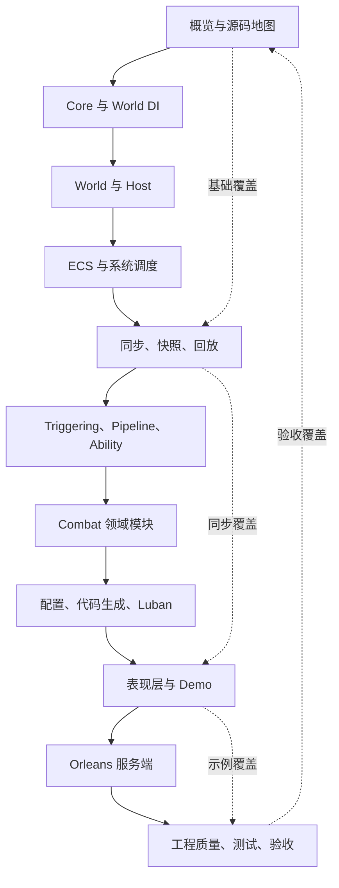
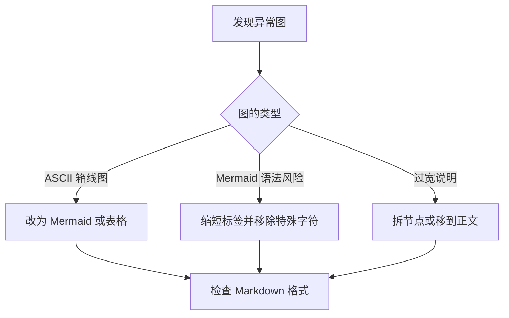
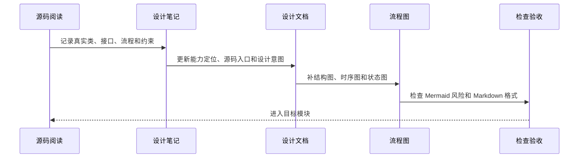

# 11.1 文档治理路线图：源码覆盖、设计意图与流程图规范

> 本文定义 `Docs/design` 的长期治理规则。目标是让设计文档持续对应真实源码、运行流程和验收入口，并为专题扩展、结构调整、流程图维护和版本记录提供统一标准。

---

## 1. 总目标

`Docs/design` 不只追求“有文档”，而是要求每篇设计文档都能回答读者最关心的五个问题：

| 问题 | 文档必须给出的答案 |
|------|--------------------|
| 这个模块解决什么问题 | 描述业务痛点、工程痛点和框架边界 |
| 为什么这样设计 | 说明核心抽象、生命周期、依赖方向和取舍 |
| 源码从哪里进入 | 列出 Unity package、.NET project、Demo、测试或 Server 入口 |
| 运行时怎么流动 | 至少提供结构图、时序图、状态图或数据流图之一 |
| 理解如何被验证 | 给出源码阅读路径、运行命令、测试入口或调试观察点 |

---

## 2. 文档完成标准

每个模块完成时，至少满足以下标准：

| 标准 | 要求 |
|------|------|
| 源码驱动 | 以真实类、接口、方法和目录为依据，不保留过期伪 API |
| 设计意图 | 解释模块要解决的问题、为什么拆这些对象、为什么保持这些约束 |
| 生命周期 | 说明创建、注册、运行、销毁、回收、取消或清理流程 |
| 流程图 | 至少提供覆盖结构、关键运行流程和生命周期的图；简单模块可用表格替代低价值图 |
| 源码路径 | 标明核心源码、相关 Demo、验证测试或运行命令 |
| 可执行入口 | 至少提供最小接入示例、模式决策表、验证命令或可复制模板之一，并写清所有权与失败路径 |
| 风险边界 | 写清线程、确定性、GC、跨端、回滚、热更新或服务端边界 |
| 证据状态 | 区分源码事实、示例验证、测试覆盖、场景基线、批准预算和强制门禁 |
| 索引接入 | 更新 `00-index.md` 的文档定位、说明和版本记录 |
| 讲解接入 | 能从 `00-PresentationAndFeishuNavigation.md` 路由到高频主题；PPT 只引用飞书页面 URL，不依赖本地路径 |

---

## 3. 总体治理顺序与覆盖矩阵



这组治理顺序遵循依赖方向：底座文档定义术语和生命周期，运行时文档解释装配与 Tick，玩法文档解释可组合能力，示例与服务端文档验证跨端落地。新文档可以引用前置概念，避免每篇都重复解释基础设施。

### 3.1 当前审计口径

本轮对 `Docs/design` 的 117 篇 Markdown 做结构盘点，并反向核对 `Unity/Packages`、`src`、`Server/Orleans`、测试工程和实际调用。篇幅、标题数量和 Mermaid 数量只用于发现候选，不直接决定文档质量；最终结论以源码契约、生产采用、生命周期、失败路径和验证证据为准。

缺口统一分为六类，避免把“未出现 package 名称”误判为“没有设计”：

| 缺口类型 | 判定方式 | 处置原则 |
|----------|----------|----------|
| canonical 缺失 | 能力有源码和采用入口，但 `Docs/design` 没有稳定专题 | 新建或并入最接近的能力地图 |
| 导航缺失 | package 内已有较完整设计，但总索引和阅读路径不可达 | 保留权威正文，补 canonical 导航和证据摘要 |
| 证据缺失 | 文档有设计说明，但没有测试、Smoke、生产调用或成熟度声明 | 补证据状态，不把“实现存在”写成“生产成熟” |
| 事实漂移 | 文档中的类型、流程、默认实现或失败语义与源码不一致 | 优先修正文档；若源码本身有缺陷，明确记录而不虚构能力 |
| 主题重叠 | 稳定设计、阶段计划和复盘材料描述同一主题 | 稳定契约留 canonical，阶段材料归档或降级为历史记录 |
| 索引治理 | 漏收录、重复编号、源码入口缺项或说明过期 | 限定修改索引，避免借机重排无关文档 |

### 3.2 证据成熟度

每个能力域按下列层级声明当前事实。高层级必须包含低层级的可追溯入口，但不能用单元测试替代生产采用，也不能用 Demo 运行替代发布门禁。

| 等级 | 可声明事实 | 不可外推的结论 |
|------|------------|----------------|
| E0 源码 | 类型和实现存在，可定位构建入口 | 已被采用、已稳定 |
| E1 示例 | Samples、Editor 或 Demo 有真实调用 | 生产默认、跨端可用 |
| E2 生产接入 | 业务运行时或服务端主链路采用 | 已覆盖失败和回归 |
| E3 自动测试 | 单元、契约或本地回环测试可执行 | 已通过真实部署和弱网验证 |
| E4 场景验收 | Smoke、Acceptance 或可复现 artifact 覆盖链路 | 已建立预算或发布阻断 |
| E5 发布门禁 | 基线、预算、CI 阻断和回滚责任明确 | 不代表未来版本无需复核 |

文档治理按覆盖范围记录，不以对话阶段或临时任务状态作为长期索引：

| 覆盖域 | 代表文档 | 源码验证重点 |
|------|------------|--------------|
| 入门与结构 | `01-OverviewAndGettingStarted/00-AbilityKitCapabilityMap.md`、`03-QuickStart.md`、`04-ProjectStructure.md` | Unity package、`src` 工程、Server/Orleans、Console Demo、构建与测试入口 |
| 网络同步 | `07-NetworkSynchronization/00-SynchronizationCapabilityMap.md`、`02-StateSync.md`、`03-RollbackPrediction.md`、`03.1-PredictionReconciliationDesign.md`、`04-ReplaySystem.md`、`05-SessionCoordination.md`、`07-MultiplayerSdkIntegrationGuide.md` | `FramePacket`、元信息/实体状态双轨、通用 hash/diff 与预测骨架、业务回滚采用、FrameRecord/Smoke/CI 证据、会话所有权、Local/Remote/Hybrid 成熟度、TCP 与扩展 transport 的实现/采用边界 |
| 玩法运行时 | `08-GameplayModules/06-DamageCalculation.md`、`07-TargetingSystem.md`、`08-PipelineAndAbilityRuntime.md` | Dataflow 与 Damage 的异形输入输出、Targeting 稳定排序、Pipeline run 隔离、Ability/MOBA 特化边界 |
| 独立基础设施 | package 内 Dataflow、HotReload、Network SDK、Threading 设计文档；前三者已作为包内 canonical 接入总索引 | package 文档与源码一致性、外部消费者、世界状态所有权、并发/确定性、测试成熟度 |
| Editor 可解释化与质量工具 | package 内 Ability Explain、Ability TestKit、Analyzer、BaseEditor、ActionEditorImpl canonical 与 Ability Explain Mock Sample | 静态注册和窗口生命周期、测试 Harness 所有权、Unity/Roslyn 诊断分工、Builder/legacy 边界、authoring-to-runtime 支持矩阵与 E0-E5 证据 |
| 配置与数据工具 | `05-CommonModules/04-ConfigurationSystem.md`、`07-CodeGenAndLubanProductionPipeline.md`、`08-ActionTimelineDataAndPlayback.md`、`09-ExcelScriptableObjectSync.md` | 运行时配置、生成发布、时间线协议和 Editor 双向同步的职责隔离、失败传播与验证门禁 |
| 示例体系 | `09-ImplementationExamples/02-ET Demo Analysis.md`、`03-MOBA Demo Analysis.md`、`04-Shooter Demo 与 Orleans Smoke.md` | ET Scene/Component/System、MOBA Blueprint/Bootstrap、Shooter Svelto runtime、Orleans smoke |
| 质量、采用与性能 | `10-EngineeringQuality/01-TestingWorkflow.md`、`04-CompanyAdoptionAndModuleGovernance.md`、`05-CrossModulePerformanceAndHotPathGovernance.md`、本文 | 测试门禁、成熟度证据、owner/rollback、benchmark artifact、预算与门禁晋升、阶段计划归档 |
| 内训与发布 | `00-PresentationAndFeishuNavigation.md`、`FeishuOfflineExportGuide.md` | PPT 阶段路由、示例展示定位、图片选择、飞书 URL 映射与点击验收 |


---

## 4. 模块批次计划

以下 Batch 0-12 是按依赖域组织的长期覆盖基线，不表示当前仍需从 Batch 0 顺序重做。当前增量工作以第 5 节的 P0-P2 审计矩阵为准；完成后回填对应能力域、索引和版本记录。

### 4.1 Batch 0：流程图健康检查与文档规范

| 项目 | 内容 |
|------|------|
| 目标 | 修复明显显示异常的流程图和旧 ASCII 图，建立统一写法 |
| 源码目录 | 不读源码，优先扫描 `Docs/design` |
| 目标文档 | `00-index.md`、本文、已有旧文档中的 Mermaid 和 ASCII 图 |
| 必画图 | 文档补全总路线图、流程图修复流程图、文档验收流程图 |
| 重点问题 | Mermaid 是否含未转义泛型、裸反斜杠换行、过宽节点、ASCII 箱线图 |
| 验收方式 | `git diff --check`，抽样阅读 Mermaid 语法，确认链接入口存在 |


### 4.2 Batch 1：概览、项目结构与源码入口

| 项目 | 内容 |
|------|------|
| 目标 | 说明 AbilityKit 是什么、源码在哪里、怎么运行、源码入口在哪里 |
| 源码目录 | `Unity/Packages`、`src`、`Server/Orleans`、`LubanConfig` |
| 目标文档 | `01-OverviewAndGettingStarted`、`00-Prologue.md`、`00-index.md` |
| 必画图 | 仓库结构图、包依赖图、Demo 启动路径图、源码路径图 |
| 设计意图 | 为什么源码集中在 Unity package，为什么保留 .NET project，为什么 Demo 和 Server 分层 |
| 验收方式 | 文档能支撑 build、Console Demo、至少一个测试入口的独立验证 |

### 4.3 Batch 2：Core 与通用基础设施

| 项目 | 内容 |
|------|------|
| 目标 | 覆盖事件、对象池、日志、标识、数值、配置基础能力 |
| 源码目录 | `Unity/Packages/com.abilitykit.core/Runtime` |
| 目标文档 | `05-CommonModules/01-EventSystem.md`、`02-ObjectPool.md`、`04-ConfigurationSystem.md`、Core 数值专题 |
| 必画图 | 事件派发时序图、对象池生命周期图、配置 provider 仲裁图、标识映射图 |
| 设计意图 | 降低 GC、统一事件解耦、稳定字符串 ID、支持配置覆盖和调试统计 |
| 验收方式 | 文档中的 API 与源码签名一致，移除 `Rent/Return`、`ITimerHandle` 等过期伪接口 |

### 4.4 Batch 3：World DI 与逻辑世界

| 项目 | 内容 |
|------|------|
| 目标 | 解释世界级依赖注入、世界生命周期、服务作用域和系统协作 |
| 源码目录 | `Unity/Packages/com.abilitykit.world.di/Runtime`、`Unity/Packages/com.abilitykit.world.ecs/Runtime` |
| 目标文档 | `02-LogicalWorldDesign/01-WorldOverview.md` 到 `05-ServiceContainer.md` |
| 必画图 | World 创建流程、Container/Scope 解析链路、System Tick 顺序、服务生命周期状态图 |
| 设计意图 | 为什么按 World 隔离服务，为什么需要 Scoped，如何避免跨战斗污染 |
| 验收方式 | 能从文档追到 `WorldContainer`、`WorldScope`、`WorldClock` 和系统注册入口 |

### 4.5 Batch 4：Host 运行时与扩展模块

| 项目 | 内容 |
|------|------|
| 目标 | 解释 HostRuntime 如何管理多世界、连接、广播、Tick 和扩展模块 |
| 源码目录 | `Unity/Packages/com.abilitykit.host/Runtime`、`Unity/Packages/com.abilitykit.host.extension/Runtime` |
| 目标文档 | `03-LogicalWorldHostDesign/01-HostRuntime.md` 到 `03-WorldManager.md` |
| 必画图 | HostRuntime Tick 时序图、World 创建销毁图、连接广播图、Blueprint/Module 装配图 |
| 设计意图 | 为什么 Host 不直接承载具体玩法，为什么通过 Hook/Feature/Module 扩展 |
| 验收方式 | 文档能解释 Demo 和 Orleans 如何复用同一 Host 抽象 |

### 4.6 Batch 5：ECS 适配与查询模型

| 项目 | 内容 |
|------|------|
| 目标 | 解释 AbilityKit 自有 ECS、Entitas、Svelto 三种模型的定位和取舍 |
| 源码目录 | `Unity/Packages/com.abilitykit.world.ecs/Runtime`、`com.abilitykit.world.entitas`、`com.abilitykit.world.svelto` |
| 目标文档 | `06-ECSArchitecture` 全目录 |
| 必画图 | EntityWorld 存储结构图、QueryImpl 流程图、Entitas 生命周期图、Svelto 提交流程图 |
| 设计意图 | 为什么保留多 ECS 适配，何时用轻量世界，何时接 Entitas 或 Svelto |
| 验收方式 | 文档能支撑查询模型选择，并解释 snapshot 遍历和版本校验 |

### 4.7 Batch 6：同步、快照、回滚与回放

| 项目 | 内容 |
|------|------|
| 目标 | 把多人同步链路拆成输入帧、快照、状态同步、预测回滚、录制回放 |
| 源码目录 | `com.abilitykit.world.framesync`、`com.abilitykit.world.snapshot`、`com.abilitykit.world.statesync`、`com.abilitykit.record`、`com.abilitykit.protocol` |
| 目标文档 | `07-NetworkSynchronization` 全目录 |
| 必画图 | 输入帧聚合图、快照封包图、预测回滚状态图、回放轨道图、重连恢复图 |
| 设计意图 | 为什么把输入、状态、表现分开，如何兼顾确定性、弱网、重连和验收 |
| 验收方式 | 能追踪一次客户端输入从采集到服务端推进再到表现层应用的完整链路 |

### 4.8 Batch 7：Triggering、Pipeline 与 Ability 核心玩法

| 项目 | 内容 |
|------|------|
| 目标 | 解释事件触发、条件判断、动作计划、技能阶段和运行上下文 |
| 源码目录 | `com.abilitykit.triggering`、`com.abilitykit.pipeline`、`com.abilitykit.ability`、`src/AbilityKit.Triggering` |
| 目标文档 | `08-GameplayModules/00-GameplayCapabilityMap.md` 到 `03-BuffSystem.md`、`08-PipelineAndAbilityRuntime.md` |
| 当前状态 | canonical Pipeline/Ability 深潜已建立；后续按测试、API 和示例变化持续校验 |
| 必画图 | TriggerPlan 执行图、条件表达式图、Pipeline 阶段图、Buff 生命周期图 |
| 设计意图 | 为什么用数据化 Plan，为什么用阶段管线，如何支持热更新、回放和测试 |
| 验收方式 | 文档能解释一个技能输入如何变成触发计划、效果执行和表现提示，并区分通用 Pipeline、Ability 服务与 MOBA runner |

### 4.9 Batch 8：Combat 领域模块

| 项目 | 内容 |
|------|------|
| 目标 | 覆盖目标搜索、投射物、伤害、实体索引、技能库、移动等战斗领域模块 |
| 源码目录 | `com.abilitykit.combat.*` |
| 目标文档 | `08-GameplayModules/04-ProjectileSystem.md` 到 `10-MotionPipeline.md` |
| 当前状态 | canonical Targeting、Projectile、Attribute、Damage、EntityManager/SkillLibrary 和 Motion 文档已建立；后续随领域接入、测试和确定性证据持续校验 |
| 必画图 | Targeting 管线图、Projectile 命中图、Damage Pipeline 图、实体索引更新图、移动来源合成图 |
| 设计意图 | 为什么把领域能力拆小包，如何组合成 MOBA/Shooter 不同战斗模型 |
| 验收方式 | 能通过文档追踪一次命中：搜索目标、生成投射物、命中判定、伤害结算、快照输出 |

### 4.10 Batch 9：配置、代码生成与数据链路

| 项目 | 内容 |
|------|------|
| 目标 | 区分运行时配置、CodeGen/Luban 生产链、ActionTimeline 协议与 Excel-ScriptableObject 编辑器同步 |
| 源码目录 | `Unity/Packages/com.abilitykit.codegen`、`com.abilitykit.actionschema`、`com.abilitykit.excel-sync`、`LubanConfig`、Demo Configs |
| 目标文档 | `05-CommonModules/04-ConfigurationSystem.md`、`07-CodeGenAndLubanProductionPipeline.md`、`08-ActionTimelineDataAndPlayback.md`、`09-ExcelScriptableObjectSync.md` |
| 当前状态 | 四条 canonical 责任线已建立；ActionTimeline 和 Excel Sync 均缺 package 自动测试，Excel Sync 仍需唯一主键、baseline 更新与编译阶段门禁 |
| 必画图 | 配置生成/加载图、时间线导出播放图、Excel 导入和三方冲突图 |
| 设计意图 | 避免把同名 Schema 或 Editor 工具误认为运行时配置能力，明确各数据资产的权威源、提交边界和失败传播 |
| 验收方式 | 能分别追踪运行时配置发布、logic JSON 导出播放和 Excel 双向同步，并定位每条链的测试与成熟度缺口 |

### 4.11 Batch 10：表现层、Demo 与工程示例

| 项目 | 内容 |
|------|------|
| 目标 | 解释逻辑表现分离、ViewEvent、Snapshot Dispatch、Console/MOBA/Shooter/ET Demo |
| 源码目录 | `com.abilitykit.demo.*`、`src/AbilityKit.Demo.*`、`Docs/design/09-ImplementationExamples` |
| 目标文档 | `04-PresentationLayerDesign`、`09-ImplementationExamples` |
| 必画图 | ViewEvent 转译图、Snapshot 分发图、Demo 启动图、跨平台适配图 |
| 设计意图 | 为什么表现层只消费事件和快照，如何支持 Unity、Console、ET、Server smoke 共用逻辑 |
| 验收方式 | 文档能解释同一个逻辑结果如何在不同端表现，并指出各端适配代码入口 |

### 4.12 Batch 11：Orleans 服务端与 Smoke 验收

| 项目 | 内容 |
|------|------|
| 目标 | 解释 Gateway、RoomGrain、BattleHost、FrameSyncGrain、Shooter Smoke 验收 |
| 源码目录 | `Server/Orleans/src`、`Server/Orleans/tools` |
| 目标文档 | Shooter/Orleans 示例文档、`12-ServerArchitecture` 服务端架构专题 |
| 必画图 | 网关请求图、房间生命周期图、战斗宿主推进图、Smoke 验收图 |
| 设计意图 | 为什么服务端只通过协议和 Host 组合接入，如何保证可测和可恢复 |
| 验收方式 | 能根据文档跑 smoke 或理解 smoke 输出中的帧、hash、reconnect、late join 结果 |

### 4.13 Batch 12：工程质量、测试与发布验收

| 项目 | 内容 |
|------|------|
| 目标 | 统一测试、采用治理、性能证据、DemoHarness、Unity 自动化、Smoke 和文档检查 |
| 源码目录 | `src/*Tests`、`Server/Orleans/src/*Tests`、`tools`、`.github` |
| 目标文档 | `10-EngineeringQuality/01-TestingWorkflow.md`、`04-CompanyAdoptionAndModuleGovernance.md`、`05-CrossModulePerformanceAndHotPathGovernance.md`，文档检查和发布验收专题 |
| 当前状态 | 测试、公司采用和性能治理 canonical 基线已建立；通用性能阻断 gate 尚未落地 |
| 必画图 | 测试金字塔图、CI 验收图、成熟度状态图、性能门禁晋升图、文档检查图 |
| 设计意图 | 为什么把纯逻辑测试、场景证据、成熟度、预算和发布阻断分层，如何降低回归与采用风险 |
| 验收方式 | 文档列出每类变更应运行的门禁、采用证据和性能声明边界 |

### 4.14 持续复核批次：既有 canonical 与最新源码对齐

| 项目 | 内容 |
|------|------|
| 目标 | 周期性选择 1 到 2 篇既有 canonical，按最新源码、生产调用和测试证据修正契约漂移，而不是只做措辞润色 |
| 本轮源码目录 | `com.abilitykit.core/Runtime/Event`、`Runtime/Generic/StableStringIdRegistry.cs`、`Runtime/Pooling`、Ability Triggering 生产适配与 Foundation 样例 |
| 本轮目标文档 | `05-CommonModules/01-EventSystem.md`、`05-CommonModules/02-ObjectPool.md` |
| 当前状态 | 已纠正事件退订与 Global facade API，补齐优先级/snapshot/once 重入、异常吞掉、字符串双重释放和 null 所有权；已补对象池锁内回调、异常非事务、manager 线程边界、旧 release handle、PooledObject 重复归还、首次配置固化和生产证据 |
| 剩余缺口 | Core Event/ObjectPool 均缺独立契约测试；字符串 Publish 双重释放和 null 不释放需修复，对象池需覆盖回调异常、Player 重复归还、manager 并发、scope 旧租约和 provider 锁内执行 |
| 验收方式 | Core 与引用样例工程构建、可用测试入口、Markdown/Mermaid/链接/fence 检查与限定路径 diff 审阅 |

持续复核不覆盖原有专题批次的历史状态。候选优先级由源码变更频率、生产调用深度、文档最后更新时间和独立测试缺口共同决定；发现状态传播、所有权、确定性或失败边界漂移时，应优先更新现有 canonical，不重复创建同主题文档。

Batch 12 的工程质量文档应覆盖测试流程与发布验收。可拆分的专题边界如下：

| 专题 | 内容边界 | 源码与脚本入口 |
|------|----------|----------------|
| 文档检查与发布验收 | Markdown fence、Mermaid 风险、索引定位、链接扫描、版本记录规范 | `Docs/design`、`.github`、现有验证脚本 |
| CI 分层 Job 设计 | fast/unit、matrix、smoke、nightly、artifact retention 的 job 拆分 | `.github/workflows`、`tools`、`Server/Orleans/tools` |

---

## 5. 当前优化矩阵与优先级

优先级由事实错误风险、生命周期/所有权风险、生产调用深度和读者阻塞程度共同决定。P0 修复会直接误导接入或掩盖失败边界的内容；P1 补 canonical、关键设计和证据；P2 处理实验性能力、历史材料和长期治理。

| 优先级 | 能力或文档 | 当前证据与发现 | 处置 | 单篇验收重点 |
|--------|------------|----------------|------|--------------|
| P0 | Network SDK 与 transport | package canonical 与接入指南已修正并进入总索引；SDK 有 E2 消费者和 E3 契约测试，TCP 是 E2/E4 主链，InMemory/LiteNet/WebSocket 仅有 E0 实现与 E3 局部回环 | 文档基线已完成；下一步补 WebSocket Gateway 启动注册、LiteNet 服务端、transport 专项矩阵、真实弱网/跨平台与 E5 门禁 | Builder/Client 所有权、延迟 transport、Tick/Dispose、dispatcher/payload、TCP 默认、扩展 transport 的服务端与采用边界 |
| P0 | HotReload | 包内 canonical 已重写并接入总索引；确认 MOBA Editor/HotUpdate DLL 为 E1，静态 world 状态无显式清理，卸载/交换异常被吞掉，安装失败缺事务回滚，未发现专项测试 | 文档基线已完成；下一步修复 world 清理、分阶段结果、回滚/安全点与测试缺口后再晋级 | DLL/Entry 发现、Apply/Uninstall/Swap 时序、overlay 所有权、重复 Apply、world 销毁、回滚、并发和测试缺口 |
| P1 | Dataflow | 包内 canonical 已重写并接入总索引；确认兼容类型才回灌，Damage 通过派生 Context 累积结果，Samples 为 E1；Dataflow 无专项测试，Damage 测试不覆盖 Pipeline | 文档基线已完成；下一步补 Execute/Context/Clone/Composite/Damage 契约测试并治理并发与结果语义 | 异形输入输出、context slot、abort/failure、Damage context 传递、processor/Clone 所有权和确定性 |
| P1 | Behavior 与 GameplayTags | 包内设计、快速接入与跨模块 canonical 已建立双向导航；Behavior 有 Samples/BTCore/MOBA E1-E2 调用，GameplayTags 有 Ability/MOBA E1-E2 消费和 E3 局部测试 | 文档基线已完成；下一步修复 Behavior Manager Tick 清理与关闭契约，补 GameplayTags Query/Requirements、引用计数、目录和序列化专项测试，再建立性能与 E5 门禁 | 包、.NET 镜像、Demo/生产调用、生命周期/所有权、契约测试和成熟度声明一致 |
| P1 | StateSync、Prediction、Replay 与 Shooter 客户端同步 | Batch E3 已修订 6 篇主体 canonical，确认元信息/实体 rollback bytes 双轨、SnapshotBuffer clone/锁语义、通用 hash/diff 字段边界、三层预测实现、FrameRecord v4 writer/v1-v4 reader、Shooter 本地有限校正、Hybrid packed 双路和 full snapshot/reliable event 恢复；专项测试、Smoke/artifact 与 CI gate 已按 E3/E4/E5 分层 | 文档基线已完成；下一步修复 `PredictionCoordinator` 清空输入后 replay 和 `Reset` 快照残留，评审 hash 的 Timestamp/字段协议与 diff frame 元数据，补齐或移除 LZ4/Zstd、KeyFrameStrategy 占位，并为 full snapshot/reconnect/reliable event 扩充失败测试和发布预算 | 不把类型存在或局部测试外推为生产成熟；通用骨架、Host/Shooter 业务采用、Smoke artifact 和不同触发条件的 CI gate 必须分别声明 |
| P1 | 会话协调、Room Gateway Flow 与 Shooter 双连接 | Batch E4 已修订 5 篇主体 canonical，确认 coordinator Package 当前仅保留配置、契约、DTO 与 codec，旧 SessionCoordinator、ExistingWorld host、Local/Remote/Hybrid adapter 和 remote transport 实现已不存在；`RoomGatewaySessionFlow` 是阶段化控制面，`GatewayMultiplayerSession` 仅 E0 且未发现真实消费者；Shooter 以 Room 控制连接和独立 battle transport 形成 E2 业务链，输入 response inline matching，push 经 receive-thread enqueue 后由主线程 Drain | 文档基线已完成；下一步决定 `GatewayMultiplayerSession` 的接入或删除，补双连接身份绑定、连接恢复、输入队列 Reset/Dispose、ack/baseline 超时与 ownership cleanup 的专项失败测试，并将真实多进程 artifact 按预算晋升到所需 E5 gate | 不把已删除实现、Console Demo 自有 adapter、类型或 Factory 分支写成 Package 通用能力；E3 源码契约、E4 真实运行 artifact 和 E5 触发/阻断策略必须分别声明 |
| P1 | 工程质量目录治理 | 原有两个 `07-*` 已完成分离：Analysis Artifact 保留稳定 `07`，阶段材料已改名为带日期的 `09-FrameSyncStateSyncAuditRecord-20260803.md` 并纳入历史索引；当前审计矩阵同时记录 CatchUp、MOBA FrameSync 模板和 Smoke gate 的未闭环边界 | Batch E2 已完成；后续只维护历史审计与稳定 canonical 的交叉引用，不把历史“已完成”外推为当前发布状态 | 无断链、无重复编号、历史状态和当前契约明确分离 |
| P2 | Threading | 包内 canonical 已增量补齐并纳入总索引；确认 `ThreadWorker` 空闲轮询、shutdown 可能遗留 pending task、优先级同毫秒不保证 FIFO，Fiber 的完成与等待语义存在实现风险；当前为 E0 独立/实验性基础设施 | 文档基线已完成；生产采用前修复唤醒、缩容、shutdown 与 Fiber 契约，补稳定消费者、并发/压力测试、性能预算和发布门禁 | 线程所有权、唤醒模型、队列语义、任务丢弃、Fiber 定义、Unity 主线程边界 |
| P2 | 包内设计与 canonical 关系 | Dataflow、HotReload、Network SDK、Threading、Behavior、GameplayTags、Ability Explain、Ability TestKit、Analyzer、BaseEditor 与 ActionEditorImpl 已建立 package canonical 或快速入口导航，并与跨模块专题分工 | Batch E1 导航基线已完成；后续按源码变化修正既有 canonical，只有跨域决策稳定后才新建专题 | 单一权威源、相对链接、更新责任、消费者证据和版本策略 |
| P2 | 其余 117 篇周期复核 | 词法扫描会误判简称、表格、CLI 和 schema 丰富文档 | 按源码变更、调用深度和证据缺口轮换复核，不按行数批量扩写 | 每轮 1-2 个能力域，限定 diff，保留审计记录 |


### 5.1 分批执行计划

| 批次 | 范围 | 预期产物 | 完成条件 |
|------|------|----------|----------|
| A | Network SDK、transport、总索引 | 已重写 SDK package canonical，修正三个扩展 transport README，并在现有多人指南上增量补齐服务端、平台与证据边界 | 文档基线已完成；Builder/Client 生命周期可追溯，链接可达，实现、局部测试、生产采用和服务端配套已分层 |
| B | HotReload | 已重写运行流程、生命周期、失败矩阵和源码阅读路径，并以包内 canonical 接入索引；后续转实现与测试治理 | 所有状态变化和异常吞掉位置可追溯；未实现回滚明确标缺口 |
| C | Dataflow | 已修正回灌语义，补齐 Damage/Samples、所有权、失败矩阵和 E1 成熟度，并以包内 canonical 接入总索引 | 文档基线已完成；异形管线与当前 `Execute` 一致，测试工程与专项覆盖范围已分层说明 |
| D | Threading、Behavior、GameplayTags、包内文档导航 | 文档基线已完成：8 篇包内/跨模块/索引/路线图文档已补生命周期、所有权、失败边界、消费者、源码入口与 E0-E5 证据分层 | package 与跨模块 canonical 导航可达；成熟度结论有源码/调用/测试入口支撑，且未把实现、专项测试、性能预算或发布门禁缺口描述为已完成 |
| E1 | Ability Explain、Ability TestKit、Analyzer、BaseEditor、ActionEditorImpl | 文档基线已完成：7 篇包内 README/Design/Sample 与索引、路线图共 9 篇文档完成源码、消费者、测试和跨包执行链比对 | canonical 导航和源码入口可达；静态生命周期、失败边界、局部 E2/E3 与未完成实现/门禁分层明确，不修改或回滚用户源码 |
| E2 | 工程质量、同步证据与历史材料 | 已完成 8 篇主体 Markdown 加总索引和路线图的事实复核：FrameSync Host/Relay 与 CatchUp 接线、Session 原子阶段、FrameRecord v4、MOBA/Shooter Smoke 拓扑与 CI policy、StateSyncPush 归属、Beta 当前风险、Analysis Artifact/FrameRecord/Smoke/CI 证据分层；阶段计划已改名为日期化历史审计并纳入索引 | Batch E2 已完成；Markdown-only 限定 diff、历史材料与稳定契约分离，最终执行链接、fence、Mermaid、源码入口、旧引用和 Git 格式校验 |
| E3 | StateSync、预测回滚、Replay 与 Shooter 客户端同步 | 已完成 6 篇主体 canonical 加总索引和路线图共 8 篇 Markdown 的源码、消费者、测试、Smoke/artifact 与 CI gate 复核；补齐双轨状态、hash/diff/压缩边界、三层预测、FrameRecord 版本兼容、本地校正、Hybrid 路由、full snapshot/reconnect/reliable event 与 E0-E5 证据 | Batch E3 文档修订完成；仅修改 Markdown，不恢复 `StateSlots.ComputeHash()`，不改源码、测试、脚本、CI 或 artifact；通用 replay/Reset、hash/diff 协议和占位压缩策略仍作为实现治理缺口保留 |
| E4 | 会话协调、同步 Adapter 边界与 Shooter 双连接网络链 | 已完成网络同步能力地图、会话协调、Shooter 网络模块、单机/多人逻辑流程、多进程故障矩阵 5 篇主体 canonical，加总索引和路线图共 7 篇 Markdown；修正 coordinator 实现面删除、Console Demo 自有 adapter、阶段化 Room flow、Room 控制连接与独立 battle transport、输入队列和 push 主线程应用，并分离 E3/E4/E5 证据 | Batch E4 文档修订完成；仅修改 Markdown，不触碰受保护的多人 SDK 指南，不改源码、测试、脚本、CI、日志、artifact 或二进制；旧实现路径和聚合 Room API 已清理，双连接身份/线程/所有权与真实 Smoke 日期边界明确 |

历史 P4-P9 候选已并入上述持续复核机制：Core、Pipeline/Ability、配置工具链、Orleans 和发布治理均保留 canonical，后续按源码变化和证据缺口进入 P1 或 P2，不再使用只反映旧批次顺序的固定优先级。

---

## 6. 每篇设计文档模板

设计文档采用以下基础结构。章节可按模块复杂度合并，但“如何决策、如何接入、如何验证”不能只隐藏在结论中：

```md
# 模块编号 标题：能力、边界与源码入口

> 概述模块能力定位、源码入口、运行流程、设计取舍与边界判断。

## 1. 能力定位与选型速查
## 2. 解决的问题与非目标
## 3. 源码入口与生产消费者
## 4. 核心抽象与总体结构图
## 5. 关键运行流程
## 6. 生命周期、所有权或状态机
## 7. 最小接入示例或操作模板
## 8. 设计意图、替代方案与取舍
## 9. 失败矩阵与风险边界
## 10. 验证入口、证据等级与未覆盖范围
## 11. 源码阅读路径
## 12. 关联模块与版本责任
```

---

## 7. 流程图修复规范

`Docs/design` 中有两类高风险图：旧 ASCII 箱线图，以及 Mermaid 节点标签中包含裸泛型、反斜杠换行或过长文字的图。流程图按以下规则处理。

| 风险 | 处理方式 |
|------|----------|
| ASCII 箱线图过宽或错位 | 优先改成 Mermaid `flowchart`、`sequenceDiagram`、`stateDiagram-v2` 或表格 |
| 节点标签包含泛型尖括号 | 用文字替代泛型，或写成 `EventKey of Args`，避免裸 `<T>` |
| 节点标签包含反斜杠换行 | 改成短标签，详细解释放到图下正文 |
| 单个节点文字太长 | 拆成多个节点，或把说明移到表格 |
| Mermaid 方向不清 | 结构图用 `TB`，数据流和调用链用 `LR`，状态流转用 `stateDiagram-v2` |
| 时序涉及多个参与者 | 使用 `sequenceDiagram`，参与者命名保持短句 |



---

## 8. 设计意图检查清单

文档治理前先对源码提出这些问题：

| 维度 | 需要回答的问题 |
|------|----------------|
| 边界 | 这个模块负责什么，不负责什么 |
| 抽象 | 核心接口为什么是这个粒度，是否隐藏了可替换实现 |
| 生命周期 | 谁创建，谁持有，谁 Tick，谁 Dispose 或 Release |
| 数据流 | 数据从哪里进入，经过哪些对象，最终产生什么输出 |
| 扩展点 | 业务项目可以在哪里接入，哪些点不建议扩展 |
| 确定性 | 是否影响帧同步、回放、预测、回滚或 hash |
| 性能 | 是否涉及对象池、索引、snapshot、批处理或 GC 约束 |
| 跨端 | 是否同时服务 Unity、Console、ET、Server 或纯 .NET 测试 |
| 调试 | 出问题时看哪个日志、测试、快照、trace 或 smoke 输出 |

---

## 9. 执行节奏

文档治理按固定节奏推进：



单次治理聚焦 1 到 2 个能力域，控制文档变更范围，避免源码依据变弱。治理结束时更新 `00-index.md` 的文档定位和版本记录。涉及已有未提交修改时，只做不冲突的索引接入；无法确认正文所有权时，不覆盖正文。

验收顺序固定为：


这条验收线本身也要保持源码驱动：如果某个文档新增了测试命令、smoke 字段或类名，必须能在真实工程、测试或脚本中找到对应入口。
