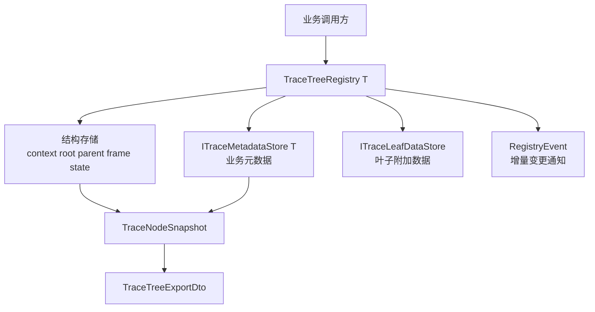
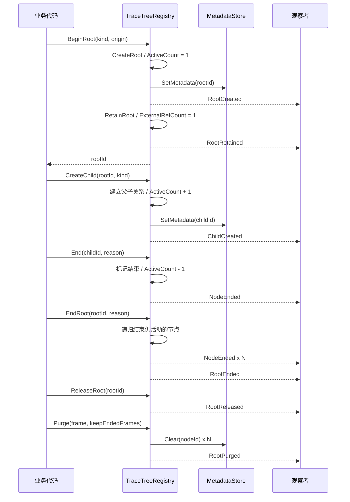
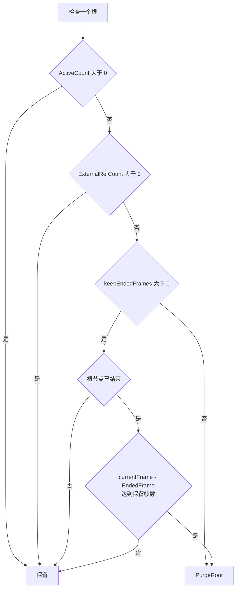
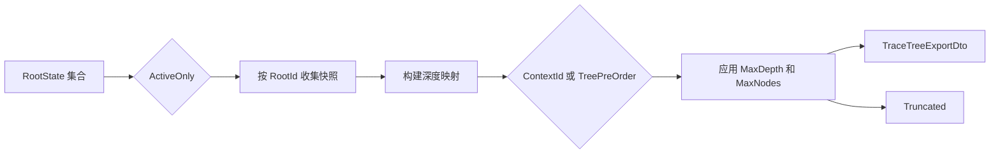

# Trace 生命周期与导出协议

## 一、文档定位

Trace 包提供一棵按因果关系组织的运行时树。一个根节点代表一次完整来源，例如技能释放、效果执行或一次服务调用；子节点记录该来源继续派生出的阶段和结果。框架保存父子关系、创建与结束帧、结束原因和业务元数据，调用方可以查询链路、订阅变化或导出快照。

本文讨论通用 Trace 注册表，不展开 MOBA 技能、Effect 和伤害的业务链路。MOBA 的生产接入与字段映射见 `09-ImplementationExamples/MOBA/09-TraceContextEffectDeepDive.md`。

当前实现位于 `com.abilitykit.trace`，核心代码不依赖 UnityEngine。Editor 包提供树窗口和节点详情插件，但编辑器展示不是本文定义的持久化协议。

## 二、核心模型

### 2.1 树结构与业务元数据分离

`TraceTreeRegistryBase` 保存所有玩法都需要的结构字段：

| 数据 | 作用 |
|---|---|
| `ContextId` | 注册表内的节点标识，由单调递增 ID 生成器分配 |
| `RootId` | 所属根节点，根节点的 `RootId` 等于自身 `ContextId` |
| `ParentId` | 直接父节点；根节点为 `0` |
| `Kind` | 节点类型整数，具体枚举由业务层定义 |
| `CreatedFrame` | 创建帧 |
| `EndedFrame` | 结束帧；是否结束应以 `IsEnded` 判断 |
| `EndReason` | 结束原因整数，具体枚举由业务层定义 |
| `IsEnded` | 节点是否已经结束 |

`TraceTreeRegistry<T>` 通过 `ITraceMetadataStore<T>` 管理业务元数据。业务注册表继承 `TraceMetadata`，实现 `CreateMetadata()` 及字段提取方法，不需要把 SkillId、Damage 或业务对象塞进通用树记录。

叶子节点还可以通过 `ITraceLeafDataStore` 挂接数值快照或调试数据。`SetLeafData()` 会检查目标当前是否为叶子；节点以后新增子节点时，框架不会自动迁移或删除此前写入的数据，因此调用方仍需约束写入时机。

### 2.2 根状态包含两组计数

每个根保存 `ActiveCount`、`ExternalRefCount` 和 `LastTouchedFrame`：

- `ActiveCount` 是树中尚未结束的节点数。创建根时为 `1`，创建子节点加一，每个节点首次结束时减一。
- `ExternalRefCount` 表示树外仍有持有者。`RetainRoot()` 增加计数，`ReleaseRoot()` 减少计数并钳制到零。
- `LastTouchedFrame` 在创建根、创建子节点、结束节点和命中 `EnsureRoot()` 时更新。

节点结束与根可回收是两个不同条件。`ActiveCount == 0` 说明整棵树没有活动节点；只有外部引用也为零，并满足保留帧策略时，`Purge()` 才会删除根及其数据。

## 三、创建与结束

### 3.1 Create、Begin 与 Scope

| API | 行为 | 引用计数 |
|---|---|---|
| `CreateRoot()` | 创建根节点 | 不增加外部引用 |
| `CreateChild()` | 在已有节点下创建子节点 | 不增加外部引用 |
| `BeginRoot()` | `CreateRoot()` 后调用 `RetainRoot()` | 根引用加一 |
| `BeginChild()` | `CreateChild()` 后对所属根调用 `RetainRoot()` | 根引用加一 |
| `CreateRootScope()` | 返回 `TraceRootScope` | Dispose 时释放根引用 |
| `CreateChildScope()` | 返回 `TraceTreeScope` | Dispose 时结束子节点 |

创建子节点要求父节点存在，否则抛出 `ArgumentException`。当前实现允许在已经结束的父节点下继续创建子节点，也允许只结束父节点而让子节点继续活动；框架没有强制结构状态机，业务层需要决定这种链路是否合理。

子节点未显式传入来源、目标或 Actor 时，会从根元数据继承，而不是从直接父节点逐级复制。这样可以让整棵树保持相同的原始来源，同时让节点通过自己的元数据记录局部参数。

### 3.2 生命周期时序

`End()` 是幂等式的状态变更：节点不存在或已经结束时返回 `false`，不会重复减少活动计数。`EndRoot()` 深度优先遍历整棵子树，只结束仍活动的节点，并返回本次实际结束数量。

### 3.3 Scope 的实际语义

`TraceRootScope.Dispose()` 只执行 `ReleaseRoot()`，不会自动调用 `EndRoot()`。调用方需要明确区分“当前持有者不再保留树”和“业务链路已经结束”。

`TraceTreeScope.Dispose()` 只执行 `End(contextId)`。当前 `BeginChild()` 会先增加根外部引用，但 `TraceTreeScope.Dispose()` 不会执行对应的 `ReleaseRoot()`。因此 `CreateChildScope()` 在现有实现中会留下根引用，阻止后续 `Purge()`。在该问题修复并补充回归测试前，生产代码不应把 child scope 视为完整的 retain/release RAII；可以改用 `CreateChild()` 配合 `End()`，或由接入层显式成对释放根引用。

## 四、清理协议

### 4.1 Purge 条件

`Purge(currentFrame, keepEndedFrames)` 逐个检查根：

`PurgeRoot()` 删除该根下的结构记录、父子索引、业务元数据和叶子数据，并发布 `RootPurged`。保留窗口读取根节点自身的 `EndedFrame`，所以只结束全部子节点但未结束根节点时，即使活动计数意外归零，也不会在启用保留窗口时被清理。

`Clear()` 是注册表级重置：清空全部树，重置 ID 生成器并发布 `RegistryCleared`。`Dispose()` 先从 `TraceRegistryDirectory` 注销，再调用 `Clear()`。注册表不是跨进程 ID 服务，清空后 ID 可以从 `1` 重新开始，导出结果若需要跨会话关联必须另带 session 标识。

### 4.2 Revision 与事件

每次 `Publish()` 都会让 `Revision` 加一。事件包括根和子节点创建、节点和根结束、根 retain/release、根清理以及注册表清空。观察者可以用 Revision 判断查询视图是否变化，但当前事件委托由调用线程同步执行，注册表没有捕获订阅者异常，也没有线程同步保护。

因此：

- 订阅者异常会向创建、结束或清理调用方传播。
- 订阅回调中的重入修改需要由接入层约束。
- 注册表应由逻辑线程单线程访问；当前 API 不构成并发容器。

## 五、查询与导出

### 5.1 运行时查询

注册表提供三类只读视图：

- 根视图：`GetRootStates()`、`GetActiveRoots()`、`GetEndedRoots()` 和 `TryGetRootState()`。
- 节点视图：`TryGetNodeSnapshot()`、`GetNodesByRoot()`、`GetNodesByKind()` 和 `TryGetChildren()`。
- 结构统计：`TryBuildChain()` 与 `TryGetRootStats()`。

这些接口返回快照或枚举，不承诺在枚举期间允许修改注册表。`TryBuildChain()` 的顺序是目标节点到根节点；需要根到叶顺序时由调用方反转结果。

### 5.2 导出选项

`ExportRoot()` 与 `ExportRoots()` 将运行时快照转换为 `TraceTreeExportDto`。导出字段包括节点 ID、父子归属、Kind、创建与结束帧、结束原因、子节点数、结束状态和可选元数据。

`TraceExportOptions` 控制以下边界：

| 选项 | 语义 |
|---|---|
| `MaxNodes` | 大于零时限制每棵树输出的节点数 |
| `ActiveOnly` | 在批量导出时只选择仍有活动节点的根 |
| `IncludeMetadata` | 是否附带业务元数据对象 |
| `MaxDepth` | 大于零时过滤深度超过上限的节点，根深度为零 |
| `Order` | 按 `ContextId` 或树前序排列 |

`ActiveOnly` 只过滤根，不会过滤活动根中的已结束节点。若需要“树内只输出活动节点”，当前导出协议没有对应选项。

树前序会先按 `ContextId` 排序兄弟节点，再从根递归遍历；无法从根到达的节点会按 `ContextId` 追加。`Truncated` 在节点上限或深度上限省略内容时为 `true`。它只表示本次导出不完整，不说明原树是否仍在运行。

### 5.3 导出不是稳定序列化格式

导出 DTO 仍包含 `object Metadata`，包内也没有固定 JSON Schema、字段版本或反序列化协议。它适合编辑器、诊断聚合器和一次性分析视图，不应直接作为长期存档或网络协议。

需要跨版本留存时，应由上层投影到带 Schema 版本的分析产物。Diagnostics 的 Analysis Artifact 已提供 Trace section，可作为稳定工程证据的承载层；该主题见 `10-EngineeringQuality/07-AnalysisArtifactAndRuntimeEvidence.md`。

## 六、生产接入

MOBA 示例已将技能释放、Effect 执行和伤害结果组织为 lineage，并将 Trace context 写入战斗执行上下文。该接入证明通用树可以承载真实战斗链路，但生产事实主要覆盖业务注册表与验收导出，不等于通用包所有生命周期分支都已验证。

接入时建议遵循以下约束：

1. 根节点对应一个可解释的原始请求，不要按每个低层函数创建根。
2. `Kind` 和 `EndReason` 由业务集中注册，避免不同模块复用相同整数表达不同语义。
3. 节点结束在业务状态提交后执行，使 `EndedFrame` 与实际结果帧一致。
4. 导出前决定是否需要保留元数据；元数据可能包含业务对象，不应默认进入网络或公开日志。
5. 运行时定期执行 `Purge()`，并监控 RootCount、TotalNodeCount 和长期非零外部引用。

## 七、验证现状与待补测试

当前包目录没有独立的 Runtime 或 Editor 测试程序集。MOBA 深潜与验收链路提供了集成证据，但以下通用行为仍应补专项测试：

| 优先级 | 测试 |
|---|---|
| P0 | `CreateRoot/CreateChild/End/EndRoot` 对 ActiveCount 的变化与幂等性 |
| P0 | `BeginChild/CreateChildScope` 的 retain/release 对称性，修复当前引用泄漏 |
| P0 | `Purge()` 在活动节点、外部引用和保留窗口组合下的行为 |
| P1 | `PurgeRoot()` 是否完整清除结构、metadata、leaf data 和子索引 |
| P1 | 两种导出顺序、MaxDepth、MaxNodes 与 `Truncated` |
| P1 | 事件顺序、Revision 单调性、订阅者异常和重入边界 |
| P2 | Editor ViewModel 对大树和持续变化注册表的刷新成本 |

## 八、当前边界

- 注册表按实例维护单调 ID，`Clear()` 后会复用 ID 区间；ID 不能脱离 session 单独持久化。
- API 没有锁，事件同步执行，当前设计面向单逻辑线程。
- 可以在已结束父节点下创建子节点，结构合法性由业务层保证。
- `TraceRootScope.Dispose()` 不结束树；`TraceTreeScope.Dispose()` 不释放 `BeginChild()` 增加的根引用。
- `ReleaseRoot()` 对多余释放静默钳制为零，无法直接发现引用配对错误。
- `ActiveOnly` 只筛选根，导出活动树时仍包含其中的已结束节点。
- 导出 DTO 的 metadata 是 `object`，没有稳定 Schema；长期证据应投影到版本化产物。
- 通用包缺少专项自动化测试，生命周期和清理协议的修改应先补回归测试。

## 九、源码入口

| 职责 | 文件 |
|---|---|
| 注册表、树结构、生命周期、清理 | `Unity/Packages/com.abilitykit.trace/Runtime/TraceTreeRegistry.Core.cs` |
| 通用接口、元数据与根状态 | `Unity/Packages/com.abilitykit.trace/Runtime/TraceInterfaces.cs` |
| Scope 与扩展方法 | `Unity/Packages/com.abilitykit.trace/Runtime/TraceTreeScope.cs` |
| 查询快照和注册表事件 | `Unity/Packages/com.abilitykit.trace/Runtime/TraceRegistryRuntime.cs` |
| 导出选项与 DTO | `Unity/Packages/com.abilitykit.trace/Runtime/TraceTreeExport.cs` |
| 来源与生命周期原因 | `Unity/Packages/com.abilitykit.trace/Runtime/TraceOrigin.cs` |
| Editor 树视图 | `Unity/Packages/com.abilitykit.trace/Editor/Windows/TraceTreeWindow.cs` |
| MOBA 生产接入深潜 | `Docs/design/09-ImplementationExamples/MOBA/09-TraceContextEffectDeepDive.md` |

## 十、结论

Trace 的核心契约是一棵带帧状态和业务元数据的因果树。创建、结束、外部持有和清理分别由不同 API 管理，任何接入都应显式处理这四个阶段。当前查询和导出能力足以支持编辑器观察、诊断聚合与示例验收，但 child scope 引用配对、并发与事件异常、稳定序列化协议和专项测试仍是明确的工程边界。
