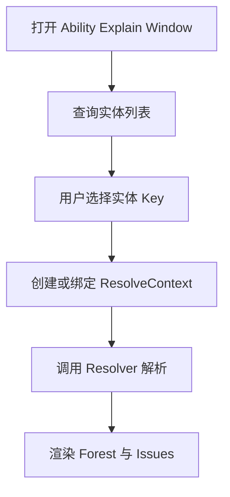
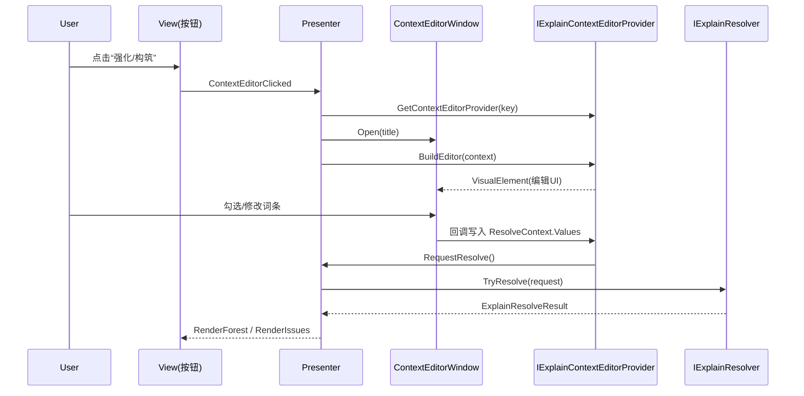
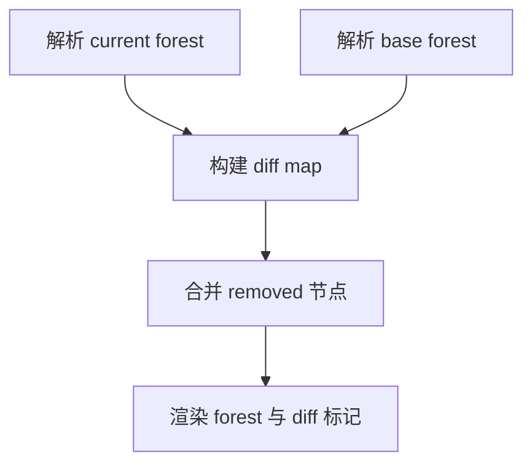

# Ability Explain 设计文档

## 1. 设计理念

Ability Explain 的目标是在 **Editor** 中提供一套“可解释化/可视化”框架，用于把**配置驱动**的能力/技能逻辑，以 Tree/Forest 的方式展示出来，并通过统一的导航协议定位到外部资源（表行/资产/文件/自定义窗口）。

核心取舍：

- 框架只负责“展示与交互骨架”，不内置业务规则。
- 业务侧以扩展点形式接入（Provider/Resolver/Navigator 等），由项目定义数据结构与跳转行为。
- 解析上下文使用 `ExplainResolveContext.Values`（键值对）承载“构筑/强化/词条”等不确定结构，使框架不绑定具体技能表结构。

## 2. 作用与非目标

### 2.1 作用

- 在一个窗口中查看某个实体（如 Ability/Projectile/Buff）的解释树。
- 展示 Issue（错误/警告）并支持定位。
- 展示 Action（跳转/打开表行/打开文件等）并执行。
- 支持子树发现（Discovery）：从树中识别引用到的其他实体，默认折叠，需要时展开。
- 支持 Diff：对比“基础解释树”与“带构筑解释树”的差异。

### 2.2 非目标

- 不负责读表/写表，不依赖具体配置系统（Luban/ScriptableObject/Json 等）。
- 不实现具体技能逻辑、词条规则、构筑规则。
- 不保证解释树节点一定可导航；导航能力由项目实现。

## 3. 核心概念

### 3.1 PipelineItemKey

用于标识窗口当前关注的实体，例如 `("Ability", "1001")`。

### 3.2 ExplainForest / ExplainNode

- `ExplainForest`：解释结果的容器，包含 0..n 棵解释树。
- `ExplainNode`：解释树的节点，包含标题、子节点、严重性、Issue/Action 等。

### 3.3 ExplainResolveRequest / ExplainResolveResult

- `ExplainResolveRequest`：一次解析请求，包含 Key、Options、Context。
- `ExplainResolveResult`：解析返回，包含 Forest、Issues 等。

### 3.4 ExplainResolveContext（构筑/强化承载）

`ExplainResolveContext` 是 resolver 的上下文输入，推荐用 `Values: Dictionary<string,string>` 承载项目侧的构筑/词条选择。

示例：

- `ui_show_diff=1`
- `mod_damage_plus=1`
- `mod_split_shot=0`

## 4. 扩展点一览（项目侧实现）

- `IEntityProvider`：提供可解释实体列表与显示名。
- `IExplainResolver`：把 `ExplainResolveRequest` 解析为 `ExplainResolveResult`（核心）。
- `INavigator`：执行 `NavigationTarget`（打开表行/资产/文件/自定义逻辑）。
- `IDiscoveryPolicy`：决定哪些 Key 可作为“子树发现”。
- `IExplainEntityListModule`：定制左侧实体列表的分组/过滤。
- `IExplainNodeContextMenuProvider`：节点右键菜单扩展。
- `IExplainContextEditorProvider`：左侧“强化/构筑”按钮弹窗编辑器扩展（用于编辑 ResolveContext）。

## 5. 典型流程

### 5.1 打开窗口与实体选择

### 5.2 构筑/强化编辑（左侧弹窗）

### 5.3 Diff 展示

当 `ResolveContext.Values["ui_show_diff"] == "1"` 时：

- 以“空上下文”解析一次作为 base forest
- 以当前上下文解析一次作为 current forest
- 构建 diff map 并渲染 badge/highlight

## 6. 约束与建议

- Resolver 建议对 `ExplainResolveContext.Values` 的缺省情况做兼容（null/缺 key）。
- ContextEditorProvider 只负责编辑 UI 和写入上下文；规则计算应在 Resolver 内部统一处理。
- 任何导航都通过 `INavigator` 执行，避免在 resolver 里直接依赖 UnityEditor API。

## 7. 最小接入清单（项目侧）

1. 实现并注册：`IEntityProvider`、`IExplainResolver`、`INavigator`。
2. 若需要构筑/词条编辑：实现并注册 `IExplainContextEditorProvider`。
3. 若需要发现子树：实现并注册 `IDiscoveryPolicy`，并在 resolver 节点中填充引用来源（Source/Actions 等）。
