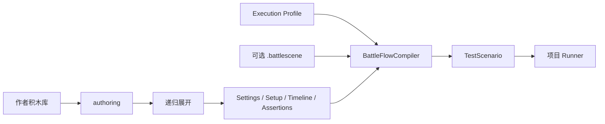
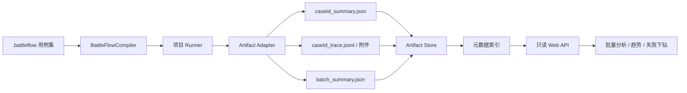

# AbilityKit BattleFlow

项目无关的战斗测试**作者模型**：策划和测试人员组合少量意图积木，编译阶段再展开为内部原子积木，并生成玩法中立的场景 IR。DSL 仅作为内部构建和开发者调试入口。

> 实现基线：2026-09-18。本文描述当前代码中的资产、编译、编辑器与 MOBA 接入契约；未来方案以“当前边界与后续方向”一节为准。

## 定位

BattleFlow 是**场景作者层的复用宏**，不是运行时控制结构。它给线性的 `TestScenario`（IR）加一层"粒度项目可选、可聚合可拆细"的作者层——测试和预览共用同一份编译结果。

## 职责红线（务必遵守）

**组合节点只做「宏」，不做「控制流」。**

- `BattleCompositeBlock` 只有 **Sequence** 语义：按序展开子积木，是纯分组/复用（宏），不涉及运行期判定。
- **不要**往 BattleFlow 加 Selector / Parallel / Loop / Condition 等控制流节点——那会让它退化成行为树的克隆 + 多一层封装。

| | 行为树（`com.abilitykit.behaviortree`） | BattleFlow（本包） |
| --- | --- | --- |
| 运行时机 | 运行期每帧 tick | 作者期一次编译 |
| 语义 | "此刻该干什么"（反应式，依赖世界状态） | "这一局是什么"（脚本式，固定序列） |
| 时间性 | 不确定（条件何时成立何时走） | 确定（每步固定 atMs） |
| 产出 | 行为（Success / Failure / Running） | 确定性 `TestScenario` |

两者树状外壳一样（叶子 + 组合），但语义与运行模型不同。**控制流 / 反应式行为（自适应对手、条件分支、循环）归行为树**，通过 DSL 的 `BehaviorProfileId` 挂到角色上。场景流程保持线性，测试才能确定性、可复现。

## 积木模型（作者层与内部层）

| 类型 | 角色 |
| --- | --- |
| `BattleBlock` | 积木基类（Id / DisplayName / Description） |
| `BattleAuthorBlock` | 策划/测试直接使用的意图积木，可跨多个语义区展开并校验参数 |
| `BattleAtomicBlock` | 叶子，`Compile(builder)` 编译成一个 IR 构件 |
| `BattleCompositeBlock` | 容器（Sequence），`Children` 一串子积木，可嵌套 |

- **框架给内部原子积木**（`SetEnvironmentBlock` / `SpawnActorBlock` / `TimelineStepBlock`），映射到 IR 的最细粒度。
- **框架和项目给作者积木及复合模板**，把参数、默认值、约束和内部步骤封装成策划可理解的测试意图。
- 编辑器普通模式只展示作者积木和复合模板；内部原子积木与 DSL 仅在开发者模式出现。
- 作者积木保存在 `.battleflow` 的 `authoring` 中，编译时展开为 `Settings / Setup / Timeline / Assertions`，不会把展开结果重复写回资产。
- `ExecutionProfileId` 提供执行默认值，普通用例不需要摆放 TickRate、超时等设置节点；显式 `ExecutionSettingsBlock` 仅用于开发者覆盖。

### 作者使用粒度

积木库按使用成本分成三层，而不是要求用户从原子节点开始搭建：

| 粒度 | 面向对象 | 典型用途 |
| --- | --- | --- |
| 测试配方 | 策划、测试 | 单节点描述一类完整测试，包括场景、动作和验收目标 |
| 测试意图 | 策划、测试 | 在已有场景或少量 setup 上组合施法、等待、验收等业务意图 |
| 内部原子节点 | 开发者 | 精确构造 IR、调试编译结果或补充尚未封装的能力 |

`BattleCompositeBlock` 是可保存、可嵌套的 Sequence 宏，用于复用一组节点；它不是第四种运行时控制流。积木库设计应优先提供配方，其次提供可组合意图，只有开发者模式才直接暴露原子节点。

## 编译到 IR（不造第三套）

作者积木可同时产生 Timeline 与 Assertions 等多个区的内容；测试与预览共用同一份展开和编译结果。



编译按以下顺序处理并合并输入：

1. 校验用例；校验过程中递归展开作者节点和复合宏（最多 64 层），并检查存储形态、语义区归属、场景所有权、作者参数以及重复的执行设置/随机种子。
2. 将 `ExecutionProfileId` 加入编译列表，作为默认执行设置。
3. 解析并校验可选的 `.battlescene`，加入静态 Setup。
4. 再次展开作者根，并按节点声明归入 `Settings / Setup / Timeline / Assertions`，以规范顺序加入编译列表。
5. 按 `Settings → Setup → Timeline → Assertions` 编译为 `TestScenario`。

Profile 先于用例节点编译，所以用例中的显式 `ExecutionSettingsBlock` 覆盖 Profile。`.battleflow` 只持久化作者节点，展开后的原子节点是派生结果，不重复写回文件。

```csharp
var standardJungleTest = new BattleCompositeBlock
{
    Id = "standard-jungle-test",
    Children = new BattleBlock[]
    {
        new SetEnvironmentBlock { ProfileId = "jungle-camp" },
        new SpawnActorBlock { Alias = "target", TeamId = 2 },
        new TimelineStepBlock { AtMs = 100, Action = "cast_skill", ActorAlias = "caster", TargetAlias = "target" },
    },
};

var scenario = BattleFlowCompiler.Compile("case-1", new BattleBlock[] { standardJungleTest });
// scenario 是 TestScenario：EnvironmentProfileId + Actors + Timeline 已填好
```

## 编辑器工作区

当前窗口不是固定的“左、中、右三个业务阶段”。普通模式围绕少量作者步骤组织，内部三语义区只用于开发者检查和精细编辑。

| 区域 | 普通模式职责 | 开发者模式职责 |
| --- | --- | --- |
| 顶部 | Case、Tags、Battle Scene、Execution Profile | 额外显示手工 `scenarioRef`、显式 Settings 和 DSL 入口 |
| 左侧 | 测试配方、测试意图和模板的积木库 | 同时显示内部原子节点 |
| 主区 | 单一“测试步骤”列表，节点字段内联编辑 | 没有作者节点时显示“构建前置 / 流程驱动 / 验收断言”三个内部区 |
| 底部 | 作者节点展开摘要、编译/运行结果和 Trace 树 | 同普通模式，用于核对投影和执行结果 |

因此，三个语义区是编译后的内部投影与诊断视图，不是要求策划按 Given / When / Then 分栏搭建。左侧回答“能选什么”，主区回答“这个测试由哪些意图组成”，底部回答“编译和运行结果如何”。当前字段直接编辑在节点内，没有独立的右侧 Inspector。

## 场景资产与用例资产

可复用的静态战场保存为 `.battlescene`，只包含环境、角色、障碍和 setup；`.battleflow` 表示测试用例，
通过 `scenarioRef` 引用场景，并只保存该用例自己的执行设置、时间线和断言。旧的自包含 `.battleflow`
仍可直接编译，不需要一次性迁移。

```json
{
  "schemaVersion": 3,
  "caseId": "xiaoqiao-cast",
  "scenarioRef": "shared-duel.battlescene",
  "tags": ["smoke", "skill"],
  "executionProfileId": "default",
  "authoring": [
    {
      "$type": "AbilityKit.Demo.Moba.EnvironmentModel.MobaSkillDamageTestBlock, AbilityKit.Demo.Moba.Environment",
      "slot": 1,
      "damageConfigId": 10020101
    }
  ]
}
```

- `scenarioRef` 相对 `.battleflow` 所在目录解析；省略扩展名时自动补 `.battlescene`。
- 引用了场景的用例不能再保存 setup，避免复制角色和环境定义形成两份事实来源。
- 作者文档在编译时展开并按 `Settings / Setup / Timeline / Assertions` 校验；作者节点参数无效、跨区积木和重复执行设置都会在编译前失败。
- 编辑器普通模式只显示测试步骤；开发者模式用于检查和编辑展开后的内部语义区。
- 普通模式从场景库下拉框绑定 `.battlescene`；手写 `scenarioRef` 和 DSL 只保留在开发者模式。
- `BattleFlowCompiler.CompileFile`、MOBA CLI 和批量 runner 共用同一套场景解析与校验逻辑。

MOBA 默认提供单节点的“施法并验证事件出现”“施法并验证事件未出现”“施法并验证状态”。它们都展开为一次施法和对应结果契约，不要求作者手工组合 Timeline 与 Assertion。

开发者模式下，文档级 DSL 可声明引用与标签，随后继续使用内部积木语句：

```text
scene shared-duel
tag smoke skill
execution tick=60 max=5000 settle=250 end=duration duration=4000
cast caster target slot=1 at=100
```

## MOBA 配置感知创作

MOBA 编辑器通过 `MobaBattleFlowConfigCatalog` 建立配置索引，并用可搜索下拉框代替常用 ID 的盲填。目录当前覆盖英雄、属性模板、技能、Effect、Buff、Projectile Launcher、Projectile、AOE、Summon 和 Search Query。

- 选择英雄时可带出默认属性模板。
- 选择施法英雄/属性模板后，技能列表收敛到其 ActiveSkills，并同时写入作者元数据 `SkillId` 与运行时输入 `Slot`。
- 选择技能后，Trace Config 候选会收敛到该技能可达的配置，并给出推荐值。
- 技能依赖索引递归扫描 PreCast/Cast Flow、Timeline、Sequence、Parallel、Repeat 和 DerivedSkill。
- `SkillFlowSO` 不完整或加载失败时，会从 `skill_flows.json` 补齐索引。
- 当前 Trace Config 不在技能可达范围内时显示一致性警告；外部配置 ID 仍允许手填和保留，不强制必须存在于本地目录。

### 完整技能测试配方

`MobaCompleteSkillTestBlock` 是当前最粗粒度的单节点配方。作者只需选择施法英雄及属性模板、目标英雄及属性模板、双方距离、技能、验收目标，以及必要时的执行参数。

```text
完整技能测试
  ├─ ExecutionSettingsBlock
  ├─ DuelSetupBlock
  └─ MobaSkillOutcomeTestBlock
       ├─ TimelineStepBlock(cast_skill)
       └─ AssertTraceBlock | AssertNoTraceBlock | AssertStateBlock
```

配方支持“Trace 必须出现”“Trace 不得出现”和“状态比较”三类验收。`SkillId` 只用于作者界面中的配置选择和一致性检查，真正发送给运行时的是 `Slot`，两者不能混为同一个契约。

完整配方会自行生成 `DuelSetupBlock`，因此不能同时绑定 `scenarioRef`。需要复用 `.battlescene` 时，应选择不含 Setup 的测试意图，或者由项目提供专门的场景引用型配方。

## 执行时间契约

普通用例通过 `ExecutionProfileId` 选择运行时钟与结束边界；开发者可用 `ExecutionSettingsBlock` 显式覆盖。`MaxDurationMs` 是防止失控运行的硬上限，
`EndCondition` 是正常结束条件，`SettleDurationMs` 是正常结束后的观察窗口，三者不能互相替代。

```text
execution tick=60 max=5000 settle=250 end=duration duration=4000
```

- `end=timeline`：最后一个时间线步骤完成后进入观察窗口。
- `end=duration duration=<ms>`：推进到指定场景时长后进入观察窗口。
- `wait` 是阻塞式时间线步骤；其持续时间会推进时间光标，后续较早的绝对时间不会让模拟时钟回退或重复推进。
- `default` Profile 使用 30Hz、30 秒硬上限、时间线完成和 500ms 观察窗口；旧文档自动使用该 Profile。
- 未知 DSL 动词和未知 execution 参数会直接报错，不再静默忽略。

## 批量结果与 Web 分析

BattleFlow 可以作为后续战斗测试平台的数据生产基座，但 Web 后台不应直接解释 `.battleflow`、调用 Unity API 或解析人类可读的 `Summary` 文本。两者通过版本化、机器可读的运行产物连接：



### 当前基座与演进边界

| 层级 | 当前能力 | Web 化要求 |
| --- | --- | --- |
| 用例 | `.battleflow`、Tags、场景引用和确定性执行参数 | 继续作为版本管理的输入，不作为后台查询模型 |
| 单例运行 | `BattleFlowRunResult` 提供 `Passed / Summary / Trace` | 保留为编辑器兼容接口；新增结构化 artifact，禁止后台解析 Summary 文本 |
| 批量运行 | `IBattleFlowBatchRunner` 返回可读报告字符串 | 保留兼容；批量执行器同时输出版本化 batch summary 和每例引用 |
| MOBA 产物 | Acceptance 链路已有 `*_summary.json`、`*_trace.jsonl`、`batch_summary.json` | 作为首个项目适配器和字段迁移来源，不把 MOBA DTO 提升为框架类型 |
| 平台 | AdminConsole/HTTP API 已具备只读 artifact 浏览基础 | 通过通用索引读取 BattleFlow artifact，执行入口另行受控 |

BattleFlow 核心包仍保持纯 C# 和玩法中立，不依赖数据库、对象存储、HTTP 或 Web DTO。MOBA、Shooter 等项目负责把自己的判定、覆盖率和诊断信息映射到通用产物信封；玩法专有明细放在版本化的扩展字段或独立附件中。

### 推荐产物契约

每次批量执行至少产生以下三类产物：

| 产物 | 粒度 | 必要内容 |
| --- | --- | --- |
| `<caseId>_summary.json` | 单用例 | 身份、版本、执行上下文、状态、稳定失败码、断言统计、维度标签和附件引用 |
| `<caseId>_trace.jsonl` | 单用例明细 | 每行一个有序事件/节点，包含关联键、帧/时间、类别、配置和父子关系 |
| `batch_summary.json` | 一批用例 | 批次身份、筛选条件、构建上下文、总数/通过/失败/错误/跳过以及 case summary 引用 |

通用信封至少稳定提供：

- 版本：`schemaVersion`、`producerVersion`。
- 关联身份：`runId`、`suiteId`、`caseId`、用例内容哈希；显示名称不能充当主键。
- 构建来源：仓库、分支、提交、构建号、触发来源和执行节点。
- 执行上下文：开始时间、耗时、Runner/Backend、随机种子、TickRate、Execution Profile、环境和配置版本/哈希。
- 结果：`passed / failed / error / skipped / needs-trace` 等稳定状态，稳定 `failureCode`，以及可变的人类说明。
- 查询维度：Tags，以及项目适配器提供的英雄、技能、场景、策略、配置和网络 Profile 等维度。
- 产物引用：逻辑类型、URI/相对路径、Content-Type、大小和校验和；后台不能依赖本机绝对路径。

字段只允许向后兼容地追加；改变既有字段语义时必须提升 Schema 主版本。消费者应忽略未知字段，生产者不得复用旧字段表达新含义。Trace 行同样需要 Schema 版本和 `runId / caseId / rootId / nodeId / parentId / frame` 等稳定关联键。

### 后台存储与查询职责

- 元数据数据库只索引 suite/case 摘要和常用维度；大体积 Trace、网络轨迹、截图及状态快照进入 artifact/object store，失败下钻时按需读取。
- 后台应支持按时间、分支、提交、标签、场景、英雄、技能、配置版本、Runner/Backend、状态和失败码筛选。
- 首批分析能力应覆盖通过率趋势、同用例跨提交对比、确定性指纹变化、耗时回归、失败码聚类和 Trace 根节点下钻。
- `failureCode` 用于聚合和告警，`Summary/errorMessage` 只用于展示；禁止按错误文案做稳定统计。
- 保留策略按摘要、失败 Trace、成功 Trace 和大附件分别配置。摘要应长期保留，成功 Trace 可采用更短周期或抽样保留。

### Web 执行安全边界

后台默认只读。浏览器不得提交任意 DSL、文件路径、命令行或程序集类型让服务端直接执行；需要从 Web 发起运行时，只能提交 allow-list 中的 `caseId / suiteId / workflowId` 和受约束参数，由 CI 或隔离的执行队列完成。

每次触发必须记录 `operationId`、操作者、输入版本、权限结果、执行目标和日志/产物引用，并具备认证、授权、并发限制、超时和审计。Web 层只负责调度和展示，不得改变 BattleFlow 的编译、判定或确定性语义。

### 分阶段落地

1. 定义玩法中立的 case/suite artifact Schema 和 JSON 示例，并为 Schema 增加兼容性测试。
2. 让 MOBA Runner 在保留现有文本接口的同时，适配已有 Acceptance summary/trace/batch 产物。
3. 建立 artifact manifest 与相对 URI，接入 CI 上传和只读后台索引。
4. 上线批次列表、筛选、趋势、失败详情和 Trace 按需下钻。
5. 最后增加受控执行入口、跨提交对比、失败聚类和保留策略自动化。

## 扩展约束

新增项目积木时遵循以下顺序：

1. 高频完整测试优先实现为 `BattleAuthorBlock` 配方，把默认值、字段校验、Setup、Timeline 和 Assertions 封装在 `Expand()` 中。
2. 需要在多个场景复用的动作或验收实现为较小的作者意图，并避免隐式创建 Setup。
3. 只有确实对应新的中性 IR 构件时才新增 `BattleAtomicBlock`；玩法语义和执行器留在项目包。
4. 只做静态复用时使用 `BattleCompositeBlock`，不要在其中引入条件、循环或并行运行语义。
5. 为项目字段注册 `IContextualBattleBlockFieldRenderer`，从配置目录提供级联选择、兼容性提示和外部 ID 回退。

作者节点必须能独立校验输入，展开结果必须通过语义区校验。同一个作者根可以跨区展开，但 `.battleflow` 不能同时保存 `authoring`、`sections` 和 legacy `blocks`。

## 当前边界与后续方向

| 能力 | 当前状态 |
| --- | --- |
| 作者节点、复合宏、递归展开与四区投影 | 已实现 |
| `.battleflow` / `.battlescene` 分离、引用解析和旧文档兼容 | 已实现 |
| Execution Profile、显式覆盖、最大时长、结束条件和观察窗口 | 已实现 |
| 普通/开发者双模式、预览、单例/批量运行和 Trace 树 | 已实现；Runner 由项目注册 |
| MOBA 完整技能配方、技能结果意图和配置级联选择 | 已实现 |
| 机器可读的 MOBA Acceptance case/trace/batch 产物 | 已有可复用基础，尚未统一为 BattleFlow artifact Schema |
| Web 后台只读浏览和批量分析链路 | 平台侧已有基础，BattleFlow 通用索引契约待实现 |
| 从 Trace/状态快照一键生成候选断言 | 尚未接入 BattleFlow 工作区 |
| 事件/状态驱动的动态停止条件 | 尚未进入中性执行契约；当前以 Timeline/Duration 结束和硬超时为主 |
| 归一化 Trace 基线评审与 CI 历史趋势 | 属于后续工程化能力 |

后续扩展仍以“让策划/测试用尽可能少的作者节点表达测试意图”为目标。新增底层节点不等于提升作者体验；只有当高频测试能被稳定封装、配置可选择、失败可定位时，才应进入普通模式积木库。

## 虚拟网络命令

BattleFlow 只负责把网络 DSL 编译成中性 `TestScenario.Commands`，不执行网络语义，也不依赖网络包：

```text
seed 47
network phase at=1000 until=3000 direction=inbound opcode=5202 latency=80 jitter=20 loss=0.1 reorder=0.05 bandwidth=128
network disconnect at=2000
network reconnect at=5000
network packet inbound opcode=5202 seq=101 at=5100
```

- `seed` 进入 `TestScenario.Seed`，同一场景、种子和输入必须生成一致的网络决策与战斗指纹。
- `network phase` 定义 `[at, until)` 的条件窗口；未填写的条件继承基线 profile。
- `network disconnect` / `network reconnect` 只切换虚拟链路，不操作真实 socket。
- `network packet` 描述权威帧或其他协议包的产生时刻；相同 `at` 保持脚本源顺序。
- 编译结果由 `network.runtime` 的 `VirtualNetworkScenarioPlan` 和 `VirtualNetworkScenarioPlayer` 解释；Moba 侧再把到达的帧接到 `BattleLogicSession.InjectRemoteFrame`。

### MOBA headless 执行顺序

只要场景包含 `network.*` 命令，MOBA LiveSim runner 就让网络命令与战斗时间线共用同一个单调虚拟时钟。每个时间戳严格按以下顺序执行：

1. 投递此前已经到期的虚拟包。
2. 执行该时刻的 `network.disconnect`、`network.reconnect`、`network.packet`。
3. 产生该时刻的战斗输入。

因此，同一时刻的 `network disconnect` 会稳定阻断 `cast`，同一时刻的 `network reconnect` 会先恢复链路再接受 `cast`。技能时间线输入按 `SkillInput` 出站包处理，只有实际投递后才进入原有 `IMobaInputCoordinator` 路径；非技能动作仍是本地确定性动作。

Headless runner 中的显式 `network.packet` 用于可观察的合成流量，不会伪造业务帧。需要覆盖客户端预测、对账和回滚时，应使用 `MobaVirtualFrameSessionRunner` 播放同一份虚拟网络计划，把交付回调绑定到 `BattleLogicSession.InjectRemoteFrame`，并通过 `advanceSimulationByMs` 在同一虚拟时钟上推进 session/feature。runner 会在交付权威帧前推进模拟、清空所有虚拟到期帧、执行超时约束，并输出网络轨迹与确定性指纹；调用方还可用 `captureFinalState` 把最终世界状态哈希纳入总指纹。底层单包能力仍由 `MobaVirtualFrameCarrier` 提供。两条路径都不依赖真实 socket 状态。

CLI 可用 `--determinism <scenario.json|flow.battleflow> [result.txt]` 连续执行两次并比较完整指纹；单例运行也可直接传入 `.battleflow`。普通执行在指定结果路径时额外生成 `.trace.json` 和 `.network.json`。

## 说明

- 纯 C#（`noEngineReferences`）、C# 9 兼容、无 Unity / 无实体系统依赖，可在 .NET 直接测试。
- 依赖 `com.abilitykit.scenario`（中性 IR）；`EnvironmentProfileId` 是**不透明字符串 id**，由项目侧的 environment catalog 解析。
- 本包只给**作者层机制**和中性命令积木，不解释网络或玩法语义；MOBA/shooter 各自提供自己的复合积木、载荷解析与积木库。
