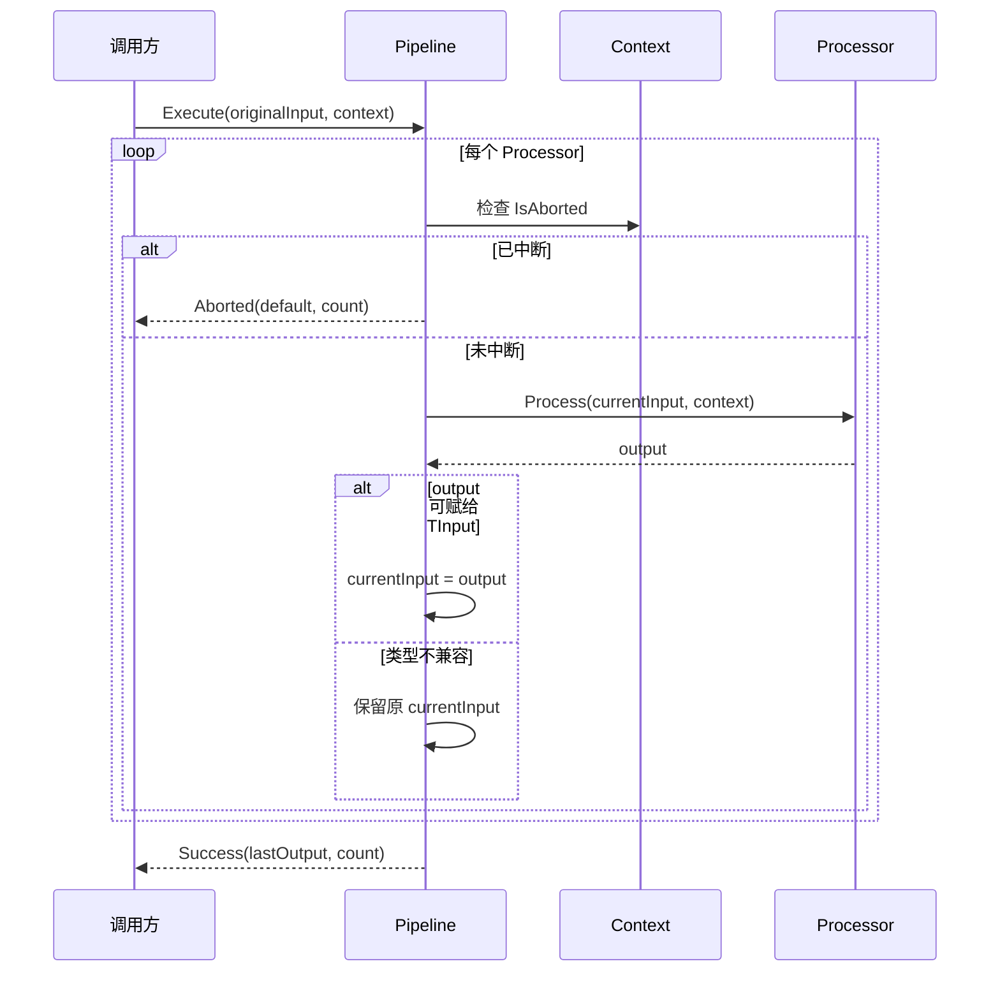
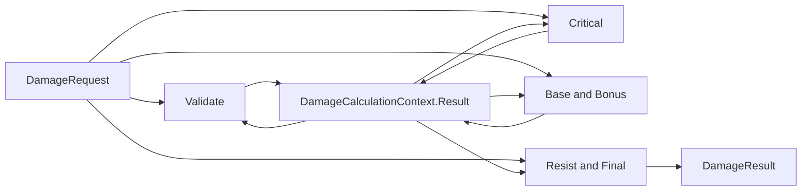

# Ability-Kit Dataflow：处理器链、异形结果传递与执行边界

> **阅读对象**：需要编写战斗计算、规则校验、数值修正或可组合处理流程的框架开发者。
>
> **文档目标**：以当前源码为准，说明处理器链、上下文槽位、同形/异形输入输出、结果状态和实例所有权；同时区分已实现能力、Samples 采用与尚未建立的测试证据。
>
> **当前成熟度：E1（示例采用）**。Dataflow 有 Unity package 与 .NET 镜像，`AbilityKit.Combat.Damage` 基于它实现伤害管线，`AbilityKit.Samples.Logic` 有两个真实调用；但 Dataflow 没有专项测试，Damage 测试工程也未覆盖 Pipeline，因此不能外推为生产主链路或已建立回归门禁。

---

## 一、设计理念：为什么需要 Dataflow 模块

Dataflow 模块用于把一段复杂计算拆成多个可组合的处理阶段。它适合表达“输入数据经过校验、修正、条件分支、中断判断，最终得到输出”的流程。

在战斗或技能系统中，常见问题是：

| 问题 | 表现 | Dataflow 的解决方式 |
|------|------|--------------------|
| 计算步骤散落 | 校验、修正、日志、打断逻辑混在一个函数里 | 通过 `IDataflowProcessor` 拆分为处理器 |
| 处理阶段难复用 | 同一段规则在不同技能中重复实现 | 处理器可以加入不同 Pipeline |
| 中间状态难传递 | 暴击、来源、临时参数需要跨阶段共享 | 通过 `IDataflowContext` 的 typed slot 或领域 Context 保存 |
| 错误和中断不统一 | 有的抛异常，有的返回特殊值 | 用 `DataflowResult` 和 `context.Abort()` 汇总最终状态 |

核心思想是：让业务计算沿着明确的处理器列表前进，每个处理器只关心当前输入、上下文和自己的输出。

---

## 二、模块边界

### 2.1 Dataflow 负责什么

- 定义数据处理器接口和抽象基类。
- 管理处理器链的添加、插入、移除和执行。
- 提供执行上下文，用于跨处理器共享临时数据。
- 封装成功、失败、中断三类执行结果。
- 提供常见处理器模板：校验、条件、打断、组合、日志。

### 2.2 Dataflow 不负责什么

- 不负责调度 Tick，也不维护时间。
- 不负责依赖注入、处理器创建、销毁或状态隔离。
- 不负责异步执行、线程切换、锁或并发调度。
- 不负责输入、输出、Context 或 Processor 的深拷贝。
- 不提供阶段级泛型类型链；一个 Pipeline 中所有 Processor 都共享同一组 `TInput/TOutput`。
- 不负责事务回滚、部分输出保留、失败阶段定位和逐阶段 trace。
- 不负责战斗领域规则本身，只提供组合骨架。

---

## 三、目录结构

| 路径 | 职责 |
|------|------|
| `Runtime/Core/Pipeline/DataflowPipeline.cs` | Pipeline 接口、泛型实现、Builder 和扩展入口 |
| `Runtime/Core/Pipeline/DataflowResult.cs` | 执行结果模型，表达成功、失败、中断 |
| `Runtime/Core/Context/IDataflowContext.cs` | 上下文接口 |
| `Runtime/Core/Context/DataflowContext.cs` | 上下文实现，保存 Source、Abort 状态和槽位 |
| `Runtime/Core/Context/DataflowSlots.cs` | typed slot 定义 |
| `Runtime/Core/Processor/IDataflowProcessor.cs` | 处理器接口与抽象基类 |
| `Runtime/Core/Processor/CommonProcessors.cs` | 常用处理器模板 |

---

## 四、核心类型与职责

### 4.1 DataflowPipeline<TInput, TOutput>

`DataflowPipeline<TInput, TOutput>` 是处理器链容器。内部使用 `List<IDataflowProcessor<TInput, TOutput>>` 保存处理阶段。Pipeline 自身不维护“本次执行”的独立状态，但会直接复用列表中的 Processor 实例，因此线程安全取决于 Processor 是否无状态以及调用方是否隔离 Context。

核心 API：

| API | 行为 |
|-----|------|
| `Execute(input, context)` | 顺序执行处理器，返回 `DataflowResult<TOutput>` |
| `AddProcessor` / `AddProcessors` | 追加处理器 |
| `InsertProcessor` | 按索引插入处理器 |
| `RemoveProcessor` | 删除指定索引处理器 |
| `Clear` | 清空处理器链 |
| `Clone` | 复制 Pipeline 结构，处理器实例仍为同一引用 |

执行时，如果 `context` 为 null，会创建新的 `DataflowContext`。如果没有处理器，当前实现返回 `Success(default, 0)`。

### 4.2 IDataflowProcessor<TInput, TOutput>

处理器是 Pipeline 的最小执行单元：

```csharp
public interface IDataflowProcessor<TInput, TOutput>
{
    string Name { get; }
    TOutput Process(TInput input, IDataflowContext context);
}
```

抽象基类 `DataflowProcessor<TInput, TOutput>` 的固定顺序是 `OnBeforeProcess -> OnProcess -> OnAfterProcess`。任一 Hook 抛出的异常都会越过当前 Processor，由 Pipeline 捕获并转为 Failure；框架不会执行补偿 Hook。

### 4.3 IDataflowContext 与 DataflowContext

上下文承担三个职责：

- 保存 `Source`，用于记录本次流水线来源对象。
- 保存 `IsAborted`，处理器可以调用 `Abort()` 阻止后续阶段。
- 保存 typed slot，用于跨处理器传递临时数据。

`DataflowSlot<T>` 让调用 API 带上泛型，但默认 Context 的底层键是 `slot.Name` 字符串，而不是 slot 实例或 `(name, type)`。因此它消除了调用处的裸字符串，却没有提供全局类型唯一性：两个同名、不同泛型类型的 slot 会覆盖同一项；读取时类型不兼容只会返回默认值，可能掩盖配置错误。业务模块必须为 slot 名称建立稳定、唯一的命名规范。

`ContainsData(slot)` 只检查名称是否存在，不检查值是否能转换为该 slot 的 `T`。`Clear()` 与 `Reset()` 当前都会清空数据、Source 和 Abort 状态；派生 Context 需要重写 `Reset()` 清理自己的字段。

### 4.4 DataflowResult<T>

执行结果记录 `Output`、`ProcessedCount`、`IsAborted` 和 `Error`，其中 `IsSuccess` 等价于“未中断且无异常”。Pipeline 捕获 Processor 异常后返回 Failure，不继续向外抛出该异常。

当前 Result 不是阶段诊断对象：它没有失败 Processor 名称、索引、中断原因或阶段耗时。更重要的是，Pipeline 在 Aborted 和 Failure 路径都传入 `default(TOutput)`，此前成功阶段的 `lastOutput` 不会保留。调用方不能把失败 Result 的 Output 当作部分提交结果。

### 4.5 CommonProcessors

当前内置模板包括：

| 类型 | 职责 |
|------|------|
| `ValidatorProcessor<TInput>` | 校验输入，不通过时调用 `context.Abort()` 并返回默认值 |
| `ConditionalProcessor<TInput,TOutput>` | 根据条件选择 true/false 分支处理 |
| `InterruptProcessor<TInput,TOutput>` | 满足条件时中断 Pipeline，同时仍可执行转换 |
| `CompositeProcessor<TInput,TOutput>` | 将多个处理器并列包装成一个处理器；每个子处理器都收到原始 input |
| `LoggingProcessor<TInput>` | 输出输入和输出日志，默认写到 `Console.WriteLine` |

---

## 五、执行语义：同形回灌与异形结果



### 5.1 同形或兼容类型管线

源码使用模式匹配，而不是强制转换：

```csharp
if (output is TInput nextInput)
{
    input = nextInput;
}
```

当 `TInput == TOutput`，或运行时 output 同时实现/继承 `TInput` 时，输出才成为下一 Processor 的输入。若 output 为 null 或类型不兼容，下一阶段继续收到之前的 input，不抛类型转换异常。

这适合“同一模型逐步规范化”的流程。需要注意：框架不会复制 input；若 Processor 原地修改引用对象，即使返回值不回灌，后续阶段仍可能观察到同一对象的变更。

### 5.2 异形管线不是阶段泛型链

`DataflowPipeline<DamageRequest, DamageResult>` 是当前最重要的异形示例。所有 Damage Processor 的接口都是 `Process(DamageRequest, context) -> DamageResult`；由于 `DamageResult` 不能赋给 `DamageRequest`，每一阶段都继续收到原始 Request。



中间结果不是靠 Pipeline 的 input 回灌，而是靠 `DamageProcessor.OnAfterProcess()` 写入 `DamageCalculationContext.Result`，下一 Processor 再在 `OnBeforeProcess()` 读取。`CritRoll` 由调用方写入 `DamageSlots.CritRoll`，避免 Processor 自行取随机数，这对纯逻辑测试、回放和帧同步确定性是正确方向。

这套设计的代价是领域 Processor 与特定 Context 形成隐式协议。若调用方只传普通 `DataflowContext`，每个 Damage Processor 都可能重新以 Request 创建结果，无法得到预期的累积计算。通用框架不会验证 Context 的具体类型。

### 5.3 Abort 与异常时序

Abort 在每次 Processor 开始前检查，而不是在 Processor 返回后立即检查。因此触发 `context.Abort()` 的 Processor 会正常返回并计入 `ProcessedCount`，Pipeline 在下一轮开始时才返回 Aborted。若它恰好是最后一个 Processor，循环结束后将返回 Success，因为没有下一轮检查。

异常发生时，抛错 Processor 不计入 `ProcessedCount`；Failure 的 Output 为 default。Abort 和异常都没有事务回滚，Processor 对 input、Context 或外部对象已产生的副作用会保留。

---

## 六、实例所有权与线程边界

| 对象 | 推荐所有者 | 可否跨执行复用 | 当前风险 |
|------|------------|----------------|----------|
| Pipeline | 业务服务、Factory 或单次调用 | 仅在 Processor 无状态且列表不被并发修改时 | Add/Insert/Remove/Clear 与 Execute 无锁 |
| Processor | Pipeline 创建方 | 无状态实现可复用；有实例字段时应隔离 | 框架不提供生命周期和并发保护 |
| Context | 单次 Execute 或对象池租约 | Reset 后可串行复用 | 字典和 Abort 状态无锁，不可并发共享 |
| Input/Output | 调用方 | 由业务模型决定 | 框架不复制、不冻结、不回滚 |
| Clone 结果 | Clone 调用方 | 结构独立 | Processor 引用共享，不是深克隆 |

Damage Processor 持有 `_result` 实例字段。即使每次执行都会从 Context 覆盖它，同一 `DamageCalculationPipeline` 上的并发 Execute 仍会竞争该字段。当前安全用法是每次创建默认 Damage Pipeline，或保证同一 Pipeline 串行执行。

`DataflowPipelineBuilder.Build()` 直接返回 Builder 内部 Pipeline，多次 Build 不生成快照。Build 后继续 Add/Insert 会修改先前取得的同一个实例。

---

## 七、扩展与最小接入

新增同形处理器时，优先继承 `DataflowProcessor<T>`；异形流程只有在每一阶段都接受同一个原始输入、并明确设计领域 Context 协议时才适用。不要把该 API 理解成可表达 `A -> B -> C` 的阶段类型图。

```csharp
public sealed class DamageValue
{
    public int Value;
}

public sealed class ClampDamageProcessor
    : DataflowProcessor<DamageValue, DamageValue>
{
    protected override DamageValue OnProcess(
        DamageValue input,
        IDataflowContext context)
    {
        input.Value = Math.Max(0, input.Value);
        return input;
    }
}

var pipeline = DataflowPipelineExtensions
    .NewPipeline<DamageValue, DamageValue>("Damage")
    .Add(new ClampDamageProcessor())
    .Build();

var context = new DataflowContext();
var result = pipeline.Execute(new DamageValue { Value = 100 }, context);
if (!result.IsSuccess)
{
    // 显式处理 result.IsAborted 与 result.Error。
}
```

业务 slot 应采用模块前缀和稳定含义，例如 `Damage_CritRoll`，并保证同名 slot 的泛型类型全仓一致。日志处理器应重写 `Log()` 接入框架诊断；默认 `Console.WriteLine` 不应直接进入 Unity 或服务端热路径。

---

## 八、失败矩阵

| 场景 | 当前结果 | 调用方必须知道的边界 |
|------|----------|----------------------|
| Context 为 null | 自动创建普通 `DataflowContext` | 领域 Processor 依赖派生 Context 时可能静默降级 |
| Pipeline 为空 | `Success(default, 0)` | 成功不代表产生了有效输出 |
| Execute 前 Context 已 Abort | `Aborted(default, 0)` | 复用 Context 前必须 Reset |
| Processor 内 Abort | 下一阶段开始前返回 Aborted | 当前 Processor 已执行并计数；末阶段 Abort 可能返回 Success |
| Processor 或 Hook 抛异常 | `Failure(exception, default, count)` | 抛错阶段不计数，部分输出和阶段身份丢失 |
| 同名不同类型 slot | 后写覆盖前值；类型不符时读默认值 | typed API 不保证运行时键类型安全 |
| Composite 包含多个 Processor | 每个子项收到同一原始 input | 仅最后一个 output 返回，不构成链式变换 |
| Clone 后修改 Processor 内部状态 | 原 Pipeline 与 Clone 同时受影响 | Clone 只复制列表结构 |
| 并发 Execute 有状态 Processor | 数据竞争 | 框架无锁；Damage `_result` 明确不安全 |
| Processor 已修改外部状态后失败 | 返回 Failure | 无补偿、无事务回滚 |

---

## 九、采用证据与未覆盖范围

| 等级 | 当前证据 | 结论 |
|------|----------|------|
| E0 源码 | `com.abilitykit.dataflow/Runtime` 与 `src/AbilityKit.Dataflow` | Unity 与 .NET 共用 package Runtime 源码 |
| E1 示例 | `CombatDamagePipelineSample`、`CombatProjectileHitDamage` | Damage 异形管线在 Samples 有真实调用 |
| E2 生产接入 | 未发现 package 或 Server 业务主链路调用 | 不声明生产采用 |
| E3 自动测试 | Dataflow 无专项测试；Damage 测试仅验证 `DamageRequest` 默认值 | Pipeline、Context、Abort、Clone 与并发语义均无回归保护 |
| E4 场景验收 | 未发现 Dataflow 专项 Smoke/Acceptance | Samples 输出不能替代场景门禁 |
| E5 发布门禁 | 未建立 | 无基线、预算或 CI 阻断声明 |

优先测试建议：

1. P0：同形回灌、异形不回灌、null output、空 Pipeline、末阶段 Abort、异常计数和 default Output。
2. P0：同名跨类型 slot、ContainsData 类型错配、Reset 后状态、派生 Context Reset。
3. P1：Clone/Builder 共享身份、Composite 原始 input 语义、有状态 Processor 并发保护策略。
4. P1：Damage 八阶段结果、无效 Request Abort、确定性 CritRoll、普通 Context 误用。
5. P2：阶段 trace、耗时与低分配基线，再决定是否晋升生产能力。

---

## 十、源码阅读路径

1. 从 `Runtime/Core/Pipeline/DataflowPipeline.cs` 阅读 Execute、列表修改、Clone 和 Builder。
2. 阅读 `Runtime/Core/Processor/IDataflowProcessor.cs`，确认三个 Hook 的异常边界。
3. 阅读 `Runtime/Core/Context/DataflowContext.cs` 与 `DataflowSlots.cs`，确认字符串键和默认值行为。
4. 阅读 `Runtime/Core/Processor/CommonProcessors.cs`，重点核对 Abort 与 Composite。
5. 阅读 `com.abilitykit.combat.damage/Runtime/Damage/Processor/DamageProcessors.cs` 和 `DamageCalculationContext.cs`，理解异形结果传递。
6. 阅读 `src/AbilityKit.Samples.Logic/Samples/Combat/CombatFirstWaveSamples.cs`，观察两个 E1 调用。
7. 阅读 `src/AbilityKit.Combat.Damage.Tests/DamageRequestTests.cs`，确认当前测试未覆盖 Pipeline。

---

## 十一、演进顺序

1. 先补契约测试，固定当前兼容回灌、Abort、异常、slot 和 Clone 语义。
2. 再决定是否修复末阶段 Abort、保留 partial output，并为 Result 增加失败阶段与原因。
3. 将 Context 键升级为 slot identity 或 `(name, type)` 前，先评估序列化、跨程序集共享和兼容成本。
4. 明确 Processor 的无状态约束、Clone 策略和 Builder 快照语义。
5. 若需要真正的异形阶段链，新增显式 `A -> B -> C` 组合抽象，不改变现有 Damage 协议的兼容行为。
6. 接入 diagnostics/trace，并在有生产消费者和自动测试后再提升证据等级。

---

*文档版本：2.0*
*最后更新：2026-08-09*
