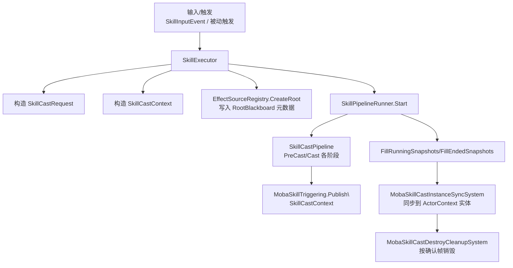
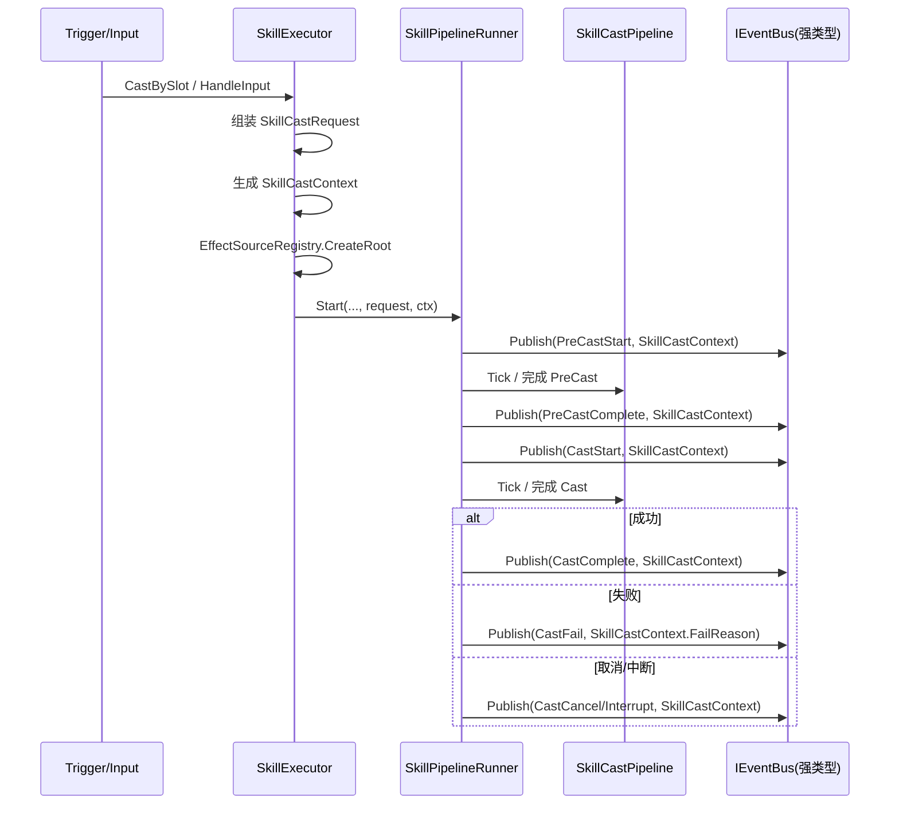

# 技能流程总览（Moba Demo Runtime）

> 本文面向 `com.abilitykit.demo.moba.runtime` 包内的技能模块实现，目标是把“从输入到施法、从流水线到 ECS 同步、从事件到溯源”的链路讲清楚，便于后续重构/扩展。

---

## 1. 设计理念

### 1.1 目标

- **强类型数据流**：技能相关事件与 payload 以 `SkillCastContext` 为权威载体，尽量避免弱类型字典/字符串事件。
- **并行施法友好**：同一施法者支持多个技能实例并行（受策略开关控制），每个实例都有独立的 `SourceContextId` 与生命周期。
- **ECS 可观测**：运行中的技能实例以 `SkillCastInstance`（ActorContext entity）形式同步到 ECS，便于 UI/逻辑系统读取。
- **可追溯（EffectSource）**：技能触发与后续 effect 执行共享同一条“溯源树”，用于归因/回放/调试。

### 1.2 三条主干链路

- **触发链路**：输入/被动触发 => `SkillExecutor` 组装 `SkillCastRequest/SkillCastContext` => `SkillPipelineRunner.Start`。
- **执行链路**：`SkillCastPipeline` 驱动阶段（PreCast/Cast/Timeline 等）=> 产生效果/表现/事件。
- **同步链路**：`SkillPipelineRunner` 提供运行快照 => `MobaSkillCastInstanceSyncSystem` 同步到 ECS => `MobaSkillCastDestroyCleanupSystem` 按确认帧销毁。

---

## 2. 核心数据结构（权威数据载体）

### 2.1 `SkillCastRequest`（流水线初始化参数）

所在文件：

- `Runtime/Impl/Moba/Services/Skill/Pipeline/SkillPipelineContext.cs`

用途：

- 用于初始化 `SkillPipelineContext.Initialize(...)`。
- 是 “把一次施法的输入参数打包” 的结构体。

关键字段：

- `SkillId` / `SkillSlot`
- `CasterActorId` / `TargetActorId`
- `AimPos` / `AimDir`
- `IWorldResolver WorldServices`
- `IEventBus EventBus`

> 说明：目前 `SkillCastRequest` 仍用于 pipeline 上下文初始化；而对外事件/触发 payload 以 `SkillCastContext` 为权威。

### 2.2 `SkillCastContext`（强类型事件 payload）

所在文件：

- `Runtime/Impl/Moba/Services/Skill/Cast/SkillCastContext.cs`

用途：

- 发布技能事件（PreCastStart/Complete/Fail、CastStart/Complete/Fail 等）时的 payload。
- 与溯源模块打通：`SourceContextId` 对应 `EffectSourceRegistry` 的 root。

关键字段（示意）：

- `SourceContextId`：溯源根 id（非常关键）
- `SkillId` / `SkillSlot` / `SkillLevel` / `Sequence`
- `CasterActorId` / `TargetActorId`
- `AimPos` / `AimDir`
- `FailReason`：失败原因（强类型传递，避免散落在弱类型 args）

### 2.3 `SkillPipelineContext`（流水线运行态上下文）

所在文件：

- `Runtime/Impl/Moba/Services/Skill/Pipeline/SkillPipelineContext.cs`

用途：

- `AbilityPipeline<SkillPipelineContext>` 运行时读写的数据容器。
- 持有 `SourceContextId` / `FailReason` 以及 `SharedData`（阶段间共享）。

关键点：

- `SharedData`：用于 Timeline 阶段推进等局部运行数据。
- `IsAborted`：用于区分“取消/中断”语义（Pipeline 状态本身可能不含 Interrupted）。

---

## 3. 主要模块职责划分

### 3.1 `SkillExecutor`：技能施法入口（组装上下文 + 创建溯源 root）

所在文件：

- `Runtime/Impl/Moba/Services/Skill/Cast/SkillExecutor.cs`

职责：

- 接收输入/调用（例如 `HandleInput`、`CastBySlot`、`CastSkill`）。
- 解析技能配置（pipeline library）。
- 组装 `SkillCastRequest`，并生成 `SkillCastContext`。
- **创建 EffectSource root**：
  - `EffectSourceRegistry.CreateRoot(kind: SkillCast, ...)`
  - 写入 root blackboard 元数据（skillId/slot/level/sequence/caster/target）。
- 将请求交给 `SkillPipelineRunner.Start(...)`。

### 3.2 `SkillPipelineRunner`：技能实例调度与生命周期管理

所在文件：

- `Runtime/Impl/Moba/Services/Skill/Pipeline/SkillPipelineRunner.cs`

职责：

- 每个 actor 一个 runner，内部维护多个 `Entry`（支持并行）。
- 管理“PreCast -> Cast”串联。
- 在关键节点发布事件（通过 `MobaSkillTriggering.Publish(...)`）。
- 在结束/取消/失败时触发溯源结束（`EffectSourceRegistry.End(...)`）。
- 对外提供运行快照：
  - `FillRunningSnapshots(...)`
  - `FillEndedSnapshots(...)`

### 3.3 `MobaSkillTriggering`：技能事件发布（强类型 EventKey）

所在文件：

- `Runtime/Impl/Moba/Services/Skill/Events/MobaSkillTriggering.cs`

职责：

- 统一封装“技能事件发布”。
- 对外只发布强类型 payload（`SkillCastContext`）。
- `FailReason` 等字段通过 `SkillCastContext` 传递。

### 3.4 `MobaSkillCastInstanceSyncSystem`：把运行态同步到 ECS

所在文件：

- `Runtime/Impl/Moba/Systems/Skill/MobaSkillCastInstanceSyncSystem.cs`

职责：

- 每帧从 `SkillExecutor` 获取 runner 快照。
- 将每个技能实例映射到一个 ActorContext entity（`SkillCastInstanceId` 为主键）。
- 更新组件：owner/skill/slot/level/sequence/startFrame/stage/aim/target/timelineRuntime...
- 标记 running/ended。
- 处理“不再出现的实例”的收尾与销毁请求。

### 3.5 `MobaSkillCastDestroyCleanupSystem`：按确认帧销毁实例实体

所在文件：

- `Runtime/Impl/Moba/Systems/Skill/MobaSkillCastDestroyCleanupSystem.cs`

职责：

- 根据 `SkillCastDestroyRequest` 以及权威确认帧门槛进行最终销毁。
- 防止预测帧下“过早删除导致抖动/回滚不一致”。

### 3.6 `EffectSourceRegistry`：溯源树（root/child、blackboard、生命周期）

所在目录：

- `Packages/com.abilitykit.ability.runtime/Runtime/Ability/Impl/Moba/EffectSource/`

职责：

- 创建 root/child 上下文（树结构）。
- 维护 root 的 blackboard（存储技能元数据、kind 等）。
- 管理结束（End）、清理（Purge）、引用计数（Retain/Release）。

---

## 4. 数据流向（从输入到 ECS）

### 4.1 总流程图（概览）

### 4.2 事件流（SkillCastContext 作为唯一权威 payload）

---

## 5. 溯源（EffectSource）与技能的接入点

### 5.1 创建 root

发生位置：`SkillExecutor.CastSkillInternal(...)`

- `ctx.SourceContextId = effectSource.CreateRoot(EffectSourceKind.SkillCast, ...)`
- 写 root blackboard：
  - `EffectSourceRegistry.RootIntKeys.EffectSourceKind`
  - `SkillId/Slot/Level/Sequence/Caster/Target`

### 5.2 结束 root（生命周期闭环）

发生位置：`SkillPipelineRunner.TryEndEffectSource(...)`（在完成/失败/取消路径上调用）

- `effectSource.EnsureRoot(...)`（幂等修复，防断链）
- `effectSource.End(ctx.SourceContextId, frame, reason)`

### 5.3 查询技能元信息

- `EffectSourceRegistry.HasSkillRootMeta(rootId)`
- `EffectSourceRegistry.TryGetSkillRootMeta(rootId, out meta)`

用途举例：

- 调试 HUD：通过 rootId 反查 skillId/slot/level。
- 归因统计：把 effect 归到某次施法序列（sequence）。

---

## 6. ECS 同步：SkillCastInstance 的生命周期

### 6.1 实例主键选择

- `InstanceId` 取自 `SkillCastContext.SourceContextId`。
- 优点：
  - 与溯源 root 同 id，链路天然统一。
  - 对外展示/调试定位更直接。

### 6.2 同步策略（每帧快照式对齐）

- runner => `RunningSnapshot` / `EndedSnapshot`
- sync system => 如果没 entity 就创建；如果有就 replace。

### 6.3 清理策略（保留帧 + 确认帧门槛）

- `RetainCompletedFrames`：结束后仍保留若干预测帧，用于 UI/表现平滑。
- `DestroyConfirmGateFrames`：发起销毁请求后，等待“权威确认帧”跨过门槛再真正销毁，降低回滚导致的闪烁。

> 这两个参数由 `MobaSkillCastInstanceSyncSettings` 提供默认值并支持 DI 覆盖。

---

## 7. 常见扩展点（建议）

- **输入多阶段**：目前 `SkillExecutor.HandleInput` 只实现 Press/Release 的基本行为；Hold/Cancel 可用于蓄力/引导/确认等。
- **按技能类型差异化清理策略**：可在 settings 中按 `SkillId` 或 `SkillCastStage` 配置不同的 retain/gate。
- **更强的“入口统一”**：所有触发入口都应最终走 `SkillExecutor`，避免产生“绕过溯源/绕过 ECS 同步”的分叉路径。

### 7.1 统一回收（高性价比，强烈建议）

`SkillPipelineContext` 内置了 cleanup 注册表，复杂技能在执行过程中创建的临时资源（订阅、计时器、外部句柄等）建议统一注册，由 Runner 在 Completed/Fail/Cancel/Interrupt 的所有出口统一回收：

- `context.RegisterCleanup(IDisposable)`
- `context.RegisterCleanup(Action)`
- `context.RunAndClearCleanups()`（由 `SkillPipelineRunner` 在终止出口自动调用）

### 7.2 分支流程（框架已内置 ConditionalPhase）

`com.abilitykit.pipeline` 已内置 `AbilityConditionalPhase<TCtx>` / `AbilityConditionalBranch<TCtx>`，可通过组装分支来表达技能的条件流程（避免把 if/else 分散写在多个 phase 内）。

---

## 8. 相关文件索引

- `Runtime/Impl/Moba/Services/Skill/Cast/SkillExecutor.cs`
- `Runtime/Impl/Moba/Services/Skill/Cast/SkillCastContext.cs`
- `Runtime/Impl/Moba/Services/Skill/Pipeline/SkillPipelineContext.cs`
- `Runtime/Impl/Moba/Services/Skill/Pipeline/SkillPipelineRunner.cs`
- `Runtime/Impl/Moba/Services/Skill/Events/MobaSkillTriggering.cs`
- `Runtime/Impl/Moba/Systems/Skill/MobaSkillCastInstanceSyncSystem.cs`
- `Runtime/Impl/Moba/Systems/Skill/MobaSkillCastDestroyCleanupSystem.cs`
- `Packages/com.abilitykit.ability.runtime/Runtime/Ability/Impl/Moba/EffectSource/EffectSourceRegistry*.cs`
