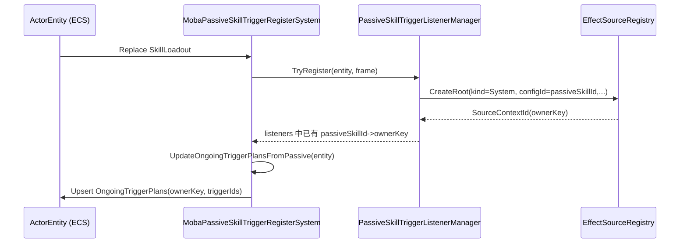
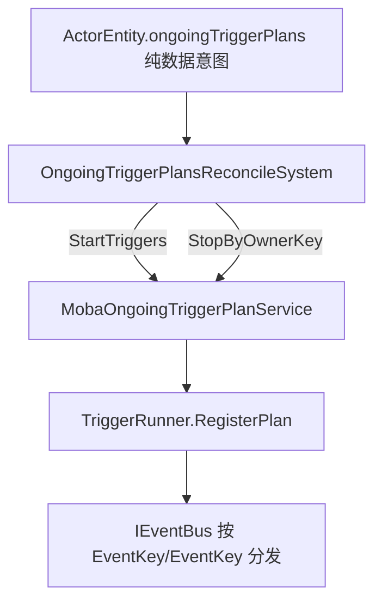
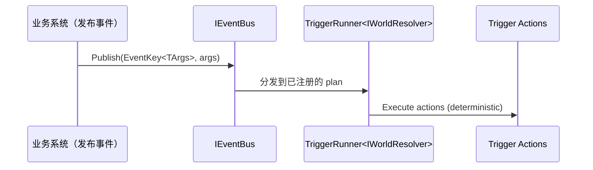

# 被动技能设计（Passive Skill Triggering）

> 本文面向 `com.abilitykit.demo.moba.runtime` 包内的被动技能触发系统实现。
>
> 目标：把“被动技能如何持续监听事件并触发效果”的**数据流、生命周期、回滚兼容点与工程约束**讲清楚，作为后续重构/扩展与资产制作（TriggerPlan）的一致性依据。

---

## 1. 设计理念

### 1.1 核心原则：不把“订阅关系”当作可回滚状态

在预测/回滚（client prediction + rollback）的仿真里：

- delegate/闭包式订阅关系不可序列化，也不应成为快照的一部分。
- **可回滚的东西应是纯数据**：例如“某 actor 当前有哪些持续触发计划（TriggerIds）”以及“这些触发计划归属哪个 ownerKey”。

因此，本设计采用“**意图（Intent）→ 对账（Reconcile）→ 运行时订阅（Subscription）**”的分层：

- **意图层**：在 ECS 组件上存“我希望持续监听哪些 TriggerIds”。
- **对账层**：把意图映射成真实订阅；并在意图变化时停止/启动。
- **执行层**：`TriggerRunner<TCtx>` 接收 event bus 的事件，执行 TriggerPlan actions。

### 1.2 统一归因：ownerKey（SourceContextId）作为生命周期与溯源锚点

被动技能的触发与其后续产生的效果（effects/actions）应当可追溯、可统一取消：

- 为每个被动技能实例创建一个 `ownerKey`（当前实现复用 `EffectSourceRegistry` 创建 root 的 `SourceContextId`）。
- 当被动移除、技能组变化、或 entity 销毁时：
  - 通过 `ownerKey` 一键取消动作（`ITriggerActionRunner.CancelByOwnerKey`）
  - 通过 `ownerKey` 结束溯源（`EffectSourceRegistry.End`）
  - 通过 `ownerKey` 停止持续触发（`MobaOngoingTriggerPlanService.Stop(ownerKey)`）

### 1.3 强类型事件优先，object 通道作为“兜底通道”

事件分发优先走强类型 `EventKey<TArgs>`：

- 业务代码发布强类型 payload。
- TriggerPlan 注册时尽量注册到对应 `EventKey<TArgs>`。

但在以下场景仍可能需要 `EventKey<object>`：

- TriggerPlan 资产中的 `EventName` 没有映射到 payload 类型（例如尚未注册到 `MobaEventSubscriptionRegistry`）。
- 通用调试/日志/桥接模块希望“按 eventId 监听所有事件”。

本设计建议：

- **短期**保留 `EventKey<object>` 作为 fallback，以便资产迁移过程中不中断。
- **长期**可逐步要求所有 `EventName` 都能解析强类型，从而减少/移除 object 通道（需全局评估）。

---

## 2. 关键模块与职责

### 2.1 被动技能配置（MO）

- **`PassiveSkillMO`**：被动技能的配置载体。
- **`PassiveSkillMO.TriggerIds`**：该被动技能希望持续监听并触发的触发器列表（TriggerPlan 的入口）。

> 说明：TriggerId 对应 `TriggerPlanJsonDatabase` 中的记录（EventId、EventName、Plan）。

### 2.2 `PassiveSkillTriggerListenerManager`：被动 ownerKey 容器与生命周期管理

文件：

- `Runtime/Impl/Moba/Systems/Skill/PassiveSkillTriggerListenerManager.cs`

职责：

- 为每个 passiveSkill 创建/维护 `SourceContextId`（ownerKey）。
- 当被动不再存在时，统一 Cancel/End 对应 ownerKey。

重要说明：

- 这里的 `PassiveSkillTriggerListenersComponent` 名称包含 Listener，但当前用途更接近“**passive ownerKey 句柄列表**”。

### 2.3 `MobaPassiveSkillTriggerRegisterSystem`：从 SkillLoadout 推导持续触发意图

文件：

- `Runtime/Impl/Moba/Systems/Skill/MobaPassiveSkillTriggerRegisterSystem.cs`

职责：

- 监听 `SkillLoadout` 的变化（Reactive）。
- 调用 listener manager 确保 ownerKey（SourceContextId）存在且过期的被动被清理。
- 将 `PassiveSkillMO.TriggerIds` 写入 `ActorEntity.ongoingTriggerPlans`（意图层数据）。
- 在 entity 移除时清理意图，并触发 listener manager 的卸载。

### 2.4 `MobaOngoingTriggerPlanService`：运行时订阅管理（ownerKey 维度）

文件：

- `Runtime/Impl/Moba/Services/Triggering/MobaOngoingTriggerPlanService.cs`

职责：

- `StartTriggers(triggerIds, ownerKey)`：
  - 对每个 TriggerId 从 `TriggerPlanJsonDatabase` 取 record
  - 先尝试按 `record.EventName` 解析 payload 类型并注册到 `EventKey<TArgs>`
  - 若无法解析则 fallback 到 `EventKey<object>`
  - 将每个注册返回的 `IDisposable` 保存到 `_regsByOwnerKey[ownerKey]`
- `Stop(ownerKey)`：dispose ownerKey 下所有注册

### 2.5 对账系统（Reconcile System）：把意图变成真实订阅

> 本文强调“意图与订阅分离”。
>
> 当前 demo runtime 的被动系统已经负责把 `TriggerIds` 写入 `OngoingTriggerPlans` 组件；
> 需要由对账系统把 `OngoingTriggerPlans` 映射到 `MobaOngoingTriggerPlanService.StartTriggers/Stop`。

对账层应该满足：

- 幂等：同一份意图反复写入不应产生重复订阅。
- 可回滚：意图回滚后，对账层在下一帧重新对齐订阅关系。
- 以 `ownerKey` 为粒度：停止/启动无需逐个事件处理。

---

## 3. 关键数据结构

### 3.1 SkillLoadout

- `ActorEntity.skillLoadout.PassiveSkills`：被动技能运行时列表（每个元素包含 `PassiveSkillId`）。

### 3.2 PassiveSkillTriggerListenersComponent（当前实现）

文件：

- `Runtime/Impl/Moba/Components/PassiveSkillTriggerListenersComponent.cs`

结构：

- `List<PassiveSkillTriggerListenerRuntime> Active`
- `PassiveSkillTriggerListenerRuntime`：
  - `int PassiveSkillId`
  - `long SourceContextId`（ownerKey）

### 3.3 OngoingTriggerPlansComponent（持续触发意图）

实体上组件：

- `ActorEntity.ongoingTriggerPlans.Active : List<OngoingTriggerPlanEntry>`
- `OngoingTriggerPlanEntry`：
  - `long OwnerKey`
  - `int[] TriggerIds`

> 被动技能与 Buff 都应使用该意图组件来表达“持续监听”，由统一对账系统负责订阅。

---

## 4. 运行时流程（核心）

### 4.1 被动技能注册/刷新（SkillLoadout 变化）

要点：

- `TryRegister` 的本质是“对齐 passive 列表 + 确保 ownerKey 存在”。
- `UpdateOngoingTriggerPlansFromPassive` 的本质是“把被动的 TriggerIds 写入持续触发意图”。

### 4.2 订阅对账（把意图变成真实订阅）

要点：

- 对账层只关心“ownerKey 与 triggerIds”，不关心具体业务事件。
- 订阅关系的创建/销毁集中在 `MobaOngoingTriggerPlanService`。

### 4.3 事件发生 → TriggerPlan 执行

---

## 5. 生命周期与清理策略

### 5.1 被动技能移除（SkillLoadout 不再包含）

触发点：

- `PassiveSkillTriggerListenerManager.RemoveObsoleteListeners`

行为：

- 从 listener 列表移除对应 passiveSkillId 的 runtime。
- 收集其 `SourceContextId(ownerKey)`，并执行：
  - `_actionRunner.CancelByOwnerKey(ownerKey)`
  - `_effectSource.End(ownerKey, frame, Cancelled)`

同时：

- `MobaPassiveSkillTriggerRegisterSystem.UpdateOngoingTriggerPlansFromPassive` 会将不再需要的 ownerKey 从 `ongoingTriggerPlans` 移除。
- 对账层应在下一帧将该 ownerKey 的订阅 Stop 掉。

### 5.2 Entity 离场（从 group 移除 / TearDown）

触发点：

- `MobaPassiveSkillTriggerRegisterSystem.OnEntityRemovedFromGroup`
- `MobaPassiveSkillTriggerRegisterSystem.OnTearDown`

行为：

- 清理该 actorId 对应的 previous ownerKeys（用于 diff）。
- `_listenerManager.TryUnregister(entity, frame)`：
  - 清空 listeners
  - 对每个 ownerKey 执行 Cancel/End

> 说明：对账层应根据意图组件的移除/清空，确保订阅也随之 Stop。

---

## 6. 回滚/确定性注意事项

### 6.1 不要在 plan action 中使用非确定性输入

- 禁用 wall-clock。
- 随机数必须来自可回滚 RNG（固定 seed/按帧推进/可重放）。

### 6.2 事件记录（可选）：被动触发事件日志

文档参考：

- `Document/被动触发事件回滚接入方案A.md`

要点：

- 通过 EventBus decorator 记录特定事件（例如 `event:passive_skill_trigger`）。
- 记录本身作为 `IRollbackStateProvider` 被 capture/restore。

> 当前 demo 的被动持续监听设计不依赖“记录回调关系”，与该方案一致。

---

## 7. 资产与注册表约束（EventName → PayloadType）

为了让 `MobaOngoingTriggerPlanService` 能注册强类型 `EventKey<TArgs>`：

- `TriggerPlanJsonDatabase.Record` 需要携带 `EventName`。
- `MobaEventSubscriptionRegistry` 需要维护：
  - `EventName => Type` 的映射。

建议约束：

- 新增事件时必须同时：
  - 在事件发布端使用强类型 payload
  - 在 `MobaEventSubscriptionRegistry` 注册映射
  - 在 TriggerPlan 资产中填写正确的 `EventName`

---

## 8. 常见问题（FAQ）

### 8.1 为什么还要发布 `EventKey<object>`？

当 TriggerPlan 资产的 `EventName` 尚未映射到 payload 类型时，系统无法注册到 `EventKey<TArgs>`；此时注册到 `EventKey<object>` 能保证触发链路不中断。

### 8.2 会不会触发两次？

不会，前提是同一个 plan 不要同时注册 `EventKey<TArgs>` 和 `EventKey<object>`（对账层应保证只注册一条路径）。

### 8.3 `PassiveSkillTriggerExecutor` 还做什么？

当前实现层已将其 legacy execution chain disable（仅保留壳/兼容）。

后续建议：

- 若确认 TriggerPlan 路径完全覆盖，且没有外部引用，可直接从编译列表移除/删除该 facade。

---

## 9. 文件索引

- `Runtime/Impl/Moba/Systems/Skill/MobaPassiveSkillTriggerRegisterSystem.cs`
- `Runtime/Impl/Moba/Systems/Skill/PassiveSkillTriggerListenerManager.cs`
- `Runtime/Impl/Moba/Components/PassiveSkillTriggerListenersComponent.cs`
- `Runtime/Impl/Moba/Services/Triggering/MobaOngoingTriggerPlanService.cs`
- `Document/被动触发事件回滚接入方案A.md`
- `Document/技能流程总览.md`
