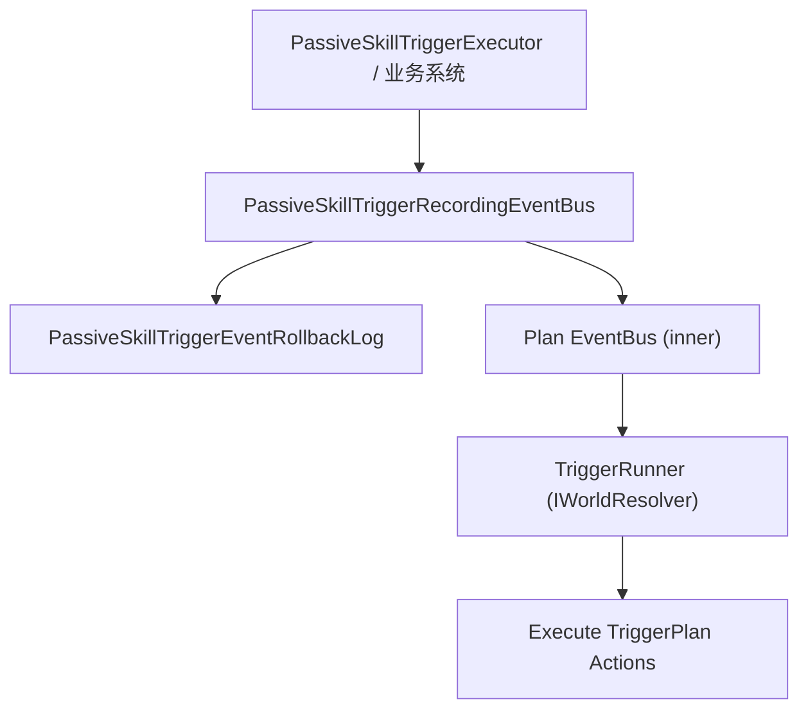
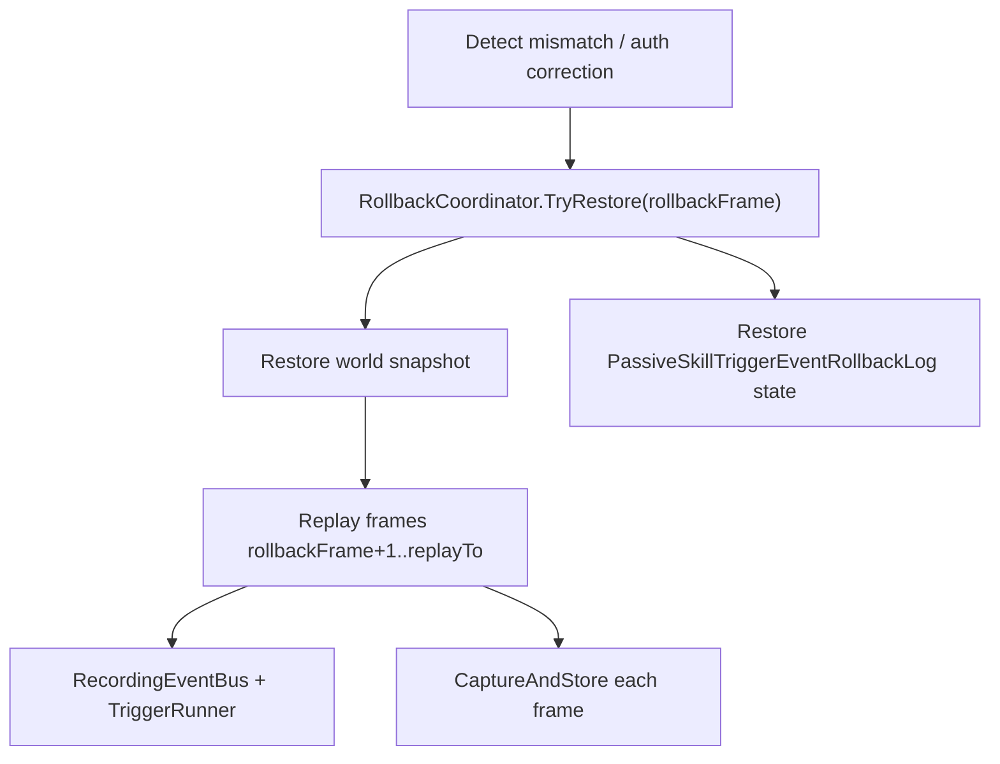

# 被动触发（PassiveSkillTrigger）强类型事件接入预测/回滚：方案 A

## 1. 背景与问题

在 MOBA 逻辑中，被动技能触发（Passive Skill Trigger）会驱动技能效果执行。传统实现通常通过：

- 运行时注册回调（delegate / handler）到 EventBus；或
- 旧版 `TriggerRunner.RunOnce(TriggerDef, args字典)` 直接执行触发器。

在 **预测/回滚（client prediction + rollback）** 的仿真里，核心要求是：

- 回滚到某帧后，能够恢复世界状态，并从该帧开始重放（replay）到目标帧；
- 触发结果必须确定（deterministic）；
- **不能依赖“回调注册关系”能被序列化**（delegate/闭包不可序列化），因此不能把“订阅关系”作为回滚数据。

因此，需要把“触发”从「回调关系」转为「可记录、可恢复的数据事件」。

## 2. 目标

- 以 **新触发器（TriggerPlan + 强类型事件）** 为主线，落地一套最小侵入式的回滚接入。
- 先覆盖关键路径：`event:passive_skill_trigger`（被动触发事件）。
- 与现有 `RollbackCoordinator` / `IRollbackStateProvider` 快照体系兼容。
- 保持旧版触发链路可继续工作（双轨），以便 TriggerPlan 资产迁移期间不改变行为。

## 3. 核心设计思路（方案 A）

### 3.1 不序列化回调，序列化事件

- **不**尝试序列化 `Subscribe()` 注册的 handler。
- **只**记录“某帧发生了什么事件 + 事件参数（args）”。

被动触发使用强类型参数：`PassiveSkillTriggerEventArgs`。

### 3.2 将事件日志作为可回滚状态的一部分

利用现有回滚框架：

- `RollbackCoordinator` 负责按帧 capture/restore。
- 各子系统通过实现 `IRollbackStateProvider` 提供可序列化 payload。

因此：把“被动触发事件日志”实现成一个 `IRollbackStateProvider`，随世界快照一起 Export/Import。

### 3.3 记录点：在 plan event bus 上做装饰器

为了避免在业务系统里到处手工写 log，采用 **EventBus 装饰器**：

- 包装 `AbilityKit.Triggering.Eventing.IEventBus`
- 在 `Publish(event:passive_skill_trigger, args)` 时自动记录。

这样：

- 业务系统只负责 `Publish`。
- 回滚接入逻辑集中在 bus + log 两个部件。

## 4. 关键数据结构

### 4.1 事件参数：`PassiveSkillTriggerEventArgs`

- 用于 TriggerPlan 的强类型事件载荷。
- EventKey：`event:passive_skill_trigger`
- 关键字段：
  - 被动/触发器：`PassiveSkillId` / `TriggerId`
  - 来源/目标：`SourceActorId` / `TargetActorId` / `SourceContextId`
  - 技能上下文（可选）：`SkillId` / `SkillSlot` / `SkillLevel` / `AimPos` / `AimDir`
  - 外部事件标记：`IsExternalEvent`
  - 源追溯（origin）：`OriginKind` / `OriginConfigId` / `OriginContextId` / `OriginSourceActorId` / `OriginTargetActorId`

### 4.2 事件日志（可回滚）：`PassiveSkillTriggerEventRollbackLog`

职责：

- 记录每帧的被动触发事件（`FrameIndex -> List<Entry>`）。
- 支持回滚框架调用：
  - `Export(frame)`：导出该帧事件列表
  - `Import(frame, payload)`：导入并恢复该帧事件列表

设计要点：

- **每帧内的顺序**：Entry 带 `Sequence`（同帧递增），用于保证稳定顺序。
- **回滚裁剪**：`Import` 前会 `TruncateAfter(frame)` 清理未来帧缓存，避免回滚后混入旧未来事件。

### 4.3 Recording Bus：`PassiveSkillTriggerRecordingEventBus`

职责：

- 作为 plan `IEventBus` 的装饰器。
- 在 `Publish<TArgs>` 时：
  - 若 `TArgs == PassiveSkillTriggerEventArgs` 且 `key == PassiveSkillTriggerEventArgs.EventKey`
  - 则调用 `log.Record(frameTime.Frame, args)`
  - 再转发到 inner bus。

## 5. 接入步骤（落地改动点）

### 5.1 新增文件

- `Runtime/Impl/Moba/Rollback/PassiveSkillTriggerEventRollbackLog.cs`
- `Runtime/Impl/Moba/Triggering/PassiveSkillTriggerRecordingEventBus.cs`

并确保在显式编译的工程文件里加入（Unity 环境下 dotnet build 需要）：

- `Unity/AbilityKit.Demo.Moba.Runtime.csproj`

### 5.2 TriggeringRuntime 注入（World bootstrap）

入口：

- `Runtime/Impl/Moba/Systems/Bootstrap/MobaWorldBootstrapModule.Stage.TriggeringRuntime.cs`

步骤：

1) 注册 `PassiveSkillTriggerEventRollbackLog` 为 world scoped service。
2) 注册 plan `AbilityKit.Triggering.Eventing.IEventBus` 时：
   - 先创建 `inner = new AbilityKit.Triggering.Eventing.EventBus()`
   - resolve `IFrameTime` 与 `PassiveSkillTriggerEventRollbackLog`
   - 返回 `new PassiveSkillTriggerRecordingEventBus(inner, frameTime, log)`

这样 `TriggerRunner<IWorldResolver>` 内部使用的 plan bus 即具备记录能力。

### 5.3 将事件日志加入回滚快照（RollbackRegistry）

预测/回滚驱动会构建 RollbackRegistry（示例入口）：

- `BattleSessionFeature.RemoteDrivenLocalSim.Bootstrap.cs` 的 `buildRollbackRegistry`
- 测试工具：`ClientPredictionTestHarness.cs`

步骤：

- 从 `world.Services` resolve `PassiveSkillTriggerEventRollbackLog`
- `reg.Register(passiveLog)`

这样 rollback capture/restore 时：

- `RollbackCoordinator.Capture(frame)` 会调用 `passiveLog.Export(frame)`
- `RollbackCoordinator.Restore(snapshot)` 会调用 `passiveLog.Import(frame, payload)`

## 6. 运行时流程

### 6.1 正常预测 Tick

1) 系统在某帧触发被动逻辑（如 `PassiveSkillTriggerExecutor`）
2) 业务侧发布强类型事件：
   - `_planEventBus.Publish(PassiveSkillTriggerEventArgs.EventKey, args)`
3) Recording bus 拦截并记录：
   - `log.Record(frameTime.Frame, args)`
4) inner plan event bus 分发
5) `TriggerRunner<IWorldResolver>` 收到事件，按 TriggerPlan 执行

### 6.2 发生回滚（rollback + replay）

你们的回滚驱动（如 `ClientPredictionDriverModule`）典型流程是：

1) `RollbackCoordinator.TryRestore(rollbackFrame)`
   - 世界状态 + passive 事件日志状态 一起被恢复
2) 从 `rollbackFrame + 1` 到 `replayToFrame` 逐帧 replay：
   - 提交 inputs
   - `world.Tick(dt)`
   - `RollbackCoordinator.CaptureAndStore(frame)`

在这种模型里：

- **不需要额外手动“重放被动事件日志”**。
- 因为 replay 时业务系统会重新产生 `Publish(event:passive_skill_trigger)`，记录与执行都会自然重做。

## 7. Mermaid 流程图

### 7.1 Publish & Record

### 7.2 Rollback & Replay

## 8. 风险与约束

- 事件执行必须确定：
  - 不允许使用 wall-clock 时间
  - 随机数必须可回放（固定 seed / deterministic RNG）
- 同帧多事件顺序：
  - 当前通过 `Sequence` 保障“记录时的稳定顺序”。
- 内存与历史帧：
  - 目前 log 使用内存字典存储；实际历史长度由 rollback buffer 决定。

## 9. 未来演进

- 将更多 plan 事件按同模式接入（扩展到其他 event key）。
- TriggerPlan 资产迁移完成后，逐步移除旧 `RunOnce + PooledTriggerArgs` 链路。
- 如需网络同步/落盘，可把 log payload 编解码统一抽象为通用 registry（多事件类型）。
