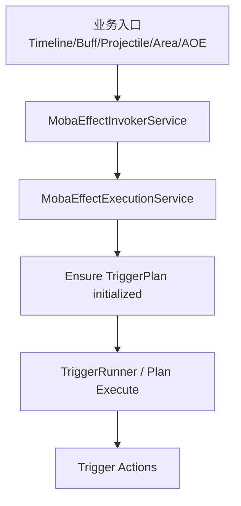
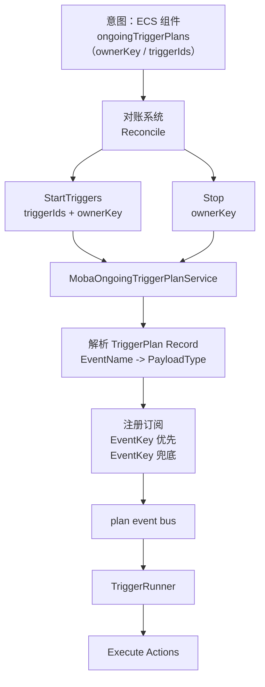
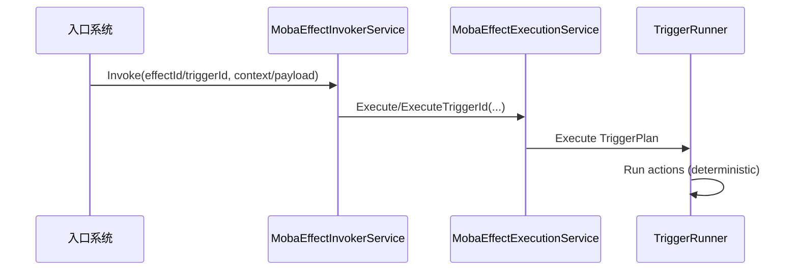
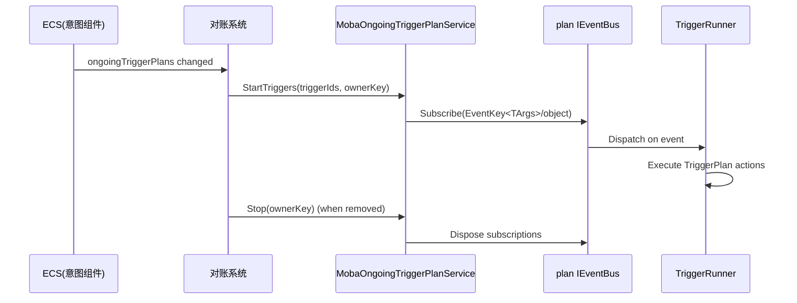

# 触发模块设计总览（Triggering in Moba Demo Runtime）

> 本文面向 `com.abilitykit.demo.moba.runtime` 包内的触发（Triggering）落地实现。
>
> 目标：把 **瞬时触发（instant）** 与 **持续触发（ongoing/持续监听）** 两种模式的设计理念、分层职责、关键数据结构、与回滚/确定性约束讲清楚，并给出尽量完整的流程图，作为后续资产制作与重构的一致性依据。

---

## 0. 术语表

- **TriggerPlan**：触发器计划（TriggerId 对应的一段可执行 action 列表），通常来自 `TriggerPlanJsonDatabase`。
- **TriggerId**：TriggerPlan 的入口 id。实践中也会用于“按 id 直接执行 plan”。
- **EventId / EventName**：事件标识。
  - `EventId`：运行时稳定 id（例如 `StableStringId.Get("event:" + eventIdString)`）。
  - `EventName`：用于资产侧声明事件名（例如 `area.enter` / `presentation.play` / `buff.add`）。
- **payload（强类型载荷）**：通过 `EventKey<TArgs>` 发布的结构化参数。
- **ownerKey（归因锚点）**：持续触发/持续动作的生命周期归属 key（推荐复用 `SourceContextId`）。
- **plan event bus**：`AbilityKit.Triggering.Eventing.IEventBus`（强类型 event bus）。

---

## 1. 设计理念与总体原则

### 1.1 强类型优先（事件与执行上下文）

- 事件发布/订阅优先使用 `EventKey<TArgs>` + `TArgs`（强类型 payload）。
- **`EventKey<object>` 仅作为兜底通道**，用于资产迁移期或调试通用监听。

### 1.2 统一入口（瞬时触发统一走 invoker）

**所有瞬时 effect/trigger 的入口**（来自 timeline、buff、projectile、area、AOE 等）应尽量统一收敛到：

- `MobaEffectInvokerService`

以保证：

- 统一初始化 pipeline/effect context（SourceContextId、WorldServices、Event payload 等）。
- 统一走 TriggerPlan 执行路径，避免“某些路径绕过计划系统”。

### 1.3 回滚/确定性：订阅关系不是可回滚状态

在预测/回滚仿真里：

- delegate/闭包形式的订阅关系不可序列化，不应进入快照。
- **可回滚的应是纯数据意图**：例如“某 actor 当前希望持续监听哪些 TriggerIds，归属哪个 ownerKey”。

因此持续触发采用：

- **意图（Intent，纯数据）**
- **对账（Reconcile，把意图映射为真实订阅）**
- **运行时订阅（Subscription，非可回滚状态）**

---

## 2. 分层职责（从下到上）

### 2.1 资产层：TriggerPlan 数据库

- `TriggerPlanJsonDatabase`
  - `TriggerId -> Record(EventName, Plan...)`

约束：

- 新增事件应同步在 `MobaEventSubscriptionRegistry` 注册 `EventName -> PayloadType` 映射，保证持续触发能注册到 `EventKey<TArgs>`。

### 2.2 分发层：plan event bus（强类型）

- `AbilityKit.Triggering.Eventing.IEventBus`
  - `Publish(EventKey<TArgs>, in args)`
  - `Subscribe(EventKey<TArgs>, handler)`

原则：

- 业务系统发布强类型事件。
- TriggerPlan 订阅侧优先订阅强类型；无法解析 payload 时 fallback 到 `EventKey<object>`。

### 2.3 执行层：TriggerRunner + TriggerPlan

- `TriggerRunner<IWorldResolver>`（或同等执行器）
  - 负责把事件/触发入口映射到 plan actions 执行。

原则：

- actions 的输入尽量来自强类型 context/payload。
- 禁用弱类型字典扩散（如 `context.Event.Args[...]`）。

### 2.4 业务入口层：瞬时触发 invoker / 持续触发 service

- **瞬时触发**：`MobaEffectInvokerService` → `MobaEffectExecutionService` → TriggerPlan。
- **持续触发**：`MobaOngoingTriggerPlanService`（ownerKey 维度启动/停止触发器订阅）。

### 2.5 ECS/系统层：写入意图、驱动对账

- 被动技能、Buff 等系统负责把“持续触发意图”写入组件（例如 `ongoingTriggerPlans`）。
- 对账系统负责把“意图变化”映射为 `StartTriggers/Stop(ownerKey)`。

---

## 3. 事件命名与 payload 注册规范（EventName / EventKey / Registry）

> 本节目标：给 TriggerPlan 资产作者与实现层开发一个“共同遵守的契约”，使得：
>
> - 业务侧能稳定发布强类型事件。
> - TriggerPlan 侧能稳定订阅到强类型 `EventKey<TArgs>`。
> - 在迁移期允许 `EventKey<object>` 兜底，但不会造成“双订阅触发两次”。

### 3.1 EventName 命名约定（资产侧）

- `EventName` 采用 **分域前缀 + 点分段** 的形式：`{domain}.{verb}[.{detail}]`。
- 约束：
  - **全小写**（建议）
  - **避免空格与特殊字符**
  - 分段只用于表达层级，不应承载参数（参数应进 payload）

建议域（示例，按包内现状扩展）：

- `skill.*`：技能施法/阶段事件（通常 payload 为 `SkillCastContext`）
- `buff.*`：buff 生命周期事件（payload 为 `BuffEventArgs`）
- `projectile.*`：投射物事件（命中/消失等）
- `area.*`：区域事件（spawn/enter/exit/expire，payload 为 `AreaEventArgs`）
- `presentation.*`：表现事件（payload 为 `PresentationEventArgs`）
- `damage.*`：伤害管线事件（payload 为 `AttackInfo/AttackCalcInfo/DamageResult`）

> 说明：`EventName` 是 TriggerPlan 资产作者最常接触的字段，优先让它“可读、可检索、稳定”。

### 3.2 EventId 与 EventKey 生成约定（运行时）

运行时的稳定事件 id 推荐使用：

- `StableStringId.Get("event:" + eventIdString)`

其中：

- `eventIdString` 建议直接使用 `EventName`（例如 `area.enter`）。
- `"event:"` 前缀用于命名空间隔离，避免与其他 StableStringId 使用场景冲突。

对应发布/订阅：

- 强类型：`new EventKey<TArgs>(eid)`
- 兜底：`new EventKey<object>(eid)`

### 3.3 PayloadType 注册：MobaEventSubscriptionRegistry 约定

为了让持续触发（ongoing triggering）能够把 TriggerPlan 资产中的 `EventName` 解析为强类型 `EventKey<TArgs>`，需要维护：

- `EventName -> PayloadType` 映射（由 `MobaEventSubscriptionRegistry` 承载）

推荐注册方式：

- **按前缀批量注册**：`reg.RegisterPrefix<TArgs>("area.")`
- 或按单个事件名注册（如果系统提供该能力）

约束：

- 一个 `EventName` 在同一时刻应当只对应一个“权威 payload 类型”。
- 如果确实需要多个 payload 类型（例如同 eventId 有不同形态），应当拆分为不同 `EventName`，不要复用同名。

### 3.4 object fallback 策略（允许，但需收敛）

允许使用 `EventKey<object>` 的典型场景：

- TriggerPlan 资产仍在迁移期，`EventName` 尚未注册到 `MobaEventSubscriptionRegistry`。
- 通用调试/日志/桥接模块希望按 eventId 监听所有事件。

不建议长期依赖 object fallback 的原因：

- payload 不透明，action 只能做弱类型判断，容易出现“资产能跑但不可维护”。
- 事件演进（字段变更）无法得到编译期约束。

建议策略：

- **短期**：业务侧发布强类型 payload 的同时，额外发布一份 `object`（boxed）事件用于兼容与调试。
- **长期**：TriggerPlan 资产与 registry 映射补齐后，逐步减少/移除 object 通道的订阅依赖。

### 3.5 禁止“双订阅触发两次”（强制约束）

原则：

- 同一条 TriggerPlan（同一 TriggerId、同一 ownerKey）在同一事件上**不得同时**注册：
  - `EventKey<TArgs>`
  - `EventKey<object>`

否则会产生：

- 同一个业务事件发布一次，但 plan 被执行两次。

执行侧建议（实现约束）：

- `MobaOngoingTriggerPlanService.StartTriggers` 在解析到强类型 payload 时：
  - **只注册强类型**，不再注册 object。
- 只有当 registry 无法解析 payloadType 时才退回 object 订阅。

---

## 4. 瞬时触发（Instant Triggering）

### 定义

瞬时触发指：

- 某帧发生一次事件或一次技能阶段推进，立刻执行一次 TriggerPlan（或 effectId 对应 plan）。

常见来源：

- 技能 timeline 节点
- Buff 阶段（onAdd/onTick/onRemove）
- Projectile 命中/飞行结束
- Area enter/exit/expire

### 推荐链路（统一走 invoker）

要点：

- invoker 负责“统一构建 context + payload”。
- `ExecuteTriggerId(triggerId, payload)` 形态适合“按 id 执行”且把必要数据放入 payload，避免 legacy `source/target/Args字典`。

### payload 规范（建议）

- **最小化**：只放 plan/action 需要的字段。
- **可追溯**：优先携带 `SourceContextId` 或能推导到它的信息（如 ownerKey、origin 等）。
- **可组合**：允许在 payload 内附带 `OriginalPayload`（当它来自外部事件时），但应避免依赖其弱类型结构。

---

## 5. 持续触发（Ongoing / Continuous Listening）

### 定义

持续触发指：

- 一段时间内持续监听某类事件（例如 `area.enter`、`buff.tick`、`passive.trigger`），当事件发生时执行对应 TriggerPlan。

它的关键不同点在于：

- “监听关系”具有生命周期，且需要能在回滚环境中正确对齐。

### 意图 → 对账 → 订阅

### `ownerKey` 的意义

- 持续订阅与持续动作（例如 action runner 的持续 action）应以 `ownerKey` 为统一生命周期锚点。
- 当 buff/passive 移除或 entity 销毁时：
  - 停止订阅：`MobaOngoingTriggerPlanService.Stop(ownerKey)`
  - 停止持续 action：`ITriggerActionRunner.CancelByOwnerKey(ownerKey)`
  - 结束溯源：`EffectSourceRegistry.End(ownerKey, frame, reason)`

### 强类型订阅策略

- 若 `EventName` 能在 `MobaEventSubscriptionRegistry` 解析到 payload 类型：
  - 订阅 `EventKey<TArgs>`。
- 否则：
  - 订阅 `EventKey<object>`。

建议约束：

- 新增事件必须同时补齐 registry 映射，避免长期依赖 object 通道。

---

## 6. 不同层的处理边界（建议清晰化）

### 业务系统（发布侧）

- 只负责发布强类型 payload。
- 不负责订阅管理；订阅管理集中在 ongoing service + 对账系统。

### Triggering 服务（执行/订阅侧）

- `MobaEffectInvokerService`：瞬时触发入口统一。
- `MobaEffectExecutionService`：只负责 plan 执行（不再承担 legacy publish）。
- `MobaOngoingTriggerPlanService`：只负责“订阅注册/停止”，不负责意图写入。

### ECS 系统（意图层）

- 被动技能系统、buff 系统等只写入/更新“意图组件”（例如 `ongoingTriggerPlans`）。
- 对账系统把意图变成订阅。

---

## 7. 回滚与确定性注意事项

### 不把订阅关系当作快照

- 快照应只包含：组件数据、运行时可序列化状态、必要的事件日志（如有）。
- 订阅关系应通过“意图对账”在每次恢复后自然重建。

### plan action 的确定性约束

- 禁用 wall-clock。
- 随机数必须可回放（固定 seed / deterministic RNG / 按帧推进）。
- 同帧多事件顺序：如需稳定顺序，应在发布侧提供稳定排序 key 或 sequence。

### 事件记录（可选扩展）

- 参考 `Document/被动触发事件回滚接入方案A.md`：通过 plan event bus decorator 记录特定事件类型，作为 `IRollbackStateProvider` 进入快照。

---

## 8. 流程图汇总

### 瞬时触发（统一走 invoker）

### 持续触发（意图对账）

---

## 9. 与现有文档的关系

- `Document/技能流程总览.md`
  - 更偏“从输入到技能 pipeline，再到 ECS 同步/溯源”。
  - 本文补齐“触发模块（instant + ongoing）”的统一视角。

- `Document/被动技能设计（Passive Skill Triggering）.md`
  - 更偏“被动技能如何持续监听”。
  - 本文将其抽象到通用“持续触发”模型，并补齐瞬时触发分层。

- `Document/被动触发事件回滚接入方案A.md`
  - 更偏“事件日志作为可回滚状态”的接入方案。
  - 本文将其列为可选扩展，不作为持续触发的硬依赖。
