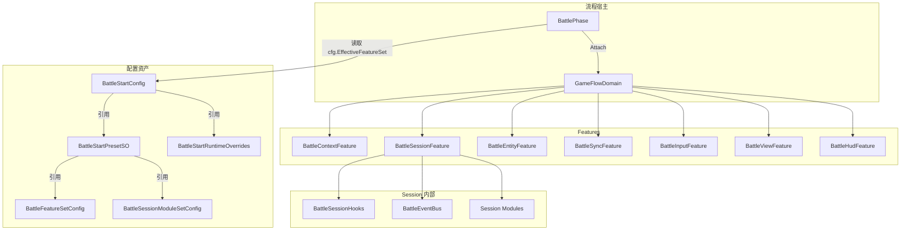
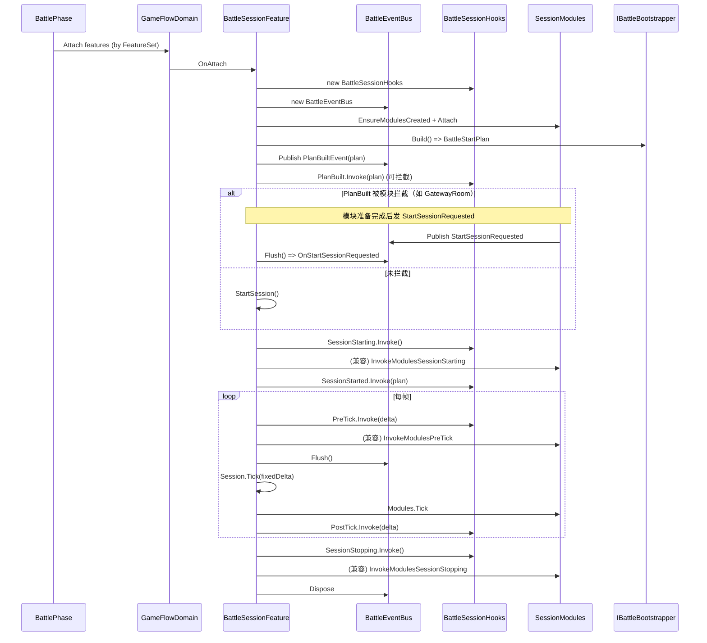
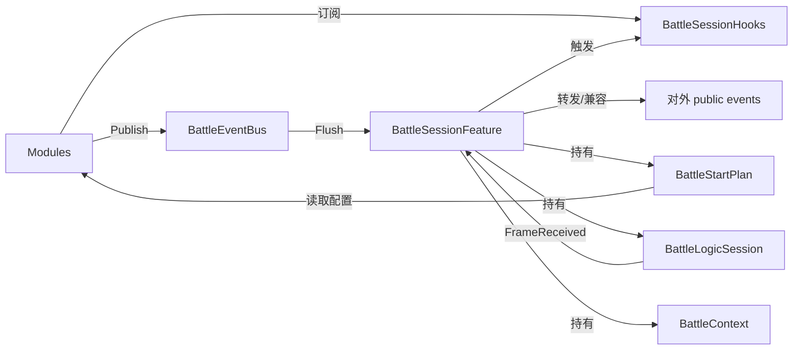

# 战斗流程设计说明（com.abilitykit.demo.moba.view.runtime）

本文档描述 Demo MOBA 的战斗流程架构：

- 配置资产（Preset/Overrides/FeatureSet/ModuleSet）如何组织
- 启动/运行/停止的流程结构（含 Hooks + EventBus + Modules）
- 关键数据在各模块间的流向
- 如何通过“组合”切换网络模式、回放/录像等运行方式

> 约定：本文只覆盖 **Battle Flow（View Runtime 包）** 的装配与运行流程；底层网络同步/录像回放的通用原理请参考：
> - `com.abilitykit.world.framesync/Document/NetworkSyncModels.md`
> - `com.abilitykit.world.record/Runtime/DESIGN.md`

---

## 1. 总览：核心角色与职责边界

### 1.1 配置与装配入口

- `BattleStartConfig`：战斗启动配置根资产（可引用 Preset/Overrides）。
- `BattleStartPresetSO`：模板资产（**完全覆盖**），用于“一键切换组合”。
- `BattleStartRuntimeOverrides`：少量运行时覆盖（WorldId/RoomId/路径等）。
- `BattleFeatureSetConfig`：BattlePhase 的 Feature 组合列表。
- `BattleSessionModuleSetConfig`：BattleSessionFeature 的 Module 组合列表。

### 1.2 运行时宿主

- `BattlePhase`：游戏相位（IGamePhase），负责按 `FeatureSet` 装配 features。
- `GameFlowDomain`：Feature 宿主容器（Attach/Detach/Tick）。
- `BattleSessionFeature`：战斗会话宿主（Session Host），负责：
  - 构建 `BattleStartPlan`
  - Start/Stop session
  - 驱动模块（Modules）
  - 驱动 hooks/eventbus

### 1.3 模块化与通信

- `IBattleSessionModule`：模块最小生命周期接口（Attach/Detach/Tick）。
- `IBattleSessionModuleId`：模块自报稳定 `Id`（用于依赖/排序/校验）。
- `IBattleSessionModuleDependencies`：模块依赖声明（字符串 Id）。
- `BattleSessionHooks`：主流程固定挂点（host-style）。
- `BattleEventBus`：模块间局部协作事件总线（queue + Flush）。

---

## 2. 配置资产排布（数据结构）

### 2.1 BattleStartConfig（根资产）

`BattleStartConfig` 当前同时承载两类信息：

- **配置来源选择**
  - `Preset`：模板（若不为 null，则模板字段覆盖绝大多数配置）
  - `RuntimeOverrides`：少量覆盖（优先级最高，但覆盖范围受限）
- **本地兜底字段**
  - 当 `Preset == null` 时使用 `BattleStartConfig` 自身字段

其对外“可组合点”主要是：

- `EffectiveFeatureSet`：决定 BattlePhase 组合哪些 Feature。
- `EffectiveSessionModuleSet`：决定 BattleSessionFeature 组合哪些 Module。

### 2.2 BattleStartPresetSO（模板，完全覆盖）

`BattleStartPresetSO` 设计目标：

- 选择一个 preset，即选定一套“正式战斗流程组合”
- 复用：多个 demo / 多个场景可以复用同一个 preset

主要字段：

- **Formal Start Profile**：
  - `WorldId / WorldType / ClientId`
  - `HostMode`（Local / GatewayRemote）
  - `AutoConnect / AutoCreateWorld / AutoJoin / AutoReady`
  - `SyncMode / ViewEventSourceMode`
  - `EnableClientPrediction / EnableConfirmedAuthorityWorld`
  - `EnabledSnapshotRegistryIds`
- **SO 引用**：
  - `EnterGameSO / PlayersSO / RunModeSO / GatewaySO`
- **组合引用**：
  - `FeatureSet / SessionModuleSet`

### 2.3 BattleStartRuntimeOverrides（少量运行时覆盖）

覆盖字段（可选）：

- `WorldId`
- `ClientId`
- `NumericRoomId`
- `GatewayJoinRoomId`
- `RecordOutputPath`
- `ReplayInputPath`

设计原则：

- 用于“运行时经常变”的参数（例如连接到某个房间、换输出文件路径）。
- 不建议覆盖 FeatureSet/ModuleSet/EnterGameSO 等“组合语义强”的字段。

---

## 3. 启动流程结构（从进入 BattlePhase 到 Session 运行）

### 3.1 组件图（装配关系）

### 3.2 时序图（关键调用序列）

---

## 4. SessionModules：组合、依赖与校验

### 4.1 模块组合来源

- `BattleSessionFeature.CreateModules()` 从 `BattleStartConfig.EffectiveSessionModuleSet` 读取 `ModuleIds`。
- 若未配置 ModuleSet，则使用默认内置组合（gateway_room / snapshot_routing / replay_seek）。

### 4.2 模块 Id 与依赖声明

- 模块必须实现：
  - `IBattleSessionModuleId`（`Id` 不可空）
- 模块可选实现：
  - `IBattleSessionModuleDependencies`（`Dependencies` 为 `IEnumerable<string>`）

### 4.3 校验与拓扑排序

`BattleSessionFeature.TrySortModulesByDependencies()` 会在创建模块后：

- 校验：
  - `Id` 缺失 / 为空
  - `Id` 重复
  - 依赖为空字符串
  - 依赖指向不存在的模块
  - 循环依赖
- 通过后进行拓扑排序。
- 失败时会通过 `SessionFailedEvent` fail-fast，并带明确错误信息。

> 说明：当前模块创建仍使用 `switch(id)` 实例化；后续若希望新增模块完全不改宿主，可进一步引入 `ModuleRegistry (id->factory)`。

---

## 5. 主流程 Hooks vs 局部事件 EventBus（数据流向）

### 5.1 设计原则

- `BattleSessionHooks`：用于“主流程固定节点”
  - PlanBuilt（可拦截）
  - SessionStarting / SessionStopping
  - PreTick / PostTick
  - SessionStarted / SessionFailed / FirstFrameReceived

- `BattleEventBus`：用于“模块间局部协作事件”
  - 例如：`StartSessionRequested`（gateway room 准备完成后请求继续启动）
  - 例如：`SessionFailedEvent`（模块内部失败上报）

### 5.2 数据流（概念图）

---

## 6. 网络模式/回放/录像如何通过组合体现

### 6.1 网络模式（Local / GatewayRemote）

- 配置来源：`BattleStartPlan.HostMode` + `UseGatewayTransport`（由 Preset/Config + GatewaySO 决定）。
- 组合体现：
  - 选择 `GatewayRoomModule`（通过 hooks 的 `PlanBuilt` 拦截启动）
  - 依赖 `GatewaySO` / room 配置

### 6.2 录像/回放（Record / Replay）

- 配置来源：`RunModeSO` + `BattleStartPlanOptions.RunMode.*` 字段。
- `RuntimeOverrides` 允许覆盖 record/replay 路径，方便调试。
- 组合体现：
  - `ReplaySeekModule` 目前偏调试输入；更完整的 record/replay 执行路径在 session 内部（后续可继续模块化）。

---

## 7. 附录：关键数据对象速查

### 7.1 BattleStartPlan（运行时计划）

- 构建位置：`IBattleBootstrapper.Build()` / `BattleStartConfig.BuildPlanOptions()`
- 主要字段类别：
  - world/client/player
  - auto actions
  - gateway transport
  - runMode record/replay
  - create world payload/opcode
  - time sync / safety

### 7.2 BattleLogicSession（运行时会话）

- 生命周期：由 `BattleSessionFeature.StartSession/StopSession` 管理。
- 每帧：由 `BattleSessionFeature.Tick` 驱动。

---

## 8. 迭代建议（与当前实现对齐）

- 继续把旧接口遍历调用（PlanModule/PreTickModule/LifecycleModule）迁移到 hooks（渐进方式，保持兼容）。
- 引入 `ModuleRegistry (id->factory)`，让新增模块无需修改 `BattleSessionFeature.CreateModules()`。
- 为 Editor 提供组合校验入口（依赖缺失/循环/必填 SO 等），将 fail-fast 前移。
