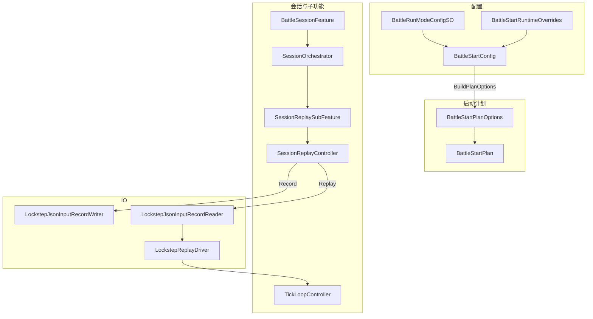
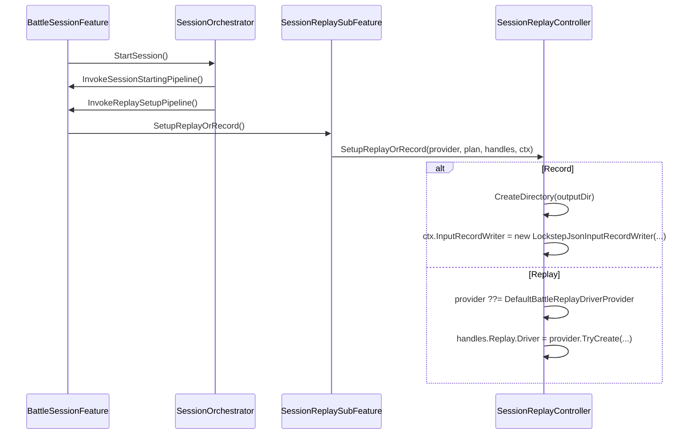
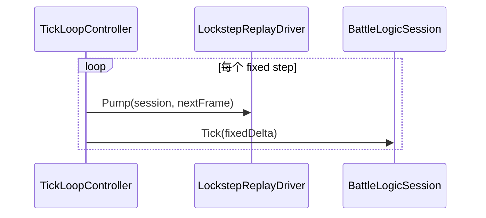

# 战斗录像与回放设计说明（输入录制 / 输入回放）

本文档描述 Demo MOBA（`com.abilitykit.demo.moba.view.runtime`）当前“输入录像 / 输入回放（Option A）”的设计与使用方式，并与通用录像模块 `com.abilitykit.world.record` 的设计做对比。

> 范围：本文覆盖 **Battle Flow** 内“输入录制/输入回放”的装配、数据流、关键挂点与调试方式。
>
> 不覆盖：底层网络同步模型、确定性原理、rollback 细节等。

---

## 1. 目标与非目标

### 1.1 目标

- 支持在本地战斗流程中：
  - **录制**：将每帧玩家输入写入 json 文件，并可选写入 snapshot/state hash。
  - **回放**：从 json 文件按帧读取输入，驱动 `BattleLogicSession` 前进。
- 维持职责边界：
  - `GameEntry` 不承载回放 provider 注册。
  - 回放驱动创建/注入发生在 Battle Flow（Session SubFeature）内部。
- 为未来扩展预留位置：
  - Option B（快照/增量）可通过替换 provider / 扩展记录内容接入。

### 1.2 非目标

- 不提供“录制文件管理 UI”（列表、筛选、删除）。
- 不保证跨版本回放兼容（录制格式/Opcode/Codec 变更会影响回放）。

---

## 2. 使用方式（配置与运行）

### 2.1 录制（Record）

配置资产：`BattleRunModeConfigSO`

- `Mode = Record`
- `RecordOutputDirectory`：录制输出目录（Odin `FolderPath`，相对目录会以 `Application.persistentDataPath` 作为根目录）

运行后会在目录下生成：

- `battle_record_yyyyMMdd_HHmmss.json`

### 2.2 回放（Replay）

配置资产：`BattleRunModeConfigSO`

- `Mode = Replay`
- `ReplayInputFilePath`：回放文件路径（Odin `FilePath`，建议选择 `persistentDataPath` 下的录制文件）

如果回放文件为空或加载失败，会在日志中输出：

- `回放启动失败：InputReplayPath 为空...`
- `回放启动失败：无法创建回放驱动...`

### 2.3 运行时覆盖（可选）

`BattleStartRuntimeOverrides` 可覆盖：

- `RecordOutputDirectory`
- `ReplayInputFilePath`

优先级高于 `RunModeSO`。

---

## 3. 端到端链路（从配置到写入/读取）

### 3.1 总览图

### 3.2 录制链路（输入写入）

关键点：

- `BattleStartConfig.BuildPlanOptions(...)`
  - `Mode == Record`：
    - `EnableInputRecording = true`
    - `InputRecordOutputPath = Path.Combine(RecordOutputDirectory, "battle_record_时间.json")`

- `SessionReplayController.SetupReplayOrRecord(...)`
  - `RunMode == Record`：
    - `Directory.CreateDirectory(outputDir)`
    - `ctx.InputRecordWriter = new LockstepJsonInputRecordWriter(plan.InputRecordOutputPath, meta)`

- `BattleInputFeature.Tick(...)`
  - 非回放模式下采集真实输入
  - 每次构造 `PlayerInputCommand` 时调用：
    - `_ctx.InputRecordWriter?.Append(in cmd)`

> 说明：当前录制是“输入为主”，同时在 `SessionReplayController.OnFrameReceived(...)` 中附带写入 snapshot/state hash（若数据存在）。

### 3.3 回放链路（输入注入）

关键点：

- `BattleStartConfig.BuildPlanOptions(...)`
  - `Mode == Replay`：
    - `EnableInputReplay = true`
    - `InputReplayPath = ReplayInputFilePath`

- `SessionReplaySubFeature.SetupReplayOrRecord(...)`
  - 查找 `IBattleReplayDriverProvider`：
    - 优先 `ctx.Phase.Root`
    - 其次 `ctx.Phase.Entry`
  - 调用 `SessionReplayController.SetupReplayOrRecord(provider, plan, handles, ctx)`

- `SessionReplayController.SetupReplayOrRecord(...)`
  - `RunMode == Replay`：
    - `provider ??= new DefaultBattleReplayDriverProvider()`
    - `provider.TryCreate(in plan, out driver)`
    - 成功：`handles.Replay.Driver = driver`

- `TickLoopController.MainTick(...)`
  - 每个 fixed-step 帧：
    - `handles.Replay.Driver?.Pump(handles.Session, nextFrame)`
    - `handles.Session.Tick(fixedDelta)`

- `BattleInputFeature.Tick(...)`
  - 回放模式：`if (_ctx.Plan.EnableInputReplay) return;`
  - 避免真实输入污染回放。

---

## 4. 关键时序（Sequence）

### 4.1 开局装配 + 回放/录制 setup

### 4.2 主循环（回放 Pump 的位置）

---

## 5. 扩展点与职责边界

### 5.1 为什么 provider 要放在 Flow 内

- `GameEntry` 是全局入口，不应承载战斗专属功能注册。
- 回放是战斗会话的一部分，理应由 `BattleSessionFeature` 的 sub-feature 管理其生命周期。

### 5.2 如何替换回放实现

通过在 `ctx.Phase.Root`（推荐）或 `ctx.Phase.Entry` 上注入实现：

- `BattleSessionFeature.IBattleReplayDriverProvider`

即可替换 `DefaultBattleReplayDriverProvider` 的行为。

> 注意：该 ECS/Component 系统要求按接口类型泛型注册，才能按接口类型读取。

---

## 6. 已知限制与风险点

- 录制 meta 中：
  - `TickRate` 使用 `plan.TickRate`（无效回退 30）。
  - `RandomSeed` 当前写为 0（若需要严格可复现，应写入真实随机种子）。
- 回放文件为 json，且依赖当前 opcode/codec；改动协议后旧文件可能无法回放。
- 回放 seek（Debug）会触发：
  - 快进 pump 或 rollback，极端情况下会 stop/start session（见 `SessionReplayController.Debug.cs`）。

---

## 7. 与 `com.abilitykit.world.record` 设计对比

`com.abilitykit.world.record/Runtime/DESIGN.md` 的核心定位是：

- 通用的“按帧索引事件容器”模型：`RecordSession` / `RecordContainer` / `RecordTrack` / `RecordEvent`。
- 通过 track + event type + codec 组合扩展不同领域的数据记录。

而当前 Demo MOBA 的输入录制/回放属于 **一个具体领域落地**：

- 记录内容主要是 lockstep 输入（`PlayerInputCommand`）
- 回放驱动通过 `LockstepReplayDriver.Pump(session, frame)` 注入输入

对比表：

| 维度 | world.record | Demo MOBA 输入录制/回放 |
|---|---|---|
| 抽象层级 | 通用容器/track/event | 领域专用（输入回放驱动） |
| 数据模型 | `RecordEvent` + track | `LockstepJsonInputRecordFile`（输入为核心） |
| 回放机制 | `BasicReplayController` 分发事件 | `LockstepReplayDriver` 注入 session 输入 |
| 扩展方式 | 新 track / 新 event type / 新 codec | 替换 `IBattleReplayDriverProvider` 或扩展写入内容 |
| 适配 Option B | 原生支持 track 扩展（snapshot/delta） | 需要扩展录制内容并调整驱动/对齐回放策略 |

### 7.1 演进建议（面向 Option B）

- 将“输入 + 快照/增量 + 战斗日志”统一抽象为 record tracks：
  - `lockstep.inputs`
  - `world.snapshots` 或 `world.deltas`
  - `battle.log`
- 对 Battle Flow 来说，仍然保留 provider 模式：
  - provider 负责装配不同 replay driver（输入-only / snapshot+delta / 混合）
- 这样可以让 Demo 的回放实现逐步靠近 `world.record` 的通用设计，而不是在 Battle Flow 内继续堆叠领域 json 格式。
