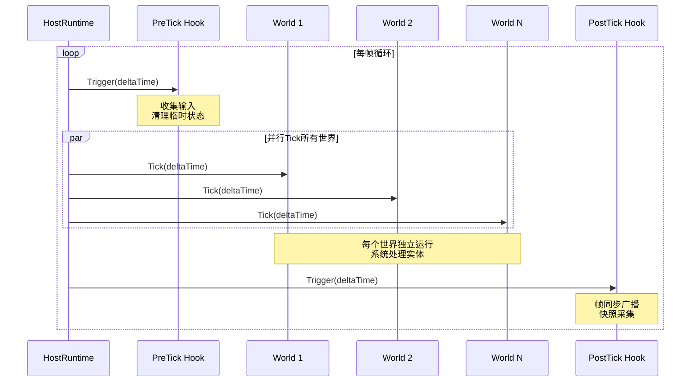
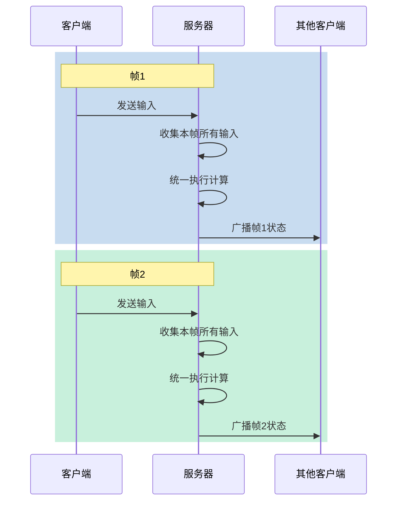
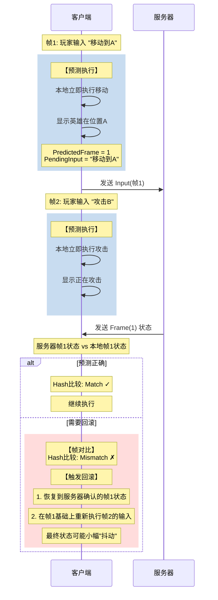
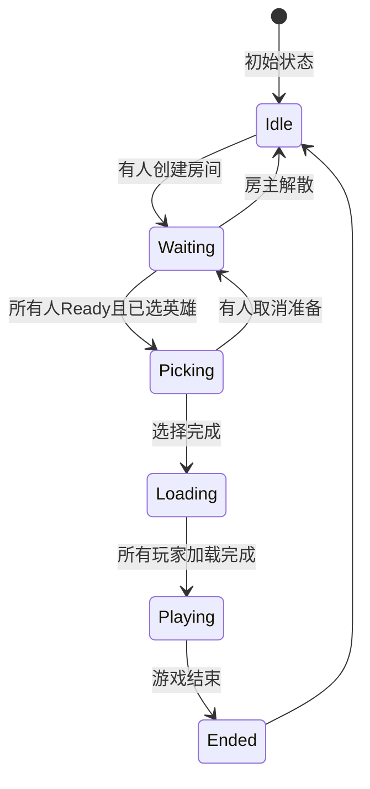

# Ability-Kit Host 模块开发设计文档

> **阅读对象**：首次接触 Ability-Kit Host 模块的开发者
>
> **文档目标**：让你理解 Host 模块"是什么"、"解决了什么问题"、"为什么这样设计"、"怎么使用和扩展"

---

## 一、设计理念：为什么要做 Host 模块？

### 1.1 传统游戏服务器的痛点

想象你要实现一个 MOBA 游戏（类似王者荣耀）的服务器，会遇到这些问题：

| 问题类型 | 具体表现 | 后果 |
|----------|----------|------|
| **耦合严重** | 战斗逻辑、房间管理、网络同步全都写在一起 | 改一个功能可能影响另一个 |
| **难以测试** | 网络代码和业务逻辑混在一起 | 很难单独测试战斗规则 |
| **难以复用** | MOBA 的房间系统不能直接给 RPG 用 | 每个项目都重新造轮子 |
| **同步复杂** | 帧同步、预测、回滚... | 每个项目都要重新实现一遍 |

### 1.2 Host 模块的解决方案

```
┌─────────────────────────────────────────────────────────────────────────┐
│                     Ability-Kit Host 设计思路                              │
│                                                                         │
│  1. 分离关注点                                                          │
│  ┌───────────────────────────────────────────────────────────────────┐ │
│  │                        HostRuntime                                 │ │
│  │                                                                     │ │
│  │   ┌─────────────┐    ┌─────────────┐    ┌─────────────────┐     │ │
│  │   │  世界管理    │    │  客户端连接  │    │   消息广播       │     │ │
│  │   │  Worlds     │    │  Clients    │    │   Broadcast     │     │ │
│  │   └─────────────┘    └─────────────┘    └─────────────────┘     │ │
│  └───────────────────────────────────────────────────────────────────┘ │
│                              │                                            │
│                              ▼                                            │
│  ┌───────────────────────────────────────────────────────────────────┐ │
│  │                    业务逻辑层 (World)                               │ │
│  │                                                                     │ │
│  │   ┌─────────────┐    ┌─────────────┐    ┌─────────────────┐     │ │
│  │   │  MOBA房间    │    │   战斗世界   │    │    大厅世界      │     │ │
│  │   └─────────────┘    └─────────────┘    └─────────────────┘     │ │
│  └───────────────────────────────────────────────────────────────────┘ │
│                                                                         │
│  2. 模块化扩展                                                          │
│     • 帧同步是可选模块，按需安装                                         │
│     • 房间管理是可选模块，按需安装                                       │
│                                                                         │
│  3. 统一抽象                                                           │
│     • 不管是 MOBA 还是 RPG，都用相同的方式管理世界                       │
│                                                                         │
└─────────────────────────────────────────────────────────────────────────┘
```

### 1.3 核心设计原则

| 原则 | 解释 | 类比 |
|------|------|------|
| **关注点分离** | Host 只管"运行"，业务只管"逻辑" | 操作系统 vs 应用程序 |
| **接口抽象** | 通过接口而非实现依赖 | USB 接口 vs 具体设备 |
| **事件驱动** | 模块间通过 Hook 事件通信 | 插件架构 |
| **状态权威** | 每个领域只有一个权威来源 | 中央服务器 vs 分布式缓存 |

---

## 二、核心概念：从零理解 Host

### 2.1 什么是"世界（World）"？

**类比理解**：World 就像一个"沙盒"，里面装着一群实体（Entity）和管理它们的系统（System）。

```
┌─────────────────────────────────────────────────────────────────────────┐
│                         MOBA 游戏世界                                    │
├─────────────────────────────────────────────────────────────────────────┤
│                                                                         │
│   实体（Entity）                      系统（System）                     │
│   ┌─────────────┐                    ┌─────────────────────┐           │
│   │             │                    │      移动系统        │           │
│   │   英雄 A    │ ──────────────▶  │      碰撞检测        │           │
│   │   位置      │                    └─────────────────────┘           │
│   │   血量      │                    ┌─────────────────────┐           │
│   │   装备      │                    │      技能系统        │           │
│   │             │                    │      冷却管理        │           │
│   └─────────────┘                    │      效果应用        │           │
│   ┌─────────────┐                    └─────────────────────┘           │
│   │             │                    ┌─────────────────────┐           │
│   │   小兵 B    │ ──────────────▶  │      战斗系统        │           │
│   │             │                    │      伤害计算        │           │
│   └─────────────┘                    │      死亡判定        │           │
│   ┌─────────────┐                    └─────────────────────┘           │
│   │             │                                                        │
│   │   防御塔    │ ──────────────▶  ...                                  │
│   │             │                                                        │
│   └─────────────┘                                                        │
│                                                                         │
└─────────────────────────────────────────────────────────────────────────┘
```

**代码视角**：World 是一个容器，里面有 Entities（数据）和 Systems（逻辑）。

### 2.2 什么是"Host"？

**类比理解**：Host 就像一个"游戏主持人"，负责：

```
┌─────────────────────────────────────────────────────────────────────────┐
│                           HostRuntime 职责                               │
├─────────────────────────────────────────────────────────────────────────┤
│                                                                         │
│   "游戏主持人" 的职责：                                                  │
│                                                                         │
│   ① 世界管理                                                           │
│      • 创建游戏房间（World）                                            │
│      • 销毁游戏房间                                                     │
│      • 驱动每个房间 Tick                                               │
│                                                                         │
│   ② 客户端连接                                                         │
│      • 接受玩家连接                                                     │
│      • 管理连接状态                                                     │
│                                                                         │
│   ③ 消息广播                                                           │
│      • 把某个房间发生的事告诉所有相关玩家                                │
│                                                                         │
│   ④ 扩展机制                                                           │
│      • 帧同步模块                                                       │
│      • 回滚模块                                                         │
│      • 任何你需要的模块                                                  │
│                                                                         │
└─────────────────────────────────────────────────────────────────────────┘
```

### 2.3 关键名词解释

| 名词 | 通俗解释 | 类比 |
|------|----------|------|
| **World** | 一个独立的游戏逻辑空间 | 一个游戏房间 |
| **WorldId** | 房间的身份证号 | 房间号 001、002 |
| **Host** | 管理所有房间的主持人 | 网吧老板 |
| **Entity** | 世界里的一个对象 | 英雄、小兵、装备 |
| **System** | 管理和修改实体的逻辑 | 移动AI、战斗规则 |
| **Tick** | 每帧更新一次游戏逻辑 | 游戏帧循环 |
| **Hook** | 扩展点，类似"钩子"挂载逻辑 | 插件挂载点 |
| **Feature** | 模块提供的功能接口 | USB设备的各种功能 |

---

## 三、核心架构

### 3.1 整体架构图

```
┌─────────────────────────────────────────────────────────────────────────┐
│                              应用程序                                    │
│                         (MOBA房间/战斗/大厅)                              │
│                                    │                                      │
│                                    ▼                                      │
├─────────────────────────────────────────────────────────────────────────┤
│                            HostRuntime                                   │
│                                                                         │
│   ┌─────────────────────────────────────────────────────────────────┐   │
│   │                          核心职责                                 │   │
│   │                                                                 │   │
│   │   ┌─────────────┐    ┌─────────────┐    ┌─────────────────┐   │   │
│   │   │  世界管理器  │    │  客户端连接  │    │   特性注册表     │   │   │
│   │   │  Worlds     │    │  Clients    │    │   Features      │   │   │
│   │   │             │    │             │    │                 │   │   │
│   │   │  创建/销毁   │    │  连接/断开   │    │  注册/查找功能   │   │   │
│   │   │  驱动Tick   │    │  消息广播    │    │                 │   │   │
│   │   └─────────────┘    └─────────────┘    └─────────────────┘   │   │
│   │                                                                 │   │
│   │   ┌─────────────────────────────────────────────────────────┐ │   │
│   │   │                      Hook 系统                            │ │   │
│   │   │  PreTick ──▶ 世界Tick ──▶ PostTick                     │ │   │
│   │   │  BeforeCreateWorld ──▶ WorldCreated ──▶ WorldDestroyed  │ │   │
│   │   └─────────────────────────────────────────────────────────┘ │   │
│   └─────────────────────────────────────────────────────────────────┘   │
│                                    │                                      │
│         ┌──────────────────────────┼──────────────────────────┐          │
│         │                          │                          │          │
│         ▼                          ▼                          ▼          │
│   ┌─────────────┐          ┌─────────────┐          ┌─────────────┐   │
│   │  MOBA房间世界 │          │   战斗世界   │          │   大厅世界   │   │
│   │             │          │             │          │             │   │
│   │ ┌─────────┐ │          │ ┌─────────┐ │          │ ┌─────────┐ │   │
│   │ │房间状态  │ │          │ │英雄实体  │ │          │ │玩家实体  │ │   │
│   │ │玩家管理  │ │          │ │小兵实体  │ │          │ │匹配状态  │ │   │
│   │ │英雄选择  │ │          │ │技能系统  │ │          │ │         │ │   │
│   │ │开局条件  │ │          │ │战斗规则  │ │          │ │         │ │   │
│   │ └─────────┘ │          │ └─────────┘ │          │ └─────────┘ │   │
│   └─────────────┘          └─────────────┘          └─────────────┘   │
└─────────────────────────────────────────────────────────────────────────┘
```

### 3.2 Tick 运行流程



### 3.3 模块安装流程

```
┌─────────────────────────────────────────────────────────────────────────┐
│                         模块安装流程                                      │
├─────────────────────────────────────────────────────────────────────────┤
│                                                                         │
│   ① 创建模块实现                                                        │
│   ┌─────────────────────────────────────────────────────────────────┐  │
│   │  public class FrameSyncModule : IHostRuntimeModule               │  │
│   │  {                                                              │  │
│   │      public void Install(runtime, options)                       │  │
│   │      {                                                          │  │
│   │          // 注册 Hook                                            │  │
│   │          // 注册 Feature                                         │  │
│   │      }                                                          │  │
│   │  }                                                              │  │
│   └─────────────────────────────────────────────────────────────────┘  │
│                                    │                                     │
│                                    ▼                                     │
│   ② 安装到 Host                                                        │
│   ┌─────────────────────────────────────────────────────────────────┐  │
│   │  var runtime = new HostRuntime(...);                             │  │
│   │  var options = new HostRuntimeOptions();                         │  │
│   │                                                                   │  │
│   │  var module = new FrameSyncModule();                             │  │
│   │  module.Install(runtime, options);                               │  │
│   └─────────────────────────────────────────────────────────────────┘  │
│                                    │                                     │
│                                    ▼                                     │
│   ③ 其他模块使用                                                        │
│   ┌─────────────────────────────────────────────────────────────────┐  │
│   │  // 客户端预测模块中使用帧同步                                    │  │
│   │  var syncHub = runtime.GetFeature<IFrameSyncHub>();              │  │
│   │  syncHub.SubmitInput(playerId, input);                           │  │
│   └─────────────────────────────────────────────────────────────────┘  │
│                                                                         │
└─────────────────────────────────────────────────────────────────────────┘
```

---

## 四、核心模块详解

### 4.1 HostRuntime - 游戏主持人

**代码位置**：`Runtime/Host/Framework/HostRuntime.cs`

**通俗解释**：HostRuntime 是整个 Host 模块的"大脑"，负责管理所有游戏世界、客户端连接、驱动游戏循环、提供扩展点。

```
┌─────────────────────────────────────────────────────────────────────┐
│                        HostRuntime 结构                               │
├─────────────────────────────────────────────────────────────────────┤
│                                                                     │
│   核心字段：                                                        │
│                                                                     │
│   _worlds: IWorldManager                                           │
│      └── 管理所有游戏世界（创建、销毁、Tick）                          │
│                                                                     │
│   _clients: Dictionary<ClientId, Connection>                        │
│      └── 管理所有客户端连接                                          │
│                                                                     │
│   _features: HostRuntimeFeatures                                    │
│      └── 模块功能注册表                                             │
│                                                                     │
│   _options: HostRuntimeOptions                                    │
│      └── 配置和扩展点（Hook）                                        │
│                                                                     │
├─────────────────────────────────────────────────────────────────────┤
│   核心方法：                                                        │
│                                                                     │
│   CreateWorld(options) → WorldId                                   │
│      └── 创建新游戏世界                                             │
│                                                                     │
│   DestroyWorld(worldId)                                             │
│      └── 销毁游戏世界                                               │
│                                                                     │
│   Tick(deltaTime)                                                  │
│      └── 驱动所有世界更新                                           │
│                                                                     │
│   Broadcast(message)                                                │
│      └── 广播消息给所有客户端                                        │
│                                                                     │
│   Connect(connection) → ClientId                                   │
│      └── 接受客户端连接                                             │
│                                                                     │
│   GetFeature<T>() → T                                              │
│      └── 获取已注册的功能接口                                        │
│                                                                     │
└─────────────────────────────────────────────────────────────────────┘
```

### 4.2 HostRuntimeOptions - 扩展点配置

**代码位置**：`Runtime/Host/Framework/HostRuntimeOptions.cs`

**通俗解释**：Options 提供了各种"钩子"，让你可以在游戏运行的各个阶段插入自己的逻辑。

| 钩子类型 | 时机 | 适用场景 |
|----------|------|----------|
| **BeforeCreateWorld** | 世界创建之前 | 修改世界配置 |
| **WorldCreated** | 世界创建之后 | 初始化世界数据 |
| **WorldDestroyed** | 世界销毁时 | 清理关联数据 |
| **PreTick** | 每帧开始时 | 收集输入、清理临时状态 |
| **PostTick** | 每帧结束时 | 帧同步广播、快照采集 |
| **BeforeSendMessage** | 发送消息之前 | 消息过滤、加密 |
| **AfterSendMessage** | 发送消息之后 | 日志记录 |

```
┌─────────────────────────────────────────────────────────────────────┐
│                         Hook 使用示例                                  │
├─────────────────────────────────────────────────────────────────────┤
│                                                                     │
│   // 添加监听者（可以多个，按 order 排序）                            │
│   options.PreTick.Add(OnPreTick1, order: 0);    // 先执行           │
│   options.PreTick.Add(OnPreTick2, order: 100);  // 后执行           │
│                                                                     │
│   // order=0  ─────────────────────────────► order=100               │
│   // 执行顺序：从左到右                                              │
│                                                                     │
└─────────────────────────────────────────────────────────────────────┘
```

### 4.3 Hook<T> - 泛型事件系统

**代码位置**：`Runtime/Host/Hooks/Hook.cs`

**通俗解释**：Hook 是一个"事件监听器"，支持多个监听者，并按优先级排序执行。

```csharp
// 1. 定义事件
public Hook<float> PreTick { get; } = new Hook<float>();

// 2. 添加监听者
options.PreTick.Add(OnPreTick1, order: 0);   // 先执行
options.PreTick.Add(OnPreTick2, order: 100); // 后执行

// 3. 触发事件
PreTick.Trigger(deltaTime);
//  → 先调用 OnPreTick1
//  → 再调用 OnPreTick2
```

### 4.4 Feature 注册表 - 模块间通信

**代码位置**：`Runtime/Host/Framework/HostRuntimeFeatures.cs`

**通俗解释**：Feature 像是一个"公告栏"，模块可以把自己的功能"贴上去"，其他模块需要时来"查看"。

```
┌─────────────────────────────────────────────────────────────────────┐
│                       Feature 注册表机制                               │
├─────────────────────────────────────────────────────────────────────┤
│                                                                     │
│   模块A 提供功能：                                                    │
│   ┌─────────────────────────────────────────┐                      │
│   │  FrameSyncModule.Install()               │                      │
│   │  runtime.Features.Register(              │ ───▶ 贴上去          │
│   │      typeof(IFrameSyncHub),             │                      │
│   │      this                               │                      │
│   │  );                                     │                      │
│   └─────────────────────────────────────────┘                      │
│                                                                     │
│   模块B 使用功能：                                                    │
│   ┌─────────────────────────────────────────┐                      │
│   │  ClientPredictionModule.Install()       │                      │
│   │  if (runtime.Features.TryGetFeature(    │                      │
│   │      typeof(IFrameSyncHub),             │ ◄── 查公告栏          │
│   │      out var hub))                      │                      │
│   │  {                                      │                      │
│   │      hub.SubmitInput(...);              │                      │
│   │  }                                      │                      │
│   └─────────────────────────────────────────┘                      │
│                                                                     │
├─────────────────────────────────────────────────────────────────────┤
│   好处：                                                             │
│   • 模块间不需要直接依赖                                             │
│   • 按需安装：没有 FrameSync 模块也能运行                           │
│   • 便于测试：可以注入 mock 实现                                    │
└─────────────────────────────────────────────────────────────────────┘
```

### 4.5 World Blueprint - 世界装配蓝图

**代码位置**：`Runtime/Host/WorldBlueprints/`

**通俗解释**：Blueprint 像是一个"配方"，定义了创建某种世界需要什么配置和模块。

```
┌─────────────────────────────────────────────────────────────────────┐
│                        Blueprint 模式                                │
├─────────────────────────────────────────────────────────────────────┤
│                                                                     │
│   定义配方（蓝图）：                                                  │
│   ┌─────────────────────────────────────────────────────────────┐  │
│   │  blueprints.Register(new DelegateWorldBlueprint(             │  │
│   │      "battle",  // 世界类型名                                │  │
│   │      options => {                                           │  │
│   │          // 战斗世界的配置                                   │  │
│   │          options.Modules.Add(new BattleModule());           │  │
│   │          options.Modules.Add(new FrameSyncModule());        │  │
│   │      }                                                      │  │
│   │  ));                                                        │  │
│   └─────────────────────────────────────────────────────────────┘  │
│                                                                     │
│   使用配方创建世界：                                                  │
│   ┌─────────────────────────────────────────────────────────────┐  │
│   │  runtime.CreateWorld(new WorldCreateOptions {               │  │
│   │      WorldType = "battle",  // 指定配方                     │  │
│   │      WorldId = new WorldId("match_001")                    │  │
│   │  });                                                        │  │
│   └─────────────────────────────────────────────────────────────┘  │
│                                                                     │
├─────────────────────────────────────────────────────────────────────┤
│   效果：                                                             │
│   • 不需要关心"战斗世界怎么装配"                                     │
│   • 只需要说"我要一个战斗世界"                                      │
│   • Blueprint 负责填充具体模块                                       │
└─────────────────────────────────────────────────────────────────────┘
```

---

## 五、帧同步模块（FrameSync）

### 5.1 为什么需要帧同步？

| 问题 | 无帧同步 | 有帧同步 |
|------|----------|----------|
| **场景** | 10个玩家在同一个房间操作 | 10个玩家在同一个房间操作 |
| **没有帧同步** | 各客户端本地速度不同，网络延迟导致画面不一致 | - |
| **有帧同步** | - | 服务器统一驱动，每帧都是同一个结果 |

**核心流程**：
1. 玩家输入上传到服务器
2. 服务器收集完本帧所有输入后，统一执行
3. 所有人都看到同样的画面

### 5.2 帧同步流程图



### 5.3 帧同步模块结构

```
┌─────────────────────────────────────────────────────────────────────┐
│                     FrameSyncDriverModule                             │
├─────────────────────────────────────────────────────────────────────┤
│                                                                     │
│   核心职责：                                                        │
│   1. 收集客户端输入                                                 │
│   2. 在固定时间点（PostTick）广播帧数据                             │
│   3. 管理每个世界的输入会话                                         │
│                                                                     │
├─────────────────────────────────────────────────────────────────────┤
│                       关键数据结构                                   │
├─────────────────────────────────────────────────────────────────────┤
│                                                                     │
│   WorldSession {                                                    │
│       PendingInputs: List<Input>   ← 等待本帧广播的输入              │
│       PendingFrame: FrameIndex     ← 本帧编号                       │
│   }                                                                 │
│                                                                     │
│   _sessions: Map<WorldId, WorldSession>                           │
│                                                                     │
├─────────────────────────────────────────────────────────────────────┤
│                       核心流程                                       │
├─────────────────────────────────────────────────────────────────────┤
│                                                                     │
│   OnPreTick():                                                     │
│      • 遍历所有世界                                                 │
│      • 将 PendingInputs 提交给世界的 InputSink                      │
│      • 清空 PendingInputs                                           │
│                                                                     │
│   OnPostTick():                                                    │
│      • 遍历所有世界                                                 │
│      • 收集本帧的输入构建 FramePacket                               │
│      • Broadcast FrameMessage 给所有客户端                          │
│                                                                     │
└─────────────────────────────────────────────────────────────────────┘
```

---

## 六、客户端预测模块（ClientPrediction）

### 6.1 为什么需要客户端预测？

```
┌─────────────────────────────────────────────────────────────────────┐
│                      网络延迟问题                                     │
├─────────────────────────────────────────────────────────────────────┤
│                                                                     │
│   问题：网络延迟导致玩家操作有延迟感                                  │
│                                                                     │
│   场景：玩家按下了"移动"键                                          │
│         网络延迟：100ms                                              │
│                                                                     │
│   ❌ 没有预测：                                                     │
│      按键 → 等待100ms → 服务器收到 → 执行 → 广播 → 客户端显示         │
│      ────────玩家感觉卡顿100ms────────▶                              │
│                                                                     │
│   ✅ 有预测：                                                       │
│      按键 → 本地立即执行 → 显示 → (后台等待服务器确认)                │
│      ──玩家感觉即时响应──▶                                           │
│                                                                     │
├─────────────────────────────────────────────────────────────────────┤
│   预测的好处：玩家操作立即响应，体验流畅                              │
│   预测的风险：预测结果可能和服务器不一致                              │
└─────────────────────────────────────────────────────────────────────┘
```

### 6.2 预测与回滚流程



### 6.3 动态预测窗口

```
┌─────────────────────────────────────────────────────────────────────┐
│                      EWMA 延迟平滑计算                               │
├─────────────────────────────────────────────────────────────────────┤
│                                                                     │
│   问题：每个玩家的网络延迟不同，固定预测窗口不合理                    │
│                                                                     │
│   解决：使用 EWMA（指数加权移动平均）动态计算                        │
│                                                                     │
│   smoothedRtt = α × newRtt + (1 - α) × oldSmoothedRtt             │
│                                                                     │
│   其中 α 是平滑因子（通常 0.2）                                      │
│                                                                     │
├─────────────────────────────────────────────────────────────────────┤
│   示例计算：                                                        │
│                                                                     │
│   帧1: RTT = 100ms, Smoothed = 100                                 │
│   帧2: RTT = 150ms, Smoothed = 0.2×150 + 0.8×100 = 110             │
│   帧3: RTT = 90ms,  Smoothed = 0.2×90  + 0.8×110 = 106            │
│   帧4: RTT = 200ms, Smoothed = 0.2×200 + 0.8×106 = 125            │
│                                                                     │
│   预测窗口 = ceil(SmoothedRtt / (2 × FixedDeltaTime × 1000))       │
│                                                                     │
├─────────────────────────────────────────────────────────────────────┤
│   效果：                                                            │
│   • 延迟高 → 预测窗口大 → 等服务器确认                                │
│   • 延迟低 → 预测窗口小 → 更多本地预测                                │
└─────────────────────────────────────────────────────────────────────┘
```

---

## 七、服务器回滚模块（ServerRollback）

### 7.1 为什么需要回滚？

```
┌─────────────────────────────────────────────────────────────────────┐
│                       延迟输入问题                                    │
├─────────────────────────────────────────────────────────────────────┤
│                                                                     │
│   问题：服务器如何处理"延迟到达"的输入？                             │
│                                                                     │
│   场景：                                                            │
│   • 帧1时，玩家A在位置X                                             │
│   • 帧2时，玩家A按下了"移动"键                                     │
│   • 由于网络延迟，服务器在帧5才收到这个输入                          │
│                                                                     │
│   ❌ 没有回滚：                                                     │
│      帧1: 位置X                                                    │
│      帧2: 移动键按下了，但服务器不知道                               │
│      帧3: 服务器继续按"没收到输入"计算                              │
│      帧5: 终于收到输入，但已经错过了帧2                              │
│      结果：游戏状态不一致                                           │
│                                                                     │
│   ✅ 有回滚：                                                       │
│      帧1: 位置X                                                    │
│      帧2: 假设没收到输入，继续计算                                   │
│      帧5: 收到帧2的输入                                             │
│      回滚到帧2，重新计算帧3、4、5                                    │
│      结果：最终状态正确                                             │
│                                                                     │
└─────────────────────────────────────────────────────────────────────┘
```

### 7.2 回滚重放流程

```
┌─────────────────────────────────────────────────────────────────────┐
│                       服务器回滚重放流程                              │
├─────────────────────────────────────────────────────────────────────┤
│                                                                     │
│   假设：                                                            │
│   • 当前帧: 10                                                     │
│   • 收到延迟输入: 帧2的玩家移动                                       │
│   • 需要回滚到帧2，重新计算帧3-10                                    │
│                                                                     │
│   Step 1: 回滚到目标帧                                              │
│   ┌─────────────────────────────────────────────────────────────┐  │
│   │  RollbackCoordinator.TryRestore(frame=2)                     │  │
│   │                                                              │  │
│   │  从快照缓存中恢复世界到帧2的状态                               │  │
│   │  State[2] ──────────────────────▶ 当前世界状态              │  │
│   └─────────────────────────────────────────────────────────────┘  │
│                               │                                      │
│                               ▼                                      │
│   Step 2: 逐帧重放直到当前帧                                         │
│   ┌─────────────────────────────────────────────────────────────┐  │
│   │  for frame = 3 to 10:                                       │  │
│   │      获取帧frame的输入（可能有延迟收到的）                      │  │
│   │      world.InputSink.Submit(frame, inputs)                   │  │
│   │      world.Tick(deltaTime)                                   │  │
│   │      coordinator.CaptureAndStore(frame)  ← 保存新快照         │  │
│   └─────────────────────────────────────────────────────────────┘  │
│                               │                                      │
│                               ▼                                      │
│   Step 3: 回滚完成                                                  │
│   ┌─────────────────────────────────────────────────────────────┐  │
│   │  世界状态已恢复到帧10                                         │  │
│   │  并且正确反映了所有（包括延迟收到的）输入                        │  │
│   │  广播帧10状态给所有客户端                                     │  │
│   └─────────────────────────────────────────────────────────────┘  │
│                                                                     │
└─────────────────────────────────────────────────────────────────────┘
```

---

## 八、MOBA房间模块（MobaRoom）

### 8.1 为什么需要房间模块？

| 需求 | 说明 |
|------|------|
| **玩家组队** | 4-5人组队，等待其他玩家加入 |
| **英雄选择** | Ban/Pick 阶段，每个人选择自己的英雄 |
| **开局条件** | 所有玩家准备 + 选完英雄 + 人数满足 |
| **同步到客户端** | 玩家加入/离开、选择英雄、开始游戏 |

### 8.2 房间状态机



### 8.3 命令处理流程

```
┌─────────────────────────────────────────────────────────────────────┐
│                       房间命令处理流程                                │
├─────────────────────────────────────────────────────────────────────┤
│                                                                     │
│   客户端                                          服务器              │
│   ───────                                        ───────            │
│                                                                     │
│   玩家点击"准备"按钮 ───────────────────────────────────────────▶  │
│                                                                     │
│   ┌─────────────────────────────────────────────────────────────┐  │
│   │  MobaRoomCommand {                                          │  │
│   │      Kind = SetReady,        // 命令类型                    │  │
│   │      PlayerId = "玩家A",     // 谁发的                      │  │
│   │      ExpectedRevision = 5,   // 期望的房间版本              │  │
│   │      ClientSeq = 101         // 客户端序列号（幂等用）     │  │
│   │  }                                                         │  │
│   └─────────────────────────────────────────────────────────────┘  │
│                                                                     │
│   ┌─────────────────────────────────────────────────────────────┐  │
│   │                    服务器处理                                  │  │
│   │                                                               │  │
│   │  1. 幂等检查                                                │  │
│   │     if (ClientSeq <= lastSeq["玩家A"])                      │  │
│   │         return Success;  // 重复命令，直接成功               │  │
│   │                                                               │  │
│   │  2. 版本检查                                                │  │
│   │     if (ExpectedRevision != currentRevision)                │  │
│   │         return StaleRevision;  // 版本过期，拒绝            │  │
│   │                                                               │  │
│   │  3. 执行命令                                                │  │
│   │     switch (Kind) {                                         │  │
│   │         case SetReady: room.SetReady(PlayerId); break;      │  │
│   │         case PickHero: room.PickHero(PlayerId, heroId);    │  │
│   │         // ...                                              │  │
│   │     }                                                       │  │
│   │                                                               │  │
│   │  4. 发布变更事件                                            │  │
│   │     Revision++;                                             │  │
│   │     Changed.Trigger(room);  // 通知同步模块                 │  │
│   │                                                               │  │
│   │  5. 返回结果                                                │  │
│   │     return Success(Revision);                               │  │
│   └─────────────────────────────────────────────────────────────┘  │
│                                                                     │
│   ◀────────────────────────────────────────────── 返回结果          │
│                                                                     │
└─────────────────────────────────────────────────────────────────────┘
```

### 8.4 房间同步机制

```
┌─────────────────────────────────────────────────────────────────────┐
│                       房间状态同步流程                                │
├─────────────────────────────────────────────────────────────────────┤
│                                                                     │
│   ┌──────────────┐                                                  │
│   │ MobaRoomState │  ← 权威状态（只在服务器）                         │
│   └──────┬───────┘                                                  │
│          │ 状态变更                                                   │
│          ▼                                                          │
│   ┌──────────────┐                                                  │
│   │    Changed   │  ← 变更事件                                       │
│   │    Event    │                                                  │
│   └──────┬───────┘                                                  │
│          │                                                          │
│          ▼                                                          │
│   ┌──────────────┐     ┌──────────────┐     ┌──────────────┐       │
│   │ Outbox Queue │ ──▶ │    Network   │ ──▶ │RoomSyncClient│       │
│   │ (发件箱队列)  │     │    传输层     │     │   (客户端)    │       │
│   └──────────────┘     └──────────────┘     └──────┬───────┘       │
│                                                     │                │
│                                                     ▼                │
│                                            ┌──────────────┐        │
│                                            │  应用增量/快照 │        │
│                                            │              │        │
│                                            │ Revision对齐  │        │
│                                            │ 状态合并      │        │
│                                            └──────┬───────┘        │
│                                                     │                │
│                                                     ▼                │
│                                            ┌──────────────┐        │
│                                            │      UI       │        │
│                                            │   (显示房间)   │        │
│                                            └──────────────┘        │
│                                                                     │
└─────────────────────────────────────────────────────────────────────┘
```

---

## 九、扩展指南：如何编写自己的模块

### 9.1 模块开发模板

```
┌─────────────────────────────────────────────────────────────────────┐
│                    IHostRuntimeModule 接口                            │
├─────────────────────────────────────────────────────────────────────┤
│                                                                     │
│   public interface IHostRuntimeModule                                │
│   {                                                                 │
│       void Install(HostRuntime runtime,                             │
│                    HostRuntimeOptions options);                     │
│                                                                     │
│       void Uninstall(HostRuntime runtime,                          │
│                      HostRuntimeOptions options);                    │
│   }                                                                 │
│                                                                     │
├─────────────────────────────────────────────────────────────────────┤
│   开发步骤：                                                        │
│   1. 实现 IHostRuntimeModule                                        │
│   2. 在 Install 中注册 Hook 和 Feature                              │
│   3. 在 Uninstall 中清理注册                                        │
│   4. 找到合适的地方调用 Install                                     │
└─────────────────────────────────────────────────────────────────────┘
```

### 9.2 模块开发示例：帧率统计模块

```
┌─────────────────────────────────────────────────────────────────────┐
│                      FramerateMonitorModule                         │
├─────────────────────────────────────────────────────────────────────┤
│                                                                     │
│   public class FramerateMonitorModule : IHostRuntimeModule          │
│   {                                                                 │
│       private HostRuntime _runtime;                                 │
│       private Dictionary<WorldId, FpsCounter> _counters;         │
│                                                                     │
│       public void Install(HostRuntime runtime,                      │
│                           HostRuntimeOptions options)                │
│       {                                                             │
│           _runtime = runtime;                                       │
│           _counters = new Dictionary<WorldId, FpsCounter>();       │
│                                                                     │
│           // 注册钩子                                                │
│           options.WorldCreated.Add(OnWorldCreated);                  │
│           options.WorldDestroyed.Add(OnWorldDestroyed);              │
│           options.PreTick.Add(OnPreTick);                           │
│           options.PostTick.Add(OnPostTick);                         │
│       }                                                             │
│                                                                     │
│       public void Uninstall(HostRuntime runtime,                     │
│                            HostRuntimeOptions options)               │
│       {                                                             │
│           options.WorldCreated.Remove(OnWorldCreated);              │
│           options.WorldDestroyed.Remove(OnWorldDestroyed);           │
│           options.PreTick.Remove(OnPreTick);                        │
│           options.PostTick.Remove(OnPostTick);                      │
│       }                                                             │
│                                                                     │
│       private void OnWorldCreated(IWorld world)                     │
│       {                                                             │
│           _counters[world.Id] = new FpsCounter();                   │
│       }                                                             │
│                                                                     │
│       private void OnWorldDestroyed(WorldId id)                     │
│       {                                                             │
│           _counters.Remove(id);                                      │
│       }                                                             │
│                                                                     │
│       private void OnPreTick(WorldId id)                            │
│       {                                                             │
│           _counters[id].BeginFrame();                               │
│       }                                                             │
│                                                                     │
│       private void OnPostTick(WorldId id, float dt)                 │
│       {                                                             │
│           var fps = _counters[id].EndFrame();                       │
│           Console.WriteLine($"World {id}: FPS = {fps:F1}");        │
│       }                                                             │
│   }                                                                 │
│                                                                     │
└─────────────────────────────────────────────────────────────────────┘
```

### 9.3 Feature 开发示例：提供自定义功能

```
┌─────────────────────────────────────────────────────────────────────┐
│                      定义 Feature 接口                               │
├─────────────────────────────────────────────────────────────────────┤
│                                                                     │
│   public interface IServerTimeProvider                              │
│   {                                                                 │
│       long GetServerTimeMs();                                       │
│       float GetServerTimeSeconds();                                 │
│   }                                                                 │
│                                                                     │
└─────────────────────────────────────────────────────────────────────┘

┌─────────────────────────────────────────────────────────────────────┐
│                      实现 Feature                                   │
├─────────────────────────────────────────────────────────────────────┤
│                                                                     │
│   public class ServerTimeProvider : IHostRuntimeModule,            │
│                                     IServerTimeProvider             │
│   {                                                                 │
│       private long _startTimeMs;                                    │
│                                                                     │
│       public void Install(...)                                      │
│       {                                                             │
│           _startTimeMs = Environment.TickCount64;                   │
│           runtime.Features.Register<IServerTimeProvider>(this);      │
│       }                                                             │
│                                                                     │
│       public long GetServerTimeMs()                                │
│       {                                                             │
│           return Environment.TickCount64 - _startTimeMs;            │
│       }                                                             │
│   }                                                                 │
│                                                                     │
└─────────────────────────────────────────────────────────────────────┘

┌─────────────────────────────────────────────────────────────────────┐
│                      使用 Feature                                   │
├─────────────────────────────────────────────────────────────────────┤
│                                                                     │
│   // 另一个模块中                                                    │
│   if (runtime.Features.TryGetFeature<IServerTimeProvider>(         │
│           out var timeProvider))                                    │
│   {                                                                 │
│       var now = timeProvider.GetServerTimeSeconds();                │
│       // 使用服务器时间                                               │
│   }                                                                 │
│                                                                     │
└─────────────────────────────────────────────────────────────────────┘
```

---

## 十、设计模式总结

| 模式 | 代码位置 | 解决的问题 |
|------|----------|----------|
| **模块插件模式** | `IHostRuntimeModule` | 核心功能与扩展功能分离，按需加载 |
| **Blueprint模式** | `IWorldBlueprint` | 世界类型与装配逻辑解耦 |
| **Feature注册表** | `HostRuntimeFeatures` | 模块间无直接依赖的服务发现 |
| **Hook事件模式** | `Hook<T>` | 生命周期扩展点，按优先级执行 |
| **幂等命令模式** | `MobaRoomOrchestrator` | 网络重发导致的重复执行问题 |
| **乐观并发控制** | Revision字段 | 分布式状态一致性 |
| **EWMA平滑** | `ClientPredictionTuningControl` | 动态适应不同网络条件 |
| **快照回滚** | `ServerRollbackModule` | 延迟输入的正确处理 |
| **权威状态** | `MobaRoomState` | 单点真相，避免状态分歧 |

---

## 十一、快速入门

### 11.1 创建基础的 Host 运行时

```csharp
// 1. 创建基础工厂
var baseFactory = new DefaultWorldFactory();

// 2. 配置世界蓝图（可选）
var blueprints = new WorldBlueprintRegistry()
    .Register(new BattleWorldBlueprint());

IWorldFactory factory = new WorldBlueprintWorldFactory(baseFactory, blueprints);

// 3. 创建世界管理器
IWorldManager worldManager = new DefaultWorldManager(factory);

// 4. 创建 Host 运行时
var runtime = new HostRuntime(worldManager);

// 5. 创建配置
var options = new HostRuntimeOptions();

// 6. 安装帧同步模块（按需）
var frameSync = new FrameSyncDriverModule();
frameSync.Install(runtime, options);

// 7. 开始运行
while (running)
{
    runtime.Tick(deltaTime);
    await Task.Delay((int)(deltaTime * 1000));
}
```

### 11.2 创建 MOBA 房间

```csharp
// 1. 获取房间编排器
var orchestrator = runtime.Features
    .GetFeature<IMobaRoomOrchestrator>();

// 2. 创建房间
var roomId = orchestrator.CreateRoom(new RoomOptions
{
    MapId = 1001,
    MinPlayers = 2,
    MaxPlayers = 10
});

// 3. 玩家加入
orchestrator.Apply(new MobaRoomCommand
{
    Kind = MobaRoomCommandKind.Join,
    PlayerId = playerId
});

// 4. 玩家准备
orchestrator.Apply(new MobaRoomCommand
{
    Kind = MobaRoomCommandKind.SetReady,
    PlayerId = playerId
});

// 5. 选择英雄
orchestrator.Apply(new MobaRoomCommand
{
    Kind = MobaRoomCommandKind.PickHero,
    PlayerId = playerId,
    HeroId = 101  // 假设101是后羿
});

// 6. 检查是否可以开局
if (orchestrator.State.CanStart())
{
    var spec = orchestrator.State.BuildGameStartSpec();
    // 开始游戏...
}
```

---

*文档版本：2.0*
*最后更新：2026-03-19*
