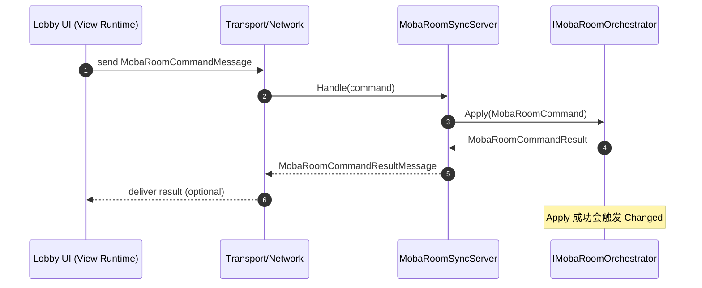
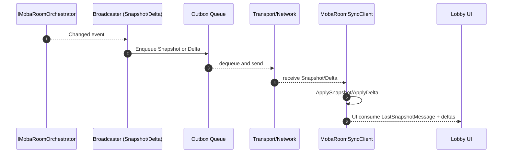

# MOBA Host Extension 设计说明（com.abilitykit.host.extension / Runtime/Moba）

本文档描述 `com.abilitykit.host.extension` 包中 `Runtime/Moba` 目录下模块的职责划分、边界约束、以及跨模块的数据流向。

目标：

- 把 **房间/大厅的权威状态** 放在 extension 的 Room 层（`MobaRoomState`/`MobaRoomOrchestrator`）
- 通过 **RoomSync** 将权威快照/增量推送给 UI（View Runtime）
- 开局（StartGame）逻辑以 Room 权威状态为准，生成 `MobaGameStartSpec` 并调用运行时（demo/runtime）的 EnterGame Flow

---

## 1. 模块分层与职责

### 1.1 Shared（跨端共享，但仍属于 extension 域）

- `Runtime/Moba/Shared/Room`
  - **职责**：
    - 定义房间权威状态的数据结构与业务规则
    - 提供“对外可调用”的房间编排接口（`IMobaRoomOrchestrator`）
  - **核心类型**：
    - `MobaRoomState`：权威房间状态（Revision、玩家槽位、Ready、Hero、SpawnPoint 等）
    - `IMobaRoomOrchestrator` / `MobaRoomOrchestrator`：对命令的统一入口；产生 Snapshot；向外发布 Changed

- `Runtime/Moba/Shared/Struct`
  - **职责**：
    - extension 域内的结构化数据（如 `MobaGameStartSpec`）
    - 注意：RoomSync 协议 DTO 当前在 `com.abilitykit.protocol.moba`（见 RoomSync Messages / Protocol）

- `Runtime/Moba/Shared/StartSources`
  - **职责**：
    - 抽象“开局来源”的输入（匹配、房间、预设等）
    - 将多来源合并为统一的 `IMobaGameStartSource` / Router

### 1.2 Server（权威侧）

- `Runtime/Moba/Server/Room`
  - **职责**：
    - Server 侧房间编排实现（当前主要是 `MobaRoomOrchestrator` 的组合/装配）

- `Runtime/Moba/Server/RoomSync`
  - **职责**：
    - 把 `IMobaRoomOrchestrator` 的权威状态变更转换为可发送的消息（Snapshot/Delta）
    - 提供一个“协议处理器”（Server）用于处理 Client 的 hello/requestSnapshot/command

- `Runtime/Moba/Server/StartGame`
  - **职责**：
    - 根据 `IMobaRoomOrchestrator.State` 判断是否可开局
    - 构建 `MobaGameStartSpec` 并调用运行时（demo/runtime）的 `MobaEnterGameFlowService`

### 1.3 Client（非权威侧）

- `Runtime/Moba/Client/RoomSync`
  - **职责**：
    - 管理 client 侧 RoomSync 状态（LastSeenRevision、NeedSnapshot、pending deltas）
    - 合并/应用从网络收到的 Snapshot/Delta/CommandResult

---

## 2. 权威边界（Authority Boundary）

### 2.1 什么是权威

- **权威房间状态**：只存在于 `MobaRoomState`（Server 侧）
- 任何 UI 的 lobby 展示数据，都应来自：
  - Snapshot：`MobaRoomSnapshotMessage`（携带 `MobaRoomSnapshot`）
  - Delta：`MobaRoomChangedMessage`

### 2.2 什么不是权威

- View Runtime 内不应维护一份“可决定开局/可写入”的 lobby 状态
- 旧的 lobby snapshot（world snapshot opcode）的链路已废弃

---

## 3. 数据流总览

### 3.1 从 UI 操作到权威状态更新（命令流）

### 3.2 从权威状态到 UI 展示（同步流）

---

## 4. 关键约定

- **Revision 单调递增**：
  - `MobaRoomState.Revision` 每次状态变更 +1
  - Snapshot/Delta 都携带 revision，用于 client 侧一致性判断

- **命令幂等/去重**：
  - `MobaRoomCommand.ClientSeq` + server 侧 `_lastClientSeq` 实现基本的重复命令去重

- **增量丢失兜底**：
  - client 侧如果发现 `delta.revision` 跳跃超过阈值（`MaxDeltaRevisionGap`）则 `NeedSnapshot=true`
  - 下一次通过 `MobaRoomRequestSnapshotMessage` 拉取全量快照

---

## 5. 文档索引

- `RoomSyncDesign.md`：RoomSync 消息/协议与状态机
- `StartGameDesign.md`：开局链路（CanStart / Spec 构建 / ApplyGameStartSpec）
- `RoomDomainDesign.md`：RoomState/Orchestrator 的命令与状态约束
