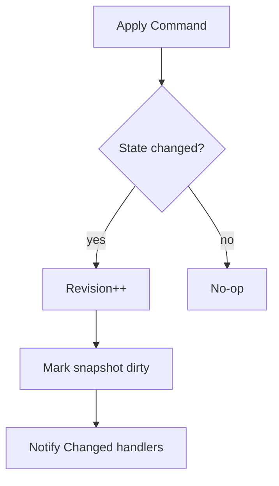

# Room 域设计（MobaRoomState / MobaRoomOrchestrator）

本文档聚焦 `Runtime/Moba/Shared/Room` 的职责与行为：

- `MobaRoomState`：权威状态容器 + 规则
- `MobaRoomOrchestrator`：命令入口 + 去重 + Changed 分发 + Snapshot 缓存

---

## 1. 核心目标

- 统一“大厅/房间”业务逻辑的权威来源
- 以 `Revision` 作为一致性基线
- 通过命令（Command）驱动状态变更，通过 Changed 事件驱动外部同步

---

## 2. 数据模型

### 2.1 房间全局字段（示意）

- `MatchId / MapId / RandomSeed`
- `TickRate / InputDelayFrames`
- `MinPlayers / MaxPlayers`
- `Revision`
- `Players: Dictionary<string, PlayerSlot>`

### 2.2 PlayerSlot（玩家槽位）

- `PlayerId`
- `TeamId`
- `Ready`
- `HeroId`
- `SpawnPointId`
- `AttributeTemplateId / Level / BasicAttackSkillId / SkillIds`

---

## 3. 命令模型

### 3.1 对外命令入口

- `MobaRoomOrchestrator.Apply(MobaRoomCommand)`
  - 参数：
    - `Kind`：Join/Leave/SetReady/PickHero/SetSpawnPoint
    - `PlayerId`：命令归属玩家
    - `ExpectedRevision`：可选的乐观并发版本（不匹配则返回 `StaleRevision`）
    - `ClientSeq`：可选的客户端序列号，用于幂等去重

### 3.2 幂等/去重

- 规则：对同一 `PlayerId`，如果 `ClientSeq <= lastSeq`，直接返回 Success（不重复应用）
- 目的：
  - 防止网络重发导致重复 Join/Ready 等
  - 降低 UI 与网络层协作复杂度

---

## 4. Snapshot 与 Changed

### 4.1 Snapshot

- `MobaRoomOrchestrator.Snapshot`
  - 内部使用 `_snapshotDirty` 缓存，避免每次读取都重建
  - 最终由 `MobaRoomState.BuildSnapshot()` 生成 `MobaRoomSnapshot`

### 4.2 Changed 事件

- `MobaRoomOrchestrator.AddChanged/RemoveChanged`
- `OnChanged(MobaRoomChangedArgs)`：
  - 标记 `_snapshotDirty=true`
  - 遍历 handler 列表（异常吞掉，避免污染主流程）

---

## 5. CanStart 与 GameStartSpec

- `MobaRoomState.CanStart()`：
  - 人数满足 min/max
  - 每个玩家 Ready
  - 每个玩家 HeroId > 0

- `MobaRoomState.TryBuildGameStartSpec(localPlayerId, out MobaGameStartSpec)`：
  - 基于当前房间状态，构建 `EnterMobaGameReq`（玩家 loadout 列表）
  - 返回 `MobaGameStartSpec`

---

## 6. 边界与注意事项

- Room 域不直接负责网络与序列化
- Room 域不依赖 View Runtime
- Room 域对外只输出：
  - Snapshot（全量）
  - ChangedArgs（增量语义）
  - CommandResult（命令执行结果）
