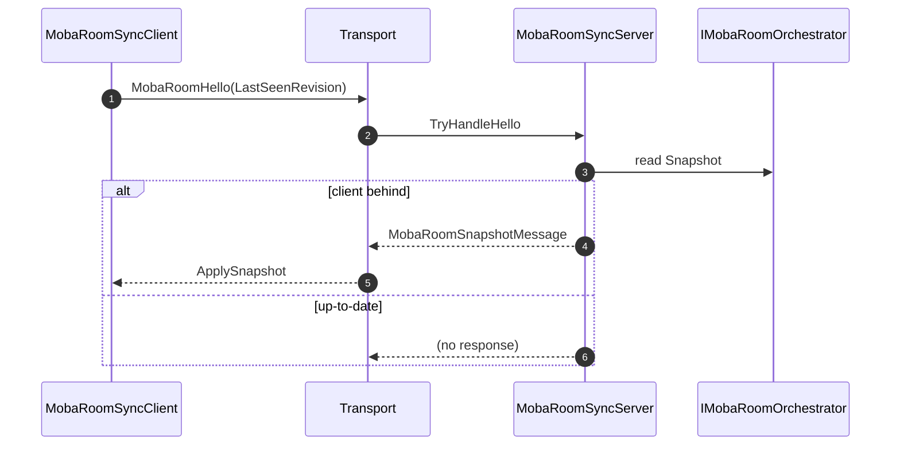
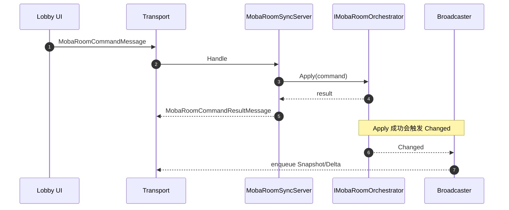
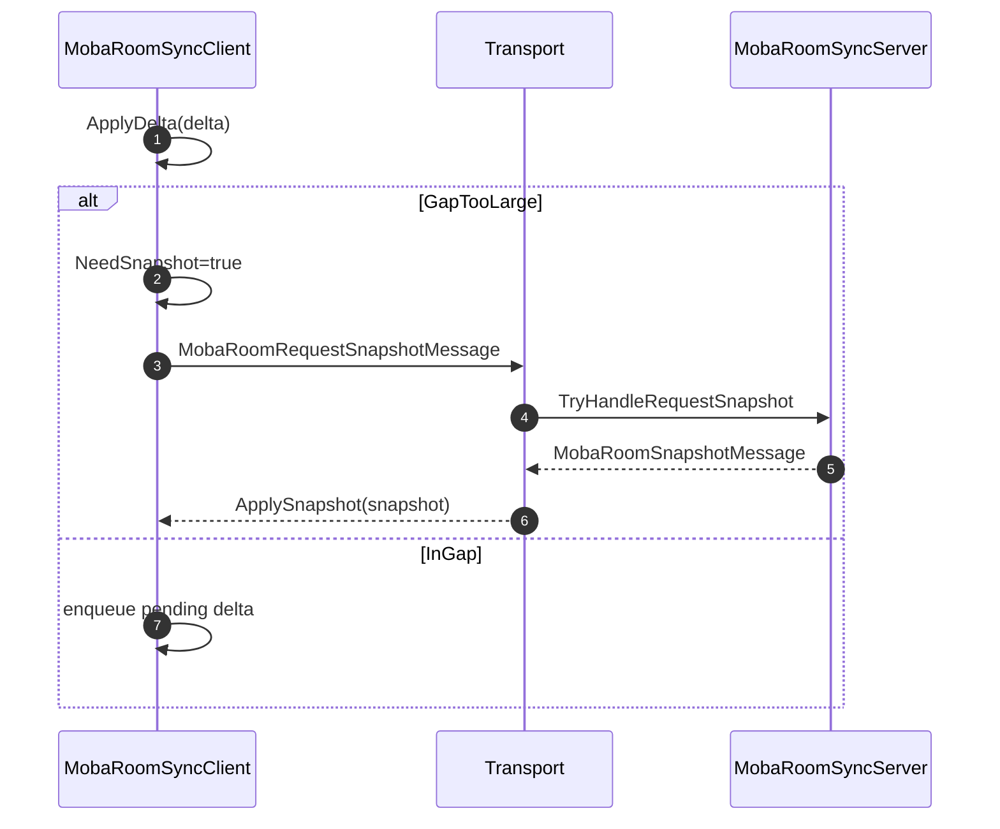

# RoomSync 设计（MobaRoomSyncServer / MobaRoomSyncClient）

本文档描述 `Runtime/Moba/*/RoomSync` 的职责划分与消息流：

- Server：把权威 Room 状态转换为可同步消息，并处理 client 请求
- Client：维护 last revision、应用 snapshot/delta，并在丢包时请求快照

> 消息结构定义位于 `com.abilitykit.protocol.moba/Runtime/RoomSync/*`。

---

## 1. 职责拆分

### 1.1 Server（协议处理器）

- `MobaRoomSyncServer`
  - `TryHandleHello` / `TryHandleRequestSnapshot`
    - 如果 `lastSeenRevision < currentRevision`，返回 `MobaRoomSnapshotMessage`
  - `HandleCommand`
    - 调用 `IMobaRoomOrchestrator.Apply`
    - 返回 `MobaRoomCommandResultMessage`

### 1.2 Server（广播器与 Outbox）

- `MobaRoomSyncServerBroadcaster`
  - 监听 `IMobaRoomOrchestrator.Changed`
  - **当前策略：每次变更直接 enqueue Snapshot**（简单可靠）

- `MobaRoomSyncServerDeltaBroadcaster`
  - 监听 `Changed`
  - enqueue `MobaRoomChangedMessage`

- `MobaRoomSyncServerOutbox` / `MobaRoomSyncServerDeltaOutbox`
  - 纯队列：Enqueue / TryDequeue / Clear
  - 由更上层的网络发送循环消费

### 1.3 Client（状态机）

- `MobaRoomSyncClient`
  - 核心状态：
    - `LastSeenRevision`
    - `NeedSnapshot`
    - `PendingDeltas`
  - 核心行为：
    - `ApplySnapshot`：更新 LastSeenRevision，清空 deltas，NeedSnapshot=false
    - `ApplyDelta`：检测 gap，必要时 NeedSnapshot=true，入队 delta
    - `TryBuildRequestSnapshot`：NeedSnapshot=true 时构建 request

---

## 2. 消息类型与语义（概览）

- `MobaRoomHello`
  - client -> server
  - 携带 `LastSeenRevision` 与 `LastAckClientSeq`

- `MobaRoomSnapshotMessage`
  - server -> client
  - 携带 `MobaRoomSnapshot`（全量）

- `MobaRoomChangedMessage`
  - server -> client
  - 携带 `Revision + ChangeKind + PlayerId + ...`

- `MobaRoomCommandMessage`
  - client -> server
  - 携带 `ClientId + MobaRoomCommand`

- `MobaRoomCommandResultMessage`
  - server -> client
  - 携带 `ClientId + MobaRoomCommandResult`

---

## 3. 数据流与时序

### 3.1 首次连接/重连（Hello -> Snapshot）

### 3.2 命令（Command -> Result + (Changed -> Snapshot/Delta)）

### 3.3 Delta 丢失兜底（NeedSnapshot）

---

## 4. 当前实现策略说明

- 目前同时提供 Snapshot 广播器与 Delta 广播器，但业务上可以按场景选用：
  - **优先 Snapshot**：实现最简单，client 逻辑也最简单
  - **Delta**：带宽更省，但需要 client 侧更严格的 gap 处理与回退到 snapshot

---

## 5. 边界与依赖

- RoomSync 不直接包含 UI 逻辑
- RoomSync 不直接依赖 demo 的 world snapshot（老链路）
- RoomSync 协议 DTO 与序列化由 `com.abilitykit.protocol.moba` 承载
