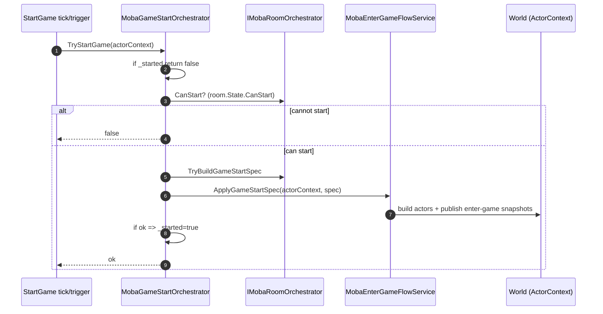

# 开局链路设计（StartGame）

本文档描述 `Runtime/Moba/Server/StartGame` 中的开局编排逻辑。

核心目标：

- 开局条件以 `IMobaRoomOrchestrator.State` 为准
- 开局 spec 以 `MobaGameStartSpec` 表达
- 开局落地通过运行时的 `MobaEnterGameFlowService.ApplyGameStartSpec` 执行

---

## 1. 关键类型与职责

- `IMobaGameStartOrchestrator`
  - 定义对外能力：`TryStartGame(ActorContext)`

- `MobaGameStartOrchestrator`
  - 依赖：
    - `IMobaRoomOrchestrator`：权威房间状态
    - `MobaEnterGameFlowService`：运行时 enter-game 执行器
  - 内部状态：`_started` 用于幂等（防止重复开局）

- `MobaWorldAutoStartHandler`
  - 依赖：`IMobaRoomOrchestrator`
  - 用于“世界自动开局”策略判断（通常由上层 tick 驱动）

---

## 2. 开局条件（CanStart）

当前判断逻辑位于 Room：

- `room.State.CanStart()`
  - 人数满足
  - 全员 ready
  - 全员已选 hero

StartGame 层只负责调用与记录幂等。

---

## 3. Spec 构建

- `room.TryBuildGameStartSpec(localPlayerId, out MobaGameStartSpec)`
  - `localPlayerId` 在当前实现中会从 `room.State.Players` 中任选一个（用于构建 `EnterMobaGameReq.playerId`）
  - `EnterMobaGameReq.players` 为 loadout 列表

> 约束：spec 构建必须是纯函数式/可重放的（同一 room state -> 同一 spec）。

---

## 4. 执行链路（ApplyGameStartSpec）

---

## 5. 失败与幂等

- `_started` 仅在 `ApplyGameStartSpec` 返回 true 时置为 true
- 如果 `CanStart=true` 但 flow 执行失败，允许后续再次尝试（由上层决定是否重试）

---

## 6. 边界说明

- StartGame 不关心 RoomSync 的网络细节
- StartGame 不关心 UI
- StartGame 不维护 lobby 状态，只读取 Room 的权威状态
