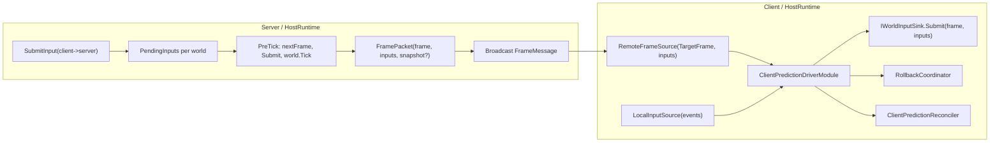
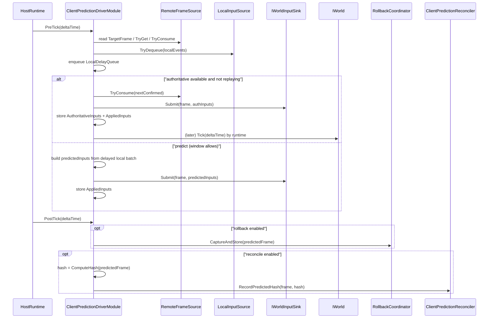

# FrameSync（Host Extension）预测/回滚设计文档

本文档面向 `com.abilitykit.host.extension/Runtime/FrameSync` 下的实现，补充模块边界、关键数据结构，以及“服务端帧同步广播 / 客户端预测推进 / 回滚重演 / hash 对账（reconcile）”的端到端数据流。

本目录核心类型：
- `FrameSyncDriverModule`：服务端（Host）侧的输入汇聚与逐帧广播。
- `ClientPredictionDriverModule`：客户端（HostRuntime）侧的预测驱动器，集成窗口控制、回滚/重演、对账。

---

## 1. 目标与非目标

目标：
- 将输入流（authoritative + local）映射为“每帧一次 Submit”的确定性执行序列。
- 在权威输入迟到时允许本地预测推进（PredictedFrame 前进）。
- 当权威输入到达后发现预测偏差，或收到权威 hash mismatch 时，能够回滚到某帧并重演到最新预测帧。
- 提供 runtime 统计与调参接口，便于观测与调优。

非目标：
- 该目录**不**实现回滚快照系统本体；快照/恢复由 `com.abilitykit.world.framesync/Runtime/FrameSync/Rollback` 提供。
- 该目录**不**规定世界内部如何做到 deterministic（随机数、浮点、迭代顺序等）；只提供驱动与校验挂点。

---

## 2. 模块边界与依赖

### 2.1 服务端：FrameSyncDriverModule

职责：
- 维护每个 `worldId` 的 `PendingInputs`（来自连接/客户端的 `SubmitInput`）。
- 在 `HostRuntimeOptions.PreTick`：
  - 生成 `nextFrame`。
  - flush `PendingInputs` 到 `IWorldInputSink.Submit(nextFrame, inputs)`。
  - `world.Tick(deltaTime)`。
  - （可选）向 `IWorldStateSnapshotProvider` 拉取 `WorldStateSnapshot`。
  - 将 `(frame, inputs, snapshot)` 封装为 `FramePacket` 并广播 `FrameMessage`。

核心代码路径：`FrameSyncDriverModule.OnPreTick`。

### 2.2 客户端：ClientPredictionDriverModule

职责：
- 从 `IConsumableRemoteFrameSource<PlayerInputCommand[]>` 获取权威输入（confirmed 推进）。
- 从 `ILocalInputSource<LocalPlayerInputEvent[]>` 获取本地输入（进入 delay queue，形成 predicted inputs）。
- 自适应预测窗口：根据 `remote.TargetFrame - confirmed` 的 backlog（EWMA 平滑）动态决定允许预测领先多少帧。
- `idealFrame` 门控：通过 `resolveIdealFrameLimit(worldId)` 将“时间同步约束”折算为 window 上限。
- 回滚与重演：
  - 权威输入与历史 applied input 不一致触发回滚。
  - hash mismatch 触发回滚（通过 `OnAuthoritativeStateHash`）。
- 回滚快照 capture：在 `HostRuntimeOptions.PostTick` 进行 `RollbackCoordinator.CaptureAndStore(predictedFrame)`。
- predicted hash 记录：在 PostTick 中调用 `ComputeHash(predictedFrame)` 并写入 `ClientPredictionReconciler`。

核心代码路径：
- `ClientPredictionDriverModule.OnPreTick`：消费输入 + 推进 confirmed/predicted + replay。
- `ClientPredictionDriverModule.OnPostTick`：capture snapshot + record predicted hash。
- `ClientPredictionDriverModule.OnAuthoritativeStateHash`：接收权威 hash 并触发 reconcile。

---

## 3. 核心数据结构（按 World）

`ClientPredictionDriverModule` 为每个 `worldId` 维护 `WorldContext`：
- 帧号：
  - `ConfirmedFrame`：已按权威输入推进的帧。
  - `PredictedFrame`：本地预测推进到的帧（可能领先）。
- 输入：
  - `LocalDelayQueue : Queue<LocalPlayerInputEvent[]>`：固定延迟队列（长度约 `inputDelayFrames + 2`），确保延迟窗口稳定。
  - `AppliedInputs : InputHistoryRingBuffer`：每帧实际提交给 world 的 inputs（预测或权威）。
  - `AuthoritativeInputs : InputHistoryRingBuffer`：权威输入历史（用于 replay 与对比）。
- 回滚：
  - `Rollback : RollbackCoordinator` + `RollbackSnapshotRingBuffer`。
  - `CaptureCounter`：每 `rollbackCaptureEveryNFrames` 帧捕获一次快照。
- 对账：
  - `ComputeHash : Func<FrameIndex, WorldStateHash>`：由上层注入。
  - `PredictedHashes` / `AuthoritativeHashes : WorldStateHashRingBuffer`。
  - `Reconciler : ClientPredictionReconciler`：比较 hash 并请求回滚。
  - `ReconcileEnabled`：可动态关闭（例如 replay 等待超时自动关闭）。
- Replay：
  - `Mode : ReplayMode (Normal/Replaying)`
  - `ReplayTo : FrameIndex`：本次 replay 目标（回滚前的 predictedFrame）。
  - `ReplayWaitTicks`：等待权威输入的计数，超时后退出 replay 并关闭 reconcile。
  - `LastRollbackFrame`：避免 rollback storm。

---

## 4. 数据流总览（Mermaid）

### 4.1 架构图（Server + Client）

### 4.2 客户端每 tick 时序

---

## 5. 客户端算法（OnPreTick）

`ClientPredictionDriverModule.OnPreTick` 每个 world 的主要流程可以概括为：

### 5.1 计算预测窗口
- `rawBacklog = remote.TargetFrame - ConfirmedFrame`（无 remote 则当 0）。
- `BacklogEwma = EWMA(rawBacklog)`。
- `window = round(BacklogEwma) + inputDelayFrames`。
- clamp：
  - `MinPredictionWindow`
  - `MaxPredictionAheadFrames`（=0 表示完全禁用预测）
- ideal gate：
  - `ideal = resolveIdealFrameLimit(worldId)`
  - `maxAheadByIdeal = max(0, ideal - confirmed)`
  - `effectiveWindow = min(window, maxAheadByIdeal)`
  - 当 `effectiveWindow == 0 && window > 0`：计为 ideal stall。

### 5.2 Step 0：采样本地输入并推进 delay queue
- 若存在 `local`：每 tick 入队一次（允许空数组），保证 delay queue 以固定节奏前进。
- 如果队列深度超过 `_maxLocalDelayQueueDepth`，丢弃最旧 batch 并累加统计。

### 5.3 Step 1（优先）：推进 ConfirmedFrame
条件：
- `remote != null` 且 `Mode == Normal`。
- `nextConfirmed <= remote.TargetFrame`。

处理：
- 先 `TryGet(nextConfirmed)` peek 权威输入用于“是否要回滚”的比较。
- 若启用 rollback 且该帧曾被预测（`PredictedFrame >= frame`）：
  - 对比 `AppliedInputs[frame]` 与 `authInputs`。
  - 不一致：恢复到 `frame-1`，进入 `Replaying`，并设置 `ReplayTo = oldPredicted`。
- 若无需回滚：`TryConsume(nextConfirmed)` 并 `InputSink.Submit(frame, inputs)`。

### 5.4 Replay 模式（确定性重演）
当 `Mode == Replaying`：
- `next = PredictedFrame + 1`。
- 若 `next > ReplayTo`：退出 replay，回到 Normal。
- 否则**只在权威输入可用时**推进：
  - 优先从 `AuthoritativeInputs` 取；否则从 `remote` 消费并存入 `AuthoritativeInputs`。
  - 若该帧权威输入还没到：不提交预测输入，`ReplayWaitTicks++`。
  - 超时（`ReplayWaitTimeoutTicks`）：
    - 关闭 `ReconcileEnabled`，退出 replay（避免卡死）。

### 5.5 Step 2：预测推进 PredictedFrame
当 `Mode == Normal` 且 `effectiveWindow > 0`：
- 令 `ahead = PredictedFrame - ConfirmedFrame`。
- 若 `ahead < effectiveWindow`：允许预测到 `PredictedFrame+1`。
- 预测输入来源：
  - 从 `LocalDelayQueue` dequeue 一个 batch；将每个 `LocalPlayerInputEvent` 转为 `PlayerInputCommand(frame, playerId, opCode, payload)`。
  - 若 batch 为空，则提交空数组。

---

## 6. 回滚触发条件

### 6.1 输入不一致触发
条件：
- `remote` 到达 `nextConfirmed`。
- 该帧之前已经执行过（预测路径）并记录在 `AppliedInputs`。
- `AppliedInputs[frame] != authInputs`。

动作：
- `TryRestore(frame-1)`。
- 设置 `Mode=Replaying`，`ReplayTo=oldPredicted`，并将 confirmed/predicted 回退到 `frame-1`。

### 6.2 hash mismatch 触发（reconcile）
入口：`OnAuthoritativeStateHash(worldId, frame, hash)`
- 将权威 hash 存入 `AuthoritativeHashes`。
- 若本地该帧 predicted hash 尚未记录，先等待（PostTick 记录后会触发比较）。
- 比较由 `ClientPredictionReconciler` 完成；当其判定 mismatch，会回调 `OnRollbackRequested(frame)`。

回调：`RequestReconcileRollback(worldId, mismatchFrame)`
- 防 storm：
  - replay 中不再进入
  - `LastRollbackFrame >= mismatchFrame` 不再进入
- 回滚到 `mismatchFrame - 1`，并进入 replay。

---

## 7. 关键不变量与排错建议

- 每 tick 每个 world **最多一次** `InputSink.Submit`（代码中有注释强调）。
- replay 模式下**不提交预测输入**，只等权威输入推进，保证收敛优先。
- 若出现“长期 replay 卡住”：
  - 检查 `remote.TargetFrame` 是否单调增长以及 `TryConsume` 是否会丢帧。
  - 关注 `ReplayWaitTimeoutTicks` 触发的日志：会自动 disable reconcile。
- 若 hash mismatch 频繁：
  - 优先确认 `ComputeHash` 的 deterministic（随机数、浮点、集合迭代顺序）。
  - 确保回滚快照覆盖了所有影响 hash 的状态。

---

## 8. 关联文档

- `README.md`：使用与调参/观测（面向使用者）。
- `com.abilitykit.world.framesync/Runtime/FrameSync/Rollback/README.md`：回滚基础设施说明。
- `com.abilitykit.world.framesync/Runtime/FrameSync/Rollback/Design.md`：回滚系统设计细节。
