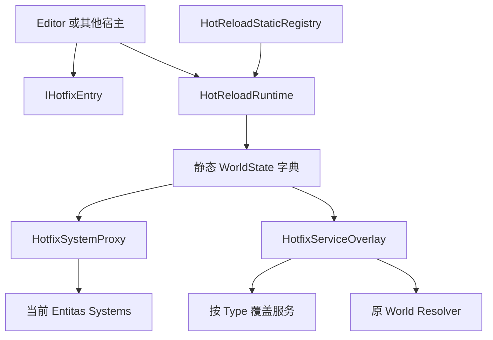
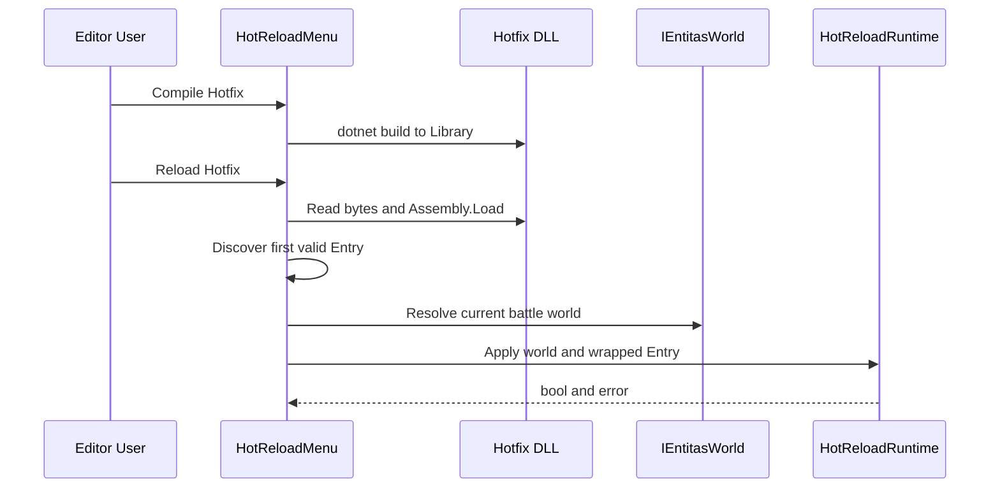
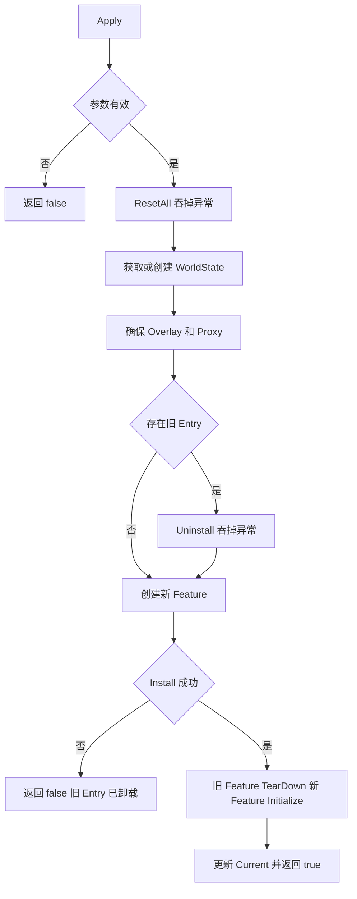

# Ability-Kit HotReload：Entitas 系统热替换、所有权与失败边界

> **阅读对象**：维护 MOBA Editor 热修复入口、实现 `IHotfixEntry`，或评估运行期系统替换风险的开发者。
>
> **文档目标**：以当前源码为准，解释 DLL 装载之外的运行时替换机制、世界级状态、服务覆盖、静态重置、失败语义与验证缺口。
>
> **成熟度**：E1 示例接入。仓库存在 MOBA Editor 和 HotUpdate DLL 示例，但没有 HotReload 专项自动测试、场景验收或发布门禁。

---

## 一、能力定位与选型速查

HotReload 是一个面向 Entitas 世界的轻量替换内核。它把新程序集提供的 `IHotfixEntry` 安装到独立 `Entitas.Systems`，再由预先插入世界系统表的 `HotfixSystemProxy` 转发生命周期调用。业务可以通过 `HotfixServiceOverlay` 给热更层覆盖少量服务，而不修改原世界容器。

| 需求 | 当前支持 | 结论 |
|------|----------|------|
| 运行期替换一组 Entitas systems | 支持，由 `HotfixSystemProxy.Swap` 完成 | 仅适合明确控制 Apply 时机的调试或试验链路 |
| 从 DLL 发现并创建入口 | 包本身不负责；MOBA Editor 用反射实现 | 加载策略属于宿主，不是运行时内核保证 |
| 热更服务覆盖 | 支持按精确 `Type` 覆盖解析 | overlay 不拥有实例释放职责 |
| 静态状态重置 | 支持手工注册 `Action` 后统一调用 | `HotReloadStaticAttribute` 当前没有自动扫描或注册实现 |
| 配置热重载 | 仅有 Editor 日志监听器 | 与 DLL Apply 是两条独立链路，不是同一事务 |
| 失败回滚与原子替换 | 不支持 | 安装失败时旧 Entry 可能已卸载，必须按非事务语义设计 |
| 多线程并发 Apply | 不支持 | 静态集合和世界状态字典均没有同步保护 |
| 世界销毁后清理 | 没有公开 API | 当前存在静态状态滞留风险 |

不应在以下场景直接采用当前实现：需要 HybridCLR/ILRuntime 平台装载、可卸载程序集、生产级灰度发布、跨世界并发替换、失败后恢复旧业务状态，或要求强确定性的联机战斗中途替换。

---

## 二、源码与工程入口

| 层次 | 入口 | 职责 |
|------|------|------|
| Unity package | `Unity/Packages/com.abilitykit.hotreload/Runtime/HotReload` | Entry、Proxy、Overlay、Static Registry 和日志接口 |
| .NET 镜像 | `src/AbilityKit.HotReload/AbilityKit.HotReload.csproj` | 编译 package Runtime；排除 Unity Editor 配置监听器 |
| Editor 宿主 | `Unity/Packages/com.abilitykit.demo.moba.editor/Editor/HotReload/HotReloadMenu.cs` | 编译 DLL、选择程序集、反射发现 Entry、定位当前世界并调用 Apply |
| 热更项目 | `Unity/HotUpdateSrc/Hotfix.Ability.Moba/Hotfix.Ability.Moba.csproj` | 面向 `netstandard2.1`，引用 Unity 生成的 HotReload、World DI 和 Entitas 程序集 |
| 示例 Entry | `Unity/HotUpdateSrc/Hotfix.Ability.Moba/MobaHotfixEntry.cs` | 安装每 60 Tick 记录一次日志的示例 System |

核心类型关系：

---

## 三、宿主装载链与 Entry 发现规则

HotReload package 不读取 DLL。当前唯一完整宿主在 MOBA Editor，其流程如下：

1. `Compile Hotfix` 执行 `dotnet build`，输出到 Unity 工程的 `Library/HotUpdate`。
2. `Reload Hotfix` 按最后写入时间选择名称匹配 `Hotfix.Ability.Moba*.dll` 的文件。
3. 宿主读取 DLL 和可选 PDB 字节，调用 `Assembly.Load`。当前没有程序集卸载上下文，重复加载会在进程中保留旧程序集。
4. 宿主按 `Assembly.GetTypes()` 返回顺序选择第一个非抽象、实现 `IHotfixEntry` 且有无参构造函数的类型。多个候选时没有显式优先级，也没有校验 `Name` 唯一性。
5. 宿主通过 `BattleLogicSessionHost.Current` 取得当前世界，并要求它实现 `IEntitasWorld`。
6. `EntryWithLogger` 在安装前向 overlay 写入 `IHotfixLogger`，然后把 Entry 交给 `HotReloadRuntime.Apply`。

因此，文件选择、程序集身份、Entry 选择和当前世界选择都属于 Editor 宿主策略。其他运行端若复用 Runtime，必须自行定义这些规则。

---

## 四、Apply 流程与真实状态变化

`HotReloadRuntime` 用 `world.Id.Value` 作为静态字典键，缓存 `Proxy`、`Overlay`、`CurrentEntry` 和 `CurrentFeature`。一次 Apply 的真实顺序是：

1. 校验 world 和 entry 非空。
2. 调用 `HotReloadStaticRegistry.ResetAll()`；单个 reset 和外层异常都会被吞掉。
3. 按 world id 获取或创建 `WorldState`。
4. 首次 Apply 时创建 overlay 和 proxy，把 proxy 加入 `world.Systems`，并立即手工调用 `proxy.Initialize()`。
5. 如果存在旧 Entry，调用其 `Uninstall`；异常被吞掉。
6. 创建新的 `Entitas.Systems`，调用新 Entry 的 `Install`。
7. 若 Install 抛出异常，返回 false；此时旧 Entry 已执行过 Uninstall，但旧 feature 尚未从 proxy 移除。
8. Install 成功后调用 `proxy.Swap(feature)`：先 TearDown 旧 feature，再赋值新 feature并 Initialize。两个异常都会被吞掉。
9. 最后更新 `CurrentEntry` 和 `CurrentFeature` 并返回 true。

该顺序不是事务。`true` 只表示新 Entry 的 `Install` 没有向外抛异常，不能证明旧 feature TearDown、新 feature Initialize 或静态 reset 成功。

---

## 五、核心抽象与设计取舍

### 5.1 IHotfixEntry

Entry 只表达安装和卸载：

- `Install(contexts, systems, services)` 应把新系统加入传入的临时 feature，而不是直接改写 `world.Systems`。
- `Uninstall` 接收到的是世界总 systems 和 overlay，不是旧 feature。需要撤销订阅、外部句柄或业务注册时，Entry 必须自行保存并定位这些资源。
- 接口没有异步、取消、版本、兼容性校验或迁移上下文，不适合承载长事务。

### 5.2 HotfixSystemProxy

Proxy 让世界系统表只插入一次稳定对象，后续 Tick 委托给 `_current` feature。这避免替换时直接操作 Entitas 系统列表，但产生三个约束：

- Apply 应在世界线程的安全点执行，不能与 `Execute`、`Cleanup` 或 `TearDown` 并发。
- 首次 Apply 会手动 Initialize proxy；若宿主之后再次初始化整个世界系统表，当前 feature 可能收到重复 Initialize。
- `Swap` 吞掉旧 TearDown 和新 Initialize 异常，因此调用者不能据返回值判断 feature 是否可运行。

`CreateHotfixFeature` 当前忽略 name，只返回空 `Entitas.Systems`；`CreateSystemInstance` 固定要求目标类型存在 `(IContexts, IWorldResolver)` 构造函数。这两个方法没有被当前生产链路调用，不应写成成熟装配能力。

### 5.3 HotfixServiceOverlay

Overlay 先查 `_overrides`，未命中或值为 null 时回退原世界 resolver。它是解析视图，不是子容器：

- key 是精确 `Type`，没有命名服务、开放泛型或继承匹配。
- `Set(type, null)` 等价于解析时回退，不表示显式屏蔽底层服务。
- `Clear()` 只清空字典，不 Dispose 覆盖实例。
- 当前 Apply 不会在每次替换前 Clear，旧 Entry 写入的覆盖会跨重载保留，除非新旧 Entry 主动覆盖或清理。

### 5.4 静态状态注册

`HotReloadStaticRegistry.Register(id, reset)` 把回调追加到静态 List；当前不检查 id、重复注册或线程并发。`ResetAll` 逐项执行并吞掉异常，`Clear` 只移除注册项，不执行 reset。

`HotReloadStaticAttribute` 当前只有 Attribute 定义。仓库没有反射扫描、Source Generator 或自动注册器，因此添加该特性不会产生任何运行时效果。需要静态清理的模块必须显式调用 `Register`，并自行避免重复注册。

### 5.5 配置 reload 监听器

`ConfigReloadDebugListener` 仅在 Unity Editor 的 SubsystemRegistration 阶段订阅 `ConfigReloadBus.Reloaded`，把成功或失败写入日志。.NET 镜像工程明确排除该文件。它不触发 DLL Apply、不更新 feature，也不参与回滚；配置热重载与系统热替换应视为两条独立链路。

---

## 六、生命周期与所有权

| 对象 | 创建者 | 持有者 | 清理现状 |
|------|--------|--------|----------|
| DLL 字节与 Assembly | Editor 宿主 | CLR 默认加载上下文 | 无卸载；重复加载保留旧程序集 |
| IHotfixEntry | Editor 宿主反射创建 | `WorldState.CurrentEntry` | 下一次 Apply 尝试 Uninstall；世界销毁时无统一清理 |
| WorldState | `HotReloadRuntime` | 静态 `States` 字典 | 无 Remove/Clear world API |
| HotfixSystemProxy | `EnsureProxyAndOverlay` | world systems 与 WorldState | 世界 TearDown 会转发当前 feature；静态引用仍可能保留 proxy |
| HotfixServiceOverlay | `EnsureProxyAndOverlay` | WorldState | 无 Dispose；覆盖项跨 Apply 保留 |
| 临时 feature | 每次 Apply | proxy 与 WorldState | 下一次成功 Swap 尝试 TearDown |
| 覆盖服务 | Entry 或宿主创建 | overlay 字典仅持有引用 | 框架不 Dispose |
| static reset callback | 业务显式 Register | 静态 Registry | 仅 Clear 移除；无重复保护 |

当前世界键使用 `world.Id.Value ?? string.Empty`。空 id 的多个世界会共享同一状态；重复 world id 也会把不同世界错误地映射到同一 proxy、contexts 和 resolver。这是采用前必须修复的隔离风险。

---

## 七、失败矩阵

| 失败点 | 当前可见结果 | 状态是否可能部分变化 | 调用方能否准确判断 |
|--------|--------------|----------------------|--------------------|
| world/entry 为空 | 返回 false 和短错误 | 否 | 能 |
| static reset 抛错 | 异常被吞，继续 Apply | 是，部分回调可能已执行 | 不能 |
| 创建 overlay/proxy 或加入 systems 抛错 | 异常向外传播，Apply 不返回 false | 是，State 可能已进入字典 | 能看到异常，但无回滚 |
| proxy 首次 Initialize 抛错 | 异常被吞 | 是 | 不能 |
| 旧 Entry Uninstall 抛错 | 异常被吞，继续安装 | 是 | 不能 |
| 新 Entry Install 抛错 | 返回 false 和异常文本 | 是，旧 Entry 已卸载；新 feature 也可能部分安装 | 只能看到 Install 失败 |
| 旧 feature TearDown 抛错 | 异常被吞，继续交换 | 是 | 不能 |
| 新 feature Initialize 抛错 | 异常被吞，仍提交并返回 true | 是，Current 指向未完整初始化 feature | 不能 |
| Execute/Cleanup 抛错 | Proxy 不捕获，沿世界 Tick 传播 | 运行中断取决于宿主 | 能看到异常 |
| 重复/并发 Apply | 无锁、无重入门禁 | 是，可能交错读写状态 | 不能可靠判断 |

业务 Entry 应把 Install 设计成可回滚的小步骤，并避免在 Install 完成前发布不可撤销的外部副作用。但这只能降低风险，不能把当前 Runtime 变成原子事务。

---

## 八、最小接入约束

宿主接入至少应满足：

1. 在世界创建并初始化完成后、且当前帧 Tick 之外的世界线程安全点调用 Apply。
2. 对 Entry 类型做明确选择，不依赖 `GetTypes().FirstOrDefault` 的顺序。
3. 校验程序集版本、Entry 名称和目标世界身份。
4. Entry 的所有外部订阅、覆盖服务和句柄都有对称 Uninstall；覆盖实例的 Dispose 由业务负责。
5. Apply 返回 false 后停止继续使用“新版本成功”的假设，并记录旧 Entry 已可能卸载的部分失败状态。
6. 联机或可回放逻辑必须在所有端统一版本，并在安全边界重建或重新同步世界；不应在确定性 Tick 中单端替换。

---

## 九、验证入口与证据状态

当前证据：

- E0：Unity package 和 `src/AbilityKit.HotReload` 可定位源码与构建入口。
- E1：MOBA Editor 可编译并加载 `Hotfix.Ability.Moba`，示例 Entry 安装日志 System。
- 未发现 `AbilityKit.HotReload.Tests`、HotReload xUnit/Unity Test、Smoke、弱网/回放验证或发布门禁。

优先补充的契约测试：

| 优先级 | 测试 |
|--------|------|
| P0 | 首次 Apply、连续成功 Apply、Install 失败后的旧 Entry/feature 状态 |
| P0 | TearDown/Initialize/Uninstall/reset 抛错时的返回值和可观测诊断 |
| P0 | world dispose 后移除 State；空 id、重复 id 和不同 world 实例隔离 |
| P1 | overlay 覆盖、null 回退、Clear 和覆盖实例所有权 |
| P1 | Registry 重复注册、Clear、异常隔离和并发策略 |
| P1 | Apply 与 Tick 并发门禁、重复 Initialize 防护 |
| P2 | Editor 多 Entry 选择、程序集版本校验和可卸载加载上下文策略 |

在 P0 测试和显式 world 清理完成前，文档和对外能力地图只能将其声明为 Editor 调试/原型能力。

---

## 十、演进顺序

1. 为 Runtime 增加世界实例级状态身份和显式 `Remove`/`DisposeWorld`，同时处理 proxy TearDown、Entry Uninstall、overlay 清理与静态引用释放。
2. 将 Apply 改成可观测的分阶段结果，至少区分 reset、uninstall、install、teardown、initialize 和 commit。
3. 定义失败策略：预构建与预校验、安装补偿，或失败后重建世界；不要只依赖 catch 后返回 false。
4. 增加世界线程/安全点门禁，禁止 Apply 与 Tick 并发。
5. 决定 overlay 覆盖服务的所有权协议，并在替换时清理旧覆盖。
6. 删除无效 Attribute，或补充明确的生成/注册机制和重复注册规则。
7. 将 Editor DLL 选择、Entry manifest、版本兼容和 AssemblyLoadContext/平台适配放到独立宿主层。
8. 完成自动测试和场景验收后，再评估从 E1 晋升到 E3/E4。

---

*文档版本：2.0*
*最后更新：2026-08-09*
