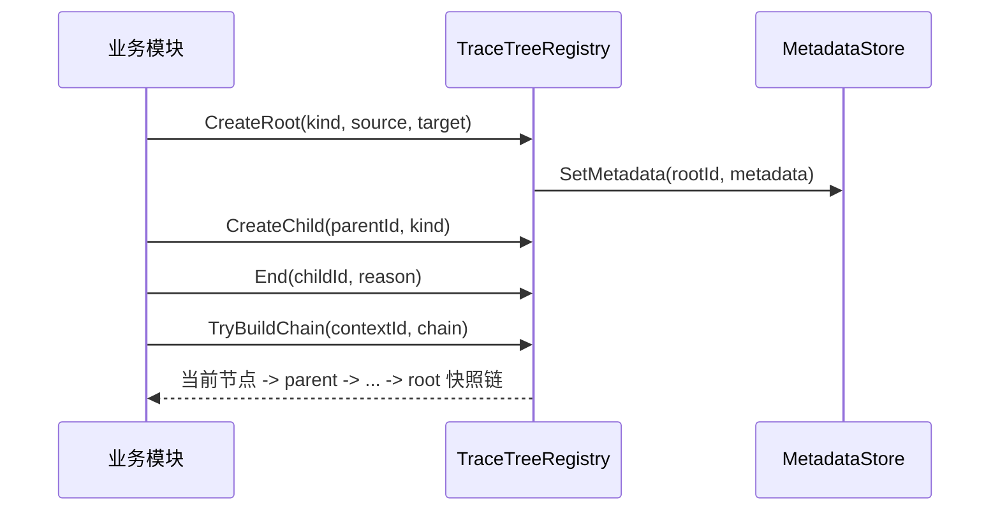

# Ability-Kit Trace 溯源树模块开发设计文档

> **阅读对象**：需要追踪技能、伤害、Buff、投射物等效果来源链路的框架开发者。
>
> **文档目标**：说明 Trace 包如何构建溯源树、保存根节点元数据、查询链路和清理生命周期。

---

## 阅读入口与当前契约

本文以 2026-09-16 的实现为准。Trace 是因果结构记录，不是完整战斗状态或实时值仓库。基础记录保持精简；配置名称、效果解释与运行时展示应由业务元数据、配置目录及运行时对象映射补齐，不因工具需要展示而把活对象或序列化大数据写入每个节点。

关联阅读：[Context 基础包](../../com.abilitykit.context/Document/Context上下文注册与快照模块开发设计文档.md)、[MOBA 整体上下文指南](../../com.abilitykit.demo.moba.runtime/Runtime/Docs/MobaCombatContextDesignGuide.md)、[Runtime Context 设计](../../com.abilitykit.demo.moba.runtime/Document/RuntimeContext运行时值与快照设计文档.md)。

## 一、设计理念

Trace 模块用于回答“这个结果从哪里来”。在战斗系统里，一个伤害可能来自技能，技能可能来自 Buff，Buff 又可能来自装备或区域效果。若只保存最终数值，排查和回放时很难还原因果链。

Trace 的方案是把一次效果来源记录为树：

- 根节点表示一次独立来源，例如一次技能释放。
- 子节点表示派生来源，例如投射物、命中、二段伤害。
- 根节点元数据由业务层定义，框架只保存树结构和生命周期。
- 叶子节点可以挂载额外快照数据，用于调试或回放。

---

## 二、模块边界

Trace 负责：

- 创建 root/child 溯源节点。
- 记录 parent/root/kind/endFrame/endReason。
- 通过 `TraceMetadata` 扩展业务元数据。
- 查询 root 状态、节点链路、按 kind/root 枚举节点。
- 结束节点、结束整棵树、按保留帧数清理已结束 root。

Trace 不负责：

- 不定义具体战斗语义，`TraceNodeKind` 和 `TraceEndReason` 只保留 `None`。
- 不负责序列化和持久化。
- 不主动 Tick，当前帧号由子类覆写 `Frame` 提供。
- 不保证线程安全，当前内部字典没有锁。

Trace ID 在同一 Registry 实例内按创建顺序单调分配；Clear 和预测撤销都不重置游标，旧 ID 不会命中新分配节点。分配空间耗尽时拒绝创建，不回绕。跨实例、跨世界、跨会话仍必须额外携带 scope，单调 ID 不是全局身份。Trace ID 与 Context entity ID、ActorId、配置 ID、技能 RuntimeId 无共同命名空间，数字相同不能直接关联。

Trace 不主动采样业务数值。节点创建/结束属于逻辑层操作，即使编辑器关闭仍应保持正确；诊断 Producer 可以由逻辑诊断开关控制。编辑器只查询或低频采样已有数据，关闭时清理自身缓存和订阅，不反向生成逻辑节点或修改 runtime。

MOBA 的效果入口观察采用独立 `MobaEffectExecutionSnapshotStore`：节点业务 metadata 只保存精确快照引用，必要数值保存在有界的外部受管记录中，基础 TraceContextRecord 不增加业务载荷。诊断模式/通道/冻结状态决定是否采集，树查询附带纯事实 DTO；记录可比树节点更早淘汰，此时明确显示 Evicted 而非回退当前值。Purge、预测撤销、Clear 和世界 Dispose 清理对应记录；不因窗口打开永久保留数据。详细字段和限制见 [Runtime Context 设计的效果入口章节](../../com.abilitykit.demo.moba.runtime/Document/RuntimeContext运行时值与快照设计文档.md#71-效果执行入口的观察快照)。

MOBA 动作前后观察另使用 `moba.action.execution` 受管类型，metadata 仅附加 ActionSnapshot 精确引用。入口与结束冻结 HP/Mana 必要字段，实际 HP 提交复用现有事件按真实树的最近动作归属，默认每动作最多 32 条。调用完成不等于玩法成功，失败可已有部分提交；前后视图不覆盖全部多目标/异步后代，也不是所有伤害计算阶段。开关中途变化、未订阅和截断分别有标记，缺失或淘汰不回退 live。详见 [Runtime Context 设计的动作事实章节](../../com.abilitykit.demo.moba.runtime/Document/RuntimeContext运行时值与快照设计文档.md#72-动作执行前后事实与实际-hp-提交)。基础 Trace 类型不承担这些业务采集。

---

## 三、目录结构

| 路径 | 职责 |
|------|------|
| `Runtime/TraceTreeRegistry.Core.cs` | 溯源树注册表核心实现 |
| `Runtime/TraceTreeScope.cs` | Begin/End 作用域辅助 |
| `Runtime/TraceSnapshot.cs` | 泛型节点快照和查询返回结构 |
| `Runtime/TraceRegistryRuntime.cs` | 运行时注册目录、生命周期事件、非泛型节点视图 |
| `Runtime/TraceOrigin.cs` | 创建节点时的来源参数 |
| `Runtime/TraceInterfaces.cs` | 元数据、叶子数据、上下文来源、状态模型 |
| `Editor/Windows` | Trace Tree 编辑器窗口和 ViewModel |
| `Editor/Plugins` | 节点详情、树可视化插件 |
| `Editor/Config` | TraceTree 编辑器配置 |

---

## 四、核心类型

### 4.1 TraceTreeRegistryBase

非泛型基类保存框架必要结构：

- `_contexts`：`contextId -> TraceContextRecord`。
- `_roots`：`rootId -> TraceRootRecord`。
- `_childrenByParent`：父子关系。
- `_contextSource`：从任意 origin 对象提取 trace id。
- `_leafDataStore`：叶子节点附加数据。

它提供 `End`、`EndRoot`、`RetainRoot`、`ReleaseRoot`、`Clear` 等基础生命周期能力，同时暴露非泛型查询面：

- `GetActiveRoots()` / `GetEndedRoots()`：枚举 root 状态，不需要知道业务元数据类型。
- `TryGetNodeSnapshot()` / `GetNodeSnapshotsByRoot()`：返回 `TraceNodeSnapshot`，供 Editor、Diagnostics、导出工具等跨业务消费。
- `RegistryEvent`：发布 root/child 创建、节点结束、root 引用变化、清理等生命周期事件。
- `GetKindName()`：业务注册表可覆写，用于工具层展示稳定节点类型名称。

### 4.2 TraceTreeRegistry<T>

泛型注册表增加业务元数据：

```csharp
public abstract class TraceTreeRegistry<T> : TraceTreeRegistryBase
    where T : TraceMetadata
```

业务侧需要实现 `CreateMetadata`，并可覆写 `GetSourceActorId`、`GetOriginSourceId` 等方法，让子节点在未显式传入来源时继承 root 元数据。

### 4.3 TraceSnapshot<T> 与 TraceNodeSnapshot

`TraceSnapshot<T>` 是业务代码使用的强类型查询结果，包含节点 ID、root ID、parent ID、kind、创建帧、结束帧、结束原因、显式 IsEnded、子节点数量和该节点元数据。它不承担写回，但 Metadata 仍是对象引用，不是深拷贝不可变数据；导出方应按需转成纯 DTO。

`TraceNodeSnapshot` 是非泛型只读视图，`Metadata` 以 `object` 暴露，主要用于 Editor、Diagnostics、日志导出等无需引用业务元数据泛型的工具场景。

### 4.4 TraceRegistryDirectory 与事件

`TraceRegistryDirectory` 维护当前运行时可见的 `TraceTreeRegistryBase` 实例。注册表构造时会自动注册，`Dispose()` 时自动移除；业务也可以显式调用 `Register`/`Unregister` 管理生命周期。

`TraceRegistryEvent` 用于订阅溯源树生命周期变化，适合桥接到诊断面板、采样器、遥测或回放工具，而不需要修改具体业务注册表。

### 4.5 元数据和数据存储

- `TraceMetadata`：业务元数据基类。
- `ITraceMetadataStore<T>`：实现的索引是节点 ContextId，root/child 都各自保存元数据；接口参数中的 rootId 名称不应理解为只支持根元数据。
- `DictionaryTraceMetadataStore<T>`：默认字典实现。
- `ITraceLeafDataStore`：为叶子节点挂载附加数据。
- `SimpleTraceContextSource`：支持 int/long/Guid 等基础 origin 提取。

---

## 五、执行流程



Root 的 `ActiveCount` 会随着节点创建和结束变化。`Purge(currentFrame, keepEndedFrames)` 只会清理 active 为 0 且 external ref 为 0 的 root。工具层可以通过 `TraceRegistryDirectory` 获取注册表，并通过非泛型快照读取树结构，避免对 `TraceTreeRegistry<T>` 做反射调用。

### 生命周期语义

| 操作/状态 | 实际含义 |
|-----------|----------|
| `End(contextId)` | 仅结束该节点；重复结束返回 false，不重复扣减 ActiveCount |
| `EndRoot(rootId)` | 结束根及其全部后代，不释放外部引用 |
| `ActiveCount` | 该根下尚未结束的节点数量，不是外部 runtime 数量 |
| `ExternalRefCount` | 跨帧消费者的根保留计数，不表示节点仍在执行 |
| `RetainRoot` / `ReleaseRoot` | 保护历史可查询性，不复活已结束节点 |
| `Purge` | 活动和外部引用都为零时按结束根的保留帧数清理 |
| `PurgeRoot` | 低层强制递归删除，不自行检查保留计数；MOBA 安全 API 另做检查 |

根节点已结束而后代仍活动是有效状态；不能只看根 IsEnded 判断整树可清理。CreatedFrame/EndedFrame 可以为 0，必须用显式 IsEnded 判断。CreateChild 只要求父节点存在，并允许在已结束但保留的来源下派生延迟效果。

### 作用域所有权

`CreateChildScope` 创建子节点并保留所属根。`End(reason)` 或 `Dispose()` 结束子节点并释放这一个根引用；重复结束、重复退出和结构体副本不会重复释放。节点已被外部结束或预测撤销时，作用域退出仍释放自身保留的根引用；结束事件订阅者抛异常时也通过 finally 执行释放。

`CreateRootScope` 保留根，`End(reason)` 只结束整树，不释放引用；`Dispose()` 最多释放一个作用域持有引用，并且所有副本共享退出状态。额外 `Retain()` 是手动保留，需要与 `Release()` 配对，Dispose 不批量释放这些额外引用。显式 Release 已释放全部作用域持有引用后，再 Dispose 不会扣减其他消费者的引用；Dispose 后不能继续 Retain，但仍可 Release 尚未配对的手动引用。

作用域仍是 readonly struct，但每次创建作用域分配一个轻量共享 lease，仅保存注册表、节点/根 ID 和释放状态，不增加每节点基础记录，不持有业务 runtime，也不复制业务数据。IsValid 表示尚未退出且节点仍存在，不是实时值或快照有效性的判断。基础包仍不保证跨线程使用安全。

直接使用 `BeginRoot` / `BeginChild` 返回 long ID 的兼容入口仍需手动配对 `ReleaseRoot`；基础 `End` / `EndRoot` 不隐式释放引用。不能通过作用域释放其他消费者直接调用 `RetainRoot` 创建的引用。

MOBA 效果执行服务保留 RootScope 和 CurrentActionScope，而非创建作用域后仅取出 ID。正常/失败动作结束和效果退出时中止的动作均通过子作用域 End 释放引用，独立效果根在退出的 finally 中 Dispose；派生效果使用普通节点创建，不凭空释放父根引用。观察快照仍先捕获动作终态，再结束 Trace，不因本次所有权修复改变采集语义。

### 查询、缓存与历史事件

Revision 为单调查询版本，创建、结束、引用变化、清理及回滚变更提高版本；它不是业务状态版本，也不保证 Metadata 被直接修改时自动通知。业务元数据更新应走现有更新 API，跨线程抓取不能靠 Revision 替代线程同步。

`ExportRoot`/`ExportRoots` 提供 DTO、节点/深度上限及截断标志，不等于磁盘序列化协议。TreePreOrder 从根向后代展示，TryBuildChain 则从当前节点向根返回。当前按根枚举仍可能扫描全部节点，全根导出可能接近 O(R*N)；尚无自动历史淘汰调度。

RegistryEvent 目前直接调用订阅者，没有基础包级异常隔离。MOBA 诊断桥接在内部捕获采集异常，但其他订阅者仍可能让已提交写操作抛出异常；这是当前风险，不应把文档当成已修复保证。Clear 通过 OnClearing 在节点索引仍存在时逐项清理当前节点对应的 metadata/leaf 映射，再清结构、调用 OnClear 并通知 RegistryCleared；保留 ID 游标，不批量清除共享存储的其他条目。自定义存储或清理 hook 抛异常时不保证清理原子性，不能把这个契约理解为任意外部存储事务。

---

### 局部生命周期回滚与预测撤销

`ValidateLifecycleRestore` / `RestoreLifecycle` 仅恢复已存在节点的结束状态、结束帧和原因；整批身份校验成功后才修改数据，不重建被清理的节点，不覆盖元数据或节点关系。根 ActiveCount 按节点状态变化做差量修正，不扫描全部历史；外部引用计数仍以当前 retain handle 为准。恢复提高 Revision 并发布 LifecycleRestored，不伪造 Started/Ended 业务事件。

MOBA 技能本地回滚只捕获技能根与已登记子节点的最小生命周期字段，使用独立本地载荷；权威恢复载荷和状态哈希不包含这些 Trace 字段。已被 Purge 的身份与完整 Context 生命周期重建不在此契约内，不能把此能力视为全量溯源树回滚。

本地载荷 v2 另保存同一模拟世界的 Trace 分配边界。回滚时撤销边界之后的全部分配，包括同帧分支、未登记效果节点和预测技能根；v1 载荷仍仅恢复捕获节点的生命周期。撤销清除节点、父子索引、元数据和叶子映射，按状态差量修正已确认根的活动计数，不回退 ID，不改变已确认根的外部引用计数。预测根的旧 retain handle 在根撤销后释放无效果；单调 ID 保证它不会释放重放的新根。

PredictionRetracted 提高 Revision，让只读树查询和导出不再返回撤销节点。历史诊断事件保留，诊断开启时追加带撤销 ID 范围的 TracePredictionRetracted 标记；该标记不是 Started/Ended 事件，也不提供指向已撤销节点的有效导航引用。本地分配边界仅用于同一世界的整体时间线回滚，不用于单个技能的独立撤销或权威冷恢复。

Clear 会把可接受预测边界的下限提升到当前分配游标；更早的旧边界在校验阶段拒绝，不能撤销清空后新建节点。清空前捕获的生命周期节点因身份已不存在也不能恢复。边界仍是同一实例内的本地游标，不是跨世界恢复引用。

---

## 六、扩展点

MOBA 动作观察 v2 关联独立伤害终态列表，复用已接受的 DamageCalculation 诊断事件，区分真实 HP 提交、护盾全吸收、零 HP 伤害和拒绝/异常出口。异常可能已有提交，提交后的通知异常也不回滚事实；未采集计算数值不显示成零，开关覆盖与截断单独标记。基础 Trace 仍仅保存结构与精确外部引用，不读取实时值来重建结果。详见 [未产生 HP 提交的伤害结果](../../com.abilitykit.demo.moba.runtime/Document/RuntimeContext运行时值与快照设计文档.md#73-未产生-hp-提交的伤害管线结果)。

- 继承 `TraceMetadata` 定义业务字段，如 SkillId、BuffId、DamageType。
- 继承 `TraceTreeRegistry<T>`，实现 `CreateMetadata`，并按需覆写 `GetKindName`。
- 实现 `ITraceContextSource`，让业务对象提供稳定 trace id 和显示名。
- 实现 `ITraceLeafDataStore`，将叶子快照接入对象池或诊断系统。
- 订阅 `RegistryEvent`，将 Trace 生命周期桥接到诊断、遥测、回放或业务日志。
- 使用 `TraceExportOptions` 控制导出节点上限、active-only、元数据包含、最大深度和导出顺序。
- 扩展 Editor 插件显示不同业务节点详情。

---

## 七、最小接入示例

```csharp
public sealed class BattleTraceMetadata : TraceMetadata
{
    public int ConfigId { get; set; }
}

public sealed class BattleTraceRegistry : TraceTreeRegistry<BattleTraceMetadata>
{
    public BattleTraceRegistry()
        : base(new DictionaryTraceMetadataStore<BattleTraceMetadata>()) { }

    protected override BattleTraceMetadata CreateMetadata(
        long contextId, int kind, long sourceActorId, long targetActorId,
        long originSourceId, string originSourceDisplay,
        long originTargetId, string originTargetDisplay, int configId)
        => new BattleTraceMetadata { ConfigId = configId };
}

using var trace = new BattleTraceRegistry();
var rootId = trace.CreateRoot(kind: 1, configId: 1001);
var childId = trace.CreateChild(rootId, kind: 2, configId: 2001);

var export = trace.ExportRoot(
    rootId,
    new TraceExportOptions(
        maxNodes: 128,
        activeOnly: false,
        includeMetadata: true,
        maxDepth: 4,
        order: TraceExportOrder.TreePreOrder));
```

Trace 包只负责记录“谁触发了谁”的树结构、生命周期和可导出快照；技能、Buff、伤害类型等业务字段放在业务 metadata 中，诊断面板通过 `TraceTreeExportDto` 读取通用结构并自行解释 metadata。

---

## 八、注意事项

- `PurgeRoot` 递归清理时会从 metadata/leaf store 清理同名 ID；如果外部 store 有不同生命周期，需要自定义实现。
- `BeginRoot` / `BeginChild` 会增加 root 外部引用，必须配合释放，否则 `Purge` 不会清理。
- 注册表构造后会进入 `TraceRegistryDirectory`，长生命周期单例无需额外注册；短生命周期实例应调用 `Dispose()` 或显式 `Unregister`。
- `CreateChild` 需要 parent 存在，否则抛出异常。
- 当前 `Frame` 默认返回 0，生产环境应由子类接入宿主帧号。

---

*文档版本：1.6*
*最后更新：2026-09-16*
