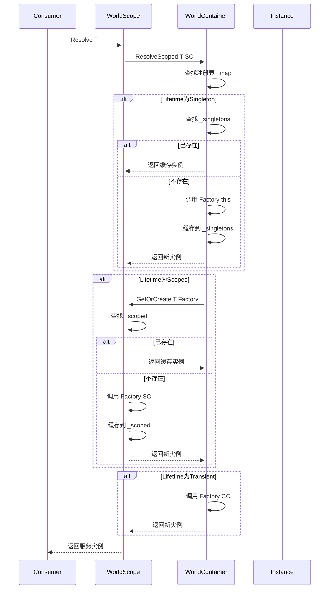
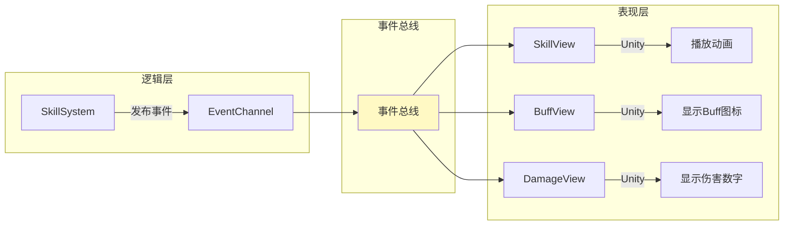
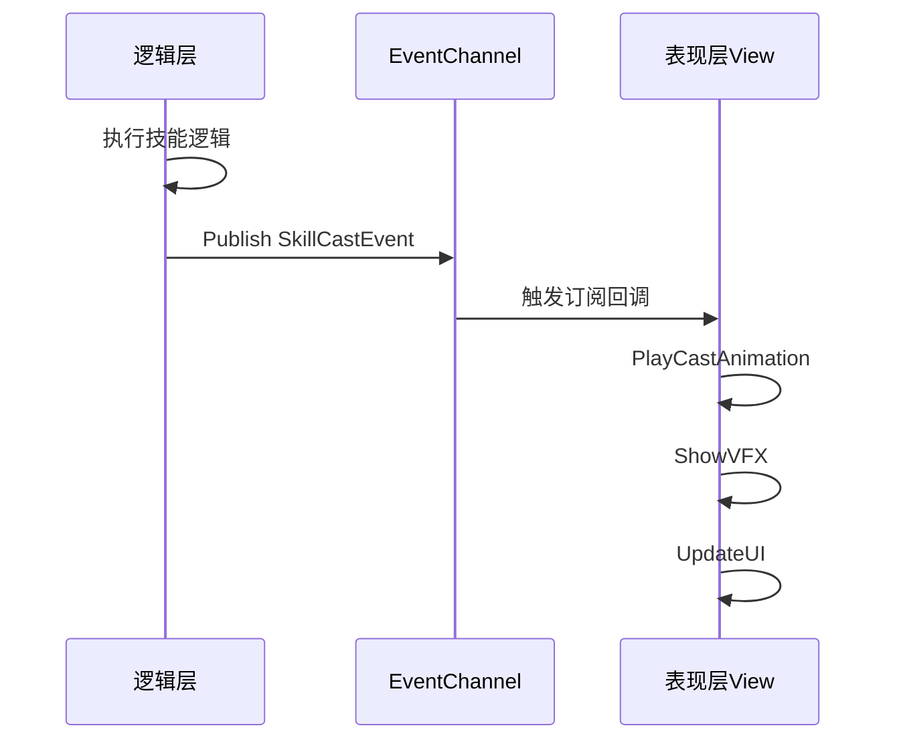
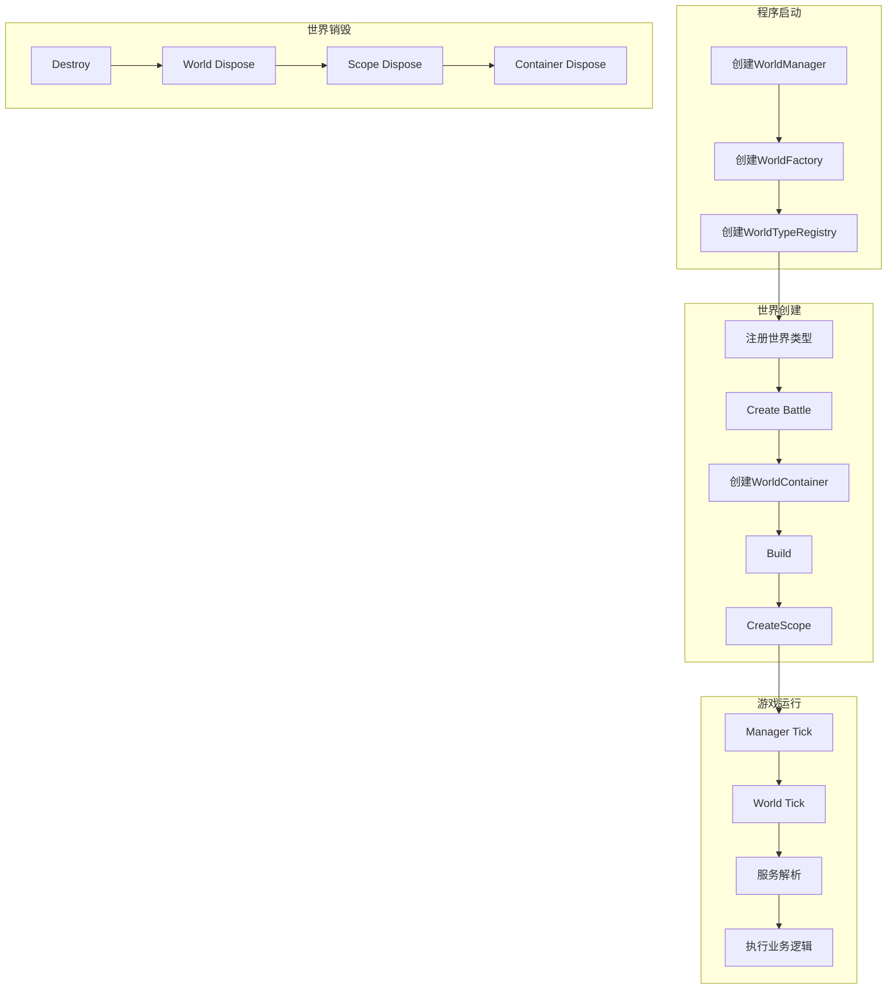
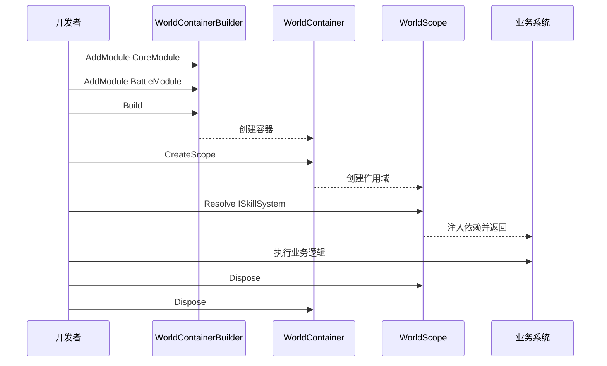

# Ability-Kit World 依赖注入与组合系统开发设计文档

> **阅读对象**：首次接触 Ability-Kit World DI 模块的开发者
>
> **文档目标**：让你理解 World DI 模块"是什么"、"解决了什么问题"、"为什么这样设计"、"怎么使用和扩展"
>
> **前置知识**：建议先阅读 [Host 模块开发设计文档](../com.abilitykit.host.extension/Document/Host模块开发设计文档.md)，了解 World 的基本概念

---

## 一、设计理念：为什么要做 World DI 模块？

### 1.1 逻辑与表现分离的挑战

在游戏开发中，实现逻辑与表现分离是很多团队追求的目标。但真正落地时，会遇到很多实际困难：

| 问题类型 | 具体表现 | 后果 |
|----------|----------|------|
| 依赖关系混乱 | 逻辑层代码到处 `new` 服务对象 | 紧耦合，难以测试 |
| 生命周期混乱 | 不知道什么时候创建、什么时候销毁 | 内存泄漏、状态不一致 |
| 服务接口分散 | 每个系统定义自己的服务接口 | 新人难以理解，维护成本高 |

### 1.2 World DI 的解决方案

World DI 通过**服务容器**统一管理依赖关系和生命周期：

```
┌─────────────────────────────────────────────────────────────────┐
│                         WorldContainer                           │
│  ┌───────────────────────────────────────────────────────────┐  │
│  │  服务注册表 (_map)                                         │  │
│  │  ┌────────────────┐  ┌────────────────┐                   │  │
│  │  │ IWorldClock    │  │ ISkillSystem   │  ...              │  │
│  │  │ Singleton      │  │ Scoped         │                   │  │
│  │  └────────────────┘  └────────────────┘                   │  │
│  └───────────────────────────────────────────────────────────┘  │
│                                                                  │
│  ┌───────────────────────────────────────────────────────────┐  │
│  │  Singleton 实例缓存 (_singletons)                          │  │
│  │  • IWorldClock → WorldClock 实例                         │  │
│  │  • IWorldRandom → SeededRandom 实例                      │  │
│  └───────────────────────────────────────────────────────────┘  │
│                                                                  │
│  ┌────────────────┐  ┌────────────────┐  ┌────────────────┐  │
│  │  WorldScope A   │  │  WorldScope B   │  │  WorldScope N   │  │
│  │  ┌──────────┐  │  │  ┌──────────┐  │  │  ┌──────────┐  │  │
│  │  │ Scoped   │  │  │  │ Scoped   │  │  │  │ Scoped   │  │  │
│  │  │ 缓存     │  │  │  │ 缓存     │  │  │  │ 缓存     │  │  │
│  │  └──────────┘  │  │  └──────────┘  │  │  └──────────┘  │  │
│  └────────────────┘  └────────────────┘  └────────────────┘  │
└─────────────────────────────────────────────────────────────────┘
```

### 1.3 核心设计原则

| 原则 | 解释 | 类比 |
|------|------|------|
| **构造函数注入** | 服务通过构造函数接收依赖，而非自行 Resolve | 零件在组装时安装，而非自行寻找 |
| **窄接口依赖** | 依赖 IWorldResolver 而非具体容器 | USB 接口 vs 具体设备型号 |
| **生命周期隔离** | Singleton 不能依赖 Scoped | 全局变量不能引用局部变量 |
| **模块化注册** | 通过 IWorldModule 组织服务注册 | 乐高积木，按模块组合 |

### 1.4 生命周期与作用域关系

三种生命周期决定了服务的创建时机和缓存位置：

```
                    ┌─────────────────────────────────────────────────────┐
                    │                   生命周期类型                      │
                    ├─────────────────────────────────────────────────────┤
                    │                                                     │
                    │   Transient                                          │
                    │   ┌─────────────────────────────────────────┐     │
                    │   │  每次 Resolve → Factory.Create() → 新实例  │     │
                    │   │  不缓存，GC 自动回收                       │     │
                    │   │  适用：无状态工具类                        │     │
                    │   └─────────────────────────────────────────┘     │
                    │                                                     │
                    │   Scoped                                            │
                    │   ┌─────────────────────────────────────────┐     │
                    │   │  WorldScope 存活期间 → 只创建一次        │     │
                    │   │  缓存在 WorldScope._scoped              │     │
                    │   │  Scope.Dispose() 时释放                  │     │
                    │   │  适用：业务系统、状态服务                 │     │
                    │   └─────────────────────────────────────────┘     │
                    │                                                     │
                    │   Singleton                                          │
                    │   ┌─────────────────────────────────────────┐     │
                    │   │  Container 存活期间 → 全局只创建一次     │     │
                    │   │  缓存在 WorldContainer._singletons    │     │
                    │   │  Container.Dispose() 时释放             │     │
                    │   │  适用：全局共享服务、配置                │     │
                    │   └─────────────────────────────────────────┘     │
                    │                                                     │
                    └─────────────────────────────────────────────────────┘
```

---

## 二、核心概念：从零理解 World DI

### 2.1 什么是"服务（Service）"？

服务是一个实现了特定接口的类，通过依赖注入获得。

```
服务定义 → 服务注册 → 服务解析 → 服务使用
    │            │            │            │
    ▼            ▼            ▼            ▼
┌────────┐   ┌────────┐   ┌────────┐   ┌────────┐
│Interface│──▶│ Impl    │──▶│Descriptor│──▶│ Instance│──▶ 注入到消费者
└────────┘   └────────┘   └────────┘   └────────┘
```

**代码示例**：

```csharp
// 1. 定义服务接口
public interface IWorldClock
{
    float DeltaTime { get; }
    float Time { get; }
    void Tick(float deltaTime);
}

// 2. 实现服务
public sealed class WorldClock : IWorldClock
{
    public float DeltaTime { get; private set; }
    public float Time { get; private set; }

    public void Tick(float deltaTime)
    {
        DeltaTime = deltaTime;
        Time += deltaTime;
    }
}
```

### 2.2 什么是"依赖注入（DI）"？

依赖注入让服务通过**构造函数**接收依赖，而非自行从全局定位器获取。

```
❌ 传统做法（主动获取）          ✅ 依赖注入（被动接收）
                                  
   ServiceA                          ServiceA
      │                                 ▲
      ▼                                 │
   SomeLocator.Get                     │
      ▲                                 │
      │                                 │
   ServiceB                           IWorldClock
                                    (构造函数注入)
```

**代码对比**：

```csharp
// ❌ 传统做法：主动获取 - 耦合！
public class SkillSystem
{
    private IWorldClock _clock;

    public SkillSystem()
    {
        // 自己去找服务
        _clock = SomeGlobalLocator.Get<IWorldClock>();
    }
}

// ✅ 依赖注入：被动接收 - 解耦！
public class SkillSystem
{
    private IWorldClock _clock;

    public SkillSystem(IWorldClock clock)
    {
        _clock = clock;
    }
}
```

### 2.3 生命周期详解

```
┌─────────────────────────────────────────────────────────────────────┐
│                        生命周期对比                                   │
├─────────────────────────────────────────────────────────────────────┤
│                                                                     │
│  ┌─────────────────────────────────────────────────────────────┐   │
│  │  Transient：每次请求创建新实例                                  │   │
│  │                                                             │   │
│  │     请求1 ──▶ [Factory] ──▶ 实例A                            │   │
│  │     请求2 ──▶ [Factory] ──▶ 实例B                            │   │
│  │     请求3 ──▶ [Factory] ──▶ 实例C                            │   │
│  │                                                             │   │
│  │     ✓ 每次都是新对象                                         │   │
│  │     ✗ 无法保持状态                                          │   │
│  └─────────────────────────────────────────────────────────────┘   │
│                                                                     │
│  ┌─────────────────────────────────────────────────────────────┐   │
│  │  Scoped：每个 WorldScope 一个实例                             │   │
│  │                                                             │   │
│  │     ┌─────────────┐      ┌─────────────┐                    │   │
│  │     │  Scope A    │      │  Scope B    │                    │   │
│  │     │  实例A      │      │  实例B       │                    │   │
│  │     └─────────────┘      └─────────────┘                    │   │
│  │                                                             │   │
│  │     ✓ Scope 内存活，复用实例                                  │   │
│  │     ✓ 不同 Scope 隔离                                        │   │
│  └─────────────────────────────────────────────────────────────┘   │
│                                                                     │
│  ┌─────────────────────────────────────────────────────────────┐   │
│  │  Singleton：全局唯一实例                                      │   │
│  │                                                             │   │
│  │     Container ──▶ [Factory] ──▶ 实例 (全局唯一)              │   │
│  │                                                             │   │
│  │     ✓ 全局共享，节省内存                                      │   │
│  │     ✗ 需要注意线程安全                                       │   │
│  └─────────────────────────────────────────────────────────────┘   │
│                                                                     │
└─────────────────────────────────────────────────────────────────────┘
```

### 2.4 关键名词解释

| 名词 | 通俗解释 | 类比 |
|------|----------|------|
| **Service** | 提供特定功能的接口实现 | 公司部门 |
| **Container** | 管理所有服务注册和实例的容器 | 部门档案室 |
| **Scope** | 服务的作用域边界 | 项目组 |
| **Resolver** | 从容器获取服务的工具 | 行政助理 |
| **Module** | 一组相关服务的组合 | 部门集合 |
| **Lifetime** | 服务的存活时间策略 | 员工合同类型 |

---

## 三、核心架构

### 3.1 整体架构图

```
┌─────────────────────────────────────────────────────────────────────────┐
│                           World DI 整体架构                               │
│                                                                         │
│   ┌─────────────────────────────────────────────────────────────────┐   │
│   │                    WorldContainerBuilder                          │   │
│   │                                                                 │   │
│   │   builder.AddModule(new BattleModule());                         │   │
│   │   builder.AddModule(new CombatModule());                        │   │
│   │   builder.RegisterType<IService, Impl>(Lifetime.Scoped);       │   │
│   │                                                                 │   │
│   │                              ▼ Build()                          │   │
│   └─────────────────────────────────────────────────────────────────┘   │
│                                    │                                     │
│                                    ▼                                     │
│   ┌─────────────────────────────────────────────────────────────────┐   │
│   │                       WorldContainer                              │   │
│   │                       (Root 容器)                                │   │
│   │                                                                 │   │
│   │   ┌─────────────────────────────────────────────────────────┐   │   │
│   │   │                  服务注册表                               │   │   │
│   │   │   ┌────────────────┐  ┌────────────────┐               │   │   │
│   │   │   │ IWorldClock    │  │ IDamageService │  ...          │   │   │
│   │   │   │ Singleton      │  │ Scoped         │               │   │   │
│   │   │   └────────────────┘  └────────────────┘               │   │   │
│   │   └─────────────────────────────────────────────────────────┘   │   │
│   │                                                                 │   │
│   │   ┌─────────────────────────────────────────────────────────┐   │   │
│   │   │              Singleton 实例缓存                           │   │   │
│   │   │   (容器级别唯一)                                          │   │   │
│   │   └─────────────────────────────────────────────────────────┘   │   │
│   │                                                                 │   │
│   │   ┌─────────────────────────────────────────────────────────┐   │   │
│   │   │          CreateScope() → WorldScope                      │   │   │
│   │   │                                                        │   │   │
│   │   │   Scope1 ──── Scope2 ──── Scope3 ──── ...              │   │   │
│   │   │   (World A)   (World B)   (World C)                    │   │   │
│   │   │                                                        │   │   │
│   │   │   ┌─────────────────────────────────────────────────┐ │   │   │
│   │   │   │              WorldScope                          │ │   │   │
│   │   │   │              (Scoped 容器)                       │ │   │   │
│   │   │   │   ┌─────────────────────────────────────────┐ │ │   │   │
│   │   │   │   │           Scoped 实例缓存               │ │ │   │   │
│   │   │   │   │   (每个 Scope 一份)                     │ │ │   │   │
│   │   │   │   └─────────────────────────────────────────┘ │ │   │   │
│   │   │   └─────────────────────────────────────────────────┘ │   │   │
│   │   └─────────────────────────────────────────────────────────┘   │   │
│   └─────────────────────────────────────────────────────────────────┘   │
│                                                                         │
└─────────────────────────────────────────────────────────────────────────┘
```

### 3.2 服务解析完整流程



### 3.3 生命周期隔离约束

```
┌─────────────────────────────────────────────────────────────────────┐
│                    生命周期隔离约束                                  │
│                                                                     │
│   ❌ Singleton 不能依赖 Scoped                                      │
│                                                                     │
│   ┌─────────────────────────────────────────────────────────────┐   │
│   │  原因分析：                                                  │   │
│   │                                                             │   │
│   │   World A 的 Scope ──┐                                      │   │
│   │   (Scoped 服务 S1)   │                                      │   │
│   │                      │ 如果 Singleton 捕获了 S1              │   │
│   │                      ▼                                      │   │
│   │   World B 的 Scope ──┴─ 错误！World B 的 S1 ≠ World A 的 S1│   │
│   │   (Scoped 服务 S1)   (生命周期混乱)                          │   │
│   │                                                             │   │
│   └─────────────────────────────────────────────────────────────┘   │
│                                                                     │
│   ✅ 正确做法：Singleton 依赖工厂或提供器                            │
│                                                                     │
│   ┌─────────────────────────────────────────────────────────────┐   │
│   │  方案1: 依赖工厂函数                                        │   │
│   │  ┌─────────────────────────────────────────────────────┐ │   │
│   │   public class SingletonService                        │ │   │
│   │   {                                                   │ │   │
│   │       public SingletonService(Func<IScopedService> f) │ │   │
│   │       {                                               │ │   │
│   │           _factory = f;                               │ │   │
│   │       }                                               │ │   │
│   │   }                                                   │ │   │
│   │   └─────────────────────────────────────────────────────┘ │   │
│   │                                                             │   │
│   │  方案2: 依赖提供器                                          │   │
│   │  ┌─────────────────────────────────────────────────────┐ │   │
│   │   public interface IScopedServiceProvider             │ │   │
│   │   {                                                   │ │   │
│   │       IScopedService Get();                           │ │   │
│   │   }                                                   │ │   │
│   │   └─────────────────────────────────────────────────────┘ │   │
│   └─────────────────────────────────────────────────────────────┘   │
│                                                                     │
└─────────────────────────────────────────────────────────────────────┘
```

### 3.4 服务销毁流程

```
┌─────────────────────────────────────────────────────────────────────┐
│                       服务销毁流程                                    │
│                                                                     │
│   WorldScope.Dispose()                                              │
│          │                                                          │
│          ▼                                                          │
│   ┌─────────────────────────────────────────────────────────────┐   │
│   │  按创建逆序释放 Scoped 实例                                   │   │
│   │                                                             │   │
│   │   创建顺序:    A → B → C → D                                │   │
│   │   销毁顺序:    D → C → B → A  (逆序)                         │   │
│   │                                                             │   │
│   │   原因：后面的服务可能依赖前面的服务                           │   │
│   │   ┌─────────────────────────────────────────────────────┐ │   │
│   │   │  A 依赖 B 依赖 C 依赖 D                                │ │   │
│   │   │  创建顺序:  A → B → C → D                             │ │   │
│   │   │  销毁顺序:  D → C → B → A (必须逆序)                   │ │   │
│   │   └─────────────────────────────────────────────────────┘ │   │
│   └─────────────────────────────────────────────────────────────┘   │
│          │                                                          │
│          ▼                                                          │
│   ┌─────────────────────────────────────────────────────────────┐   │
│   │  WorldContainer.Dispose()                                    │   │
│   │                                                             │   │
│   │   1. 释放所有 Singleton 实例（逆序）                         │   │
│   │   2. 释放注册表                                              │   │
│   │   3. 容器标记为 disposed                                     │   │
│   │                                                             │   │
│   └─────────────────────────────────────────────────────────────┘   │
│                                                                     │
└─────────────────────────────────────────────────────────────────────┘
```

---

## 四、核心模块详解

### 4.1 WorldContainer - 根容器

**代码位置**：`Runtime/World/DI/WorldContainer.cs`

**通俗解释**：WorldContainer 是"服务档案室"，管理所有服务的注册和 Singleton 实例。

```
┌────────────────────────────────────────────────────────────────┐
│                   WorldContainer 结构                             │
│                                                                │
│   核心字段：                                                    │
│                                                                │
│   _map: Dictionary<Type, WorldServiceDescriptor>               │
│      └── 服务类型 → 注册信息 的映射                              │
│                                                                │
│   _singletons: Dictionary<Type, object>                        │
│      └── Singleton 实例缓存                                    │
│                                                                │
│   _initialized: HashSet<object>                                 │
│      └── 已初始化的实例（防重复）                                │
│                                                                │
│   _singletonCreationStack: Stack<Type>                          │
│      └── 检测循环依赖和生命周期穿透                              │
│                                                                │
├────────────────────────────────────────────────────────────────┤
│   核心方法：                                                    │
│                                                                │
│   Resolve(Type) → object                                        │
│      └── 解析服务（Singleton/Transient）                         │
│                                                                │
│   ResolveScoped(Type, WorldScope) → object                      │
│      └── 解析 Scoped 服务                                       │
│                                                                │
│   CreateScope() → WorldScope                                    │
│      └── 创建新的 Scope                                         │
│                                                                │
│   IsRegistered(Type) → bool                                     │
│      └── 检查服务是否已注册                                      │
│                                                                │
└────────────────────────────────────────────────────────────────┘
```

**关键约束检查**：

```
┌────────────────────────────────────────────────────────────────┐
│                    生命周期穿透检测                                │
│                                                                │
│   Resolve调用                                                   │
│       │                                                        │
│       ▼                                                        │
│   入栈 _singletonCreationStack                                  │
│       │                                                        │
│       ▼                                                        │
│   调用 Factory                                                  │
│       │                                                        │
│       ▼                                                        │
│   ┌──────────────────────────────────────────────────────┐     │
│   │  工厂内部调用 Resolve?                                │     │
│   │       │                                              │     │
│   │       ├───▶ Scoped ──▶ ❌ 生命周期穿透异常            │     │
│   │       │                                              │     │
│   │       ├───▶ Singleton ──▶ ✓ 允许                     │     │
│   │       │                                              │     │
│   │       └───▶ Transient ──▶ ✓ 允许                     │     │
│   └──────────────────────────────────────────────────────┘     │
│       │                                                        │
│       ▼                                                        │
│   出栈 _singletonCreationStack                                  │
│                                                                │
└────────────────────────────────────────────────────────────────┘
```

### 4.2 WorldScope - 作用域容器

**代码位置**：`Runtime/World/DI/WorldScope.cs`

**通俗解释**：WorldScope 是"项目组档案柜"，管理该 World 专属的 Scoped 服务。

```
┌────────────────────────────────────────────────────────────────┐
│                    WorldScope 结构                               │
│                                                                │
│   核心字段：                                                    │
│                                                                │
│   _root: WorldContainer                                        │
│      └── 引用根容器                                             │
│                                                                │
│   _scoped: Dictionary<Type, object>                            │
│      └── Scoped 实例缓存                                       │
│                                                                │
│   _disposeOrder: List<object>                                  │
│      └── 按创建顺序记录实例（用于逆序销毁）                       │
│                                                                │
│   _disposed: bool                                              │
│      └── 销毁标记                                              │
│                                                                │
├────────────────────────────────────────────────────────────────┤
│   核心方法：                                                    │
│                                                                │
│   Resolve(Type) → object                                        │
│      └── 解析服务（优先 Scoped，委托 Singleton）                 │
│                                                                │
│   TryResolve(Type, out object) → bool                          │
│      └── 安全解析（不抛异常）                                   │
│                                                                │
│   GetOrCreate(Type, Func<object>) → object                      │
│      └── 内部方法：获取或创建 Scoped 实例                       │
│                                                                │
│   Dispose()                                                    │
│      └── 按逆序释放所有 Scoped 实例                            │
│                                                                │
├────────────────────────────────────────────────────────────────┤
│   内置类型映射：                                                │
│                                                                │
│   IWorldServiceContainer ──▶ 返回 _root                        │
│   IWorldResolver ──▶ 返回 this                                 │
│   IWorldScope ──▶ 返回 this                                    │
│                                                                │
└────────────────────────────────────────────────────────────────┘
```

### 4.3 WorldContainerBuilder - 构建器

**代码位置**：`Runtime/World/DI/WorldContainerBuilder.cs`

**通俗解释**：Builder 是"装修队"，负责把各种服务组装到容器里。

```
┌─────────────────────────────────────────────────────────────────────┐
│                   WorldContainerBuilder 方法                          │
│                                                                     │
│   服务注册方法：                                                     │
│                                                                     │
│   Register(Type, Lifetime, Func<IWorldResolver, object>)              │
│      └── 最基础的注册方法                                            │
│                                                                     │
│   Register<TService>(Lifetime, Func<IWorldResolver, T>)              │
│      └── 泛型版本的注册                                             │
│                                                                     │
│   RegisterType<TService, TImpl>(Lifetime)                            │
│      └── 注册实现类型，容器自动构造                                   │
│                                                                     │
│   RegisterService<TService, TImpl>(Lifetime)                         │
│      └── IService 专用版本                                          │
│                                                                     │
│   RegisterServiceAlias<TService, TImpl>(Lifetime)                    │
│      └── 别名注册：直接转发到另一个服务                              │
│                                                                     │
│   模块方法：                                                         │
│                                                                     │
│   AddModule(IWorldModule)                                            │
│      └── 添加模块（模块内批量注册）                                  │
│                                                                     │
│   辅助方法：                                                         │
│                                                                     │
│   RegisterInstance<T>(T instance)                                    │
│      └── 注册已有实例（始终为 Singleton）                            │
│                                                                     │
│   TryRegister / TryRegisterType                                     │
│      └── 条件注册：已存在则忽略                                      │
│                                                                     │
└─────────────────────────────────────────────────────────────────────┘

┌─────────────────────────────────────────────────────────────────────┐
│                        注册方法对比                                   │
├─────────────────────────────────────────────────────────────────────┤
│                                                                     │
│   Register          ──▶  后注册覆盖先注册                            │
│                                                                     │
│   TryRegister       ──▶  先注册生效，后注册忽略                       │
│                                                                     │
│   RegisterType      ──▶  自动构造实现类型                            │
│                                                                     │
│   RegisterInstance  ──▶  注册已有实例，始终 Singleton                 │
│                                                                     │
└─────────────────────────────────────────────────────────────────────┘
```

### 4.4 WorldActivator - 实例创建器

**代码位置**：`Runtime/World/DI/WorldActivator.cs`

**通俗解释**：Activator 是"装配工人"，负责用反射创建服务实例并选择最合适的构造函数。

```
┌─────────────────────────────────────────────────────────────────────┐
│                     WorldActivator 逻辑                              │
│                                                                     │
│   Create(Type implType, IWorldResolver resolver)                    │
│                                                                     │
│   ┌───────────────────────────────────────────────────────────────┐ │
│   │  Step 1: 获取或构建构造函数计划                               │ │
│   │   - 从缓存获取（ConcurrentDictionary）                       │ │
│   │   - 或扫描所有 public 构造函数                               │ │
│   │   - 按参数数量降序排列                                       │ │
│   └──────────────────────────────────────────────────────────────┘ │
│                              │                                      │
│                              ▼                                      │
│   ┌───────────────────────────────────────────────────────────────┐ │
│   │  Step 2: 尝试每个构造函数                                     │ │
│   │   - 按参数数量从多到少尝试                                    │ │
│   │   - 对每个参数调用 TryResolve                                 │ │
│   │   - 记录缺失的依赖信息                                       │ │
│   └──────────────────────────────────────────────────────────────┘ │
│                              │                                      │
│                              ▼                                      │
│   ┌───────────────────────────────────────────────────────────────┐ │
│   │  Step 3: 选择最佳匹配并创建                                    │ │
│   │   - 选择参数最多且全部可解析的构造函数                        │ │
│   │   - 调用 ConstructorInfo.Invoke(args)                         │ │
│   │   - 如无构造函数满足，抛异常并输出诊断信息                    │ │
│   └──────────────────────────────────────────────────────────────┘ │
│                                                                     │
└─────────────────────────────────────────────────────────────────────┘

┌─────────────────────────────────────────────────────────────────────┐
│                        构造函数选择示例                               │
├─────────────────────────────────────────────────────────────────────┤
│                                                                     │
│   // 假设有以下构造函数：                                           │
│                                                                     │
│   public class SkillSystem                                         │
│   {                                                                │
│       public SkillSystem(IWorldClock clock);           // 1 参数    │
│       public SkillSystem();                            // 0 参数    │
│   }                                                                │
│                                                                     │
│   // 选择过程：                                                     │
│   // 1. 尝试 SkillSystem(IWorldClock) → IWorldClock 已注册 ✓        │
│   // 2. 选择此构造函数（参数最多且可解析）                           │
│                                                                     │
└─────────────────────────────────────────────────────────────────────┘

┌─────────────────────────────────────────────────────────────────────┐
│                        诊断信息示例                                   │
├─────────────────────────────────────────────────────────────────────┤
│                                                                     │
│   No suitable constructor found for SkillSystem.                     │
│   Make sure dependencies are registered.                             │
│                                                                     │
│   Missing dependencies by constructor:                              │
│     ctor(IWorldClock, IDamageService) missing: IDamageService       │
│     ctor(IWorldClock) missing: IWorldClock                          │
│                                                                     │
└─────────────────────────────────────────────────────────────────────┘
```

### 4.5 IWorldModule - 模块接口

**代码位置**：`Runtime/World/DI/IWorldModule.cs`

**通俗解释**：Module 是"装修方案"，定义了一组相关服务的注册方式。

```
┌─────────────────────────────────────────────────────────────────────┐
│                     IWorldModule 接口                                │
│                                                                     │
│   public interface IWorldModule                                      │
│   {                                                                │
│       void Configure(WorldContainerBuilder builder);                  │
│   }                                                                │
│                                                                     │
└─────────────────────────────────────────────────────────────────────┘

┌─────────────────────────────────────────────────────────────────────┐
│                        模块组合示例                                   │
├─────────────────────────────────────────────────────────────────────┤
│                                                                     │
│   var container = new WorldContainerBuilder()                       │
│       .AddModule(new CoreModule())     // 基础服务                  │
│       .AddModule(new CombatModule())   // 战斗服务                  │
│       .AddModule(new SkillModule())   // 技能服务                  │
│       .Build();                                                     │
│                                                                     │
└─────────────────────────────────────────────────────────────────────┘
```

### 4.6 AttributeWorldServicesModule - 属性扫描注册

**代码位置**：`Runtime/World/Services/Attributes/AttributeWorldServicesModule.cs`

**通俗解释**：AttributeModule 是"自动装修队"，通过扫描特性自动注册服务。

```
┌─────────────────────────────────────────────────────────────────────┐
│                    属性注册示例                                       │
│                                                                     │
│   定义服务时添加特性：                                                │
│   ┌─────────────────────────────────────────────────────────────┐ │
│   │  [WorldService(typeof(IWorldClock), WorldLifetime.Singleton)]│ │
│   │  public sealed class WorldClock : IWorldClock                │ │
│   │  { ... }                                                    │ │
│   │                                                             │ │
│   │  [WorldService(typeof(ISkillSystem), WorldLifetime.Scoped)]  │ │
│   │  public sealed class SkillSystem : ISkillSystem              │ │
│   │  { ... }                                                    │ │
│   └─────────────────────────────────────────────────────────────┘ │
│                                                                     │
│   使用模块扫描注册：                                                  │
│   ┌─────────────────────────────────────────────────────────────┐ │
│   │  builder.AddModule(new AttributeWorldServicesModule(         │ │
│   │      profile: WorldServiceProfile.All,                     │ │
│   │      assemblies: new[] { typeof(MyAssembly).Assembly },    │ │
│   │      namespacePrefixes: new[] { "MyGame.Runtime." }        │ │
│   │  ));                                                        │ │
│   └─────────────────────────────────────────────────────────────┘ │
│                                                                     │
└─────────────────────────────────────────────────────────────────────┘

┌─────────────────────────────────────────────────────────────────────┐
│                       Profile 枚举说明                                │
├─────────────────────────────────────────────────────────────────────┤
│                                                                     │
│   [Flags]                                                          │
│   public enum WorldServiceProfile                                   │
│   {                                                               │
│       Default = 1 << 0,   // 默认环境                              │
│       Client  = 1 << 1,   // 客户端专用                            │
│       Server  = 1 << 2,   // 服务器专用                            │
│       All     = Default | Client | Server  // 所有环境             │
│   }                                                               │
│                                                                     │
└─────────────────────────────────────────────────────────────────────┘
```

---

## 五、与逻辑表现分离的结合

### 5.1 逻辑层与表现层数据流



### 5.2 表现层服务订阅示例



### 5.3 逻辑层服务架构

```
┌─────────────────────────────────────────────────────────────────────┐
│                    逻辑层服务架构                                    │
│                                                                     │
│   ┌─────────────────────────────────────────────────────────────┐ │
│   │                    World (逻辑世界)                           │ │
│   │                                                             │ │
│   │   ┌─────────────────────────────────────────────────────┐   │ │
│   │   │           WorldScope (服务容器)                      │   │ │
│   │   │                                                     │   │ │
│   │   │   ┌─────────────────────────────────────────────┐ │   │ │
│   │   │   │  注册的服务：                                │ │   │ │
│   │   │   │                                             │ │   │ │
│   │   │   │  • IWorldClock     (Singleton)             │ │   │ │
│   │   │   │  • IWorldRandom    (Singleton)             │ │   │ │
│   │   │   │  • ISkillLibrary   (Singleton)             │ │   │ │
│   │   │   │  • ISkillSystem    (Scoped)                │ │   │ │
│   │   │   │  • IBuffSystem     (Scoped)                │ │   │ │
│   │   │   │  • IDamageService  (Scoped)                │ │   │ │
│   │   │   │                                             │ │   │ │
│   │   │   └─────────────────────────────────────────────┘ │   │ │
│   │   │                                                     │   │ │
│   │   └─────────────────────────────────────────────────────┘   │ │
│   │                                                             │ │
│   └─────────────────────────────────────────────────────────────┘ │
│                                                                     │
└─────────────────────────────────────────────────────────────────────┘
```

---

## 六、核心服务接口

### 6.1 服务接口关系

```
┌─────────────────────────────────────────────────────────────────────┐
│                      接口继承关系                                     │
├─────────────────────────────────────────────────────────────────────┤
│                                                                     │
│                          IService                                   │
│                          (基础)                                     │
│                             ▲                                       │
│              ┌──────────────┴──────────────┐                       │
│              │                              │                        │
│              ▼                              ▼                        │
│    IWorldInitializable              IWorldScope                     │
│         (可初始化)                    (作用域)                     │
│                                               ▲                      │
│              ┌──────────────────────────────┘                       │
│              │                                                      │
│              ▼                                                      │
│         IWorldScope                                                 │
│              │                                                      │
│              ├──▶ IWorldResolver (解析能力)                          │
│              └──▶ IWorldServiceContainer (容器能力)                   │
│                                                                     │
├─────────────────────────────────────────────────────────────────────┤
│                                                                     │
│   IService                                                         │
│   └─ OnInit(IWorldResolver)                                        │
│   └─ Dispose()                                                     │
│                                                                     │
│   IWorldResolver                                                   │
│   ├─ Resolve<T>()                                                  │
│   └─ TryResolve<T>(out T)                                          │
│                                                                     │
│   IWorldScope                                                      │
│   └─ 继承 IWorldResolver + IService                                │
│                                                                     │
│   IWorldServiceContainer                                           │
│   ├─ IsRegistered<T>()                                            │
│   └─ RegisteredServiceTypes                                        │
│                                                                     │
└─────────────────────────────────────────────────────────────────────┘
```

### 6.2 IWorldClock - 世界时钟

**代码位置**：`Runtime/World/Services/IWorldClock.cs`

```
┌─────────────────────────────────────────────────────────────────────┐
│                    IWorldClock 接口                                  │
├─────────────────────────────────────────────────────────────────────┤
│                                                                     │
│   属性：                                                            │
│                                                                     │
│   DeltaTime: float                                                  │
│      └── 距离上一帧的时间（秒）                                       │
│                                                                     │
│   Time: float                                                       │
│      └── 世界启动后的总时间（秒）                                     │
│                                                                     │
│   方法：                                                            │
│                                                                     │
│   Tick(float deltaTime)                                             │
│      └── 每帧调用，更新时间和增量时间                                 │
│                                                                     │
├─────────────────────────────────────────────────────────────────────┤
│                        调用示例                                      │
├─────────────────────────────────────────────────────────────────────┤
│                                                                     │
│   // 每帧更新                                                       │
│   var clock = scope.Resolve<IWorldClock>();                         │
│   clock.Tick(deltaTime);                                            │
│                                                                     │
│   // 读取时间                                                       │
│   Debug.Log($"当前时间: {clock.Time}s");                            │
│   Debug.Log($"上一帧: {clock.DeltaTime}s");                         │
│                                                                     │
└─────────────────────────────────────────────────────────────────────┘
```

### 6.3 IWorldRandom - 世界随机数

**代码位置**：`Runtime/World/Services/IWorldRandom.cs`

```
┌─────────────────────────────────────────────────────────────────────┐
│                   IWorldRandom 接口                                   │
├─────────────────────────────────────────────────────────────────────┤
│                                                                     │
│   方法：                                                            │
│                                                                     │
│   NextInt(int min, int max) → int                                  │
│      └── 返回 [min, max) 范围内的整数                               │
│                                                                     │
│   NextFloat01() → float                                            │
│      └── 返回 [0, 1) 范围的浮点数                                    │
│                                                                     │
├─────────────────────────────────────────────────────────────────────┤
│                        确定性设计                                    │
├─────────────────────────────────────────────────────────────────────┤
│                                                                     │
│   • 可通过种子创建相同序列                                           │
│   • 用于帧同步：保证各端随机结果一致                                 │
│                                                                     │
│   ┌─────────────────────────────────────────────────────────────┐  │
│   │  种子相同 → 随机序列相同 → 网络同步时各端行为一致             │  │
│   └─────────────────────────────────────────────────────────────┘  │
│                                                                     │
└─────────────────────────────────────────────────────────────────────┘
```

---

## 七、世界管理器

### 7.1 IWorldManager 工作流程

```
┌─────────────────────────────────────────────────────────────────────┐
│                   IWorldManager 结构                                  │
├─────────────────────────────────────────────────────────────────────┤
│                                                                     │
│   核心方法：                                                        │
│                                                                     │
│   Create(WorldCreateOptions) → IWorld                               │
│      └── 创建新世界                                                │
│                                                                     │
│   TryGet(WorldId) → (bool, IWorld)                                  │
│      └── 查找世界                                                  │
│                                                                     │
│   Destroy(WorldId) → bool                                           │
│      └── 销毁世界                                                  │
│                                                                     │
│   Tick(float deltaTime)                                             │
│      └── 驱动所有世界更新                                          │
│                                                                     │
│   DisposeAll()                                                      │
│      └── 销毁所有世界                                              │
│                                                                     │
├─────────────────────────────────────────────────────────────────────┤
│                        工作流程                                      │
├─────────────────────────────────────────────────────────────────────┤
│                                                                     │
│   创建世界:                                                         │
│   ┌─────────────────────────────────────────────────────────────┐  │
│   │  Create options                                            │  │
│   │      │                                                     │  │
│   │      ▼                                                     │  │
│   │  Factory.Create ──▶ World.Initialize ──▶ 添加到_worlds    │  │
│   └─────────────────────────────────────────────────────────────┘  │
│                                                                     │
│   驱动Tick:                                                         │
│   ┌─────────────────────────────────────────────────────────────┐  │
│   │  Manager.Tick(dt)                                          │  │
│   │      │                                                     │  │
│   │      ▼                                                     │  │
│   │  遍历所有 World ──▶ World.Tick(dt) ──▶ 完成本帧            │  │
│   └─────────────────────────────────────────────────────────────┘  │
│                                                                     │
│   销毁世界:                                                         │
│   ┌─────────────────────────────────────────────────────────────┐  │
│   │  Destroy(worldId)                                           │  │
│   │      │                                                     │  │
│   │      ▼                                                     │  │
│   │  存在? ──▶ World.Dispose ──▶ 从_worlds移除                  │  │
│   └─────────────────────────────────────────────────────────────┘  │
│                                                                     │
└─────────────────────────────────────────────────────────────────────┘
```

### 7.2 WorldTypeRegistry - 世界类型注册表

**代码位置**：`Runtime/World/Management/WorldTypeRegistry.cs`

```
┌─────────────────────────────────────────────────────────────────────┐
│                 WorldTypeRegistry 结构                               │
├─────────────────────────────────────────────────────────────────────┤
│                                                                     │
│   Register(string worldType, Func<WorldCreateOptions, IWorld> f)   │
│      └── 注册世界创建函数                                           │
│                                                                     │
│   Create(WorldCreateOptions) → IWorld                               │
│      └── 按 WorldType 分发创建                                     │
│                                                                     │
├─────────────────────────────────────────────────────────────────────┤
│                        使用示例                                      │
├─────────────────────────────────────────────────────────────────────┤
│                                                                     │
│   registry                                                          │
│       .Register("Battle", options =>                               │
│           new BattleWorld(options))                                 │
│       .Register("Lobby", options =>                                │
│           new LobbyWorld(options));                                 │
│                                                                     │
│   var world = registry.Create(new WorldCreateOptions                 │
│   {                                                                │
│       Id = new WorldId("match_001"),                               │
│       WorldType = "Battle"                                         │
│   });                                                              │
│                                                                     │
└─────────────────────────────────────────────────────────────────────┘
```

### 7.3 完整生命周期图



---

## 八、扩展指南：如何编写自己的服务

### 8.1 服务开发完整流程

```
┌─────────────────────────────────────────────────────────────────────┐
│                    服务开发步骤                                       │
│                                                                     │
│   Step 1: 定义服务接口                                              │
│   ┌─────────────────────────────────────────────────────────────┐  │
│   │  public interface IMyService                               │  │
│   │  {                                                          │  │
│   │      void DoSomething();                                   │  │
│   │      int GetValue();                                       │  │
│   │  }                                                          │  │
│   └─────────────────────────────────────────────────────────────┘  │
│                                                                     │
│   Step 2: 实现服务                                                  │
│   ┌─────────────────────────────────────────────────────────────┐  │
│   │  [WorldService(typeof(IMyService), WorldLifetime.Scoped)]  │  │
│   │  public sealed class MyService : IMyService,              │  │
│   │                                IWorldInitializable         │  │
│   │  {                                                         │  │
│   │      private IWorldClock _clock;                            │  │
│   │                                                             │  │
│   │      // 构造函数注入                                        │  │
│   │      public MyService(IWorldClock clock)                   │  │
│   │      {                                                     │  │
│   │          _clock = clock;                                   │  │
│   │      }                                                     │  │
│   │                                                             │  │
│   │      // 初始化方法（可选）                                   │  │
│   │      public void OnInit(IWorldResolver services)           │  │
│   │      {                                                     │  │
│   │          // 访问其他服务                                     │  │
│   │      }                                                     │  │
│   │                                                             │  │
│   │      public void DoSomething() { ... }                     │  │
│   │      public int GetValue() { ... }                         │  │
│   │  }                                                         │  │
│   └─────────────────────────────────────────────────────────────┘  │
│                                                                     │
│   Step 3: 注册服务                                                  │
│   ┌─────────────────────────────────────────────────────────────┐  │
│   │  // 方式1: 显式注册                                         │  │
│   │  builder.RegisterType<IMyService, MyService>(              │  │
│   │      WorldLifetime.Scoped);                                │  │
│   │                                                              │  │
│   │  // 方式2: 通过模块注册                                     │  │
│   │  builder.AddModule(new MyServiceModule());                  │  │
│   └─────────────────────────────────────────────────────────────┘  │
│                                                                     │
└─────────────────────────────────────────────────────────────────────┘
```

### 8.2 模块开发流程

```
┌─────────────────────────────────────────────────────────────────────┐
│                     模块开发示例                                      │
│                                                                     │
│   public class MyGameModule : IWorldModule                          │
│   {                                                                │
│       public void Configure(WorldContainerBuilder builder)          │
│       {                                                            │
│           // 时钟服务（Singleton）                                   │
│           builder.RegisterType<IWorldClock, WorldClock>(            │
│               WorldLifetime.Singleton);                             │
│                                                                     │
│           // 随机数服务（Singleton，支持种子）                        │
│           builder.RegisterType<IWorldRandom, SeededRandom>(        │
│               WorldLifetime.Singleton);                             │
│                                                                     │
│           // 业务服务（Scoped）                                      │
│           builder.RegisterType<ISkillSystem, SkillSystem>(         │
│               WorldLifetime.Scoped);                               │
│           builder.RegisterType<IBuffSystem, BuffSystem>(           │
│               WorldLifetime.Scoped);                               │
│           builder.RegisterType<IDamageService,                      │
│               DamageService>(WorldLifetime.Scoped);                 │
│       }                                                            │
│   }                                                                │
│                                                                     │
└─────────────────────────────────────────────────────────────────────┘

┌─────────────────────────────────────────────────────────────────────┐
│                        添加到构建器                                   │
├─────────────────────────────────────────────────────────────────────┤
│                                                                     │
│   var container = new WorldContainerBuilder()                       │
│       .AddModule(new CoreModule())     // 先添加基础模块            │
│       .AddModule(new MyGameModule())   // 再添加业务模块            │
│       .Build();                                                     │
│                                                                     │
└─────────────────────────────────────────────────────────────────────┘
```

---

## 九、诊断与排查

### 9.1 常见错误与解决方案

| 错误 | 表现 | 原因 | 解决 |
|------|------|------|------|
| **Service not registered** | `InvalidOperationException: Service not registered` | 服务未注册或注册到了错误类型 | 检查模块是否添加、注册类型是否匹配 |
| **No suitable constructor** | 抛出异常列出缺失依赖 | 构造函数参数未注册 | 添加缺失的服务注册 |
| **Singleton cannot resolve scoped** | 生命周期穿透异常 | Singleton 依赖了 Scoped 服务 | 改为依赖工厂或提供器 |
| **ObjectDisposedException** | 已释放的容器被访问 | 容器/Scope 已 Dispose | 检查生命周期管理 |

### 9.2 错误诊断流程

```
┌─────────────────────────────────────────────────────────────────────┐
│                      错误诊断流程                                     │
├─────────────────────────────────────────────────────────────────────┤
│                                                                     │
│   Service not registered                                            │
│        │                                                           │
│        ▼                                                           │
│   ┌─────────────────────────────────────────────────────────────┐  │
│   │  检查注册步骤:                                               │  │
│   │  1. 模块是否已 AddModule?                                    │  │
│   │  2. 服务是否实现了接口?                                      │  │
│   │  3. 注册的接口类型是否匹配?                                  │  │
│   └─────────────────────────────────────────────────────────────┘  │
│                                                                     │
│   ──────────────────────────────────────────────────────────────── │
│                                                                     │
│   No suitable constructor                                           │
│        │                                                           │
│        ▼                                                           │
│   ┌─────────────────────────────────────────────────────────────┐  │
│   │  检查构造函数:                                               │  │
│   │  1. 查看诊断信息中的 missing dependencies                    │  │
│   │  2. 添加缺失的服务注册                                       │  │
│   │  3. 或使用 [Inject] 标记可选依赖                              │  │
│   └─────────────────────────────────────────────────────────────┘  │
│                                                                     │
│   ──────────────────────────────────────────────────────────────── │
│                                                                     │
│   Singleton cannot resolve scoped                                   │
│        │                                                           │
│        ▼                                                           │
│   ┌─────────────────────────────────────────────────────────────┐  │
│   │  检查生命周期:                                               │  │
│   │  1. Singleton 服务不能直接依赖 Scoped 服务                   │  │
│   │  2. 改为依赖 Func<IScopedService> 工厂                       │  │
│   │  3. 或依赖 IScopedServiceProvider                             │  │
│   └─────────────────────────────────────────────────────────────┘  │
│                                                                     │
└─────────────────────────────────────────────────────────────────────┘
```

### 9.3 WorldCompositionReport

**代码位置**：`Runtime/World/Diagnostics/WorldCompositionReport.cs`

```
┌─────────────────────────────────────────────────────────────────────┐
│                  组合报告内容                                        │
├─────────────────────────────────────────────────────────────────────┤
│                                                                     │
│   public sealed class WorldCompositionReport                         │
│   {                                                                │
│       WorldId          // 世界 ID                                   │
│       WorldType        // 世界类型                                  │
│       CreatedUtc       // 创建时间                                  │
│       Modules          // 加载的模块列表                            │
│       Installers       // 安装器类型                                 │
│       RegisteredServices // 注册的服务类型                           │
│   }                                                                │
│                                                                     │
│   使用场景：                                                        │
│   • 排查"服务未注册"错误                                            │
│   • 查看特定世界安装了哪些模块                                        │
│   • 线上环境记录组合信息                                            │
│                                                                     │
└─────────────────────────────────────────────────────────────────────┘
```

---

## 十、快速入门

### 10.1 完整使用流程

```
┌─────────────────────────────────────────────────────────────────────┐
│                    服务使用完整流程                                   │
├─────────────────────────────────────────────────────────────────────┤
│                                                                     │
│   1. 定义服务和接口                                                 │
│   ┌─────────────────────────────────────────────────────────────┐  │
│   │  定义IService接口                                            │  │
│   │      │                                                       │  │
│   │      ▼                                                       │  │
│   │  实现Service类                                               │  │
│   └─────────────────────────────────────────────────────────────┘  │
│                           │                                         │
│                           ▼                                         │
│   2. 创建构建器                                                     │
│   ┌─────────────────────────────────────────────────────────────┐  │
│   │  WorldContainerBuilder builder                              │  │
│   │      │                                                       │  │
│   │      ├──▶ AddModule(CoreModule)                              │  │
│   │      ├──▶ AddModule(BattleModule)                            │  │
│   │      └──▶ RegisterType自定义服务                              │  │
│   └─────────────────────────────────────────────────────────────┘  │
│                           │                                         │
│                           ▼                                         │
│   3. 构建容器                                                       │
│   ┌─────────────────────────────────────────────────────────────┐  │
│   │  builder.Build()                                            │  │
│   │      │                                                       │  │
│   │      ▼                                                       │  │
│   │  WorldContainer                                             │  │
│   └─────────────────────────────────────────────────────────────┘  │
│                           │                                         │
│                           ▼                                         │
│   4. 创建作用域                                                     │
│   ┌─────────────────────────────────────────────────────────────┐  │
│   │  container.CreateScope()                                    │  │
│   │      │                                                       │  │
│   │      ▼                                                       │  │
│   │  WorldScope                                                  │  │
│   └─────────────────────────────────────────────────────────────┘  │
│                           │                                         │
│                           ▼                                         │
│   5. 解析和使用                                                     │
│   ┌─────────────────────────────────────────────────────────────┐  │
│   │  scope.Resolve<ISkillSystem>()                              │  │
│   │      │                                                       │  │
│   │      ▼                                                       │  │
│   │  构造函数注入 → 执行业务逻辑                                  │  │
│   └─────────────────────────────────────────────────────────────┘  │
│                           │                                         │
│                           ▼                                         │
│   6. 清理资源                                                       │
│   ┌─────────────────────────────────────────────────────────────┐  │
│   │  scope.Dispose()                                            │  │
│   │  container.Dispose()                                        │  │
│   └─────────────────────────────────────────────────────────────┘  │
│                                                                     │
└─────────────────────────────────────────────────────────────────────┘
```

### 10.2 世界创建完整流程



### 10.3 代码示例

```csharp
// 1. 创建构建器
var builder = new WorldContainerBuilder();

// 2. 添加核心模块
builder.AddModule(new CoreModule());     // 时钟、日志等基础服务
builder.AddModule(new CombatModule());   // 战斗相关服务

// 3. 注册自定义服务
builder.RegisterType<IWorldRandom, DefaultWorldRandom>(
    WorldLifetime.Singleton);

// 4. 构建容器
var container = builder.Build();

// 5. 创建世界 Scope
var scope = container.CreateScope();

// 6. 获取服务
var clock = scope.Resolve<IWorldClock>();
var skillSystem = scope.Resolve<ISkillSystem>();

// 7. 使用服务
skillSystem.ExecuteSkill(context);

// 8. 清理资源
scope.Dispose();
container.Dispose();
```

---

## 十一、文件清单

| 分类 | 文件路径 | 核心职责 |
|------|----------|----------|
| **DI 核心** | | |
| | `Runtime/World/DI/WorldContainer.cs` | Root 容器：singleton/transient 解析、scope 创建、约束检查 |
| | `Runtime/World/DI/WorldScope.cs` | Scope 容器：scoped 缓存、释放、tryResolve 容错 |
| | `Runtime/World/DI/WorldContainerBuilder.cs` | 构建器：Register/TryRegister/AddModule/Build |
| | `Runtime/World/DI/WorldActivator.cs` | 反射创建：选择构造函数并输出缺失依赖诊断 |
| | `Runtime/World/DI/WorldLifetime.cs` | 生命周期枚举：Transient/Scoped/Singleton |
| | `Runtime/World/DI/WorldServiceDescriptor.cs` | 服务描述符：存储类型、生命周期、工厂 |
| **接口** | | |
| | `Runtime/World/DI/IWorldResolver.cs` | 解析窄接口：Resolve/TryResolve |
| | `Runtime/World/DI/IWorldScope.cs` | Scope 接口：继承 IWorldResolver 和 IDisposable |
| | `Runtime/World/DI/IWorldServiceContainer.cs` | 容器只读接口：IsRegistered/RegisteredServiceTypes |
| | `Runtime/World/DI/IWorldModule.cs` | 模块接口：Configure 注册 |
| **世界管理** | | |
| | `Runtime/World/Management/WorldManager.cs` | 世界管理器：Create/Destroy/Tick |
| | `Runtime/World/Management/WorldTypeRegistry.cs` | 世界类型注册表：按类型创建世界 |
| | `Runtime/World/Management/RegistryWorldFactory.cs` | 基于注册表的世界工厂 |
| | `Runtime/World/Abstractions/IWorld.cs` | 世界接口：Id/Type/Services/Initialize/Tick |
| | `Runtime/World/Abstractions/IWorldFactory.cs` | 世界工厂接口 |
| **核心服务** | | |
| | `Runtime/World/Services/IWorldClock.cs` | 世界时钟接口 |
| | `Runtime/World/Services/IWorldRandom.cs` | 世界随机数接口 |
| | `Runtime/World/Services/IWorldLogger.cs` | 世界日志接口 |
| | `Runtime/World/Services/IService.cs` | 服务基接口 |
| | `Runtime/World/Services/IWorldInitializable.cs` | 可初始化服务接口 |
| | `Runtime/World/Services/WorldClock.cs` | 时钟实现 |
| | `Runtime/World/Services/DefaultWorldRandom.cs` | 随机数实现（支持种子） |
| **属性扫描** | | |
| | `Runtime/World/Services/Attributes/WorldServiceAttribute.cs` | 服务注册特性 |
| | `Runtime/World/Services/Attributes/WorldServiceProfile.cs` | Profile 掩码枚举 |
| | `Runtime/World/Services/Attributes/AttributeWorldServicesModule.cs` | 特性扫描注册模块 |
| **诊断** | | |
| | `Runtime/World/Diagnostics/WorldCompositionReport.cs` | 组合报告 |
| | `Runtime/World/Diagnostics/WorldDebugRegistry.cs` | 调试注册表 |

---

## 附录：核心流程速查

### A1. 服务生命周期对比

| 生命周期 | 创建时机 | 缓存位置 | 销毁时机 | 适用场景 |
|----------|----------|----------|----------|----------|
| **Transient** | 每次 Resolve | 不缓存 | GC 回收 | 无状态工具类 |
| **Scoped** | 首次 Resolve | WorldScope | Scope.Dispose | 业务系统、状态服务 |
| **Singleton** | 首次 Resolve | WorldContainer | Container.Dispose | 全局共享服务、配置 |

### A2. 注册方法对比

| 方法 | 行为 | 适用场景 |
|------|------|----------|
| `Register` | 后注册覆盖先注册 | 覆盖默认实现 |
| `TryRegister` | 先注册生效，后注册忽略 | 提供默认实现，允许被覆盖 |
| `RegisterType` | 自动构造实现类型 | 标准服务注册 |
| `RegisterInstance` | 注册已有实例 | 单例模式、预配置对象 |

### A3. 核心设计模式

| 模式 | 代码位置 | 解决的问题 |
|------|----------|----------|
| **服务定位器** | `IWorldResolver` | 服务获取的接口抽象 |
| **构造函数注入** | `WorldActivator` | 依赖声明清晰，利于测试 |
| **模块化注册** | `IWorldModule` | 服务分组，按需组合 |
| **特性扫描注册** | `AttributeWorldServicesModule` | 减少样板代码 |
| **生命周期隔离** | `WorldContainer/WorldScope` | 防止状态泄漏 |
| **作用域模式** | `WorldScope` | World 级别的服务隔离 |
| **工厂模式** | `Func<IWorldResolver, T>` | 延迟创建，控制实例化时机 |
| **初始化回调** | `IWorldInitializable` | 依赖解析后的初始化逻辑 |

---

*文档版本：2.0*
*最后更新：2026-03-19*
