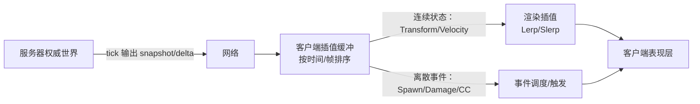
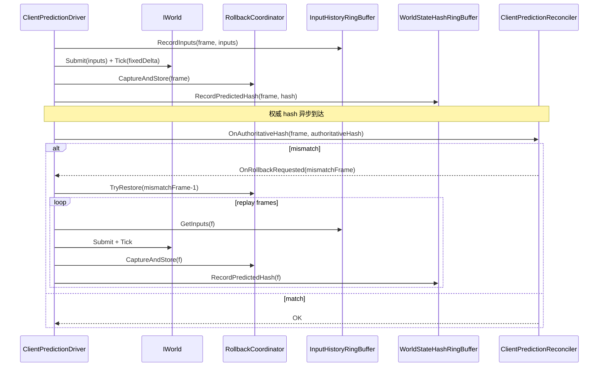

# 两种网络同步方案：状态同步插值 vs 预测回滚重演（com.abilitykit.world.framesync）

本文档补充两种常见的实时战斗网络同步方案，并说明它们在本工程（FrameSync/Rollback 基础设施）中的落地方式、注意事项与常见坑。

- 方案 A：**服务器权威 + 状态同步（snapshot/delta） + 客户端插值**（本地玩家可选局部预测）
- 方案 B：**客户端预测 + 回滚（rollback）+ 重演（replay）+ 对账（reconcile）**（更强一致）

> 说明：两种方案并不是互斥关系；很多项目会采用“混合架构”：
> - 对本地玩家使用方案 B 的一部分能力（预测/回滚/重演）
> - 对其它实体主要使用方案 A（状态同步 + 插值）

---

## 0. 术语与目标

- **Authoritative（权威）**：服务器最终决定的输入/状态。
- **Predicted（预测）**：客户端在未收到权威确认前，为了手感而提前推进的结果。
- **Confirmed（确认）**：客户端已经从服务器确认一致的帧/状态。
- **Snapshot（快照）**：离散的世界/实体状态数据（可能是全量或差量）。
- **Delta / Diff（差量）**：相对某个基线快照的变化（用于节省带宽）。
- **Interpolation（插值）**：客户端渲染时用两份快照平滑出中间态。
- **Rollback/Replay（回滚/重演）**：发现预测偏差后回到历史帧并从输入历史重跑。

设计目标通常包含：

- 手感（低延迟/流畅）
- 一致性（不作弊/权威可控）
- 可扩展（系统解耦/易接入）
- 可观测（能定位 mismatch/抖动/回滚）

---

## 1. 方案 A：状态同步 + 客户端插值（可选局部预测）

### 1.1 核心理念

- 服务器按固定频率（tickRate）生成“可渲染状态”（或世界状态）并发送给客户端。
- 客户端不直接渲染“最新到达的快照”，而是**引入插值缓冲**：
  - 令 `renderTime = now - interpolationDelay`
  - 在 `renderTime` 两侧的两份快照之间做 `lerp/slerp`
- 对离散事件（spawn、damage、buff 等）通常按帧/时间戳触发，不做插值。

### 1.2 数据流（概念）

### 1.3 客户端插值缓冲（关键点）

- **缓冲的对象**：通常是“连续变化”的状态，例如：
  - 位置/朝向/速度
  - 动作状态（可选）
- **插值延迟（interpolationDelay）**：
  - 常见取 50ms~200ms
  - 延迟越大越稳（更不容易缺帧），但“看到的世界”越落后
- **缺快照的处理**：
  - `Hold`：用最新快照（停顿但不发散）
  - `短时外推`：用速度外推一小段（必须有上限，避免发散）

### 1.4 适用范围

- MOBA/ARPG：多数实体采用状态同步 + 插值；本地玩家可能额外做局部预测。
- 射击/动作：本地玩家移动/开火常用局部预测；其它玩家主要插值。

### 1.5 注意事项（坑）

- **快照时间基准**：用 `FrameIndex` 或 `serverTime`，必须统一。
- **顺序/乱序**：客户端缓冲必须能按时间排序，并丢弃过旧数据。
- **离散事件与连续状态分流**：
  - Transform 类插值
  - Spawn/Damage/Cue 等事件按帧触发
- **纠正策略**：若服务器权威位置与客户端显示偏差较大，需要平滑拉回或瞬移阈值。

---

## 2. 方案 B：预测 + 回滚 + 重演 + 对账（Reconcile）

### 2.1 核心理念

- 客户端在未收到权威输入/状态前，先用本地输入推进世界（Predicted）。
- 当收到权威对账信息（常见为 hash 或关键状态）后：
  - 如果一致：推进 confirmed
  - 如果不一致：回滚到历史帧并重演到当前

本包 `Runtime/FrameSync/Rollback` 提供的正是这一方案的关键基础设施。

### 2.2 典型时序（与本包类型对齐）

### 2.3 落地前提（非常重要）

要让方案 B 稳定成立，你必须保证：

- **确定性（Determinism）**：同输入序列同初始状态，必然得到同结果。
  - 随机必须可回滚（种子/状态纳入 provider）
  - 不读取真实时间
  - 避免依赖 Dictionary 遍历顺序影响分支
- **回滚闭环（Rollbackable State）**：所有会影响逻辑分支/结果的状态都必须可回滚。
  - 不仅是 ECS 组件
  - 还包括“services 中可变数值/缓存/队列”等
- **输入历史完整**：重演用的 inputs 必须覆盖所有影响世界的输入。

### 2.4 Provider 接入建议

在本包体系中，“可回滚状态”的边界是 `IRollbackStateProvider`：

- 每个系统（移动/技能/CD/随机数/内部 service 状态）提供一个 provider。
- 通过 `RollbackRegistry` 注册，构造 `RollbackCoordinator` 后 `Seal()` 固化。

建议：

- provider 的 payload 结构自行版本化（字段版本、校验等）。
- provider 的 Export/Import 不要吞异常；出现异常应让上层能观测并 fail fast。

### 2.5 适用范围

- 需要强一致、低输入延迟的逻辑（例如：本地玩家的核心移动/技能输入）
- 需要长期可重演的系统（录像、观战、反作弊校验）

### 2.6 注意事项（坑）

- **历史长度不足**：`TryRestore=false`，回滚失败 -> 调大 `rollbackHistoryFrames`。
- **capture 过稀疏**：`captureEveryNFrames` 太大 -> replay 距离变长、失败概率上升。
- **authoritative inputs 缺失**：replay 用预测输入会 tug-of-war -> 需要等待权威或超时策略。
- **表现层与回滚**：
  - 推荐表现层跟随 confirmed 世界（避免回滚导致反复生成/销毁）
  - 若要预测表现，则必须为 view event 设计可撤销/可纠错机制（成本高）

---

## 3. 两种方案的对比与选型建议

| 维度 | 方案 A：状态同步 + 插值 | 方案 B：预测回滚重演 |
| --- | --- | --- |
| 手感（本地） | 一般（可加局部预测改善） | 很好 |
| 一致性 | 依赖服务器，客户端主要显示 | 强一致（但实现难） |
| 成本/复杂度 | 中等 | 高 |
| 对确定性的要求 | 中等（插值/纠正即可） | 极高（必须可重演） |
| 表现层处理 | 插值缓冲 + 事件触发 | 建议跟 confirmed；预测表现需额外机制 |

建议路线：

- 首先把方案 A 的“状态输出 + 插值缓冲 + 离散事件分流”做好（快速稳定）。
- 如果确实需要更强一致/更低输入延迟，再把关键路径纳入方案 B（逐步扩张回滚闭环范围）。

---

## 4. 与本工程其它模块的关系（建议）

- **Triggering（技能/效果）**：
  - 若要参与方案 B，需要保证所有写入可回滚、确定性随机、无不可回滚副作用。

- **Motion（移动/位移）**：
  - 方案 A：服务器发 Transform/Velocity，客户端插值
  - 方案 B：移动系统要可回滚（MotionState + source 状态）

- **Record（录制/回放）**：
  - 方案 A：可记录网络快照流（用于复盘展示）
  - 方案 B：更推荐记录 authoritative inputs（可完全重演）

