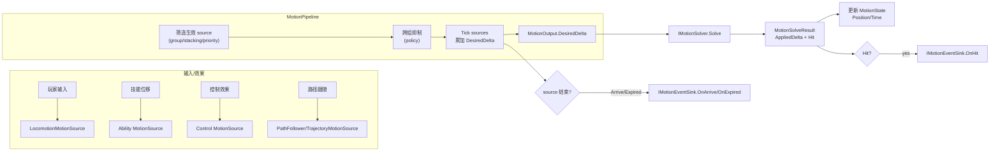
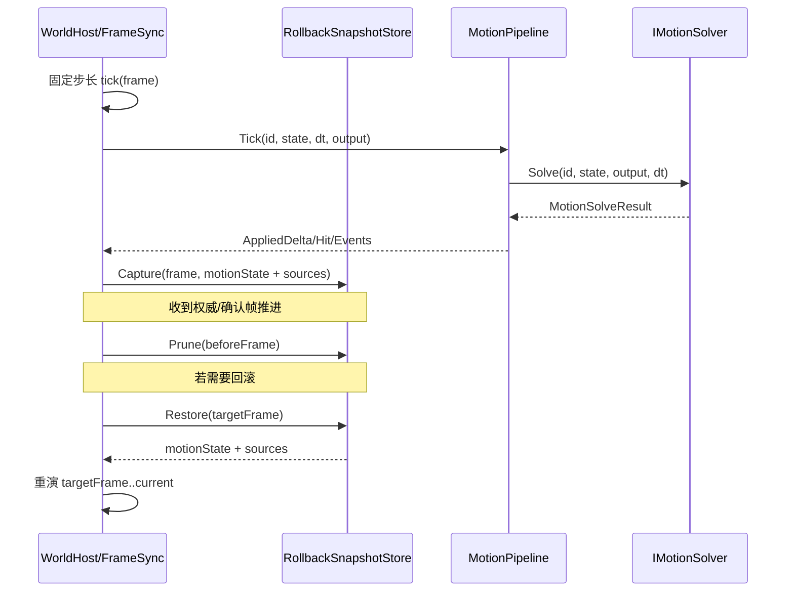

# Motion 模块设计文档（com.abilitykit.world.motion）

## 目标与定位

`com.abilitykit.world.motion` 提供一套**框架层的纯逻辑运动系统**（MotionSystem），用于在不依赖 Unity/Entitas 的情况下计算“期望移动/最终应用移动”，并通过外部接口对接：

- 角色移动（输入驱动）
- 技能位移（冲刺、击退、牵引等）
- 路径跟随（waypoints / path follower）
- 子弹/轨迹运动（按时间采样轨迹）

核心约束：

- 不依赖 Unity Transform；外部负责把 `MotionState.Position/Forward` 写回 ECS/Transform。
- 不内置物理；碰撞/阻挡通过 `IMotionSolver` 由外部实现。
- 不负责网络同步/回滚；但应满足固定步长推进、可重演的使用方式（由上层 FrameSync/Rollback 管理）。

## 模块边界

- 本模块负责：
  - 组合多个运动源（`IMotionSource`）
  - 计算每 tick 的 `DesiredDelta`
  - 通过 `IMotionSolver` 得到 `AppliedDelta`（可包含命中信息）
  - 更新 `MotionState`（Position/Time）并可选发出事件（`IMotionEventSink`）

- 上层（游戏实现/World Host）负责：
  - 维护实体 id -> MotionPipeline / MotionState 的映射
  - 将输入、技能效果转换为 MotionSource 的创建/更新/取消
  - 将 `MotionState` 的结果写回 ECS（位置/朝向/速度等）
  - 碰撞求解 `IMotionSolver` 的具体实现（例如基于地图 NavMesh、格子、AABB、Capsule 等）
  - 在帧同步/预测回滚场景中：
    - 固定步长驱动 tick
    - 快照/回滚/重演（本模块只提供纯计算能力）

## 目录结构与核心类型

- `Runtime/MotionSystem/Core/`
  - `MotionState`：运动状态（Position/Velocity/Forward/Time）
  - `MotionOutput`：本 tick 输出（DesiredDelta/AppliedDelta/NewVelocity/NewForward）
  - `IMotionSource`：运动源接口（每 tick 贡献位移）
  - `MotionPipeline`：组合多个 source，计算 desired delta 并交给 solver
  - `MotionGroups`：默认分组（Locomotion/Ability/Control/Path）
  - `MotionStacking`：同组叠加策略（Additive/ExclusiveHighestPriority/OverrideLowerPriority）
  - `MotionPipelinePolicy`：跨组抑制规则（例如 Control 抑制 Locomotion/Ability/Path）

- `Runtime/MotionSystem/Collision/`
  - `IMotionSolver`：碰撞/阻挡求解器接口
  - `MotionSolveResult/MotionHit`：求解结果

- `Runtime/MotionSystem/Events/`
  - `IMotionEventSink`：事件回调（OnHit/OnArrive/OnExpired）

- `Runtime/MotionSystem/Trajectory/` 与 `Generic/`
  - `ITrajectory3D` 等：轨迹与路径跟随实现

## 数据流（每 tick）

### 总览

MotionPipeline 的 tick 可以视为三段：

1. 选择“本 tick 生效”的 motion sources（基于 group/stacking/priority/policy）
2. 汇总得到 `DesiredDelta`
3. 交给 `IMotionSolver` 得到 `AppliedDelta` 并更新 state

### 关键点：分组/优先级/叠加

- `IMotionSource.GroupId`：用于把 motion 分成逻辑组（如输入移动、技能位移、控制、路径）
- `IMotionSource.Priority`：数值越大优先级越高（Pipeline 会排序）
- `IMotionSource.Stacking`：
  - `Additive`：同组所有 source 都 tick 并叠加
  - `ExclusiveHighestPriority`：同组只 tick 优先级最高的那个
  - `OverrideLowerPriority`：同组表现同 Exclusive，但语义用于“覆盖/压制”，可触发跨组抑制
- `MotionPipelinePolicy`：配置跨组抑制。例如默认：Control 组在 OverrideLowerPriority 时抑制 Locomotion/Ability/Path。

## MotionPipeline 运行时行为（更贴近代码）

`MotionPipeline.Tick(id, ref state, dt, ref output)` 的关键流程（与代码结构一致）：

1. 清理无效 source（`null` 或 `!IsActive`）
2. Pass1：找出所有非 Additive 的 group 的“最佳 source index”（优先级最高）
3. Pass1.5：如果最佳 source 的 stacking 是 `OverrideLowerPriority`，根据 `Policy` 把被抑制 group 加入 suppressed 列表
4. Pass2：遍历 sources，跳过 suppressed group；对非 Additive 的 group 只 tick 最佳 source；累加 desired
5. `solver.Solve(...)` 得到 `AppliedDelta`，更新 `state.Position/state.Time`
6. 如果命中则 `Events.OnHit(...)`；如果某 source 在 tick 后 `IsActive` 变 false，则根据 `IMotionFinishEventSource` 触发 `OnArrive/OnExpired`

## 固定步长与可重演（FrameSync / Rollback 友好性）

本模块本身不实现回滚，但为了便于上层回滚/重演，建议按以下方式使用：

- 使用固定 dt（例如 `1 / tickRate`）驱动 `MotionPipeline.Tick`。
- `MotionState.Time` 仅使用固定 dt 累加，不读取真实时间。
- 运动源不要读取“真实时间/随机”；如需随机，使用上层提供的确定性随机源并把必要输入记录在指令/快照里。

在回滚体系中，上层通常会：

- 对每个实体存储可回滚的 `MotionState`（以及 motion sources 的必要参数/进度）
- 回滚到目标帧后，按帧重演 `MotionPipeline.Tick`

下面是一个推荐的时序（上层 Host）：

## 扩展点与实现建议

### 1) 新的运动源（IMotionSource）

适用于：

- 技能冲刺/击退/牵引（按持续时间、按曲线、按目标点）
- 子弹（轨迹采样）
- 受控移动（眩晕/定身期间强制速度为 0 或强制方向）

建议：

- 把 source 的“状态”（剩余时间、当前进度、目标点等）放在 source 自身或上层 state 中，并确保可序列化/可回滚。
- `IsActive` 为 false 表示 source 自动移除（Pipeline 会清理）。

### 2) 碰撞求解（IMotionSolver）

职责：

- 输入：当前 state + desired delta + dt
- 输出：applied delta（可能缩短/偏转），以及命中信息（`MotionHit`）

常见实现策略：

- 纯逻辑格子/导航网格约束
- AABB/圆柱体碰撞
- “滑墙”/“停止”策略

### 3) 事件（IMotionEventSink）

- `OnHit`：用于命中反馈（例如停止/反弹/触发效果）
- `OnArrive/OnExpired`：用于处理“移动完成”（到达/过期）

建议：事件只作为逻辑信号，不直接驱动 Unity 表现；表现层应订阅并在 View 层执行。

## 常见坑与约束

- `MotionPipeline` 内部会移除 `null` source、以及 tick 前 `!IsActive` 的 source；所以外部要注意引用生命周期。
- 若 `IMotionSource.IsActive` 在 tick 后变为 false，本 tick 会发出完成事件（Arrive/Expired），但 source 是否立即移除取决于下一次 tick 清理。
- 若需要跨组抑制，必须同时满足：
  - suppressor source stacking = `OverrideLowerPriority`
  - `MotionPipeline.Policy` 中配置了 suppression 关系

